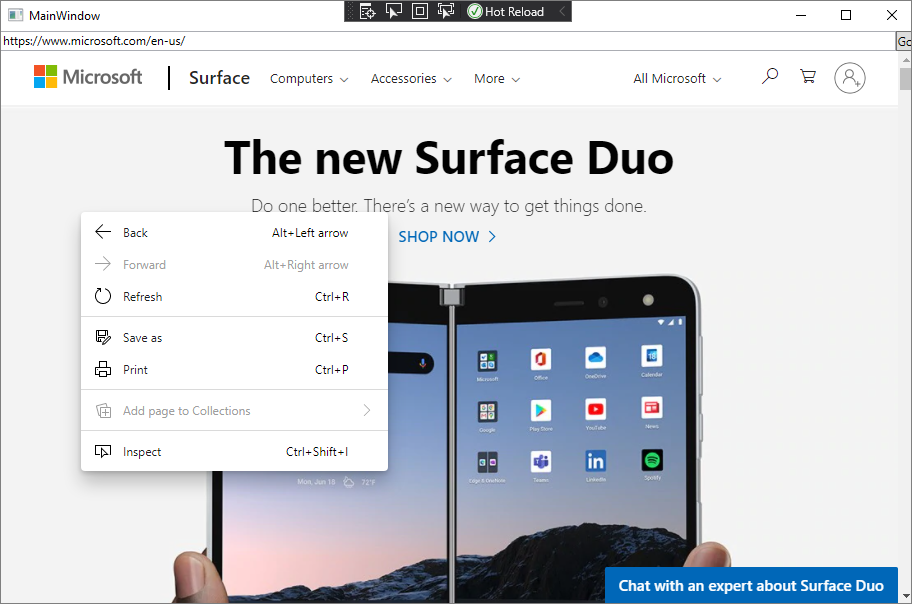

# Call web-side code from native-side code
<!-- old title: Use JavaScript in WebView for extended scenarios -->

Using JavaScript in WebView2 controls allows you to customize native apps to meet your requirements. This article explores how to use JavaScript in WebView2, and reviews how to develop using advanced WebView2 features and functions.


<!-- ====================================================================== -->
## Before you begin

This article assumes that you already have a working project. If you don't have a project, and want to follow along, see [Get started with WebView2](../get-started/get-started.md).


<!-- ====================================================================== -->
## Basic WebView2 functions

Use the following functions to begin embedding JavaScript in your WebView2 app.

| API | Description |
| --- | --- |
| [ExecuteScriptAsync](/dotnet/api/microsoft.web.webview2.wpf.webview2.executescriptasync) | Run JavaScript in a WebView2 control. Call this method after the page [Document Object Model (DOM) content](/dotnet/api/microsoft.web.webview2.core.corewebview2.domcontentloaded) is loaded or the [navigation is completed](/dotnet/api/microsoft.web.webview2.core.corewebview2.navigationcompleted). See [Get started with WebView2](../get-started/get-started.md). |
| [AddScriptToExecuteOnDocumentCreatedAsync](/dotnet/api/microsoft.web.webview2.core.corewebview2.addscripttoexecuteondocumentcreatedasync) | Runs on every page when the DOM is created. Call this method after the CoreWebView2 is initialized. |


<!-- ====================================================================== -->
## Scenario: ExecuteScript JSON-encoded results

Because the result of `ExecuteScriptAsync` is JSON-encoded, if the result of evaluating the JavaScript is a string, you will receive a JSON-encoded string and not the value of the string.

For example, the following code executes script that results in a string.  The resulting string includes a quote at the start, a quote at the end, and escaping slashes:

```csharp
string result = await coreWebView2.ExecuteScriptAsync(@"'example'");
Debug.Assert(result == "\"example\"");
```

The script returns a string that `ExecuteScript` JSON-encodes for you.  If you call `JSON.stringify` from your script, then the result is doubly encoded as a JSON string the value of which is a JSON string.

Only the properties that are directly in the result are included in the JSON-encoded object; inherited properties aren't included in the JSON-encoded object.  Most DOM objects inherit all properties, so you'll need to explicitly copy their values into another object to return.  For example:

Script              | Result
---                 | ---
`performance.memory`  | `{}`
`(() => { const {totalJSHeapSize, usedJSHeapSize} = performance.memory; return {totalJSHeapSize, usedJSHeapSize}; })();` |  `{"totalJSHeapSize":4434368,"usedJSHeapSize":2832912}`

When we return just `performance.memory` we don't see any of its properties in the result because all properties are inherited.  If instead, we copy particular property values from `performance.memory` into our own new object to return, then we see those properties in the result.

When executing script via `ExecuteScriptAsync` that script is run in the global context.  It helps to have your script in an anonymous function so that any variables you define aren't polluting the global context.

For example:

*  If you run the script `const example = 10;` more than once, the subsequent times you run the script will throw an exception, because `example` was defined the first time you ran it. 

*  If you instead run the script `(() => { const example = 10; })();` the `example` variable is defined in the context of that anonymous function.  That way, it's not polluting the global context, and can be run more than once.


<!-- ====================================================================== -->
## Scenario: Running a dedicated script file

In this section, you access a dedicated JavaScript file from your WebView2 control.

> [!NOTE]
> Although writing JavaScript inline may be efficient for quick JavaScript commands, you lose JavaScript color themes and line formatting that makes it difficult to write large sections of code in Visual Studio.

To solve the problem, create a separate JavaScript file with your code, and then pass a reference to that file using the `ExecuteScriptAsync` parameters.

1. Create a `.js` file in your project, and add the JavaScript code that you want to run.  For example, create a file called `script.js`.

1. Convert the JavaScript file to a string that is passed to `ExecuteScriptAsync`, by pasting the following code after the page is done navigating:

   ```csharp
   string text = System.IO.File.ReadAllText(@"C:\PATH_TO_YOUR_FILE\script.js");
   ```

1. Pass your text variable using `ExecuteScriptAsync`:

   ```csharp
   await webView.CoreWebView2.ExecuteScriptAsync(text);
   ```


<!-- ====================================================================== -->
## Scenario: Removing drag-and-drop functionality

In this section, you use JavaScript to remove the drag-and-drop functionality from your WebView2 control.

To begin, explore the current drag-and-drop functionality:

1. Create a `.txt` file in order to drag-and-drop.  For example, create a file named `contoso.txt` and add text to it.

1. Press **F5** to build and run the project.

1. Drag-and-drop the `contoso.txt` file into the WebView2 control.  A new window opens, which is the result of the code in your sample project:

   

1. Next, add code to remove the drag-and-drop functionality from the WebView2 control.  Paste the following code after the CoreWebView2 object is initialized in your code:

   ```csharp
   await webView.CoreWebView2.AddScriptToExecuteOnDocumentCreatedAsync(
      "window.addEventListener('dragover',function(e){e.preventDefault();},false);" +
      "window.addEventListener('drop',function(e){" +
         "e.preventDefault();" +
         "console.log(e.dataTransfer);" +
         "console.log(e.dataTransfer.files[0])" +
      "}, false);");
   ```

1. Press **F5** to build and run the project.

1. Try to drag and drop `contoso.txt` into the WebView2 control.  Confirm that you can't drag and drop.


<!-- ====================================================================== -->
## Scenario: Removing the context menu

In this section, you remove the right-click menu from your WebView2 control.

To begin, explore the current functionality of the right-click menu:

1. Press **F5** to build and run the project.

1. Right-click anywhere on the WebView2 control.  The context menu displays the default right-click menu commands:

   

   Next, add code to remove the right-click menu functionality from the WebView2 control.

1. Paste the following code after the CoreWebView2 object is initialized in your code:

   ```csharp
   await webView.CoreWebView2.ExecuteScriptAsync("window.addEventListener('contextmenu', window => {window.preventDefault();});");
   ```

1. Press **F5** to build and run the project.  Confirm that you can't open a right-click menu.


<!-- ====================================================================== -->
## See also

* [Get started with WebView2](../get-started/get-started.md)
* [WebView2Samples repo](https://github.com/MicrosoftEdge/WebView2Samples) - a comprehensive example of WebView2 capabilities.
* [WebView2 API reference](../webview2-api-reference.md)
* [Web/native interop](../concepts/overview-features-apis.md#webnative-interop) in _Overview of WebView2 features and APIs_.
