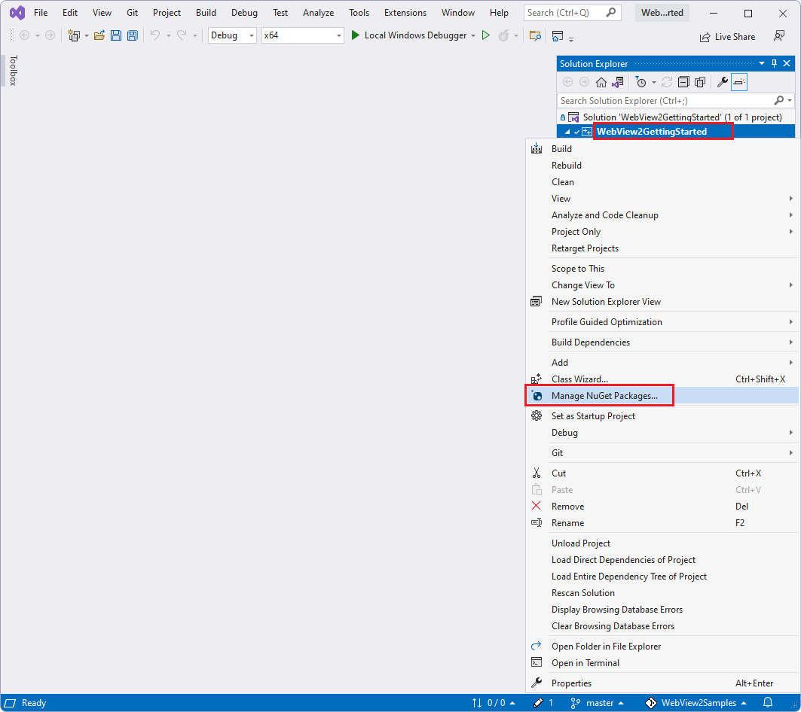

# Set up your Dev environment for WebView2

This article covers general-purpose setup of your development environment for WebView2 development.  Some Getting Started tutorials point here for preliminary setup steps, and then add platform-specific or project-specific setup steps.


<!-- ====================================================================== -->
## Install Visual Studio

1. Install [Visual Studio](https://visualstudio.microsoft.com) 2015 or later, such as Visual Studio Professional 2019, or Visual Studio 2022 Community edition.  Most of the WebView2 samples were created and tested using Visual Studio 2019.  If a sample was created using Visual Studio 2019, you should build and run the sample in Visual Studio 2019, before using the sample in Visual Studio 2022.

   The WebView2 samples are designed for Microsoft **Visual Studio**, not Microsoft **Visual Studio Code**.

   If you are installing Visual Studio, you can accept the defaults for now; you can click **Install**, and then decline installing the Workloads at this time.  Visual Studio will prompt you later, when you open a particular `.sln` file, to install the platform-appropriate workloads.


<!-- ====================================================================== -->
## Install a preview channel of Microsoft Edge

Install any Microsoft Edge preview channel (Beta, Dev, or Canary) on a supported operating system:
   *  Windows 10
   *  Windows 11

To download a preview channel of Microsoft Edge (Beta, Dev, or Canary), go to [Become a Microsoft Edge Insider](https://www.microsoft.com/edge/download/insider).

We recommend using the Canary channel.  The minimum required version is 82.0.488.0.

The preview channels of Microsoft Edge are required in order to use a prerelease version of the WebView2 SDK.  A prerelease SDK enables testing your app against the latest APIs, and trying out the latest APIs.


<!-- The h3 section [Clone or download the WebView2Samples repo](../get-started/win32.md#download-or-clone-the-webview2samples-repo) in _Get started with WebView2 in Win32 apps_ links to here -->
<!-- ====================================================================== -->
## Download the WebView2Samples repo

There are two repos containing WebView2 samples:
*  [WebView2Samples repo](https://github.com/MicrosoftEdge/WebView2Samples)
*  [WebView2Browser repo](https://github.com/MicrosoftEdge/WebView2Browser)

You can download a repo as a `.zip` file, or clone the repo.

*  If you download the repo (as a `.zip` file), you get a snapshot copy of the repo.  You can then download another, updated copy of the repo later.

*  If you clone the repo, you can update your local copy using git commands or features of various Dev apps.


To download the repo (as a `.zip` file):

1. Open the [WebView2Samples repo](https://github.com/MicrosoftEdge/WebView2Samples) (or the [WebView2Browser repo](https://github.com/MicrosoftEdge/WebView2Browser)) in a new window or tab.

1. Click the green **Code** button in the upper right of the GitHub repo, and then click **Download ZIP**.

   

   The **Download** pop-up appears in Microsoft Edge:

   

   In Microsoft Edge, if the **Download** pop-up isn't visible, click **Settings and more** (...) and then click **Downloads**.

1. In the **Downloads** pop-up window, hover to the right of `WebView2Samples-main.zip` and then click the **Show in folder** (folder) icon.

   It is recommended that you don't click the **Open file** link, because that immediately unzips the file in your Downloads area, which could make it harder (and slower) to move to your desired location.

1. Copy or cut the `WebView2Samples-main.zip` file from your Downloads directory to a regular directory, such as `Documents`.

1. Unzip the `WebView2Samples-main.zip` file and note the location of the unzipped files.

   

1. Study the breakout of main directories.

   `-main` is the name of the repo branch that this downloaded directory snapshot represents.  It is possible to switch to a different branch at GitHub and then download, for example, `WebView2Samples-smoketest-1.0.1054.27-prerelease-testing.zip`.  In that case, the downloaded `.zip` file is a snapshot of the `smoketest-1.0.1054.27-prerelease-testing` branch of the repo.  This documentation assumes that you downloaded the `main` branch of the repo.

1. Recommended: Rename the root directory from `WebView2Samples-main` to `WebView2Samples`, to match the repo name and path.


<!-- The h3 section [Clone or download the WebView2Samples repo](../get-started/win32.md#download-or-clone-the-webview2samples-repo) in _Get started with WebView2 in Win32 apps_ links to here -->
<!-- ====================================================================== -->
## Clone the WebView2Samples repo

You can download the repo as a `.zip` file, or clone the repo.

*  If you download the repo (as a `.zip` file), you get a snapshot copy of the repo.  You can then download another, updated copy of the repo later.

*  If you clone the repo, you can update your local copy using git commands or features of various Dev apps.


To clone the `WebView2Samples` repo (or the `WebView2Browser` repo), you must first install git.  You can download the repo, as described above, or clone it.


<!-- ------------------------------ -->
#### Install git

1. If you want to clone the `WebView2Samples` repo (instead of downloading it), and if git isn't not already installed, [download git](https://git-scm.com/downloads) and install it.


<!-- ------------------------------ -->
#### Obtain the URL for cloning the WebView2Samples repo

1. Open the [WebView2Samples repo](https://github.com/MicrosoftEdge/WebView2Samples) in a new window or tab.

1. Click the green **Code** button in the upper right of the GitHub repo, select **Clone**, and then click the **Copy** icon (or, select the HTTPS URL string in the text box and copy it).

   

1. Decide which tool you want to use to locally clone the repo:
   *  Visual Studio
   *  GitHub Desktop
   *  Git Bash shell or command prompt

Next, clone the GitHub repo to your local drive.  To do that, follow the appropriate steps below, for the tool you want to use.


<!-- ------------------------------ -->
#### Cloning the repo by using Visual Studio

If you want to use Visual Studio to clone the GitHub repo to your local drive:

1. In Visual Studio, select **File** > **Clone repository**.

1. Enter the URL that you copied from the GitHub repo.

1. From within the same dialog, or in a file explorer utility, you can create a general-purpose root `git` or `GitHub` folder in a writeable location, then select that directory, so that the repo will be cloned there, as a new directory.

   For example, you could create the repo in the parent folder: `C:\Users\myUserName\Documents\GitHub\`, so that the cloning operation will create the new directory `C:\Users\myUserName\Documents\GitHub\WebView2Samples`.

You've cloned the repo to your local drive.  Skip to the next major section below.


<!-- ------------------------------ -->
#### Cloning the repo by using GitHub Desktop

If you want to use GitHub Desktop to clone the GitHub repo to your local drive:

1. Install [GitHub Desktop](https://desktop.github.com).

1. In GitHub Desktop, select **File** > **Clone repository**.

1. In Visual Studio or GitHub Desktop, enter the URL that you copied from the GitHub repo.

1. From within the same dialog, or in a file explorer utility, you can create a general-purpose root `git` or `GitHub` folder in a writeable location, then select that directory, so that the repo will be cloned there, as a new directory.

   For example, you could create the repo in the parent folder: `C:\Users\myUserName\Documents\GitHub\`, so that the cloning operation will create the new directory `C:\Users\myUserName\Documents\GitHub\WebView2Samples`.

You've cloned the repo to your local drive.  Skip to the next major section below.


<!-- ------------------------------ -->
#### Cloning the repo by using Git Bash shell or a command prompt

If you instead want to clone the repo by using a Git Bash shell or command prompt:

1. Clone the repo to your local drive, entering the URL string that you copied from the GitHub repo:

   ```console
   # example location where the repo directory will be added:
   cd c:/users/myusername/documents/github/
   git clone https://github.com/MicrosoftEdge/WebView2Samples.git
   ```

   

   The directory is created on your local drive, in the path you specified, such as in the following figure:

   

   You've cloned the repo to your local drive.

See also:
* [Cloning a repository](https://docs.github.com/en/repositories/creating-and-managing-repositories/cloning-a-repository) - GitHub docs.
* [Clone the Edge Demos repo to your drive](../../devtools/samples/index.md#clone-the-edge-demos-repo-to-your-drive) in _Sample code for DevTools_.

* [Step 6: Set up a localhost server](../../visual-studio-code/microsoft-edge-devtools-extension/install.md#step-6-set-up-a-localhost-server) in _Installing the DevTools extension for Visual Studio Code_.


<!-- ====================================================================== -->
## Open a WebView2Samples .sln file in Visual Studio

After you clone or download the `WebView2Samples` repo, open a `.sln` file in Visual Studio.

1. In your local copy of the repo directory structure, locate a `.sln` file.  The [top-level README file in the WebView2Samples repo](https://github.com/MicrosoftEdge/WebView2Samples#readme) gives a similar overview.

1. Open a `.sln` file in Visual Studio.  For example, open your local copy of [WebView2Samples.sln](https://github.com/MicrosoftEdge/WebView2Samples/blob/main/SampleApps/WebView2Samples.sln).  This repo's solution files require Visual Studio, not Visual Studio Code.

1. Open one of the `.sln` files.  For example, open your local copy of the main Win32 solution file [WebView2Samples/SampleApps/WebView2Samples.sln](https://github.com/MicrosoftEdge/WebView2Samples/blob/main/SampleApps/WebView2Samples.sln) (downloaded as path `WebView2Samples-main/SampleApps/WebView2Samples.sln`) in Microsoft Visual Studio.  When you open that solution file in Visual Studio, **Solution Explorer** contains the following projects:

   


For general, initial Dev environment setup, you can open any type of `.sln` file from the `WebView2Samples` repo:

*  A platform-specific `.sln` file in a subdirectory of the `GettingStartedGuides` directory.  These match the Getting Started tutorials and are completed examples that demonstrate a couple API features.

*  The Win32 `.sln` file containing multiple platform projects, in the `SampleApps` directory.  This is a comprehensive API demonstration.

*  A platform-specific `.sln` file in a subdirectory of the `SampleApps` directory.  These are comprehensive API demonstrations.


<!-- ====================================================================== -->
## Install Visual Studio workloads

Install Visual Studio workloads if prompted.  When you open a `.sln` file from the cloned or downloaded `WebView2Samples` repo in Microsoft Visual Studio 2019 or 2022, you might see a "cannot open" dialog.

<!-- For example, the Win32 tutorial tells how to install a particular workload if prompted to, upon opening a particular sample.  For example, see [Install the "Desktop development with C++" workload](../get-started/win32.md#install-workloads) in _Get started with WebView2 in Win32 apps_. -->

1. Click the **OK** button.  Then you might see a workload installer such as:

   .

1. Select the checkbox and then click the **Install** button.

   The Visual Studio installer runs, for the platform's workload:

   .

   A Migration Report log file page might open, such as at `file:///C:/Users/username/Documents/WebView2Samples-main/WebView2Samples-main/SampleApps/UpgradeLog.htm`:

   

   _To zoom, right-click > **Open image in new tab**._

   Above, the `-main` directory suffix is present for the downloaded `.zip` file of the repo, not if you cloned the repo.

   Visual Studio opens the selected `.sln` file in Solution Explorer:

   


<!--
maintenance links; keep:
Main, central copy:
[Install or update the WebView2 SDK](../how-to/machine-setup.md#install-or-update-the-webview2-sdk) in _Set up your Dev environment for WebView2_
Secondary copies:
[Install or update the WebView2 SDK](../get-started/win32.md#step-6---install-the-webview2-sdk) in _Get started with WebView2 in Win32 apps_
[Install or update the WebView2 SDK](../get-started/winforms.md#step-3---install-the-webview2-sdk) in _Get started with WebView2 in WinForms apps_
[Install or update the WebView2 SDK](../get-started/wpf.md#step-3---install-the-webview2-sdk) in _Get started with WebView2 in WPF apps_
[Install or update the WebView2 SDK](../get-started/winui2.md#step-6---install-the-webview2-sdk) in _Get started with WebView2 in WinUI 2 (UWP) apps_
[Install or update the WebView2 SDK](../get-started/winui.md#step-4---install-the-webview2-sdk) in _Get started with WebView2 in WinUI 3 (Windows App SDK) apps_
-->
<!-- ====================================================================== -->
## Install or update the WebView2 SDK

<!--
condensed summary to possibly use elsewhere:
To select which version of WebView2 SDK NuGet package a Visual Studio project uses, in Visual Studio, right-click a project, select **Manage NuGet Packages**, select or clear the **Include prerelease** checkbox, select the **Microsoft.Web.WebView2** package, and then in the **Version** dropdown list, select a version of the **Microsoft.Web.WebView2** NuGet package.
-->


The WebView2 SDK includes the WebView2 control, which is powered by Microsoft Edge, and enables you to embed web technologies (HTML, CSS, and JavaScript) in your native applications.

You install the WebView2 SDK once per project node of each `.sln` file.  The WebView2 SDK installation applies only to the project that it's installed on.

Instead of downloading the `Microsoft.Web.WebView2` SDK NuGet package from nuget.org, you install the WebView2 SDK NuGet package through the **NuGet Package Manager** panel in Visual Studio.  After you clone or download the WebView2Samples repo, you then open one of the repo's `.sln` files in Visual Studio, and right-click a project node within the solution.  You use the **NuGet Package Manager** panel to install the `Microsoft.Web.WebView2` SDK as a NuGet package.

The `Microsoft.Web.WebView2` SDK is available in Release and Prerelease versions.  To get started, a Release version is recommended.


Install or update the Release or Prerelease WebView2 SDK, as follows:

1. Open a `.sln` file in Visual Studio.  For example, open your local copy of [WebView2Samples.sln](https://github.com/MicrosoftEdge/WebView2Samples/blob/main/SampleApps/WebView2Samples.sln).  This repo's solution files require Visual Studio, not Visual Studio Code.

1. In **Solution Explorer**, right-click the solution's project nodes, such as the **WebView2GettingStarted** project node (not the solution node) and then select **Manage NuGet Packages**.

   The following image shows a particular .sln file and project; use whichever project you want to install the SDK to:

   

   The **NuGet Package Manager** tab opens in Visual Studio.

1. In the **NuGet** window, click the **Browse** tab.

1. On the right of the search bar, clear the **Include prerelease** checkbox, or set it if you want a prerelease version of the SDK, which includes experimental APIs.

1. In the search bar in the upper left, type **Microsoft.Web.WebView2**.

1. Below the search bar, click the **Microsoft.Web.WebView2** card.

1. In the right-hand pane, click the **Install** (or **Update**) button.  NuGet downloads the WebView2 SDK to your machine, for use by this project.

   

   _To zoom, right-click > **Open image in new tab**._

1. Close the **NuGet Package Manager** tab.

The WebView2 SDK is now installed, so your development environment is now set up to add WebView2 features to WebView2 apps.

See also:
* [NuGet.org > Microsoft.Web.WebView2 SDK](https://www.nuget.org/packages/Microsoft.Web.WebView2)


<!-- ====================================================================== -->
## Updating the WebView2 Runtime

To update the WebView2 Runtime on your development machine and on user machines, see [Distribute your app and the WebView2 Runtime](../concepts/distribution.md).


<!-- ====================================================================== -->
## See also

* [Cloning a repository](https://docs.github.com/en/repositories/creating-and-managing-repositories/cloning-a-repository) - GitHub docs.
* [Clone the Edge Demos repo to your drive](../../devtools/samples/index.md#clone-the-edge-demos-repo-to-your-drive) in _Sample code for DevTools_.
* [Step 6: Set up a localhost server](../../visual-studio-code/microsoft-edge-devtools-extension/install.md#step-6-set-up-a-localhost-server) in _Installing the DevTools extension for Visual Studio Code_.
