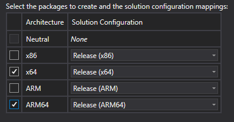
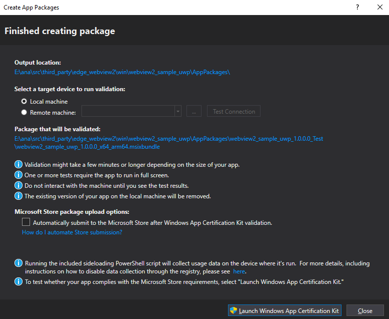

# Publish a UWP WebView2 app to the Microsoft Store

A _UWP WebView2 app_ is a Universal Windows Platform (UWP) app that hosts the WebView2 control.  To make a UWP WebView2 app widely available, you can publish it to the Microsoft Store, by following the steps below.

For general background information about publishing to the Windows Store, see [Publish Windows apps and games](/windows/uwp/publish/), at Windows App Development documentation > UWP.  The steps below provide the specific details about how to publish a UWP WebView2 app.

<!-- ====================================================================== -->
## Step 1: Configure a Microsoft Store account in Visual Studio

*  Make sure you have a Microsoft Store account configured in Microsoft Visual Studio.

   If needed, see [Get registered](https://developer.microsoft.com/microsoft-store/register/), about developer accounts for the Microsoft Store.  Then continue with the steps below.

<!-- ====================================================================== -->
## Step 2: Test the non-packaged host app

Test for these common basic issues before submitting your app to the Microsoft Store.  This will help prevent Store certification failures, which would delay your app from becoming available.

1. Make sure the app runs correctly on startup.

1. Make sure the app works correctly during shutdown sleep.

<!-- ====================================================================== -->
## Step 3: Package the host app

The Microsoft Store requires submitting a packaged app.  Package your app as follows:

1. Update the `package.appxmanifest` with all needed content, such as Visual Assets, Packaging name, and Application information.  If you don't do this, the Microsoft Store validation step will fail.  Then continue with the steps below.

1. At [Partner Center](https://partner.microsoft.com), select **Project** > **Publish** and then reserve an application name.

1. Associate the application with the reserved name, by selecting **Project** > **Publish** > **Associate App with the Store**.

1. Create the app package, by selecting **Project** > **Publish** > **Create App Packages**.  Select the target configurations:

   

   32-bit and 64-bit versions of the WebView2 Runtime will work in UWP on non-ARM platforms. 32-bit is not supported for ARM, due to dependencies on Microsoft Edge.  64-Bit is supported on ARM.

1. Once the app package has been created for your configurations, the **Create App Packages** window displays the **Finished creating package** dialog:

   

1. In the dialog, note where the package bundle was placed.  This information is also shown in the build window.

1. Click the **Close** button.
 

<!-- ====================================================================== -->
## Step 4: Test the package

To make sure that all required content files are present in the package, and to make sure the files have correct permissions, test your packaged app, as follows:

1. Use the generated app package to install the app on your machine.  Look for any oddities regarding required packages and functionality.

1. If possible, install your app on other machines also.  Look for any oddities regarding required packages and functionality.

<!-- ====================================================================== -->
## Step 5: Run Windows App Certification Kit (WACK)

<!-- * [Windows App Certification Kit](https://learn.microsoft.com/windows/uwp/debug-test-perf/windows-app-certification-kit) -->

Windows App Certification Kit (WACK) is an app that's a certification tool.  This tool evaluates your host app against the Microsoft Store's requirements.

Once you're satisfied that your packaged app works, run the Windows App Certification Kit (WACK):

1. Generate the app package again, as above.  That's the easiest way to get to the Windows App Certification Kit (WACK) process.

1. Once the package creation is complete, select **Launch Windows App Certification Kit**.

1. You must approve the User Access Control (UAC) dialog, for the Windows App Certification Kit (WACK) to run correctly.

1. Select **All** for the test suite, and then click **Next**.

1. After a few minutes, the Windows App Certification Kit (WACK) shows a results page.  If the app failed, click the link to review the results.

### Resolving tests

The results page of the Windows App Certification Kit (WACK) app shows any tests that need to be resolved.

#### Restricted name-space

If your app failed the **Restricted name-space** check, edit the `package.appxmanifest` file and remove the `restrictedcapabilities` line and any capabilities that use `rescap`.

WebView2 shouldn't require any restricted capabilities, to operate.  If your app needs restricted capabilities, you'll need to either ask for a store exception through [Partner Center](https://partner.microsoft.com), or only distribute the app through non-Store avenues.

#### Branding

If your app failed the **Branding** checks, update all the Visual Assets in the manifest as described above.

#### App Capabilities

If your app failed the **App Capabilities** tests, turn off any unneeded capabilities.  If you need a special use capability you will need to get Microsoft Store approval or use non-Store distribution methods.

#### General metadata correctness

If your app failed the **General metadata correctness** tests with an error in `IPopup4`, update the **microsoft.UI.xaml** NuGet package to version **Microsoft.UI.Xaml.2.8.0-prerelease.220118001** or higher.  There was a bug in the manifests, prior to that version.

#### Supported API

In this test, WACK checks the Windows APIs that your host app is calling, to make sure they're supported.

If your app failed the **Supported API** test, update the Windows SDK to version 22000 or higher, to get the latest version of the allowed-APIs list.  There should be no blocking APIs for WebView2 in the current Windows SDK.

<!-- ====================================================================== -->
## Step 6: Upload the app package

*  After all of the Windows App Certification Kit (WACK) tests have passed, upload your app package to the Windows Store, by using either of the following approaches:

   *  Approach 1: In Windows App Certification Kit (WACK), select **Project** > **Publish** > **Upload App Packages**.

   *  Approach 2: Go to Partner Center and upload your app package to the Windows Store through Partner Center. 

<!-- ====================================================================== -->
## See also

* [Get registered](https://developer.microsoft.com/microsoft-store/register/) - Creating a developer account for the Microsoft Store.
* [Publish Windows apps and games](/windows/uwp/publish/), at Windows App Development documentation > UWP.  General background information about publishing to the Windows Store.
* [Windows App Certification Kit](/windows/uwp/debug-test-perf/windows-app-certification-kit)
* [Partner Center (partner.microsoft.com)](https://partner.microsoft.com).
