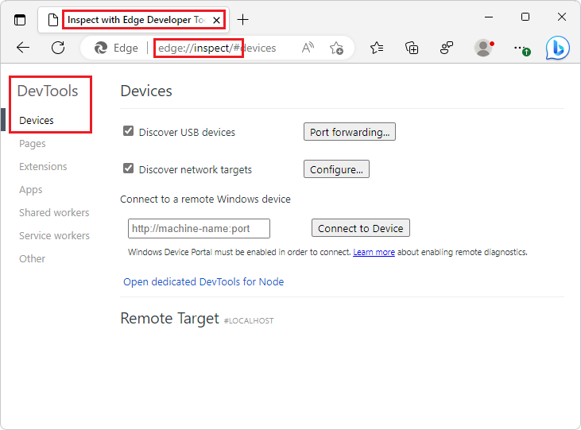
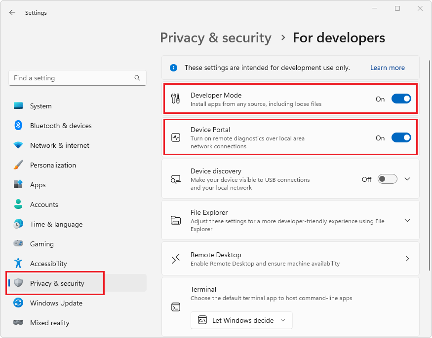
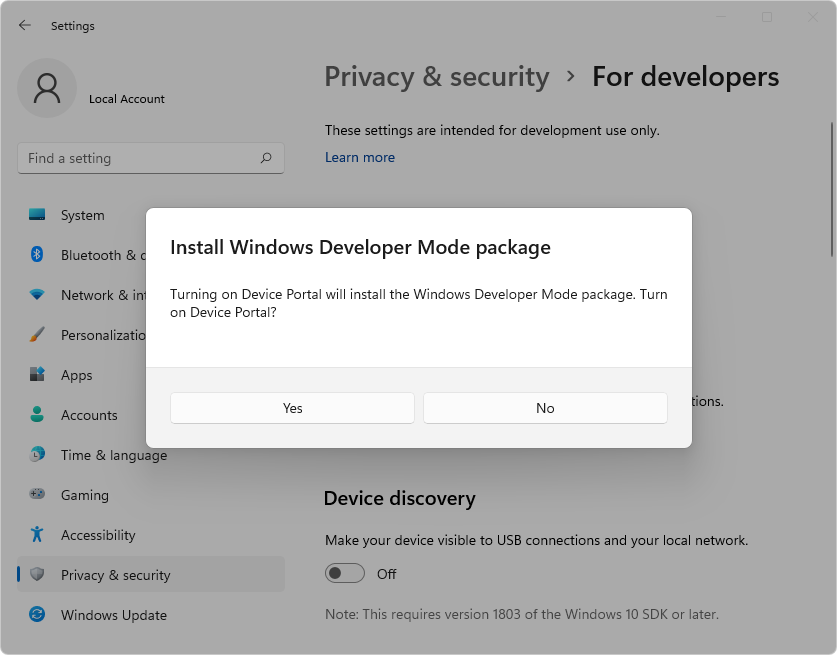
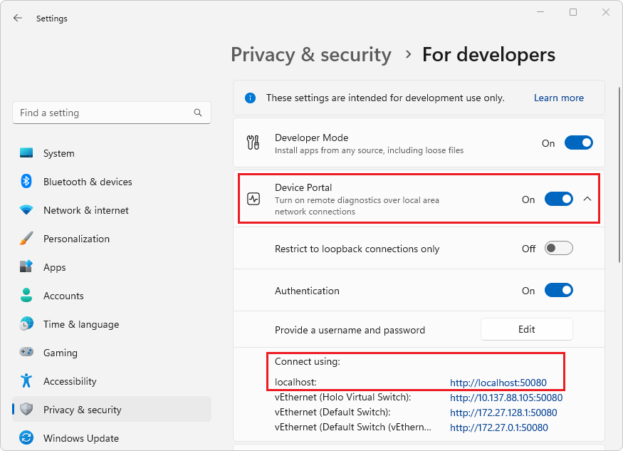
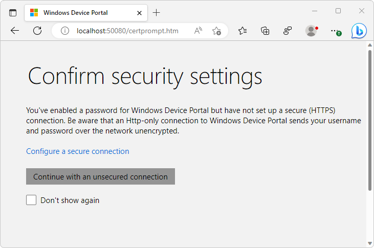
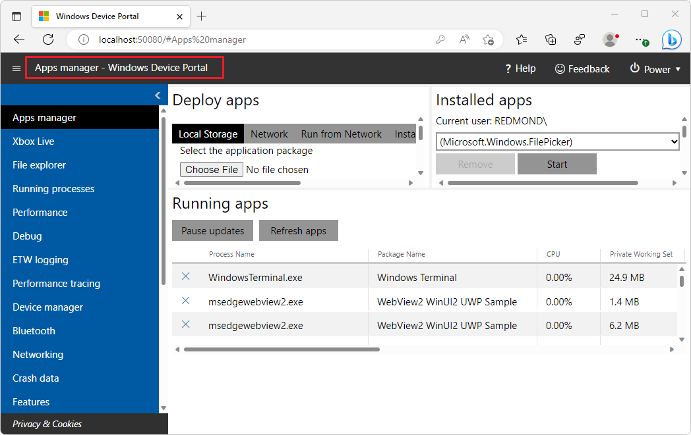
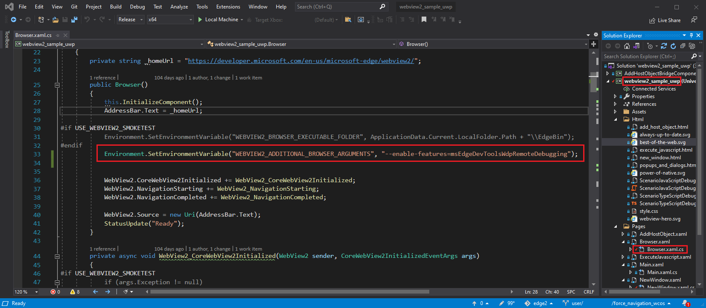
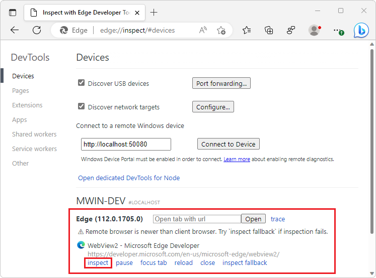
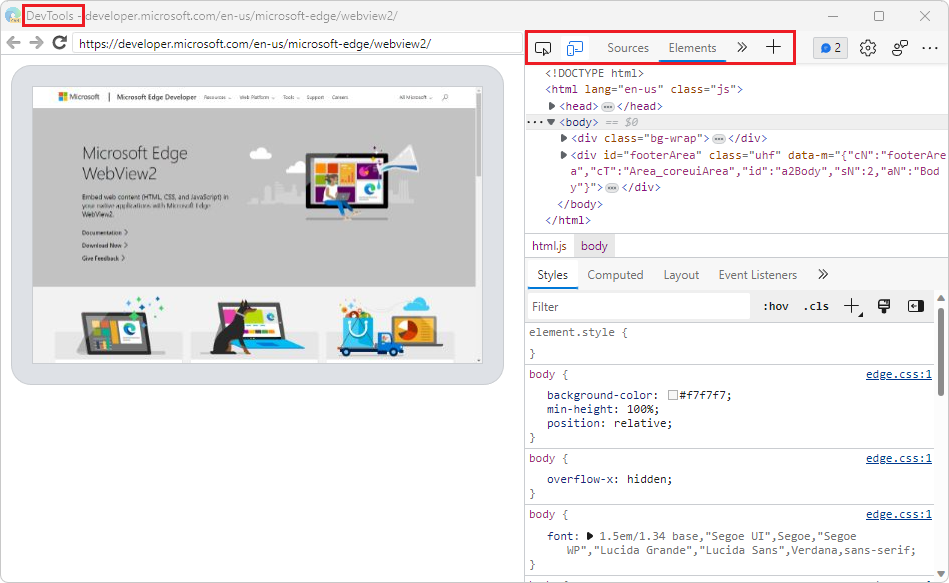

# Remote debugging desktop WebView2 WinUI 2 (UWP) apps

To use [Microsoft Edge DevTools](/microsoft-edge/devtools-guide-chromium/landing/) to debug a WebView2 WinUI 2 (UWP) app, use remote debugging.  Remote debugging is necessary for WebView2 WinUI 2 (UWP) apps because currently, the built-in DevTools can't be launched inside a store-signed WebView2 WinUI 2 (UWP) app.


<!-- ========================================================================== -->
## Attach DevTools remotely to a desktop WebView2 WinUI 2 (UWP) app

Attach Microsoft Edge DevTools remotely to a desktop WebView2 WinUI 2 (UWP) app as follows:

1.  In Microsoft Edge, go to `edge://inspect`.  The **Inspect with Edge Developer Tools** page opens:

    

1.  Enable `Developer Mode`: Open Windows **Settings**, select **Privacy & security** > **For developers**, and then turn on the **Developer Mode** toggle.

1.  In the same **Settings** page, turn on the **Device Portal** toggle:

    

    If your operating system isn't up-to-date, you might get a message in the **Settings** window: "The Windows Developer Mode package couldn't be found in Windows Update, so remote deployment and Windows Device Portal are unavailable.  [Learn more](/windows/uwp/debug-test-perf/device-portal-desktop#failed-to-locate-the-package)."

1.  If you get such a message, update your operating system (OS) to the latest version, and then turn on the **Device Portal** toggle.

1.  When prompted to **Install Windows Developer Mode package**, click **Yes**:

    

    After the installation is complete, note the URL that will be used for the remote debugging connection. To find this URL, expand the **Device Portal** dropdown list.  In this case, the Device Portal URL that will be used is `http://localhost:50080`:

    

1.  Install [Remote Tools for Microsoft Edge](https://www.microsoft.com/store/productId/9P6CMFV44ZLT) from the Microsoft Store.

1.  In Microsoft Edge, go to the Device Portal URL that you previously noted.  Verify that the **Confirm security settings** page is loaded (in the **Windows Device Portal** tab):

    

1.  If you are only debugging apps that are running locally, you can select the **Continue with an unsecured connection** button.

    Or, if you aren't running the app locally, or if you need to connect over HTTPS, select the **Configure a secure connection** link, and then follow the steps in the page that you're redirected to.

1.  Verify that you're redirected to the **Apps manager: Windows Device Portal** page:

    

1.  Go to `http://<Device Portal URL>/msedge` and verify Remote Tools for Microsoft Edge are functioning. The page loads an empty list: `[]`, unless there's an application running that is debuggable by remote tools.

1.  Configure your WebView2 WinUI 2 (UWP) app for remote debugging:

    To enable remote debugging, an environment variable must be set in your project.  This variable must be set before creating the `CoreWebView2` instance, and before either setting the `WebView2.Source` property or calling the `WebView2.EnsureCoreWebView2Async` method.

    Set the following variable:

    ```
    "WEBVIEW2_ADDITIONAL_BROWSER_ARGUMENTS", "--enable-features=msEdgeDevToolsWdpRemoteDebugging"
    ```
    
    For example, if you're using the [WebView2 Sample UWP app](https://github.com/MicrosoftEdge/WebView2Samples/tree/main/SampleApps/webview2_sample_uwp), you can set the environment variable by adding the following line in the `Browser.xaml.cs` file:
    
    ```csharp
    Environment.SetEnvironmentVariable("WEBVIEW2_ADDITIONAL_BROWSER_ARGUMENTS", "--enable-features=msEdgeDevToolsWdpRemoteDebugging");
    ```

    The line is numbered 33 in this screenshot, in the `Browser()` constructor, below an `#endif` that wraps an existing `SetEnvironmentVariable` statement:

    

1.  Launch your app.

1.  Go to `http://<Device Portal URL>/msedge`, such as `http://localhost:50080/msedge`, and make sure your WebView2 instance appears in the list:

    

1.  Go to `edge://inspect`.  In the **Connect to a remote Windows device** text box, enter `http://<Device Portal URL>`, such as `http://localhost:50080`, and then click **Connect to Device**.

1.  Verify that you can successfully connect, so that your debuggable WebView2 control, named **Edge**, is listed under your machine name:

    

1.  At the bottom of the **Edge** WebView2 control entry, click the **inspect** link.  Microsoft Edge DevTools opens for the WebView2 control:

    

Now you can use Microsoft Edge DevTools to inspect and debug the WebView2 control.


<!-- ========================================================================== -->
## See also

* [Remote debugging WebView2 WinUI 2 (UWP) apps](./remote-debugging.md)
