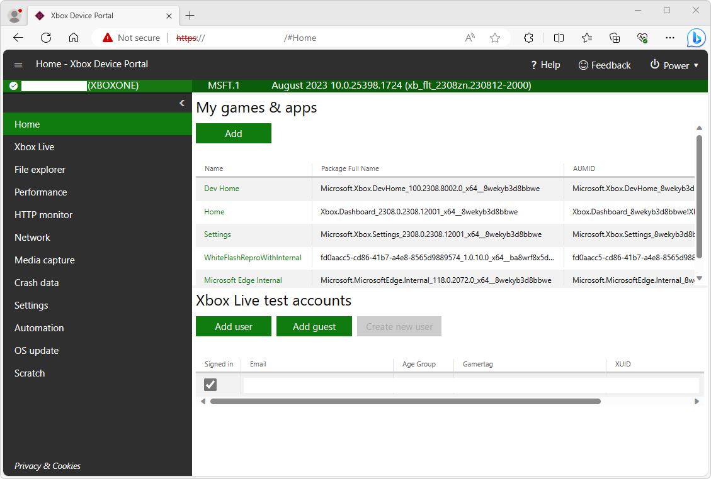
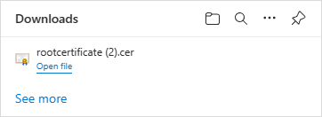
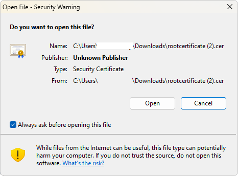
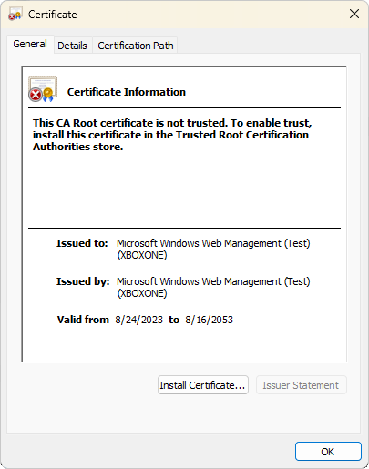
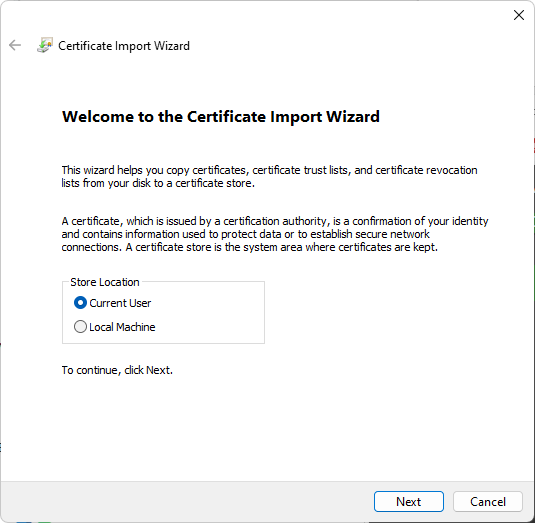
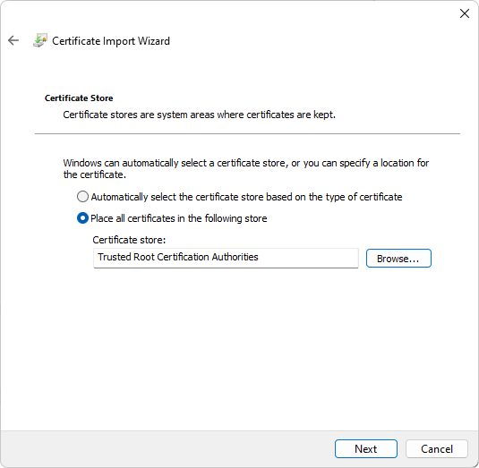
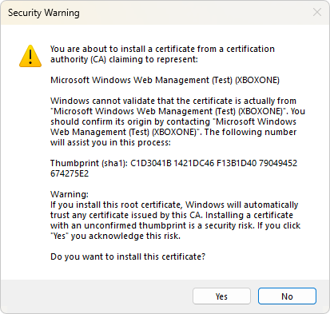
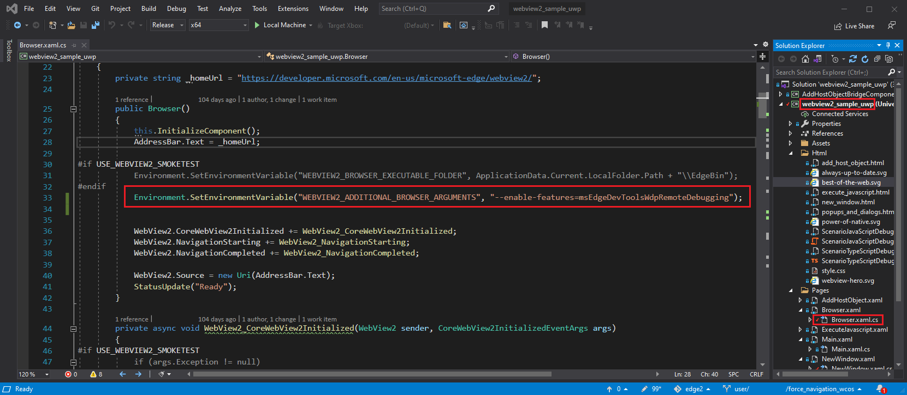
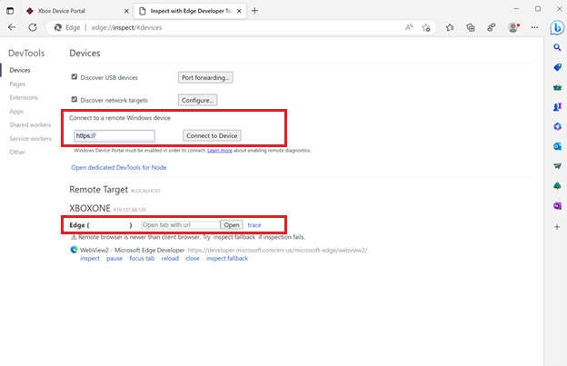
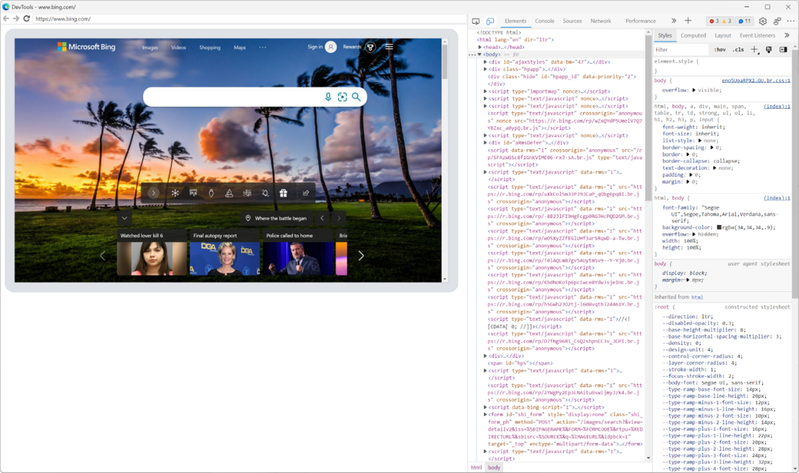

# Remote debugging Xbox WebView2 WinUI 2 (UWP) apps

To use [Microsoft Edge DevTools](/microsoft-edge/devtools-guide-chromium/landing/) to debug a WebView2 WinUI 2 (UWP) app, use remote debugging.  Remote debugging is necessary for WebView2 WinUI 2 (UWP) apps because currently, the built-in DevTools can't be launched inside a store-signed WebView2 WinUI 2 (UWP) app.


<!-- ========================================================================== -->
## Attach DevTools remotely to an Xbox WebView2 WinUI 2 (UWP) app

Attach Microsoft Edge DevTools remotely to an Xbox WebView2 WinUI 2 (UWP) app as follows:

1.  In Microsoft Edge, go to `edge://inspect`.  The **Inspect with Edge Developer Tools** page opens:

    

1.  Enable Developer Mode on Xbox.  See [Xbox One Developer Mode activation](/windows/uwp/xbox-apps/devkit-activation).

1.  In Microsoft Edge, navigate to `https://<System IP>:11443`.  Verify that the **Confirm security settings** page is loaded (in the **Windows Device Portal** tab).  For these examples, `<System IP>` is the Xbox System OS IP, replace that with your Xbox System OS IP.

    

    An SSL cert error appears:

    

1.  Click the **Advanced** button, and then click **Continue** to `<System IP>`.

    Xbox Device Portal opens:

    

1.  Navigate to `https://<System IP>:11443/config/rootcertificate`. This downloads a `rootcertificate.cer` file:

    

1.  Open the downloaded `rootcertificate.cer` file and then click **Open** when the following dialog is displayed:

    

1.  Click **Install Certificate**:

    

1.  Select **Current User** and click **Next**:

    

1.  Click the option to `Place all certificates in the following store`. Click **Browse** and select `Trusted Root Certification Authorities`:

    

1.  Click **Yes** to accept the security warning:

    

1.  Restart Microsoft Edge.

1.  Navigate to `https://<System IP>:11443` and verify the connection shows as secure:

    

1.  Configure your WebView2 WinUI 2 (UWP) app for remote debugging:

    To enable remote debugging, an environment variable must be set in your project.  This variable must be set before creating the `CoreWebView2` instance, and before either setting the `WebView2.Source` property or calling the `WebView2.EnsureCoreWebView2Async` method.

    Set the following variable:

    ```
    "WEBVIEW2_ADDITIONAL_BROWSER_ARGUMENTS", "--enable-features=msEdgeDevToolsWdpRemoteDebugging"
    ```
    
    For example, if you're using the [WebView2 Sample UWP app](https://github.com/MicrosoftEdge/WebView2Samples/tree/main/SampleApps/webview2_sample_uwp), you can set the environment variable by adding the following line in the `Browser.xaml.cs` file:
    
    ```csharp
    Environment.SetEnvironmentVariable("WEBVIEW2_ADDITIONAL_BROWSER_ARGUMENTS", "--enable-features=msEdgeDevToolsWdpRemoteDebugging");
    ```

    The line is numbered 33 in this screenshot, in the `Browser()` constructor, below an `#endif` that wraps an existing `SetEnvironmentVariable` statement:

    

1.  Deploy your app to your Xbox using `Xbox Device Portal` and launch your app.

1.  Go to `edge://inspect`.  In the **Connect to a remote Windows device** text box, enter `https://<System IP>:11443`, and then click **Connect to Device**.

1.  Verify that you can successfully connect, so that your debuggable WebView2 control, named **Edge**, is listed under your machine name:

    

1.  At the bottom of the **Edge** WebView2 control entry, click the **inspect** link.  Microsoft Edge DevTools opens for the WebView2 control:

    

Now you can use Microsoft Edge DevTools to inspect and debug the WebView2 control in your Xbox WebView2 WinUI 2 (UWP) app.


<!-- ========================================================================== -->
## See also

* [Remote debugging WebView2 WinUI 2 (UWP) apps](./remote-debugging.md)
