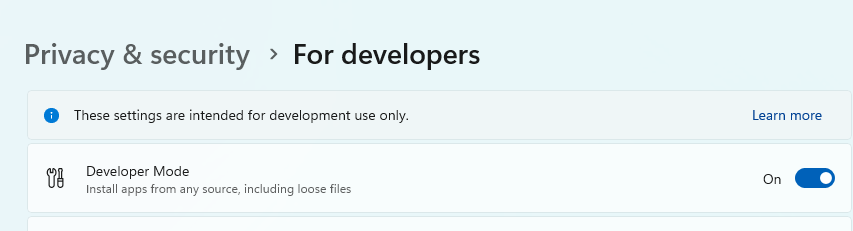
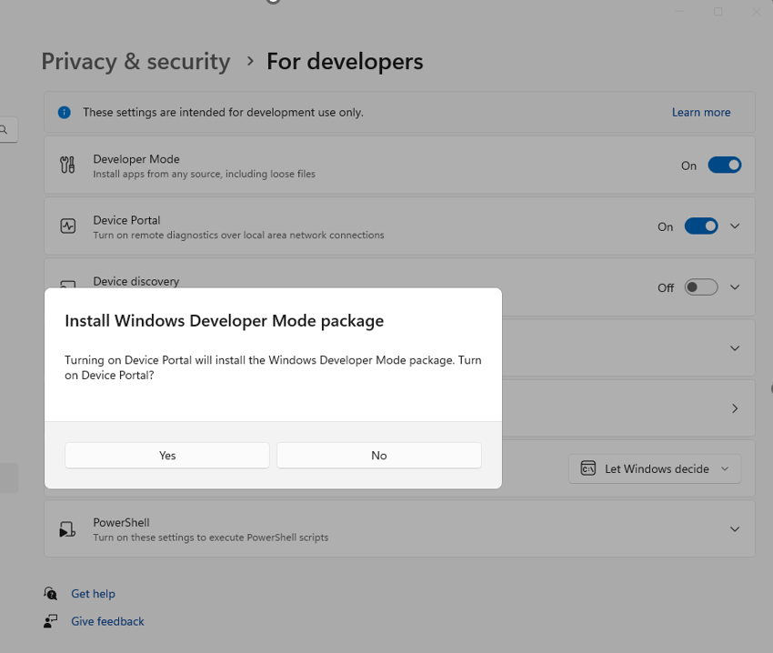
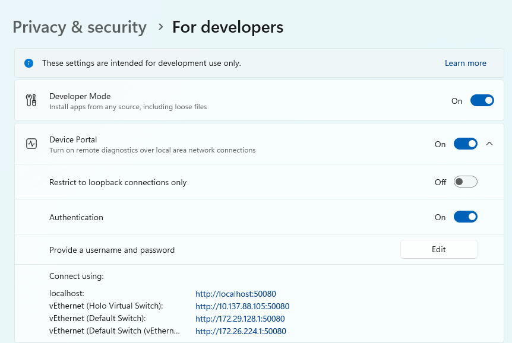
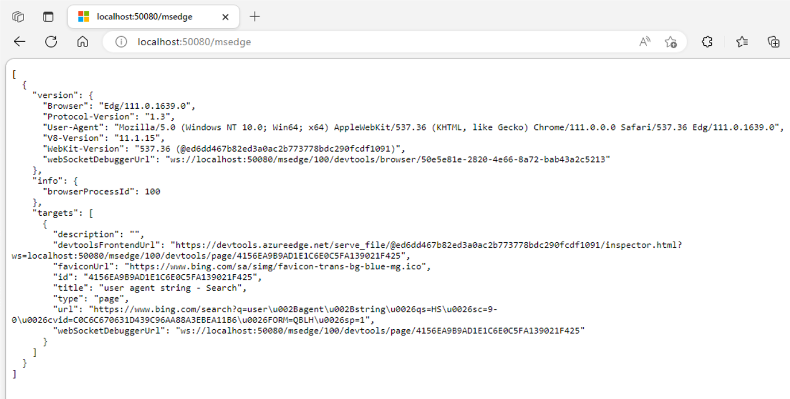
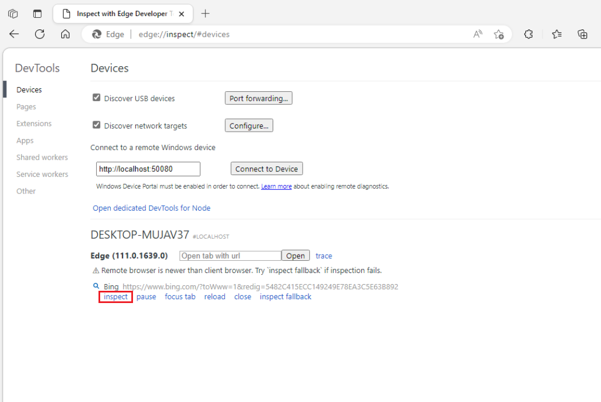

# Remote Debugging WebView2 apps with Remote Tools for Microsoft Edge

Use `Remote Tools for Microsoft Edge` to enable [Microsoft Edge DevTools](https://learn.microsoft.com/en-us/microsoft-edge/devtools-guide-chromium/landing/) debugging.

<!-- ====================================================================== -->
## Debugging Desktop WebView2 UWP apps

These steps can be used to attach `Edge DevTools` remotely to a WebView2 UWP app.
Remote debugging is necessary as a current limitation to WebView2 UWP apps is the built-in `DevTools` cannot be launched directly inside a store signed WebView2 UWP app.

1. Install [Edge Canary](https://www.microsoftedgeinsider.com/en-us/download/canary).

1. In `Edge Canary` navigate to `edge://inspect` and verify the page is supported in your version of the browser.

1. Enable `Developer Mode`:

    Open **Windows Settings> Privacy & security > For developers**:

    Switch `Developer Mode` to **On**.

    Verify the switch is enabled:

    

1. Enable `Device Portal`:

    Open **Windows Settings> Privacy & security > For developers**:

    Switch `Device Portal` to **On**.

    Click **Yes** to Install Windows Developer Mode package when prompted.

    

    Once the installation is complete, note the URL that will be used for the remote debugging connection. To find this URL, expand the Device Portal dropdown.  In this case, the Device Portal URL that will be used is `http://localhost:50080`.

    

1. Install [Remote Tools for Microsoft Edge](https://www.microsoft.com/store/productId/9P6CMFV44ZLT) from the Microsoft Store.

1. Open the Device Portal URL you previously noted in `Edge Canary`. Verify this is the page that is loaded:

    

1. If you are only debugging apps running locally, you can select **Continue with an unsecured connection**.
    Otherwise if you are not running the app locally, or if you need to connect over `HTTPS` select **Configure a secure connection** and follow the steps outlined in the page you are redirected to.

1. Verify the page you are redirected to is as follows:

    

1. Navigate to `http://<Device Portal URL>/msedge` and verify Remote Tools for Microsoft Edge are functioning. The page should load an empty list `[]`.

1. Configure your WebView2 UWP app for remote debugging:

    To enable remote debugging, two environment variables must be set in your project.

    This variable must be set before the `CoreWebView2` creation before either the `WebView2.Source` property is set or the `WebView2.EnsureCoreWebView2Async` method is called.

    Set the following variables:

    `WEBVIEW2_ADDITIONAL_BROWSER_ARGUMENTS = --enable-features=msEdgeDevToolsWdpRemoteDebugging`
    
    `WEBVIEW2_RELEASE_CHANNEL_PREFERENCE = 1`

    If you are using the [WebView2 Sample UWP app](https://github.com/MicrosoftEdge/WebView2Samples/tree/main/SampleApps/webview2_sample_uwp) you will add the following lines (lines 33 and 34) in the `Browser.xaml.cs` file:

    

1. Launch your app.

1. Navigate to `http://<Device Portal URL>/msedge` and verify your WebView2 instance appears in the list:

    

1. Navigate to `edge://inspect` and enter `http://<Device Portal URL>` in the box underneath `Connect to a remote Windows device` and click **Connect to Device**.

1. Verify you are able to successfully connect and your debuggable WebView2 is displayed.

    

1. Click **inspect** and `DevTools` for the WebView2 will open.

1. Debug WebView2 in the `DevTools` tab as normal.

<!-- ====================================================================== -->
## See also

* [Overview of DevTools](../index.md).
* [Get started with WebView2](../get-started/get-started.md)
* [WebView2Samples repo](https://github.com/MicrosoftEdge/WebView2Samples) - a comprehensive example of WebView2 capabilities.
* [WebView2 API reference](../webview2-api-reference.md)
* [See also](../index.md#see-also) in _Introduction to Microsoft Edge WebView2_.
