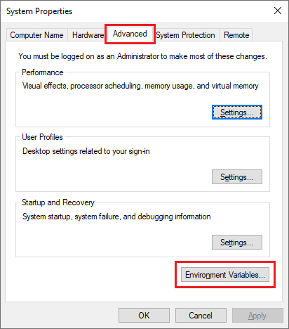
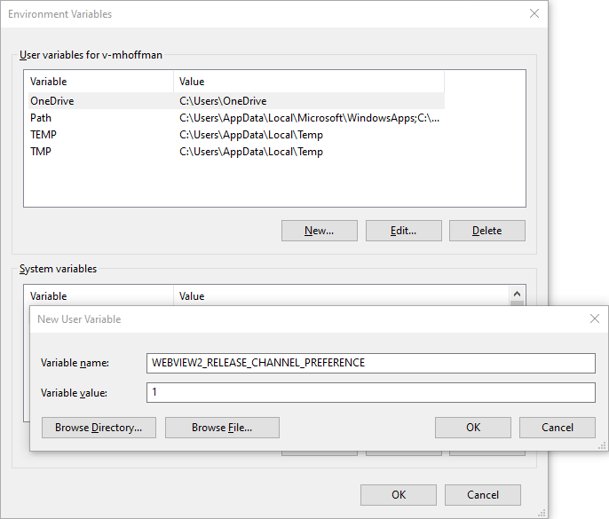
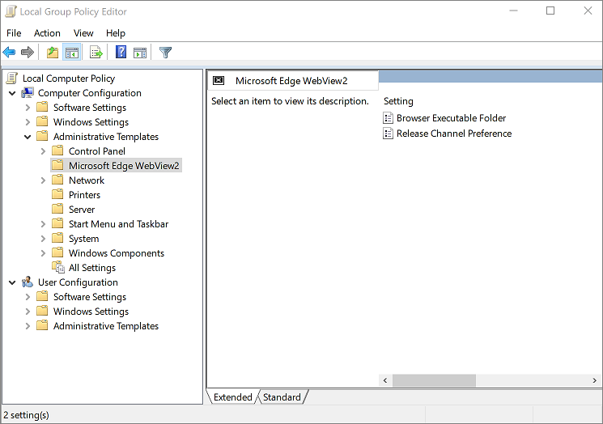
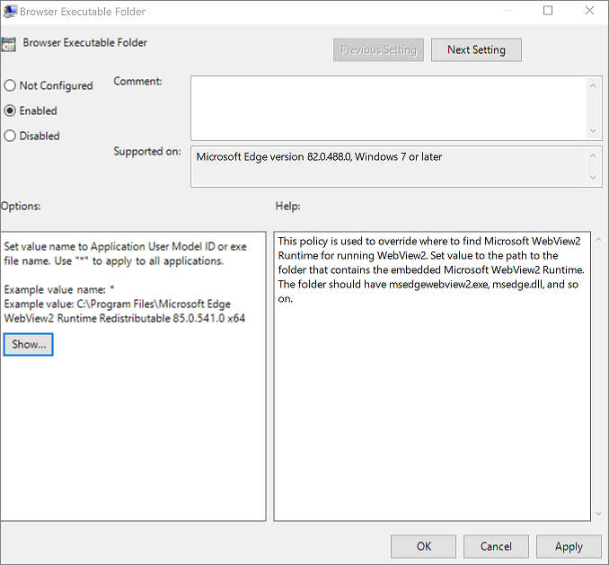
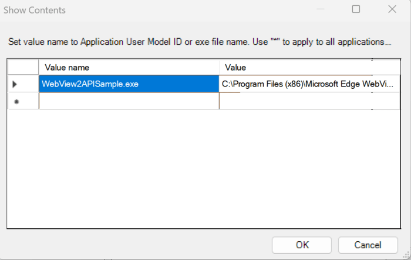

# Test upcoming APIs and features
<!-- old title: # Switch to a preview channel to test upcoming APIs and features -->

<!-- todo: update behavior description -->

To test upcoming APIs and features, you switch to a preview channel, as follows.

Updates of the WebView2 Evergreen Runtime often include new APIs and features.  Some of these updates could potentially break your WebView2 app.  To test the experimental APIs ahead of time and ensure your app's forward-compatibility, you should perform compatibility testing using a preview channel of Microsoft Edge, along with a prerelease version of the WebView2 SDK.

When you test a prerelease SDK package, you need to direct your application to use a preview channel of Microsoft Edge (Beta, Dev, or Canary), instead of defaulting to using the WebView2 Runtime.  Several approaches for doing this are explained below.

The WebView2 Runtime doesn't have the latest experimental WebView2 APIs.  For your WebView2 code to run when using experimental APIs in a prerelease SDK, your client (on a development machine) needs to have a Microsoft Edge preview channel.  The Canary preview channel is recommended, because it's ahead of the other channels and has the latest experimental APIs.

The prerelease SDK works together with a preview channel as follows:

*  A prerelease version of the WebView2 SDK contains the method signatures for experimental APIs, which allow you to write code using the experimental WebView2 APIs in your app.

*  The preview channels of Microsoft Edge contain the Microsoft Edge binaries that are needed to run and render your app, including the implementation of the experimental APIs.

For more information about how SDK versions works in conjunction with the WebView2 Runtime or preview channels of Microsoft Edge, see [Understand the different WebView2 SDK versions](../concepts/versioning.md).


<!-- ====================================================================== -->
## Downloading the prerelease SDK and a preview channel

To use experimental APIs, download a prerelease version of the WebView2 SDK from [Microsoft.Web.WebView2 package](https://www.nuget.org/packages/Microsoft.Web.WebView2).

To download a Microsoft Edge preview channel, see [Microsoft Edge Insider Channels](https://www.microsoft.com/edge/download/insider).


<!-- intro/overview of 4 approaches ======================================= -->
## Approaches to making your app use a specific browser channel

When a WebView2 is initialized, it will attempt to find a valid runtime on the machine to use. This can be the WebView2 Runtime, a preview channel of Microsoft Edge, or a specified location containing fixed version binaries. You can learn more about supported runtimes at [Distribute your app and the WebView2 Runtime](../concepts/distribution.md).

There are several ways to make your WebView2 app use a specified preview channel of Microsoft Edge:
*  By calling a function.
*  By using a registry override.
*  By using an environment variable.
*  By using a group policy.

These approaches are described below.

### Browser executable folder

One approach is to use a browser executable folder.  In this approach, you specify a folder that contains runtime binaries. This folder can be any of the following locations:
*  The installed location of the WebView2 Runtime.
*  A preview channel of Microsoft Edge.
*  A folder containing fixed version binaries that you have deployed to the machine yourself.

If you set the browser executable folder to a specific preview channel of Microsoft Edge, you will need to update the location when that preview channel updates to a newer version. This is because the location includes the version number as part of its path. Therefore, we recommend using this approach for local testing only.

### Default channel-search order

This section applies to using a group policy, registry override, or environment variable.

If a specific browser executable folder isn't specified, then the WebView2 will attempt to load a runtime from one of the known default locations.

The default channel-search order is:
1. The WebView2 Runtime.
1. The Beta channel of Microsoft Edge.
1. The Dev channel of Microsoft Edge.
1. The Canary channel of Microsoft Edge.

If you set the release channel preference to `1` by using a group policy, registry override, or environment variable, that will use the reverse of the default search order.


<!-- 1. Calling a function ============================================================== -->
## Calling a function

If you want to make your application use a specific runtime by calling a function, complete the following steps.

### Win32\/C++

We'll use the [WebView2APISample](https://github.com/MicrosoftEdge/WebView2Samples/tree/main/SampleApps/WebView2APISample) to demonstrate this procedure.

1. On your development machine, find the path containing the Microsoft Edge preview channel.  For example:

   `C:\\Users\\myname\\AppData\\Local\\Microsoft\\Edge SxS\\Application\\93.0.929.0`

1. Clone the [WebView2Samples](https://github.com/MicrosoftEdge/WebView2Samples) repo.

1. Open the **WebView2APISample** project, and then in **Source Files**, open the `AppWindow.cpp` file.

1. Find where [CreateCoreWebView2EnvironmentWithOptions](/microsoft-edge/webview2/reference/win32/webview2-idl#createcorewebview2environmentwithoptions) is called.  For example:

   ```cpp
   HRESULT hr = CreateCoreWebView2EnvironmentWithOptions(
       subFolder, m_userDataFolder.c_str(), options.Get(),
       Callback<ICoreWebView2CreateCoreWebView2EnvironmentCompletedHandler>(
           this, &AppWindow::OnCreateEnvironmentCompleted)
           .Get());
   ```

1. Replace the `subFolder` variable by the folder path for the Microsoft Edge preview channel you want to use.  For example:

   ```cpp
   HRESULT hr = CreateCoreWebView2EnvironmentWithOptions(
       L"C:\\Users\\myname\\AppData\\Local\\Microsoft\\Edge SxS\\Application\\93.0.929.0", m_userDataFolder.c_str(), options.Get(),
       Callback<ICoreWebView2CreateCoreWebView2EnvironmentCompletedHandler>(
           this, &AppWindow::OnCreateEnvironmentCompleted)
           .Get());
   ```

### WinForms

WinForms uses an approach similar to the Win32/C++ approach described above.

1. Set `CreationProperties.BrowserExecutableFolder` to point to the path that contains the Microsoft Edge Canary or Dev channel.  To do this, in the **WebView2Samples** solution, in the **WebView2WpfBrowser** project, open the file `MainWindow.xaml.cs`.

1. Find `CreationProperties.BrowserExecutableFolder`.  For example:

   ```csharp
   WebView2 GetReplacementControl(bool useNewEnvironment)
   {
      WebView2 replacementControl = new WebView2();
      ((System.ComponentModel.ISupportInitialize)(replacementControl)).BeginInit();
      // Setup properties and bindings.
      if (useNewEnvironment)
      {
         // Create a new CoreWebView2CreationProperties instance so the environment
         // is made anew.
         replacementControl.CreationProperties = new CoreWebView2CreationProperties();
         replacementControl.CreationProperties.BrowserExecutableFolder = webView.CreationProperties.BrowserExecutableFolder;
         replacementControl.CreationProperties.Language = webView.CreationProperties.Language;
         replacementControl.CreationProperties.UserDataFolder = webView.CreationProperties.UserDataFolder;
         shouldAttachEnvironmentEventHandlers = true;
      }
   ```

### WPF

WPF uses an approach similar to the Win32/C++ approach described above.

Refer to [CoreWebView2CreationProperties.BrowserExecutableFolder Property](/dotnet/api/microsoft.web.webview2.wpf.corewebview2creationproperties.browserexecutablefolder#Microsoft_Web_WebView2_Wpf_CoreWebView2CreationProperties_BrowserExecutableFolder).


<!-- 2. Registry Override ================================================= -->
## Using a registry override

When specifying a preview channel by using a registry override, there are two options:
*  Change the browser executable folder.
*  Change the release channel preference.

These two approaches are described below.

### Registry override: browser executable folder

To make your application use a Microsoft Edge preview channel by using a registry override that sets the browser executable folder:

1. Open a PowerShell terminal or PowerShell-enabled command prompt.

1. Modify and then run the following command:

   `REG ADD HKLM\Software\Policies\Microsoft\Edge\WebView2\BrowserExecutableFolder /v WebView2APISample.exe /t REG_SZ /d "C:\Users\myname\AppData\Local\Microsoft\Edge SxS\Application\88.0.680.0"`

   Replace `WebView2APISample.exe` with the file name of your own app executable or the Application User Model ID. Using a wildcard (*) as the value name will apply the override to _all_ WebView2 apps on the machine and can result in unexpected behavior.

   Replace `C:\Users\myname\AppData\Local\Microsoft\Edge SxS\Application\88.0.680.0` by the path to the desired Microsoft Edge preview channel.

#### Resuming using the default, WebView2 Evergreen Runtime

To undo the above setting, run the following command:

`REG DELETE HKLM\Software\Policies\Microsoft\Edge\WebView2\BrowserExecutableFolder /f`

### Registry override: release channel preference

To make your application use a Microsoft Edge preview channel by using a registry override that changes the release channel preference by changing the order of searching for a channel:

1. Open a PowerShell terminal or PowerShell-enabled command prompt.

1. Modify and then run the following command:

   `REG ADD HKLM\Software\Policies\Microsoft\Edge\WebView2\ReleaseChannelPreference /v WebView2APISample.exe /t REG_SZ /d "1"`

   Replace `WebView2APISample.exe` with the file name of your own app executable or the Application User Model ID. Using a wildcard (*) as the value name will apply the override to _all_ WebView2 apps on the machine and can result in unexpected behavior.

#### Resuming using the default, WebView2 Evergreen Runtime

To delete the `ReleaseChannelPreference` registry override, run the command:

`REG DELETE HKLM\Software\Policies\Microsoft\Edge\WebView2\ReleaseChannelPreference /f`


<!-- 3. Environment Variable ============================================== -->
## Using an environment variable

To make your application use a Microsoft Edge preview channel by using an environment variable:

1. In the Windows search bar, enter "environment", and then select **Edit the system environment variables**.

   

1. In the **System Properties** dialog, select the **Advanced** tab, and then select the **Environment Variables** button.

   

1. In the **User variables** section of the **Environment Variables** dialog, select **New**.

1. In the **New User Variable** dialog, set the **Variable name** to `WEBVIEW2_BROWSER_EXECUTABLE_FOLDER`, and set the **Variable value** to the path to your preferred browser channel or fixed version binaries.

   Alternatively, set the **Variable name** to `WEBVIEW2_RELEASE_CHANNEL_PREFERENCE`, and set the **Variable value** to `1` to reverse the search order, to use preview channels (Beta, Dev, or Canary) first. Any value besides `1` indicates the default search order.

1. Click **OK** to close the dialogs.

   

### Which app is affected

The above approach sets the environment variable for all WebView2 apps, not just the app you're testing.  To set this environment variable for only the WebView2 app which you are testing, if you're running your app from the command prompt, set the environment variable `WEBVIEW2_RELEASE_CHANNEL_PREFERENCE=1`.  That sets the environment variable just for the current `cmd.exe` command-prompt process and for any new child processes from that `cmd.exe` instance.  Then the environment variable only applies to the WebView2 app that you're testing.

If you use the `WEBVIEW2_RELEASE_CHANNEL_PREFERENCE` environment variable, you can set it to the following values.

| Value | Description |
|---|---|
| `1` | Reverses the search order, to use [preview channels](https://www.microsoft.com/edge/download/insider) first, before the WebView2 Runtime. |
| `0` or another value other than `1` | Uses the [default channel-search order](#default-channel-search-order), which is to use the WebView2 Runtime before the preview channels. |

### Applying the new environment variable to running processes

After setting an environment variable, the environment variable is applied to any new processes that are created.  The environment variable doesn't apply to processes which are already running.  To ensure that all processes use the new environment variable, you may need to restart Visual Studio, or log out of Windows and then log in again.


<!-- 4. Group Policy ====================================================== -->
## Using a group policy

If you want to make your application use a Microsoft Edge preview channel by using a group policy, copy ADMX and ADML files to the `PolicyDefinitions` folder, as follows.

1. Download the policy files from [Download and deploy Microsoft Edge for business](https://www.microsoft.com/edge/business/download).

1. Copy the ADMX file into a Policy Definitions template folder, such as `C:\Windows\PolicyDefinitions`.

1. Copy the ADML file into a matching locale folder within the `Policy Definitions` folder, such as a `C:\Windows\PolicyDefinitions\en-us`<!--keep /en-us here--> folder.

1. Open the **Local Group Policy Editor**.  To do this, in the Windows search bar, type "group policy", and then select **Edit group policy**.

1. Expand **Local Computer Policy**, then **Computer Configuration** or **User Configuration**.  Then expand **Administrative Templates** > **Microsoft Edge WebView2**.

   

1. Select **Browser Executable Folder**.  The following screenshots apply to setting the **Browser Executable Folder**.  Alternatively, select **Release Channel Preference**, which uses similar dialogs.

   

1. Select the **Show** button.

1. Fill-in the **Show Contents** dialog.  In the **Value name** column, enter your app's `.exe` file name or Application User Model ID. Using a wildcard (*) as the value name will apply the override to _all_ WebView2 apps on the machine and can result in unexpected behavior.

   

1. Select **OK** to close the dialogs.

For more information, see [Configure Microsoft Edge policy settings](/deployedge/configure-microsoft-edge).
