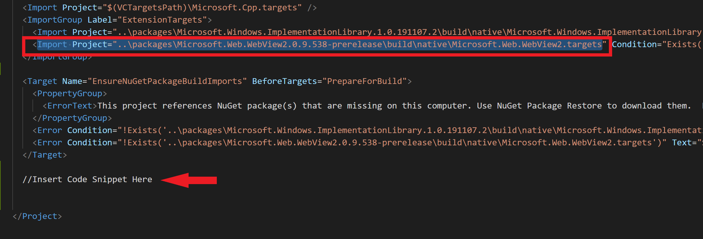
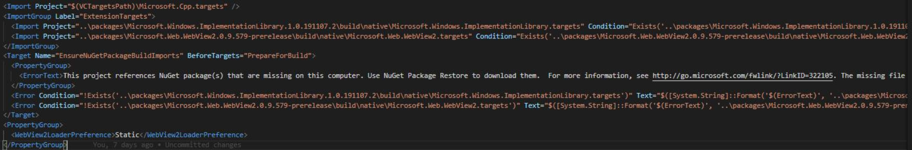

# Distribute a WebView2 app as a single executable file
<!-- old title: Statically link the WebView2 loader library -->

You may want to distribute your application with a single executable file, instead of a package of many files.  To create a single executable file, or to reduce the size of your package, you should statically link the WebView2Loader files.  The WebView2 SDK contains a header file, `WebView2Loader.dll`, and the `IDL` file. `WebView2Loader.dll` is a small component that helps apps locate the WebView2 Runtime, or Microsoft Edge preview channels, on the device.

For an app that doesn't ship `WebView2Loader.dll`, do the following:

1. Open the `.vcxproj` project file for your app in a text editor, such as Visual Studio Code.

   The `.vcproj` project file might be a hidden file, meaning that the file isn't shown in Visual Studio.  To find hidden files, use the command line.

1. Locate the section in the code where you include the WebView2 NuGet package target files.  The location in the code is highlighted in the following figure:

   

1. Copy the following code and paste it where the `Microsoft.Web.WebView2.targets` is included:

   ```xaml
   <PropertyGroup>
       <WebView2LoaderPreference>Static</WebView2LoaderPreference>
   </PropertyGroup>
   ```

   The inserted code is shown below:

   

1. Compile and run your app.


<!-- ====================================================================== -->
## See also

* [Get started with WebView2](../get-started/get-started.md)
* [WebView2Samples repo](https://github.com/MicrosoftEdge/WebView2Samples) - a comprehensive example of WebView2 capabilities.
* [WebView2 API reference](../webview2-api-reference.md)
