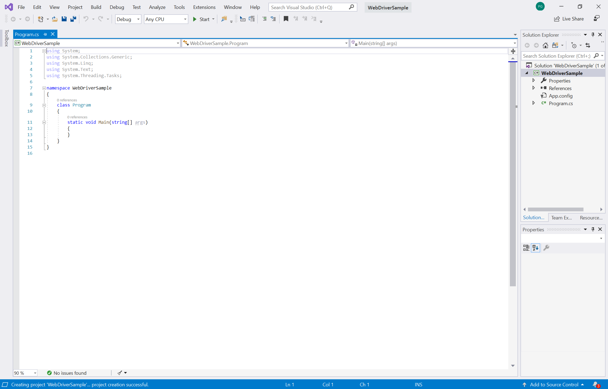
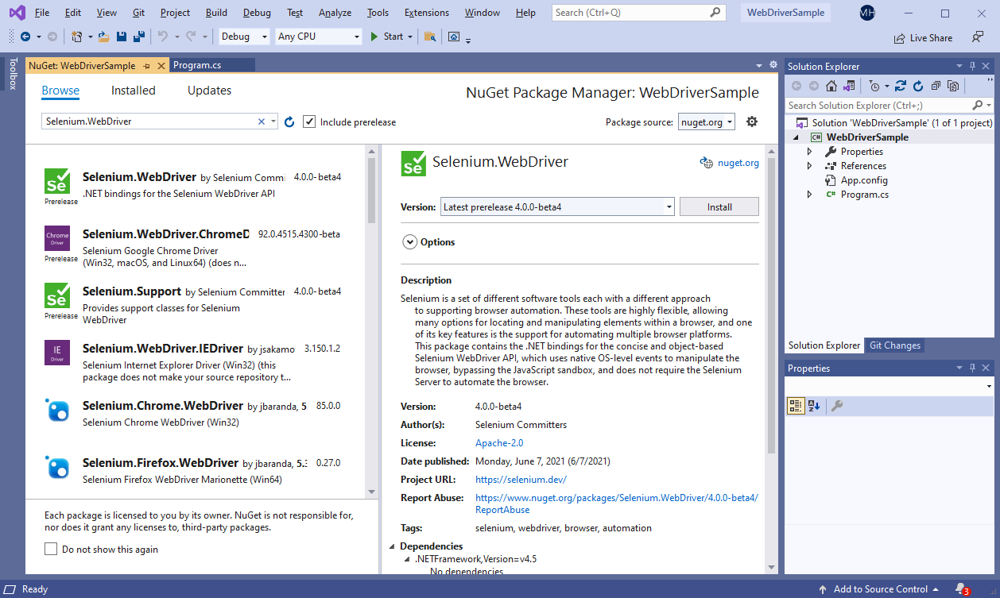
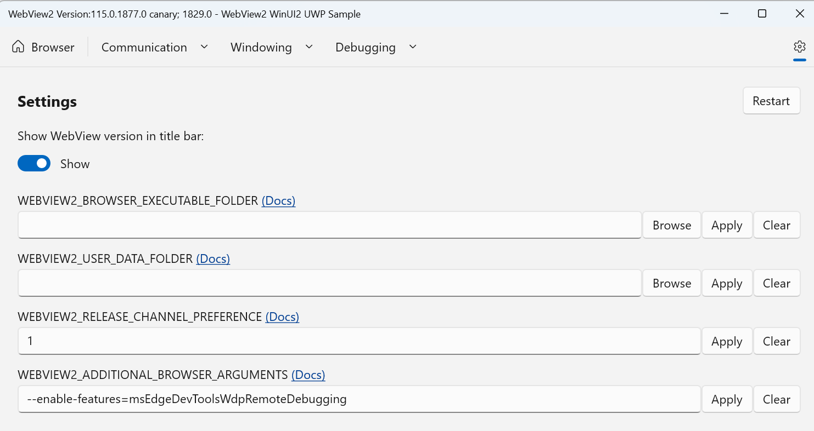
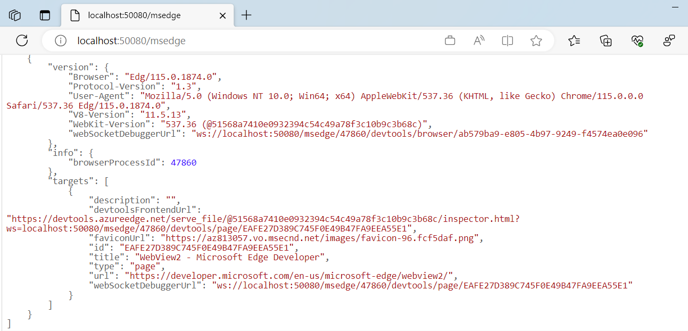

# Automate and test WebView2 apps with Microsoft Edge WebDriver
<!-- old title: # Automate and test WebView2 apps with Microsoft Edge WebDriver -->

This article explains how to automate and test your WebView2 app with Microsoft Edge WebDriver, by using the Selenium framework for browser test automation.

This article provides instructions for using the Selenium framework and C#, but you can use any library, framework, and programming language that supports WebDriver.  To accomplish the same tasks using a WebDriver testing framework other than Selenium, consult the official documentation for your framework of choice.

To create automated tests that simulate user interactions for your WebView2 app, you can use Microsoft Edge WebDriver.  Microsoft Edge WebDriver is Microsoft's implementation of the W3C [WebDriver](https://www.w3.org/TR/webdriver2) protocol.  The W3C WebDriver protocol allows programs to control the behavior of web browsers.

Test authors write tests that use WebDriver commands to tell the browser to perform specific actions.  Microsoft Edge WebDriver receives these commands and then asks the browser to perform the requested action.  Microsoft Edge WebDriver supports automating both the Microsoft Edge Browser, and WebView2 apps.

For the relationship between the WebDriver protocol, Microsoft Edge WebDriver as an implementation of that protocol, and the Selenium test framework, see [WebDriver overview](../../webdriver-chromium/index.md#relationship-between-webdriver-and-other-software).


<!-- ====================================================================== -->
## Step 1: Download the WebView2API Sample

If you don't have an existing WebView2 project, clone the WebView2Samples repo in order to download the [WebView2API Sample app](https://github.com/MicrosoftEdge/WebView2Samples/tree/main/SampleApps/WebView2APISample).  That particular sample within the larger repo a comprehensive sample of the latest WebView2 SDK.  Make sure you've satisfied the [prerequisites for the WebView2API Sample app](https://github.com/MicrosoftEdge/WebView2Samples/tree/main/SampleApps/WebView2APISample#prerequisites).

Once you've cloned the repo, build the project in Visual Studio.  It should look like the following figure.


<!-- ====================================================================== -->
## Step 2: Install Microsoft Edge WebDriver

Follow the instructions to install [Microsoft Edge WebDriver](../../webdriver-chromium/index.md#download-microsoft-edge-webdriver).  Microsoft Edge WebDriver is the browser-specific driver required by Selenium to automate and test WebView2.

Make sure the version of Microsoft Edge WebDriver matches the version of the WebView2 Runtime that your app uses.  For the WebView2API Sample to work, make sure your version of the WebView2 Runtime is greater than or equal to the supported version of the latest WebView2 SDK release.

*  To locate the latest WebView2 SDK release, see [Release Notes for the WebView2 SDK](../release-notes/index.md).

*  To find out which version of the WebView2 Runtime you currently have, go to `edge://settings/help`.


<!-- ====================================================================== -->
## Step 3: Add Selenium to the WebView2API Sample

By this point, you've installed the WebView2 Runtime, built a WebView2 project, and installed Microsoft Edge WebDriver.  Next, get started using Selenium, as follows.

1. Start by creating a new **C# .NET Framework** project in **Visual Studio**.  Select **Next** on the bottom right-hand corner to continue.

   

1. Give your project a **Project name**, save it to your preferred **Location**, and then select **Create**.

   

   A new project is created, with all the code placed in the `Program.cs` file.

   

1. Next, add Selenium to the project; install Selenium by using the Selenium.WebDriver NuGet package as follows.  To download the Selenium.WebDriver NuGet package, in **Visual Studio**, select **Project** > **Manage NuGet Packages**.

1. Select the **Browse** tab.  The following screen appears.

   

1. In the **Package source** dropdown list, select **nuget.org**.

1. Select the **Include prerelease** checkbox.

1. Type `Selenium.WebDriver` in the **Search** bar, and then select **Selenium.WebDriver** from the results.

1. In the detail window on the right, make sure the **Version** is set to **4.0.0** or later, and then select **Install**.  NuGet downloads Selenium to your machine.

   

   To learn more about the Selenium.WebDriver NuGet package, see [Selenium.WebDriver](https://www.nuget.org/packages/Selenium.WebDriver).

1. Use `OpenQA.Selenium.Edge` by adding the statement `using OpenQA.Selenium.Edge;` at the beginning of the file `Program.cs`:

   ```csharp
   using OpenQA.Selenium.Edge;

   using System;
   using System.Collections.Generic;
   using System.Linq;
   using System.Text;
   using System.Threading.Tasks;
   ```

You've now set up an empty Visual Studio project that's suitable for Selenium testing.  Next, configure Selenium to drive WebView2 by using either the "launch" approach or the "attach" approach.


<!-- ====================================================================== -->
## Step 4: Choosing whether Microsoft Edge WebDriver should launch your app or attach to it

Decide whether to configure Selenium to drive WebView2 by using the "launch" or "attach" approach.

*  The "launch" approach: In some scenarios, it's appropriate to let Microsoft Edge WebDriver handle launching your WebView2 app.
Microsoft Edge WebDriver launches your WebView2 app and automatically attaches to the first available WebView2 instance that your app creates.

*  The "attach" approach: In other scenarios, it's appropriate to attach Microsoft Edge WebDriver to a running WebView2 instance.  You launch your app outside of Microsoft Edge WebDriver, and then attach Microsoft Edge WebDriver to a running WebView2 instance.  This "attach" approach is for a WebView2 app that's not compatible with the "launch" approach.

### Approach 1: Letting Microsoft Edge WebDriver launch your WebView2 app
<!-- preferred phrase -->

If you have a simple app that creates a single WebView2 instance and that instance is active immediately upon launch, then you can use the "launch" approach; use [Step 4a: Letting Microsoft Edge WebDriver launch your WebView2 app](#step-4a-letting-microsoft-edge-webdriver-launch-your-webview2-app).

In this scenario, there's one WebView2 instance, and it's available upon launch, without needing to navigate through any native UI.

### Approach 2: Attaching Microsoft Edge WebDriver to a running WebView2 app
<!-- preferred phrase -->

If you have any situation that doesn't fit the "launch" scenario above, you should attach Microsoft Edge WebDriver to a running WebView2 instance (instead of letting Microsoft Edge WebDriver handle the WebView2 launch); use [Step 4b: Attaching Microsoft Edge WebDriver to a running WebView2 app](#step-4b-attaching-microsoft-edge-webdriver-to-a-running-webview2-app).

Some examples of scenarios that don't fit the "launch" scenario are:
*  You need to navigate through some native UI before the WebView2 instance is created.
*  Your app creates multiple WebView2 instances, and you want to attach to a specific instance.

In such scenarios, we recommend attaching to a specific instance of WebView2, because having Microsoft Edge WebDriver launch your WebView2 app is for relatively simple scenarios only.  When Microsoft Edge WebDriver launches your app, it automatically attaches to the first WebView2 instance that is created, and will fail if no WebView2 instance is found.

Regardless of whether you use the "launch" or "attach" approach, you must download Microsoft Edge WebDriver, and make sure the version matches the version of the WebView2 runtime that your app uses.  The initial steps to configure your WebDriver framework (such as Selenium) will differ between the "launch" versus "attach" approaches.

Once you've completed these initial steps to either launch an app or attach to a WebView2 instance, you'll be able to use any supported WebDriver commands to interact with that WebView2 instance.


<!-- ====================================================================== -->
## Step 4a: Letting Microsoft Edge WebDriver launch your WebView2 app
<!-- old title: Drive WebView2 with Selenium and Microsoft Edge WebDriver -->

Use this "launch" approach if you have a simple app that creates a single WebView2 instance and that instance is active immediately upon launch.  In this scenario, there's one WebView2 instance, and it's available upon launch, without needing to navigate through any native UI.

To drive WebView2 with Selenium and Microsoft Edge WebDriver:

1. Create an `EdgeOptions` object, by copying and pasting the following code:

   ```csharp
   static void Main(string[] args)
   {
      EdgeOptions eo = new EdgeOptions();
   ```

   Next, we'll add code that does the following:

   *  Configure the `EdgeOptions` instance to use WebView2, by setting the `UseWebView` option to `true`.
   *  Set `eo.BinaryLocation` to the file path of your WebView2 app binary.
   *  Create an `EdgeDriver` object using the `EdgeOptions` instance.

1. Copy the following code and paste it below the `eo` declaration line:

   ```csharp
   //Set the EdgeOptions instance to use WebView2
   eo.UseWebView = true;

   //Set the BinaryLocation to the filepath of the WebView2API Sample runtime
   eo.BinaryLocation = @"C:\path\to\your\webview2\project.exe";
   EdgeDriver e = new EdgeDriver(eo);
   ```

1. In the above code, specify the correct file path of your project runtime and the Microsoft Edge WebDriver runtime on your machine.

   `EdgeDriver` has now been configured to drive the WebView2 in your project.  For example, if you're using the **WebView2API Sample**, your code can now go to `https://microsoft.com` by running the `e.Url = @"https://www.microsoft.com";` command, as shown in the next code listing.

1. Verify that Selenium can drive WebView2.  To do this, set a breakpoint on the line `e.Url = @"https://www.microsoft.com";`, and then run the project.

   ```csharp
      //Navigate the WebView2API Sample from bing.com to microsoft.com
      e.Url = @"https://www.microsoft.com";

      //Exit Microsoft Edge WebDriver
      e.Quit();
   }
   ```

   

Congratulations!  You've successfully automated a WebView2 project and driven WebView2 by using Selenium and Microsoft Edge WebDriver, per the "launch" approach.

This is the end of the article, if you are using the "launch" approach.


<!-- ====================================================================== -->
## Step 4b: Attaching Microsoft Edge WebDriver to a running WebView2 app
<!-- description: Automating a WebView2 instance in an already-running application by attaching Edge Driver to the WebView2 app. -->

This section explains how to attach Microsoft Edge WebDriver to an already-running WebView2 instance.  If you don't have just a single WebView2 instance, or your WebView2 instance requires navigating through some native UI, use this section and approach.

A problem is that to automate a WebView2-based app, you sometimes first need to perform some actions in the native GUI in order to launch the WebView2 control.  As a solution, you need to navigate the native UI outside of Microsoft Edge WebDriver, and somehow ensure that the WebView2 instance is displayed, as follows.

In this scenario, where you have some native UI to navigate, you launch your app using a method other than Microsoft Edge WebDriver, such as a command line script, or a separate tool such as WinAppDriver. Once your app process has been launched, you trigger the WebView2 instantiation, and then attach Microsoft Edge WebDriver to the running WebView2 instance.

Microsoft Edge WebDriver doesn't handle native UI automation, but here are some other approaches to navigate the native UI and display the WebView2 instance that you are automating:

*  Windows Application Driver ([WinAppDriver](https://github.com/Microsoft/WinAppDriver)) is a service to support Selenium-like UI Test Automation on Windows Applications.  This service supports testing Universal Windows Platform (UWP), Windows Forms (WinForms), Windows Presentation Foundation (WPF), and Classic Windows (Win32) apps on Windows 10 PCs.

*  Using Microsoft Native UI automation directly.  The [Microsoft UI Automation](/windows/win32/winauto/entry-uiauto-win32) framework allows automated test scripts to interact with the UI.  Microsoft UI Automation enables Windows applications to provide and consume programmatic information about user interfaces (UIs).  It provides programmatic access to most UI elements on the desktop.  It enables assistive technology products, such as screen readers, to provide information about the UI to end users and to manipulate the UI by standard input and by means other than standard input. <!-- condense that; 1st para -->

* Use a flag such as a command-line parameter or an environment variable to tell your app to launch directly to the WebView2 instance, to avoid the need for navigating native UI.  Depending on your scenario, this might make it possible to use the "launch" approach described in [Step 4a: Letting Microsoft Edge WebDriver launch your WebView2 app](#step-4a-letting-microsoft-edge-webdriver-launch-your-webview2-app).  <!-- create a special test mode that displays x. -->

In addition to ensuring the WebView2 instance is activated, you need to set its `--remote-debugging-port` command-line parameter.  We'll do this in the steps below.  Microsoft Edge WebDriver will use this remote debugging port to connect to your WebView2 instance.

### Launching the WebView2 app with remote debugging enabled

The next step happens when you're coding your app.  You need to provide this extra command-line parameter when you're instantiating your WebView2 control.  Enable remote debugging, as follows.

1. Configure your WebView2 instance with the `--remote-debugging-port=<port>` additional command-line parameter using one of the recommended approaches in [Globals, in WebView2 Win32 C++ Reference](/microsoft-edge/webview2/reference/win32/0-9-538/webview2-idl).  Choose an available port number for this parameter.

1. Launch your app.  How you launch your app depends on what other native UI testing tools you're using.

At this point, your app is running and its `--remote-debugging-port` command-line parameter has been set.  Next, we'll attach Microsoft Edge WebDriver to the launched WebView2 app.

### Attaching Microsoft Edge WebDriver to the launched WebView2 app

1. Use the `EdgeOptions.DebuggerAddress` property to tell Microsoft Edge WebDriver to connect to the remote debugging port that you specified previously, instead of launching a new application:

```csharp
EdgeOptions eo = new EdgeOptions();
eo.UseWebView = true;
eo.DebuggerAddress = "localhost:9222";
EdgeDriver e = new EdgeDriver(eo);
```

At `localhost:9222` above, the port number given on this line should match the port number that you chose when setting `--remote-debugging-port` above.

For more info about the `DebuggerAddress` property of the `EdgeOptions` object, see [EdgeOptions object](../../webdriver-chromium/capabilities-edge-options.md#edgeoptions-object).

### For UWP apps, attach Microsoft Edge WebDriver to WebView2 with Remote Tools

1. Complete the steps described in [Remote debugging UWP apps with Remote Tools for Microsoft Edge](./remote-debugging.md).

   This WebView2 feature is currently only supported in the Canary preview channel of Microsoft Edge.  Set the enviroment variable `WEBVIEW2_RELEASE_CHANNEL_PREFERENCE=1`, to ensure that the WebView2 version is Canary.  For more information, see [Using an environment variable](./set-preview-channel.md#using-an-environment-variable) in _Test upcoming APIs and features_.

   
 
1. After you've launched the UWP WebView2 app, go to `http://<Device Portal URL>/msedge`.  For example, the following screenshot shows `localhost:50080/msedge`:

   

1. Note the `browserProcessId` for the WebView2 process that you want to attach Microsoft Edge WebDriver to.  For example, the above screenshot shows the `browserProcessId` as `47860`.

1. In your code, use the `wdpAddress` and `wdpProcessId` properties to tell Microsoft Edge WebDriver to connect to the [Remote Tools for Microsoft Edge](https://apps.microsoft.com/store/detail/9P6CMFV44ZLT) and the specific WebView2 process.
   * `wdpAddress` is defined as the Device Portal URL.
   * `wdpProcessId` is defined as the `browserProcessId` value that you noted in the previous step:

   ```csharp
   EdgeOptions eo = new EdgeOptions();
   eo.AddAdditionalEdgeOption("wdpAddress", "localhost:50080");
   eo.AddAdditionalEdgeOption("wdpProcessId", 47860);
   // Optional user name and password to use when connecting to a Windows Device Portal
   // server.  Required if the server has authentication enabled.
   // eo.AddAdditionalEdgeOption("wdpUsername", "username");
   // eo.AddAdditionalEdgeOption("wdpPassword", "password");
   EdgeDriver e = new EdgeDriver(eo);
   ```

For more information about launching a WebView2 UWP app with Remote Tools, see [Remote debugging UWP apps with Remote Tools for Microsoft Edge](./remote-debugging.md).

Congratulations!  You've successfully attached Microsoft Edge WebDriver to a running WebView2 app.

### UWP projects and debugging

To configure the debug settings on launch, you must use the registry to enable debugging for all WebView2 processes on startup. Because of the way that UWP projects are launched, the WebDriver2 control is unable to automatically configure the debug settings on launch. Note that setting this registry key enables debugging support for all launched WebView2 processes while this environment variable is configured.

You can override parameters by values that are specified in the WEBVIEW2_ADDITIONAL_BROWSER_ARGUMENTS registry key. For information about the WEBVIEW2_ADDITIONAL_BROWSER_ARGUMENTS registry key (and equivalent environment variable), see [CreateCoreWebView2EnvironmentWithOptions](/microsoft-edge/webview2/reference/win32/webview2-idl?#createcorewebview2environmentwithoptions) in _Globals_. The WEBVIEW2_ADDITIONAL_BROWSER_ARGUMENTS registry key (which is also an environment variable name) lets you add to the command-line arguments that will be passed to the WebView2 Runtime browser process when it is started.


<!-- ====================================================================== -->
## See also

* [WebDriver on Selenium documentation](https://www.selenium.dev/documentation/en/webdriver) - How the APIs Selenium drives WebView2 or Microsoft Edge.
* [Introduction to Microsoft Edge WebView2](../index.md) - How to use the WebView2 control to embed web content in your native app.
* [Use WebDriver for test automation](../../webdriver-chromium/index.md) - Automating Microsoft Edge.
