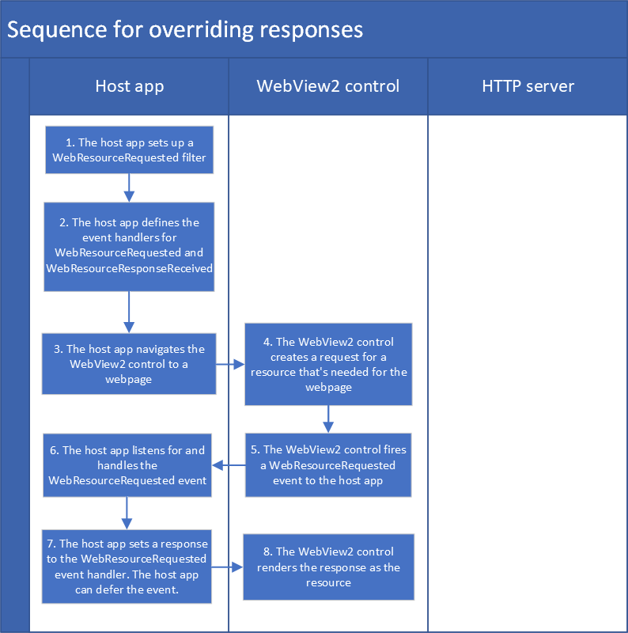

# Custom management of network requests
<!--
# Custom management of network requests and responses in WebView2
# Managing network requests in WebView2
# Navigating with web resource request and response events
-->

<!-- todo
writer: add arrows to diagrams
writer: read through body content
-->

The Microsoft Edge WebView2 control lets you interact with and modify network requests.  You can either provide a response or modify the network request using the `WebResourceRequested` and `WebResourceResponseReceived` events.  There is also special functionality that allows you to navigate with specific network requests using the `NavigateWithWebResourceRequest API`.

This article describes how you can modify network requests.  Use this API and approach to:
* Upload local file content to your app to add support for offline functionality.
* Block content in a webpage, such as specific images.
* Fine-tune authentication for specific pages.

**Terminology:**

| Term | Definition |
|---|---|
| intercept | Your host app can intercept a request that is sent from the WebView2 control to the HTTP server, read or modify the request, and then send the unchanged or modified request to the HTTP server (or to local code instead of the HTTP server). |
| override | Your host app can override a response that's sent from the HTTP server to the WebView2 control, and send a custom response to the WebView2 control instead of the original response. |


<!-- ====================================================================== -->
## When to use custom vs. basic approaches

The `WebResourceRequested` event is a low-level API that gives more control, but requires more coding and is complicated to use.  For some common scenarios, we provide APIs that are easier to use and are optimized for those specific scenarios, and we recommend you use those APIs rather than the APIs discussed in this article.

Instead of using the WebResourceRequested APIs, it's preferable to use these other approaches when feasible:
* [Basic Authentication](/microsoft-edge/webview2/concepts/basic-authentication?tabs=csharp)
* [General navigation](/microsoft-edge/webview2/concepts/navigation-events) 
* [Managing cookies in WebView2](/microsoft-edge/webview2/reference/win32/icorewebview2)
* Setting the user agent string.  See [UserAgent Property](/microsoft-edge/webview2/reference/winrt/microsoft_web_webview2_core/corewebview2settings#useragent).

**Note:** For URLs with virtual hostnames, using the `WebResourceRequested` event isn't supported.  This is because the `WebResourceRequested` event isn't fired for the [SetVirtualHostNameToFolderMapping method](/microsoft-edge/webview2/reference/win32/icorewebview2_3#setvirtualhostnametofoldermapping).<!-- or ClearVirtualHostNameToFolderMapping. -->


<!-- ------------------------------ -->
#### How your host app, the WebView2 control, and the HTTP server interact

The WebView2 control sits in between your host app and the HTTP server.  When your host app navigates to a URI, the WebView2 control sends a request to the HTTP server.  The HTTP server then sends a response to the WebView2 control.

<!-- lexicon for the 3 actors:
the HTTP server
the WebView2 control
the host app
-->


<!-- ====================================================================== -->
## Intercepting a request, to monitor or modify it

Your host app can _intercept_ a request that is sent from the WebView2 control to the HTTP server, read or modify the request, and then send the unchanged or modified request to the HTTP server (or to local code instead of the HTTP server). 

Intercepting the request allows you to customize the header content, URL, or the GET/POST method.  The host app may want to intercept a request to provide optional POST content as part of the request.

The host app can change the properties of a request by using this API:

##### [.NET](#tab/dotnet)

* [CoreWebView2WebResourceRequest Class](/dotnet/api/microsoft.web.webview2.core.corewebview2webresourcerequest)

##### [Win32](#tab/win32)

* [ICoreWebView2WebResourceRequest](/microsoft-edge/webview2/reference/win32/icorewebview2webresourcerequest)

---


<!-- ------------------------------ -->
#### What you can do with headers

A HTTP header provides important information and metadata about a request or response.  Changing [headers](https://developer.mozilla.org/docs/Glossary/HTTP_header) enables you to perform powerful actions on the network. 

A [request header](https://developer.mozilla.org/docs/Glossary/Request_header) can be used to indicate the format of the response (such as the `Accept-*` headers), set authentication tokens, read and write cookies (sensitive information), modify the user agent, and so on.  A [response header](https://developer.mozilla.org/docs/Glossary/Response_header) can be used to provide more context of the response.


<!-- ------------------------------ -->
#### Filtering the WebResourceRequested event based on URL and resource type

In order to receive `WebResourceRequested` events, specify filters for the requests that the host app is interested in, based on URL and resource type.

For example, suppose the host app is trying to replace images.  In this case, the host app is only interested in `WebResourceRequested` events for images.  The host app would only get events for images by specifying the `resourceContext` filter for images.

Another example is if the host app is only interested in all requests that are under a site like `https://example.com`.  Then the app can specify a URL filter as `https://example.com/*` to get events that are associated with that site.

##### [.NET](#tab/dotnet)

* [CoreWebView2.AddWebResourceRequestedFilter Method](/dotnet/api/microsoft.web.webview2.core.corewebview2.addwebresourcerequestedfilter)

##### [Win32](#tab/win32)

* [AddWebResourceRequestedFilter method](/microsoft-edge/webview2/reference/win32/icorewebview2#addwebresourcerequestedfilter)

---


For details about how the URL filter works, see [CoreWebView2.AddWebResourceRequestedFilter Method > Remarks](/dotnet/api/microsoft.web.webview2.core.corewebview2.addwebresourcerequestedfilter#remarks)


<!-- ------------------------------ -->
#### Why would you want to intercept requests that are sent from WebView2?  

Intercepting requests sent from WebView2 enables you to further configure your request. The host app might want to provide optional content as part of the request that the WebView2 control won't know on its own. Some scenarios include:
*  You're logging into a page and the app has credentials so the app can provide authentication header without the user having to enter those credentials.  
*  You want offline functionality in the app so you redirect the URL to a local file path when no internet connection is detected.
*  You want to upload local file content to the request server via a POST request.


<!-- ------------------------------ -->
#### Sequence for modifying requests

<!-- wiki page that points to the Visio source file: Documentation > "Notes about specific image files" -->


1. The host app sets up a `WebResourceRequested` filter.
1. The host app defines the event handlers for `WebResourceRequested` and `WebResourceResponseReceived`.
1. The host app navigates the WebView2 control to a webpage.
1. The WebView2 control creates a request for a resource that's needed for the webpage.
1. The WebView2 control fires a `WebResourceRequested` event to the host app.
1. The host app listens for and handles the `WebResourceRequested` event.
1. The host app can modify headers at this point.  The host app can also defer the `WebResourceRequested` event, which means that the host app asks for more time to decide what to do.
1. The WebView2 network stack can add more headers (for example, can add cookies and authorization headers).
1. The WebView2 control sends the request to the HTTP server.
1. The HTTP server sends the response to the WebView2 control.
1. The WebView2 control fires the `WebResourceResponseReceived` event.
1. The host app listens for the `WebResourceResponseReceived` event and handles it.<!-- todo: arrow: "The WebView2 control creates a request for a resource that's needed for the webpage." -->


<!-- ------------------------------ -->
#### Example: Intercepting a request, to monitor or modify it

<!-- this example doesn't exist in the sample repo -->

<!-- the below intro is based on copying the main h2's Sentence 1 from above: -->
In the following example, the host app _intercepts_ the document request that is sent from the WebView2 control to the `http://www.example.com` HTTP server, adds a custom header value and sends the request.  

##### [.NET](#tab/dotnet)

```csharp
// Add a filter to select all resource types under http://www.example.com
webView.CoreWebView2.AddWebResourceRequestedFilter(
      "http://www.example.com/*", CoreWebView2WebResourceContext.All);
webView.CoreWebView2.WebResourceRequested += delegate (
   object sender, CoreWebView2WebResourceRequestedEventArgs args) {
   CoreWebView2WebResourceContext resourceContext = args.ResourceContext;
   // Only intercept the document resources
   if (resourceContext != CoreWebView2WebResourceContext.Document)
   {
      return;
   }
   CoreWebView2HttpRequestHeaders requestHeaders = args.Request.Headers;
   requestHeaders.SetHeader("Custom", "Value");
};
```

##### [Win32](#tab/win32)

```cpp
// Add a filter to select all resource types under http://www.example.com
m_webView->AddWebResourceRequestedFilter(
      L"http://www.example.com/*", COREWEBVIEW2_WEB_RESOURCE_CONTEXT_ALL);
m_webView->add_WebResourceRequested(
      Callback<ICoreWebView2WebResourceRequestedEventHandler>(
         [this](
            ICoreWebView2* sender,
            ICoreWebView2WebResourceRequestedEventArgs* args) {
            COREWEBVIEW2_WEB_RESOURCE_CONTEXT resourceContext;
            CHECK_FAILURE(args->get_ResourceContext(&resourceContext));
            // Only intercept the document resources
            if (resourceContext != COREWEBVIEW2_WEB_RESOURCE_CONTEXT_DOCUMENT)
            {
               return S_OK;
            }

            // Set a custom header to the document request.
            wil::com_ptr<ICoreWebView2WebResourceRequest> request;
            CHECK_FAILURE(args->get_Request(&request));
            wil::com_ptr<ICoreWebView2HttpRequestHeaders> headers;
            request->get_Headers(&headers);
            headers->SetHeader(L"Custom", L"Value");
            return S_OK;
         })
         .Get(),
      &m_webResourceRequestedToken);
```  

---


<!-- ====================================================================== -->
## Overriding a response, to proactively replace it
<!-- Overriding and providing new responses to WebView2 -->
<!-- ## Overriding the response and providing a different, custom response to the WebView2 control -->

By default, the HTTP server sends responses to the WebView2 control.  Your host app can _override_ a response that's sent from the HTTP server to the WebView2 control, and send a custom response to the WebView2 control instead of the original response.


<!-- ------------------------------ -->
#### Sequence for overriding responses

<!-- wiki page that points to the Visio source file: Documentation > "Notes about specific image files" -->


1. The host app sets up a `WebResourceRequested` filter.
1. The host app defines the event handlers for `WebResourceRequested` and `WebResourceResponseReceived`.
1. The host app navigates the WebView2 control to a webpage.
1. The WebView2 control creates a request for a resource that's needed for the webpage.
1. The WebView2 control fires a `WebResourceRequested` event to the host app.
1. The host app listens for and handles the `WebResourceRequested` event.
1. The host app sets a response to the `WebResourceRequested` event handler.  The host app can also defer the `WebResourceRequested` event, which means that the host app asks for more time to decide what to do.
1. The WebView2 control renders the response as the resource.
<!-- todo: remove "then" from diagram step 8 -->


<!-- ------------------------------ -->
#### Example: Overriding a response, to proactively replace it

##### [.NET](#tab/dotnet)

```csharp
// Add a filter to select all image resources
webView.CoreWebView2.AddWebResourceRequestedFilter(
      "*", CoreWebView2WebResourceContext.Image);
webView.CoreWebView2.WebResourceRequested += delegate (
   object sender, CoreWebView2WebResourceRequestedEventArgs args) {
    
   // Replace the remote image resource with a local one specified at the path customImagePath.
   // If response is not set, the request will continue as it is.
   FileStream fs = File.Open(customImagePath, FileMode.Open);
   CoreWebView2WebResourceResponse response = webView.CoreWebView2.Environment.CreateWebResourceResponse(fs, 200, "OK", "Content-Type: image/jpeg");
   args.Response = response;
};
```

##### [Win32](#tab/win32)

```cpp
// Add a filter to select all image resources
m_webView->AddWebResourceRequestedFilter(
                L"*", COREWEBVIEW2_WEB_RESOURCE_CONTEXT_IMAGE);
m_webView->add_WebResourceRequested(
   Callback<ICoreWebView2WebResourceRequestedEventHandler>(
      [this](
         ICoreWebView2* sender,
         ICoreWebView2WebResourceRequestedEventArgs* args) {
         COREWEBVIEW2_WEB_RESOURCE_CONTEXT resourceContext;
         args->get_ResourceContext(&resourceContext);

         // Replace the remote image resource with a local one specified at the path customImagePath.
         // If response is not set, the request will continue as it is.
         wil::com_ptr<IStream> stream;
         SHCreateStreamOnFileEx(
               customImagePath, STGM_READ, FILE_ATTRIBUTE_NORMAL,
               FALSE, nullptr, &stream);
         wil::com_ptr<ICoreWebView2WebResourceResponse> response;
         wil::com_ptr<ICoreWebView2Environment> environment;
         wil::com_ptr<ICoreWebView2_2> webview2;
         m_webView->QueryInterface(IID_PPV_ARGS(&webview2));
         webview2->get_Environment(&environment);
         environment->CreateWebResourceResponse(
               stream.get(), 200, L"OK", L"Content-Type: image/jpeg", &response);
         args->put_Response(response.get());
         return S_OK;
      })
      .Get(),
   &m_webResourceRequestedToken);
```

---


<!-- ====================================================================== -->
## Constructing a custom request and navigating using that request
<!-- ## Constructing a custom request and navigating the WebView2 control using that request -->
<!-- ## Navigating with custom requests  -->
<!-- use-case: Navigating (vs. Overriding or Intercepting) -->

The `NavigateWithWebResourceRequest` method allows your host app to navigate the WebView2 control using a custom `WebResourceRequest`.  You can use this API to create a GET or POST request that has custom headers and content.  Then the WebView2 control will navigate by using this custom request.

##### [.NET](#tab/dotnet)

* [CoreWebView2.NavigateWithWebResourceRequest(CoreWebView2WebResourceRequest) Method](/dotnet/api/microsoft.web.webview2.core.corewebview2.navigatewithwebresourcerequest)

##### [Win32](#tab/win32)

* [interface ICoreWebView2_2::NavigateWithWebResourceRequest method](/microsoft-edge/webview2/reference/win32/icorewebview2_2#navigatewithwebresourcerequest)

---


<!-- ------------------------------ -->
#### Example: Constructing a custom request and navigating using that request

<!-- This is an existing example in the Win32 sample app. -->

<!-- CreateWebResourceRequest and NavigateWithWebResourceRequest -->

<!-- the code listings below were not copied from the sample app; they were copied from the spec.  ok?
from https://github.com/MicrosoftEdge/WebView2Feedback/blob/main/specs/NavigateWithWebResourceRequest.md#examples -->


<!-- -------------------------------------------------- -->
##### [.NET](#tab/dotnet)

```csharp
// This code posts text input=Hello to the POST form page in W3Schools.

// Need to convert post data to UTF-8 as required by the application/x-www-form-urlencoded Content-Type 
UTF8Encoding utfEncoding = new UTF8Encoding();
byte[] postData = utfEncoding.GetBytes("input=Hello");

MemoryStream postDataStream = new MemoryStream(postData.Length);
postDataStream.Write(postData, 0, postData.Length);
postDataStream.Seek(0, SeekOrigin.Begin);

// This acts as a HTML form submit to https://www.w3schools.com/action_page.php
CoreWebView2WebResourceRequest webResourceRequest = 
environment.CreateWebResourceRequest("https://www.w3schools.com/action_page.php",
                                     "POST",
                                     postDataStream,
                                    "Content-Type: application/x-www-form-urlencoded");
webView.CoreWebView2.NavigateWithWebResourceRequest(webResourceRequest);
```

<!-- -------------------------------------------------- -->

##### [Win32](#tab/win32)

```cpp
// This code posts text input=Hello to the POST form page in W3Schools.

// Need to convert post data to UTF-8 as required by the application/x-www-form-urlencoded Content-Type 
std::wstring postData = std::wstring(L"input=Hello");
int sizeNeededForMultiByte = WideCharToMultiByte(
   CP_UTF8, 0, postData.c_str(), postData.size(), nullptr,
   0, nullptr, nullptr);

std::unique_ptr<char[]> postDataBytes = std::make_unique<char[]>(sizeNeededForMultiByte);
WideCharToMultiByte(
   CP_UTF8, 0, postData.c_str(), postData.size(), postDataBytes.get(),
   sizeNeededForMultiByte, nullptr, nullptr);

wil::com_ptr<ICoreWebView2WebResourceRequest> webResourceRequest;
wil::com_ptr<IStream> postDataStream = SHCreateMemStream(
      reinterpret_cast<const BYTE*>(postDataBytes.get()), sizeNeededForMultiByte);

// This acts as a HTML form submit to https://www.w3schools.com/action_page.php
webviewEnvironment->CreateWebResourceRequest(
   L"https://www.w3schools.com/action_page.php", L"POST", postDataStream.get(),
   L"Content-Type: application/x-www-form-urlencoded", &webResourceRequest);
webview->NavigateWithWebResourceRequest(webResourceRequest.get());
```

---


<!-- ====================================================================== -->
## Monitoring the requests and responses via the WebResourceResponseReceived event

You can monitor the requests and responses via the `WebResourceResponseReceived` event, to read any header value.


<!-- ------------------------------ -->
#### Example: Monitoring the requests and responses via the WebResourceResponseReceived event

This example shows how to read the authorization header value by monitoring the requests and responses via the `WebResourceResponseReceived` event.

The following code demonstrates how the `WebResourceResponseReceived` event can be used.
<!-- from https://github.com/MicrosoftEdge/WebView2Feedback/blob/main/specs/WebResourceResponseReceived.md#examples -->


<!-- -------------------------------------------------- -->

##### [.NET](#tab/dotnet)

```csharp
WebView.CoreWebView2.WebResourceResponseReceived += CoreWebView2_WebResourceResponseReceived;

// Note: modifications made to request are set but have no effect on WebView processing it.
private async void WebView_WebResourceResponseReceived(object sender, CoreWebView2WebResourceResponseReceivedEventArgs e)
{
    // Actual headers sent with request
    foreach (var current in e.Request.Headers)
    {
        Console.WriteLine(current);
    }

    // Headers in response received
    foreach (var current in e.Response.Headers)
    {
        Console.WriteLine(current);
    }

    // Status code from response received
    int status = e.Response.StatusCode;
    if (status == 200)
    {
        Console.WriteLine("Request succeeded!");

        // Get response body
        try
        {
            System.IO.Stream content = await e.Response.GetContentAsync();
            // Null will be returned if no content was found for the response.
            if (content != null)
            {
                DoSomethingWithResponseContent(content);
            }
        }
        catch (COMException ex)
        {
            // A COMException will be thrown if the content failed to load.
        }
    }
}
```

<!-- -------------------------------------------------- -->

##### [Win32](#tab/win32)

COM example, uses `ICoreWebView2WebResourceRequest`.

```cpp
EventRegistrationToken m_webResourceResponseReceivedToken = {};

m_webView->add_WebResourceResponseReceived(
    Callback<ICoreWebView2WebResourceResponseReceivedEventHandler>(
        [this](ICoreWebView2* webview, ICoreWebView2WebResourceResponseReceivedEventArgs* args)
            -> HRESULT {
            // The request object as committed
            wil::com_ptr<ICoreWebView2WebResourceRequest> webResourceRequest;
            args->get_Request(&webResourceRequest);
            // The response object as received
            wil::com_ptr<ICoreWebView2WebResourceResponseView> webResourceResponse;
            args->get_Response(&webResourceResponse);
            
            // Get body content for the response
            webResourceResponse->GetContent(
                Callback<
                    ICoreWebView2WebResourceResponseViewGetContentCompletedHandler>(
                    [this, webResourceRequest, webResourceResponse](HRESULT result, IStream* content) {
                        // The response content might have failed to load.
                        bool getContentSucceeded = SUCCEEDED(result);

                        // The stream will be null if no content was found for the response.
                        if (content) {
                            DoSomethingWithContent(content);
                        }
                        
                        return S_OK;
                    })
                    .Get());

            return S_OK;
        })
        .Get(),
    &m_webResourceResponseReceivedToken);
```

---


<!-- ====================================================================== -->
## API Reference overview

<!-- -------------------------------------------------- -->

##### [.NET](#tab/dotnet)


**Request:**

* [CoreWebView2.AddWebResourceRequestedFilter Method](/dotnet/api/microsoft.web.webview2.core.corewebview2.addwebresourcerequestedfilter)
* [CoreWebView2.NavigateWithWebResourceRequest Method](/dotnet/api/microsoft.web.webview2.core.corewebview2.navigatewithwebresourcerequest)
* [CoreWebView2.RemoveWebResourceRequestedFilter Method](/dotnet/api/microsoft.web.webview2.core.corewebview2.removewebresourcerequestedfilter)
* [CoreWebView2.WebResourceRequested Event](/dotnet/api/microsoft.web.webview2.core.corewebview2.webresourcerequested)
* [CoreWebView2Environment.CreateWebResourceRequest Method](/dotnet/api/microsoft.web.webview2.core.corewebview2environment.createwebresourcerequest)
* [CoreWebView2WebResourceContext Enum](/dotnet/api/microsoft.web.webview2.core.corewebview2webresourcecontext)
* [CoreWebView2WebResourceRequest Class](/dotnet/api/microsoft.web.webview2.core.corewebview2webresourcerequest)
   * `Content`
   * `Headers`
   * `Method`
   * `Uri`
* [CoreWebView2WebResourceRequestedEventArgs Class](/dotnet/api/microsoft.web.webview2.core.corewebview2webresourcerequestedeventargs)
   * `Request`
   * `ResourceContext`
   * `Response`
   * `GetDeferral`

**Response:**

* [CoreWebView2.WebResourceResponseReceived Event](/dotnet/api/microsoft.web.webview2.core.corewebview2.webresourceresponsereceived)
* [CoreWebView2Environment.CreateWebResourceResponse Method](/dotnet/api/microsoft.web.webview2.core.corewebview2environment.createwebresourceresponse)
* [CoreWebView2WebResourceResponse Class](/dotnet/api/microsoft.web.webview2.core.corewebview2webresourceresponse)
   * `Content`
   * `Headers`
   * `ReasonPhrase`
   * `StatusCode`
* [CoreWebView2WebResourceResponseReceivedEventArgs Class](/dotnet/api/microsoft.web.webview2.core.corewebview2webresourceresponsereceivedeventargs)
   * `Request`
   * `Response`
* [CoreWebView2WebResourceResponseView Class](/dotnet/api/microsoft.web.webview2.core.corewebview2webresourceresponseview)
   * `Headers`
   * `ReasonPhrase`
   * `StatusCode`
   * `GetContentAsync`

<!-- -------------------------------------------------- -->

##### [Win32](#tab/win32)

**Request:**

* [ICoreWebView2](/microsoft-edge/webview2/reference/win32/icorewebview2)
   * `add_WebResourceRequested`
   * `AddWebResourceRequestedFilter`
   * `remove_WebResourceRequested`
   * `RemoveWebResourceRequestedFilter`
* [ICoreWebView2Environment2](/microsoft-edge/webview2/reference/win32/icorewebview2environment2)
   * `CreateWebResourceRequest`   
* [ICoreWebView2WebResourceRequest](/microsoft-edge/webview2/reference/win32/icorewebview2webresourcerequest)
   * `get_Content`
   * `get_Headers`
   * `get_Method`
   * `get_Uri`
   * `put_Content`
   * `put_Method`
   * `put_Uri`
* [ICoreWebView2WebResourceRequestedEventArgs](/microsoft-edge/webview2/reference/win32/icorewebview2webresourcerequestedeventargs)
   * `get_Request`
   * `get_ResourceContext`
   * `get_Response`
   * `GetDeferral`
   * `put_Response`
* [ICoreWebView2WebResourceRequestedEventHandler](/microsoft-edge/webview2/reference/win32/icorewebview2webresourcerequestedeventhandler)
   * `Invoke`

**Response:**

* [ICoreWebView2_2](/microsoft-edge/webview2/reference/win32/icorewebview2_2)
   * `add_WebResourceResponseReceived`
   * `NavigateWithWebResourceRequest`
   * `remove_WebResourceResponseReceived`
* [ICoreWebView2Environment](/microsoft-edge/webview2/reference/win32/icorewebview2environment)
   * `CreateWebResourceResponse`
* [ICoreWebView2WebResourceResponse](/microsoft-edge/webview2/reference/win32/icorewebview2webresourceresponse)
   * `get_Content`
   * `get_Headers`
   * `get_ReasonPhrase`
   * `get_StatusCode`
   * `put_Content`
   * `put_ReasonPhrase`
   * `put_StatusCode`
* [ICoreWebView2WebResourceResponseReceivedEventArgs](/microsoft-edge/webview2/reference/win32/icorewebview2webresourceresponsereceivedeventargs)
   * `get_Request`
   * `get_Response`
* [ICoreWebView2WebResourceResponseReceivedEventHandler](/microsoft-edge/webview2/reference/win32/icorewebview2webresourceresponsereceivedeventhandler)
   * `Invoke`
* [ICoreWebView2WebResourceResponseView](/microsoft-edge/webview2/reference/win32/icorewebview2webresourceresponseview)
   * `get_Headers`
   * `get_ReasonPhrase`
   * `get_StatusCode`
   * `GetContent`
* [ICoreWebView2WebResourceResponseViewGetContentCompletedHandler](/microsoft-edge/webview2/reference/win32/icorewebview2webresourceresponseviewgetcontentcompletedhandler)
   * `Invoke`

---


<!-- ====================================================================== -->
## See also

* [Call native-side code from web-side code](hostobject.md)
* [Web/native interop](../concepts/overview-features-apis.md#webnative-interop) in _Overview of WebView2 features and APIs_.

<!-- 
* [NavigateWithWebResourceRequest spec](https://github.com/MicrosoftEdge/WebView2Feedback/blob/main/specs/NavigateWithWebResourceRequest.md)
* [WebResourceResponseReceived event spec](https://github.com/MicrosoftEdge/WebView2Feedback/blob/main/specs/WebResourceResponseReceived.md) -->
