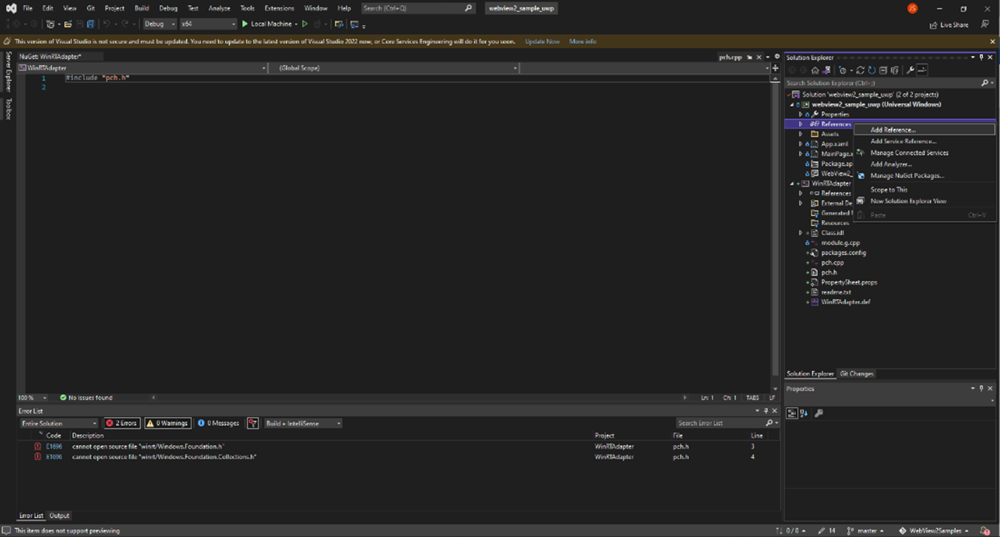

# Call native-side WinRT code from web-side code

Your web-side JavaScript code can access native-side WinRT methods and properties, with the help of the **wv2winrt** tool (the WebView2 WinRT JS Projection tool).  The **wv2winrt** tool generates needed code files for your JavaScript code, and enables using methods and properties of any WinRT APIs, including:

*  Your WebView2 host app's WinRT APIs.
*  Windows WinRT APIs.
*  Third-party WinRT APIs.

For more information about why you'd want to have your web-side JavaScript code access the methods and properties of your WinRT host app, see the introduction of [Call native-side code from web-side code](hostobject.md).

This article walks you through the following main steps:

<!-- instance 1 of this paragraph: -->
1. Create a **WinRTAdapter** project for the wv2winrt tool.  This project builds a library out of code that's generated by running the tool.  This generated code allows WinRT APIs to be exposed in the WebView2 control.

1. Run the wv2winrt tool to generate C++/WinRT source code for selected namespaces or classes.

1. Call `AddHostObjectToScript`, in the WinUI 2 (UWP) sample WebView2 browser app project (**webview2_sample_uwp**).

1. Call methods and properties on the host object from your web-side JavaScript code (or from the DevTools **Console**).


<!-- ====================================================================== -->
## WinRT vs. .NET

This article is for WinRT WebView2 APIs, not for .NET WebView2 APIs.  The C# code in this article will build, but not run, for .NET WebView2 APIs.  Calling `AddHostObjectToScript` using this article's C# code for .NET WebView2 APIs would produce an error message.

The wv2winrt tool (the WebView2 WinRT JS Projection tool) is needed when projecting WinRT objects, because WinRT by default doesn't support `IDispatch`, which WebView2's Win32 and .NET platforms support.

For .NET use of `AddHostObjectToScript`, see [Call native-side code from web-side code](hostobject.md) instead of this article.


<!-- ====================================================================== -->
## Let's get started!

First let's find a native object (class) that we're interested in calling from JavaScript code.  For this example, we'll use the WinRT `Language` class, which is in the `Windows.Globalization` namespace, for Windows UWP applications.  The [Language Class](/uwp/api/windows.globalization.language) enables getting information from the client's native OS.

In the WebView2 host app, the web-side JavaScript code can then access methods and properties on the `Language` object that's in the native-side code.  At the end of this example walkthrough, you'll use the **Console** of Microsoft Edge DevTools to test reading the host's `displayName` property of the `Language` class:

```javascript
const Windows = chrome.webview.hostObjects.sync.Windows;
(new Windows.Globalization.Language("en-US")).displayName;
```

The **Console** will then output `English (United States)`, or another language display name, demonstrating that you've called native-side WinRT code from web-side JavaScript code:


Similarly, in actual code rather than in the DevTools **Console**, you access the host object first by setup code for the script:

```javascript
// early in setup code:
const Windows = chrome.webview.hostObjects.sync.Windows;
```

Then in the main body of your code, calls to projected objects look like the following:

```csharp
(new Windows.Globalization.Language("en-US")).displayName;
```


<!-- ====================================================================== -->
## Step 1: Clone the repo and build the WebView2 UWP sample

1. If Visual Studio 2015 or later isn't already installed, in a separate window or tab, see [Install Visual Studio](../how-to/machine-setup.md#install-visual-studio) in _Set up your Dev environment for WebView2_.  Follow the steps in that section, and then return to this page and continue the steps below.

1. If a preview channel of Microsoft Edge (Beta, Dev, or Canary) isn't already installed, in a separate window or tab, see [Install a preview channel of Microsoft Edge](../how-to/machine-setup.md#install-a-preview-channel-of-microsoft-edge) in _Set up your Dev environment for WebView2_.  Follow the steps in that section, and then return to this page and continue the steps below.

   If you have your own app code base already, you can open that project in Visual Studio, instead of starting with the **webview2_sample_uwp** sample from the `WebView2Samples` repo.

1. If not done already, download or clone the `WebView2Samples` repo to your local drive.  In a separate window or tab, see [Download the WebView2Samples repo](../how-to/machine-setup.md#download-the-webview2samples-repo) in _Set up your Dev environment for WebView2_.  Follow the steps in that section, and then return to this page and continue below.

1. On your local drive, open the `.sln` file in Visual Studio, in a directory such as:

   *  `<your-repos-directory>/WebView2Samples-main/SampleApps/webview2_sample_uwp/webview2_sample_uwp.sln`
   *  `<your-repos-directory>/WebView2Samples/SampleApps/webview2_sample_uwp/webview2_sample_uwp.sln`

   The sample solution opens in Visual Studio:

   

1. In Visual Studio, select **Debug** > **Start Debugging**.  This builds the **webview2_sample_uwp** project, and then runs the baseline version of the project.  The **WebView2 WinUI 2 UWP Sample** window opens:

   

1. Close the **WebView2 WinUI 2 UWP Sample** window.

In case you need more information, see detailed steps in these pages, and then continue below:
* [WebView2 sample: WinUI 2 (UWP) browser app](../samples/webview2_sample_uwp.md) - steps to open, compile, and run the sample app.
* [Get started with WebView2 in WinUI 2 (UWP) apps (public preview)](../get-started/winui2.md) - setting up a basic WebView2 app.
* [GitHub > WebView2Samples repo > webview2_sample_uwp](https://github.com/MicrosoftEdge/WebView2Samples/tree/master/SampleApps/webview2_sample_uwp)
* [Set up your Dev environment for WebView2](machine-setup.md) - details about setting up prerequisites.


<!-- =============================================== -->
## Step 2. Add a WinRTAdapter project for the wv2winrt tool

<!-- instance 2 of this paragraph: -->
Next, create a **WinRTAdapter** project for the wv2winrt tool (the WebView2 WinRT JS Projection tool).  This project builds a library out of code that's generated by running the tool.  This generated code allows WinRT APIs to be exposed in the WebView2 control.

Add a project for the wv2winrt tool, as follows:

1. Right-click the **webview2_sample_uwp** solution (not the project), and then select **Add** > **New project**.  The **Add a new project** dialog box opens.

1. In the **Search** textbox, enter **Windows Runtime Component (C++/WinRT)**.

   <!-- delete paragraph? why would you want to do this? -->
   **Note:** Alternative approach: If you don't add a project using the project template for **Windows Runtime Component (C++/WinRT)** as described in the numbered steps below, then you'll need to instead install the **Universal Windows Platform development** workload, by following the steps in [UWP applications > Introduction to C++/WinRT](/windows/uwp/cpp-and-winrt-apis/intro-to-using-cpp-with-winrt#visual-studio-support-for-cwinrt-xaml-the-vsix-extension-and-the-nuget-package).
   <!--That page reads: "From within the Visual Studio Installer, install the Universal Windows Platform development workload. In **Installation Details** > **Universal Windows Platform development**, check the **C++ (v14x) Universal Windows Platform tools** option(s), if you haven't already done so.  And, in **Windows Settings** > **Update & Security** > **For developers**, choose the **Developer mode** option rather than the **Sideload apps** option."-->

1. Select the **Windows Runtime Component (C++/WinRT)** card, and then click the **Next** button:

   

   The **Configure your new project** window opens.

1. In the **Project name** textbox, name the Project, specifically, **WinRTAdapter**.  **Note:** For now, you must use this specific project name:

   

1. Click the **Create** button.  The **New Universal Windows Platform Project** dialog opens:

   

1. Click the **OK** button.

   The **WinRTAdapter** project is created:

   

The wv2winrt tool (the WebView2 WinRT JS Projection tool) will run in this **WinRTAdapter** project.  In a below step, you'll generate code for selected classes in this project.


<!-- =============================================== -->
## Step 3. Install Windows Implementation Library, for WinRTAdapter project

In the WinRTAdapter project, install the Windows Implementation Library (WIL), as follows:

1. In **Solution Explorer**, right-click the **WinRTAdapter** project, and then select **Manage NuGet Packages**.  The **NuGet Package Manager** window opens in Visual Studio.

1. In the **NuGet Package Manager** window, in the **Search** box, enter **Windows Implementation Library**, and then select the **Windows Implementation Library** card:

   

1. Click the **Install** button.

WIL is now installed for the **WinRTAdapter** project.  Windows Implementation Library (WIL) is a header-only C++ library to make using COM coding for Windows easier.  It provides readable, type-safe C++ interfaces for Windows COM coding patterns.


<!-- =============================================== -->
## Step 4. Install WebView2 prerelease SDK, for WinRTAdapter project

In the WinRTAdapter project, also install a prerelease version of the WebView2 SDK, as follows:

1. In Solution Explorer, right-click the **WinRTAdapter** project, and then select **Manage NuGet Packages**.  The NuGet Package Manager window opens.

1. Select the **Include prerelease** checkbox.

1. In the **Search** box, enter **WebView2**.

1. Click the **Microsoft.Web.WebView2** card.  Detailed info appears in the middle area of the window.

1. In the **Version** drop-down, select a **prerelease** version of the WebView2 SDK.  The version must be 1.0.1243.0 or higher.  Note which version number you select.

1. Click the **Install** button:

   

The WebView2 prerelease SDK is now installed for the **WinRTAdapter** project.


<!-- =============================================== -->
## Step 5. Install WebView2 prerelease SDK, for webview2_sample_uwp project

In the **webview2_sample_uwp** project, install the same prerelease version of the WebView2 SDK as you installed for the **WinRTAdapter** project, as follows:

1. In Solution Explorer, right-click the **webview2_sample_uwp** project, and then select **Manage NuGet Packages**.  The NuGet Package Manager window opens.

1. Select the **Include prerelease** checkbox.

1. In the **Search** box, enter **WebView2**.

1. Click the **Microsoft.Web.WebView2** card.  Detailed information appears in the middle area of the window.

1. In the **Version** drop-down, select a **prerelease** version of the WebView2 SDK.  The version must be 1.0.1243.0 or higher.  This needs to be the same version as for the **WinRTAdapter** project.

1. Click the **Install** button.

   The screen should look similar to the above section, except that now, **NuGet Package Manager** is open for the **webview2_sample_uwp** project instead of the **WinRTAdapter** project.

The WebView2 prerelease SDK is now installed for the **webview2_sample_uwp** project.


<!-- =============================================== -->
## Step 6. Generate source code for selected host API items

Next, configure the wv2winrt tool (the WebView2 WinRT JS Projection tool), to incorporate the WinRT classes that you want to use.  This generates source files that will then be compiled, rather than adding a `#` include of entire header files.  Generating code for these API items enables your web-side JavaScript code to call these API items.

In the example steps below, we'll specify two `Windows` namespaces, and the wv2winrt tool will generate source code for only those namespaces:
*  `Windows.System.UserProfile` <!-- why add Windows.System.UserProfile? -->
*  `Windows.Globalization.Language`

Later, when the sample app is running, you'll call these API items from the **Console** of DevTools, to demonstrate that these specified host-side API items can be called from web-side code.

In this walkthrough, specify two `Windows` namespaces, as follows:

1. In Solution Explorer, right-click the **WinRTAdapter** project, and then select **Properties**.  The **WinRTAdapter Property Pages** dialog opens.

1. On the left, select **Common Properties** > **WebView2**.

1. Set **Use WebView2 WinRT APIs** to **No**.  This is so the WebView2 SDK doesn't copy the WebView2 WinRT component to the project's output.  This WinRTAdapter project isn't calling any WebView2 WinRT APIs, so it doesn't need the WinRT component.

1. Set **Use the wv2winrt tool** to **Yes**.

1. Set **Use JavaScript case** to **Yes**.

1. In the **Include filters** row, click the right-hand column, and then click **Edit**.  The **Include filters** dialog opens.

   <!-- true? In the same text box, below the previous value you entered, you'll also add a reference for the tool itself, such as params: **Windows.Globalization.Language**. -->

1. In the topmost text box, paste the following lines:

   ```
   Windows.System.UserProfile
   Windows.Globalization.Language
   ```

   

   You need to specify the full name of the namespaces or classes, as shown above.

1. Click the **OK** button to close the **Include filters** dialog box.

1. Make sure the **WinRTAdapter Property Pages** dialog looks like the following, for this walkthrough:

   <!-- 1st use of png: -->
   

1. Click the **OK** button to close the **Property Pages** dialog box.


<!-- =============================================== -->
## Step 7. Add the host object in the webview2_sample_uwp project

In the **webview2_uwp_sample** project, add a reference that points to the **WinRTAdapter** project, as follows:

1. In Solution Explorer, expand the **webview2_uwp_sample** project, right-click **References**, and then select **Add Reference**.  The **Reference Manager** dialog opens.

<!-- dark mode, low res, not really needed (simple UI action easily specified & standard:) -->
   <!--  -->

1. In the tree on the left, select **Projects**.  Select the **WinRTAdapter** checkbox:

   

1. Click the **OK** button to close the **Reference Manager** dialog.

1. Right-click the **WinRTAdapter** project, and then select **Build**.

Source code is generated for namespaces or classes that you specified in the **Include filters** dialog.  That dialog populates the **Include filters** row of the **WinRTAdapter Property Pages** dialog for the **WinRTAdapter** project.


<!-- =============================================== -->
## Step 8. Add the host object in the webview2_sample_uwp project

Next, pass the WinRT object from the native side of the host app to the web side of the host app.  To do this, add an `InitializeWebView2Async` method that calls `AddHostObjectToScript`, as follows:

1. In Solution Explorer, expand the **webview2_sample_uwp** project, and then select **MainPage.xaml.cs**.

1. Below the `MainPage` constructor, add the following `InitializeWebView2Async` method:

   ```csharp
   private async void InitializeWebView2Async()
   {
      await WebView2.EnsureCoreWebView2Async();
      var dispatchAdapter = new WinRTAdapter.DispatchAdapter();
      WebView2.CoreWebView2.AddHostObjectToScript("Windows", dispatchAdapter.WrapNamedObject("Windows", dispatchAdapter));
   }
   ```

   This method calls `AddHostObjectToScript`.

1. In the `MainPage` constructor, above the `StatusUpdate("Ready");` line, add the following code:

   ```csharp
   InitializeWebView2Async();
   ```

1. Right-click the **webview2_sample_uwp** project, and then select **Set as startup project**.

1. Press `Shift+Ctrl+S` to save all files.

1. Press `F5` to run the sample app.  The **WebView2 WinUI 2 UWP Sample** window opens.

   

The host app's web-side code, including DevTools **Console**, can now call methods and properties of the specified namespaces or classes of the host object.


<!-- =============================================== -->
## Step 9. Call methods and properties on the host object from web-side JavaScript

Next, use the DevTools **Console** to demonstrate that web-side code can call the included, specified host-side API items.

1. Click in the main part of the WebView2 sample app window to give it focus, and then press `Ctrl+Shift+I` to open Microsoft Edge DevTools.  Or, right-click the page, and then select **Inspect**.  The Microsoft Edge DevTools window opens.

1. If the Microsoft Edge DevTools window isn't visible, press `Alt+Tab` to display the DevTools window.  If needed, move the DevTools window.

1. In the **Console** of DevTools, paste the following code, and then press `Enter`:

   ```javascript
   const Windows = chrome.webview.hostObjects.sync.Windows;
   (new Windows.Globalization.Language("en-US")).displayName;
   ```

   The **Console** outputs a language name string, such as `English (United States)`, demonstrating that your app's host-side code can be called from web-side code.

   

1. Close the UWP sample app.  The DevTools window also closes.


<!-- ====================================================================== -->
## WebView2 Properties available in the WinRTAdapter Property Pages

This section is for reference.

<!-- 2nd use of png: -->


For help about a property, click a property row.  Help is shown at the bottom of the dialog.

Command-line help contains similar information for the parameters of `wv2winrt.exe`.  For example:

| Parameter | Description |
|---|---|
| `verbose` | List some content to standard out including which files have been created and information about the include and exclude rules. |
| `include` | List as above will exclude namespaces and runtimeclasses by default except those listed. The include declarations may be either namespaces which include everything in that namespace, or runtimeclass names to include just that runtimeclass. |
| `use-javascript-case` | Changes the generated code to produce methods names, property names, and so on, that use the same casing style as Chakra JavaScript WinRT projection. The default is to produce names that match the winrt. |
| `output-path` | Sets the path in which generated files will be written. |
| `output-namespace` | Sets the namespace to use for the generated WinRT class (see the next section). |
| `winmd-paths` | A space-delimited list of all the winmd files that should be examined for code generation. |


<!-- ====================================================================== -->
## API Reference overview

* WinRT: [ICoreWebView2Interop::AddHostObjectToScript Method](/microsoft-edge/webview2/reference/winrt/interop/icorewebview2interop#addhostobjecttoscript)
<!-- clickable: https://docs.microsoft.com/microsoft-edge/webview2/reference/winrt/interop/icorewebview2interop#addhostobjecttoscript -->
* Win32: [ICoreWebView2::AddHostObjectToScript method](/microsoft-edge/webview2/reference/win32/icorewebview2#addhostobjecttoscript)
<!-- clickable: https://docs.microsoft.com/microsoft-edge/webview2/reference/win32/icorewebview2#addhostobjecttoscript -->
* .NET: [CoreWebView2.AddHostObjectToScript Method](/dotnet/api/microsoft.web.webview2.core.corewebview2.addhostobjecttoscript)
<!-- clickable: https://docs.microsoft.com/dotnet/api/microsoft.web.webview2.core.corewebview2.addhostobjecttoscript -->


<!-- ====================================================================== -->
## See also

* [Call native-side code from web-side code](hostobject.md)
