# Call native-side WinRT code from web-side code

Your web-side JavaScript code can access native-side WinRT methods and properties, with the help of the **wv2winrt** tool (the WebView2 WinRT JS Projection tool).  The **wv2winrt** tool generates needed code files for your JavaScript code, and enables using methods and properties of any WinRT APIs, including:

*  Your WebView2 host app's WinRT APIs.
*  Windows WinRT APIs.
*  Third-party WinRT APIs.

For more information about why you'd want to have your web-side JavaScript code access the methods and properties of your WinRT host app, see the introduction of [Call native-side code from web-side code](hostobject.md).


<!-- ------------------------------ -->
#### Why WinRT and .NET use different approaches

This article is for WinRT WebView2 APIs, not for .NET WebView2 APIs.  The C# code in this article will build, but not run, for .NET WebView2 APIs.  Calling `AddHostObjectToScript` using this article's C# code for .NET WebView2 APIs would produce an error message.

The **wv2winrt** tool (the WebView2 WinRT JS Projection tool) is needed when projecting WinRT objects, because WinRT doesn't support `IDispatch` or any other mechanism to dynamically inspect and interact with WinRT objects, which WebView2's Win32 and .NET platforms support.  For .NET use of `AddHostObjectToScript`, see [Call native-side code from web-side code](hostobject.md) instead of this article.
<!--
`IDispatch` is a way to:
*  Dynamically inspect COM objects, to discover methods, properties, and events.
*  Interact with COM objects, to call methods, get or set properties, and subscribe to and receive events.
-->


<!-- ------------------------------ -->
#### Setup differences for WinUI 3 vs. WinUI 2

If your WinRT WebView2 app targets WinUI 3 (Windows App SDK) rather than WinUI 2 (UWP), here's an overview of the WinUI 3-specific steps that are provided further below:

*  In a non-packaged app, you have to do additional steps that are in the article "Enhancing Non-packaged Desktop Apps using Windows Runtime Components".

*  Add `WinRTAdapter` to `CsWinRTIncludes`.

*  For WinUI 3 (Windows App SDK) apps, the main app project has a reference to WinAppSDK which directly includes its own copy of the WebView2 SDK files, so you cannot include a reference to the WebView2 SDK in the main app project without producing error messages.

*  The project adapter version doesn't have to match.

<!-- todo: add these steps in detailed section for WinUI 3? -->
*  After installing "default" options for Visual Studio 2022 Community edition, in Visual Studio Installer, click the **.NET** card, then on the right, select the checkbox **Windows App SDK C# Templates**.

*  If the correct project template still doesn't appear: in the Visual Studio Installer, click the **UWP** card to select it, select the **v143 C++ tools** checkbox on the right, and then click the **Modify** button.


<!-- ====================================================================== -->
## Strategy and end goal of this example


<!-- ------------------------------ -->
#### Strategy

This article walks you through the following main steps:

1. Create a **WinRTAdapter** project for the **wv2winrt** tool (the WebView2 WinRT JS Projection tool).

1. For this example, specify the following host-side APIs for projection:
   * [Windows.System.UserProfile Namespace](/uwp/api/windows.system.userprofile)
   * [Windows.Globalization.Language Class](/uwp/api/windows.globalization.language)

1. Run the **wv2winrt** tool to generate C++/WinRT source code for the selected namespaces or classes.

1. Call [AddHostObjectToScript](/microsoft-edge/webview2/reference/winrt/microsoft_web_webview2_core/corewebview2#addhostobjecttoscript), in your main WinUI project.

1. Call methods and properties on the host object from your web-side JavaScript code (or from the DevTools Console).


<!-- ------------------------------ -->
#### End goal

First, we'll pick some WinRT APIs that we're interested in calling from JavaScript code.  For this example, we'll use the WinRT `Language` class, which is in the `Windows.Globalization` namespace, for Windows UWP applications.  The [Windows.Globalization.Language Class](/uwp/api/windows.globalization.language) enables getting language information from the client's native OS.

In the WebView2 host app, the web-side JavaScript code can then access methods and properties on the `Language` object that's in the native-side code.


###### Access projected APIs via DevTools Console

At the end of this example walkthrough, you'll use the **Console** of Microsoft Edge DevTools to test reading the host's `displayName` property of the `Language` class:

```javascript
const Windows = chrome.webview.hostObjects.sync.Windows;
(new Windows.Globalization.Language("en-US")).displayName;
```

The DevTools Console will then output `English (United States)`, or another language display name, demonstrating that you've called native-side code from web-side JavaScript code:

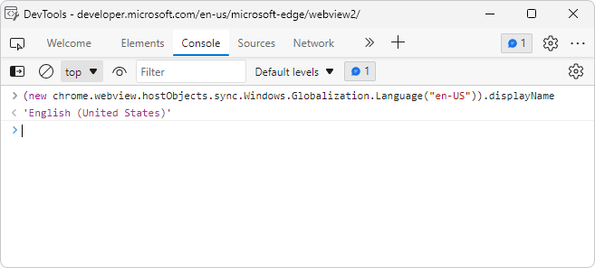

You can similarly access [Windows.System.UserProfile Namespace](/uwp/api/windows.system.userprofile) members.
<!-- todo: call Windows.System.UserProfile apis -->


###### Access projected APIs via source code files

Similarly, in source code files rather than in the DevTools Console, you can access the projected host object.  First, you run setup code for the script:

```javascript
// early in setup code:
const Windows = chrome.webview.hostObjects.sync.Windows;
```

Then in the main body of your code, you add calls to projected objects, like the following:

```csharp
(new Windows.Globalization.Language("en-US")).displayName;
```

You can similarly access [Windows.System.UserProfile Namespace](/uwp/api/windows.system.userprofile) members.
<!-- todo: call Windows.System.UserProfile apis -->


Let's get started!


<!-- ====================================================================== -->
## Step 1: Create or obtain a basic WebView2 project

##### [WinUI 2 (UWP)](#tab/winui2)

#### Install Visual Studio

* If Visual Studio 2015 or later isn't already installed, in a separate window or tab, see [Install Visual Studio](../how-to/machine-setup.md#install-visual-studio) in _Set up your Dev environment for WebView2_.  Follow the steps in that section, and then return to this page and continue the steps below.  The present article shows screenshots for Visual Studio Community Edition 2022.

#### Install a preview channel of Microsoft Edge

* If a preview channel of Microsoft Edge (Beta, Dev, or Canary) isn't already installed, in a separate window or tab, see [Install a preview channel of Microsoft Edge](../how-to/machine-setup.md#install-a-preview-channel-of-microsoft-edge) in _Set up your Dev environment for WebView2_.  Follow the steps in that section, and then return to this page and continue the steps below.

#### Create or open a basic WebView2 project

1. Do any of the following approaches to obtain a baseline starter project that contains a couple lines of WebView2 code that embeds the WebView2 control:

   * **Use the provided baseline sample solution:**  If not done already, clone or download the `WebView2Samples` repo to your local drive.  In a separate window or tab, see [Download the WebView2Samples repo](../how-to/machine-setup.md#download-the-webview2samples-repo) in _Set up your Dev environment for WebView2_.  Follow the steps in that section, and then return to this page and continue below.  This approach uses your local copy of https://github.com/MicrosoftEdge/WebView2Samples/tree/main/GettingStartedGuides/WinUI2_GettingStarted/MyUWPGetStartApp.sln.

   * **Use a project template in Visual Studio to create a basic UWP app and add a WebView2 control:**  Do the steps in [Get started with WebView2 in WinUI 2 (UWP) apps](../get-started/winui2.md) to create a baseline starter project that contains a couple lines of WebView2 code that embeds the WebView2 control.

   * **Use your existing code base:**  If you have your own app code base already, you can open that project in Visual Studio.

1. On your local drive, open the `.sln` file that you obtained above, such as the Samples repo solution:

   *  `<your-repos-directory>/WebView2Samples-main/GettingStartedGuides/WinUI2_GettingStarted/MyUWPGetStartApp.sln`
   *  `<your-repos-directory>/WebView2Samples/GettingStartedGuides/WinUI2_GettingStarted/MyUWPGetStartApp.sln`

   The sample solution opens in Visual Studio:

   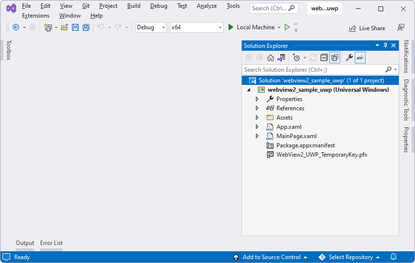

1. In Visual Studio, select **Debug** > **Start Debugging**.  This builds the project, and then runs the baseline version of the project.  The baseline app opens, such as the **MyUWPGetStartApp** window:

   

   Shown is a WinUI 2 (UWP) app that has a WebView control added, set to initially navigate to Bing.com.  This is the app that results from doing the steps in [Get started with WebView2 in WinUI 2 (UWP) apps](../get-started/winui2.md).

1. Close the app window.


##### [WinUI 3 (Windows App SDK)](#tab/winui3)

1. Use the Visual Studio project template to create a fresh new solution and project.  To do this, do the steps in [Get started with WebView2 in WinUI 3 (Windows App SDK) apps](../get-started/winui.md) and then continue below. 

   Or, if you have your own app code base already, you can open that project in Visual Studio, and add a **WinRTAdapter** project as shown below.

   At this point, Visual Studio may look like the following:

   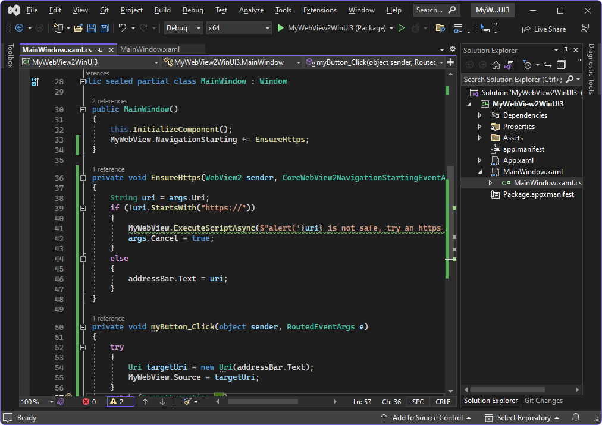

   And the **WinUI Desktop** app may look like the following:

   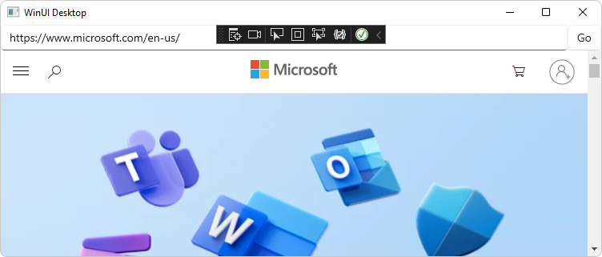

1.  If the **WinUI Desktop** app is running, close the app.

1.  The following Visual Studio dialogs might appear.  These debugger dialogs are a known bug.  Click the **OK** button, and then click the **Cancel** button to close these dialogs:

    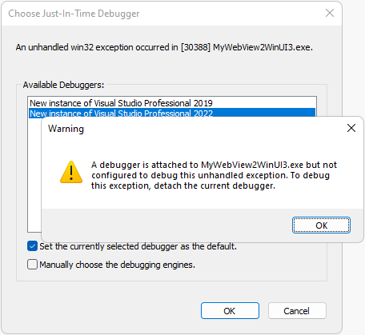

---


<!-- =============================================== -->
## Step 2: Add a WinRTAdapter project for the wv2winrt tool

Next, create a **WinRTAdapter** project for the **wv2winrt** tool (the WebView2 WinRT JS Projection tool).  This project builds a library out of code that's generated by running the tool.  This generated code allows WinRT APIs to be exposed in the WebView2 control.

Add a project for the **wv2winrt** tool, as follows:

1. In Visual Studio, open your WinUI project, from the previous step.

1. In Solution Explorer, right-click the solution (not the project), and then select **Add** > **New project**.  The **Add a new project** dialog opens.

1. In the **Search** textbox, enter **Windows Runtime Component (C++/WinRT)**.

   **Alternative approach:** If you don't add a project using the project template for **Windows Runtime Component (C++/WinRT)** as described in the numbered steps below, then you'll need to instead install the **Universal Windows Platform development** workload, by following the steps in [UWP applications > Introduction to C++/WinRT](/windows/uwp/cpp-and-winrt-apis/intro-to-using-cpp-with-winrt#visual-studio-support-for-cwinrt-xaml-the-vsix-extension-and-the-nuget-package).

1. Select the **Windows Runtime Component (C++/WinRT)** card, and then click the **Next** button:

   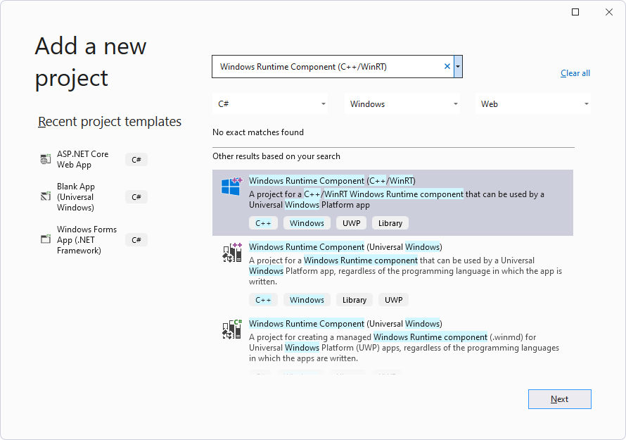

   **Note:** Make sure the template includes "C++/WinRT" in its name. If this template isn't listed, install the **Universal Windows Platform development** workload from within the Visual Studio Installer. If you are using Visual Studio 2019 and still can't find the template, install the **C++/WinRT templates and visualizer for VS2019** extension from **Visual Studio > Extensions > Manage Extensions**.

   The **Configure your new project** window opens.


<!-- ------------------------------ -->
#### Configuring and creating the project


##### [WinUI 2 (UWP)](#tab/winui2)

1. In the **Project name** textbox, name the Project, specifically, **WinRTAdapter**.  **Note:** For now, you must use this specific project name.

   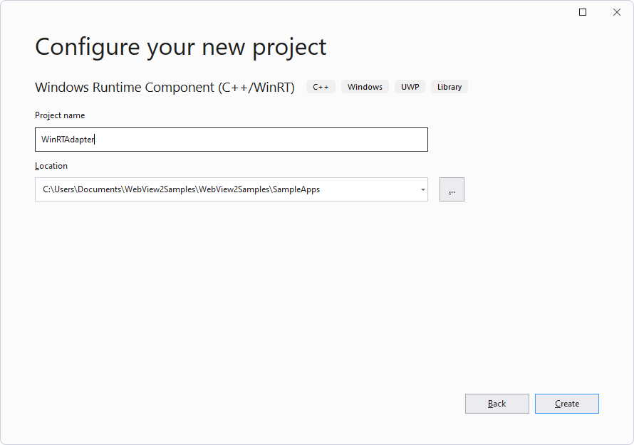

   The path in the above screenshot reflects the approach of cloning the samples repo.

1. Click the **Create** button.

   The **New Windows Project** dialog opens:

   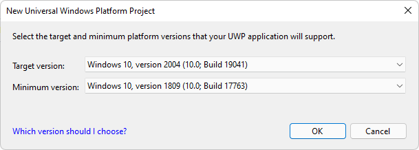

1. Click the **OK** button.

   The **WinRTAdapter** project is created and is added in Solution Explorer next to the main project:

   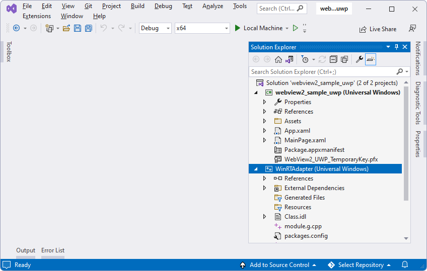

1. Select **File** > **Save All** (**Ctrl+Shift+S**).


##### [WinUI 3 (Windows App SDK)](#tab/winui3)

1. In the **Project name** textbox, name the Project, specifically, **WinRTAdapter**.  **Note:** For now, you must use this specific project name.

   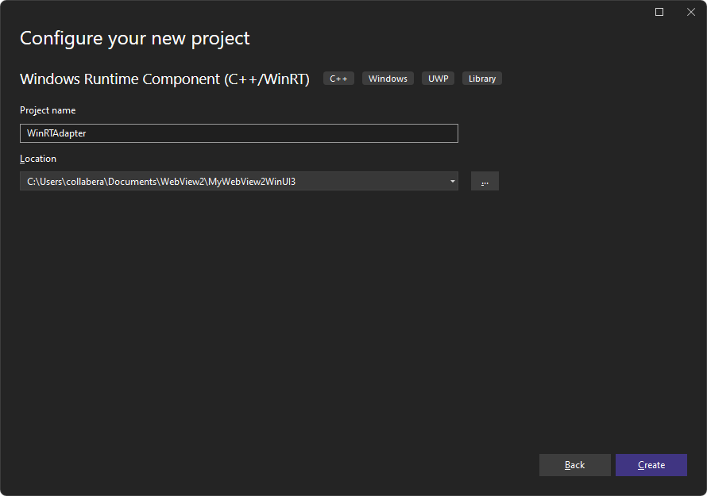

1. Click the **Create** button.

   The **New Windows Project** dialog opens:

   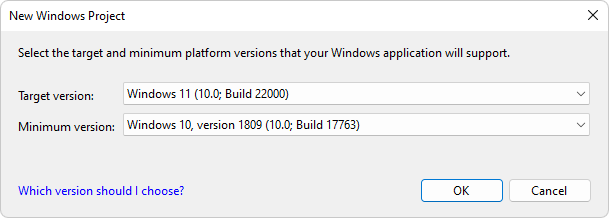

1. Click the **OK** button.

   The **WinRTAdapter** project is created and is added in Solution Explorer next to the main project:

   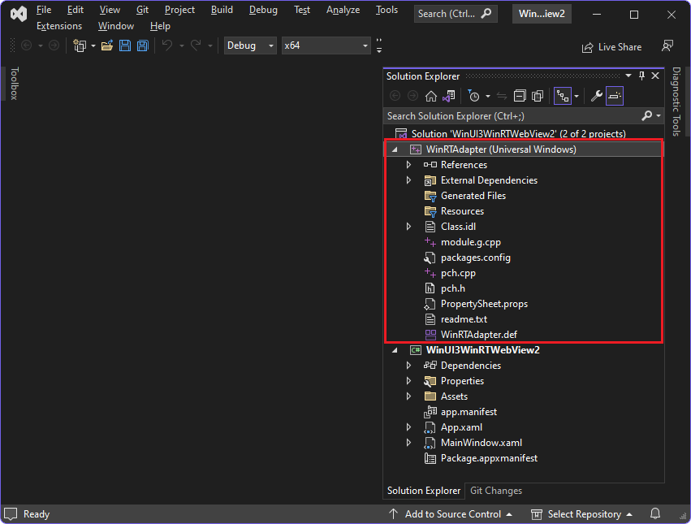

1. Select **File** > **Save All** (**Ctrl+Shift+S**).

---

The **wv2winrt** tool (the WebView2 WinRT JS Projection tool) will run in this **WinRTAdapter** project.  In a below step, you'll generate code for selected classes in this project.


<!-- =============================================== -->
## Step 3: Install Windows Implementation Library, for WinRTAdapter project

In the WinRTAdapter project, install the Windows Implementation Library (WIL), as follows:


##### [WinUI 2 (UWP)](#tab/winui2)

1. In **Solution Explorer**, right-click the **WinRTAdapter** project, and then select **Manage NuGet Packages**.  The **NuGet Package Manager** window opens in Visual Studio.

1. In the **NuGet Package Manager** window, click the **Browse** tab.

1. In the **NuGet Package Manager** window, in the **Search** box, enter **Windows Implementation Library**, and then select the **Windows Implementation Library** card:

   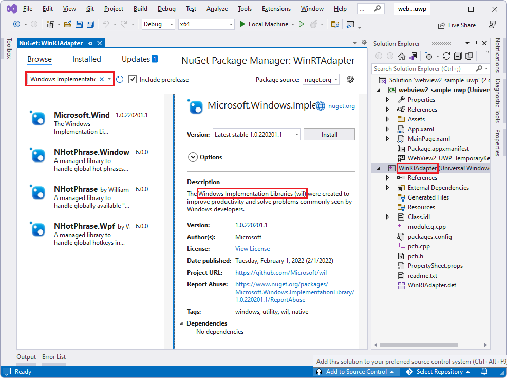

1. Click the **Install** button.  The **Preview Changes** dialog opens:

   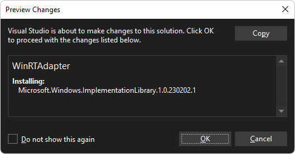

1. Click the **OK** button.

1. Select **File** > **Save All** (**Ctrl+Shift+S**).


##### [WinUI 3 (Windows App SDK)](#tab/winui3)

1. In **Solution Explorer**, right-click the **WinRTAdapter** project, and then select **Manage NuGet Packages**.  The **NuGet Package Manager** window opens in Visual Studio.

1. In the **NuGet Package Manager** window, click the **Browse** tab.

1. In the **NuGet Package Manager** window, in the **Search** box, enter **Windows Implementation Library**, and then select the **Windows Implementation Library** card:

   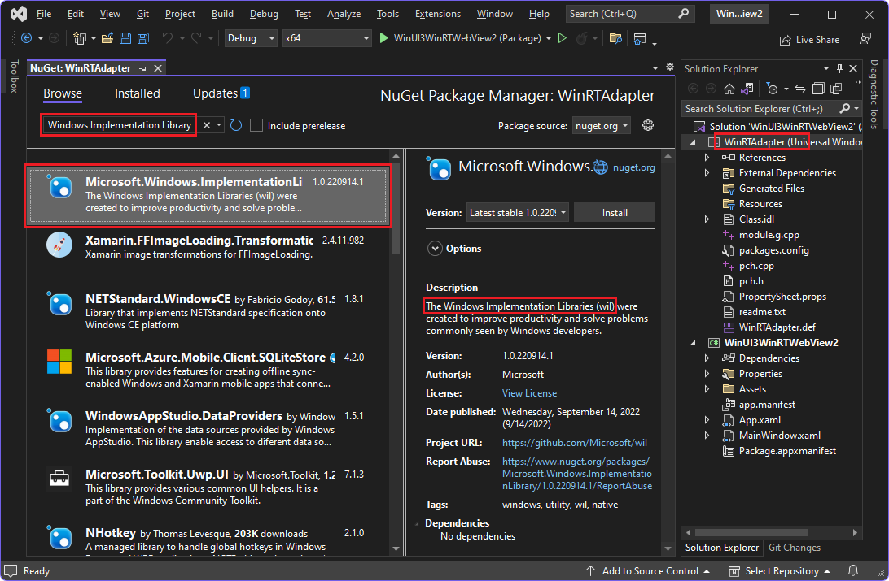

1. Click the **Install** button.

1. Select **File** > **Save All** (**Ctrl+Shift+S**).

---

WIL is now installed for the **WinRTAdapter** project.  Windows Implementation Library (WIL) is a header-only C++ library to make using COM coding for Windows easier.  It provides readable, type-safe C++ interfaces for Windows COM coding patterns.


<!-- =============================================== -->
## Step 4: Install WebView2 prerelease SDK, for WinRTAdapter project

In the WinRTAdapter project, also install a prerelease version of the WebView2 SDK, as follows:


##### [WinUI 2 (UWP)](#tab/winui2)

1. In Solution Explorer, right-click the **WinRTAdapter** project, and then select **Manage NuGet Packages**.  The NuGet Package Manager window opens.

1. In the **NuGet Package Manager** window, click the **Browse** tab.

1. Select the **Include prerelease** checkbox.

1. In the **Search** box, enter **WebView2**.

1. Click the **Microsoft.Web.WebView2** card.  Detailed info appears in the middle area of the window.

1. In the **Version** dropdown list, select a **prerelease** version of the WebView2 SDK, or make sure **Latest prerelease** is selected.  The version must be 1.0.1243.0 or higher.  Note which version number you select.

   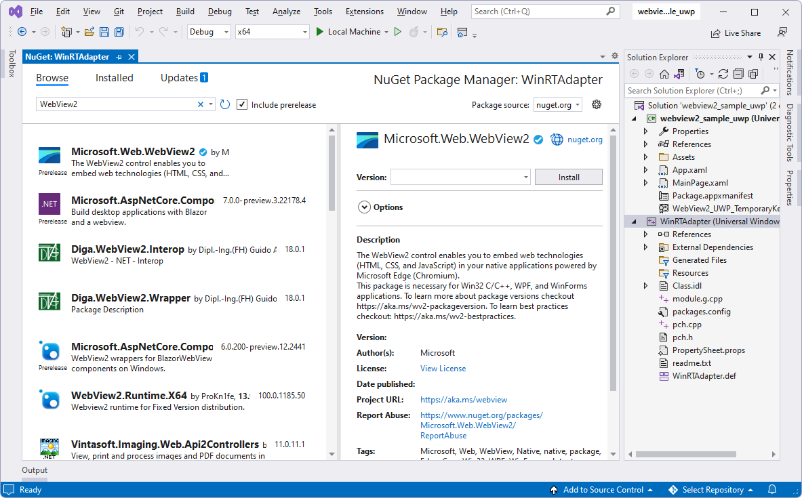

1. Click the **Install** button.  The **Preview Changes** dialog opens:

   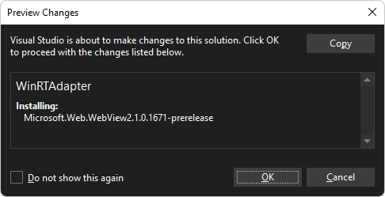

1. Click the **OK** button.

1. Select **File** > **Save All** (**Ctrl+Shift+S**).


##### [WinUI 3 (Windows App SDK)](#tab/winui3)

1. In Solution Explorer, right-click the **WinRTAdapter** project, and then select **Manage NuGet Packages**.  The NuGet Package Manager window opens.

1. In the **NuGet Package Manager** window, click the **Browse** tab.

1. Select the **Include prerelease** checkbox.

1. In the **Search** box, enter **WebView2**.

1. Click the **Microsoft.Web.WebView2** card.  Detailed info appears in the middle area of the window.

1. In the **Version** dropdown list, select a **prerelease** version of the WebView2 SDK, or make sure **Latest prerelease** is selected.  The version must be 1.0.1243.0 or higher.  Note which version number you select.

   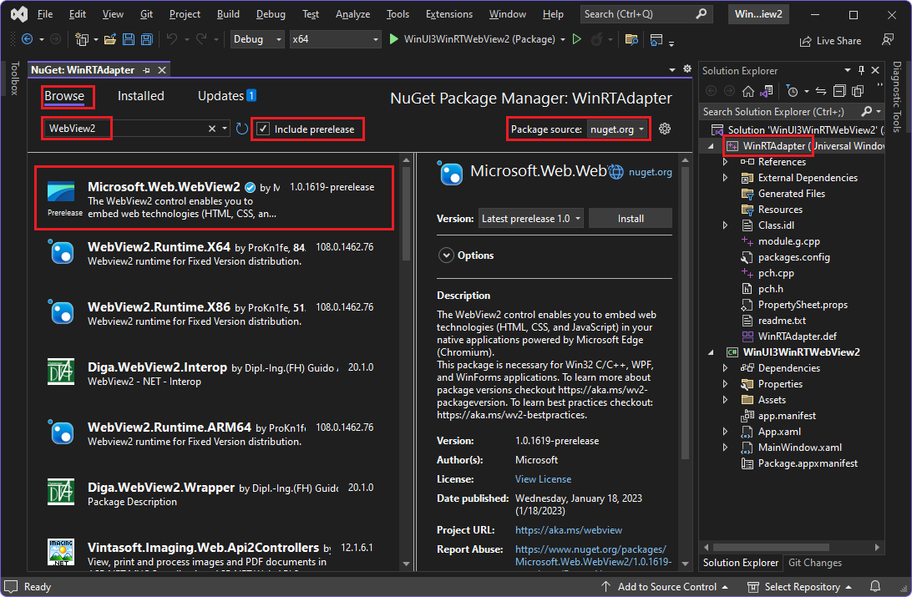

1. Click the **Install** button.

1. Select **File** > **Save All** (**Ctrl+Shift+S**).

---

The WebView2 prerelease SDK is now installed for the **WinRTAdapter** project.


<!-- =============================================== -->
## Step 5: Install WebView2 prerelease SDK (WinUI 2 only)


##### [WinUI 2 (UWP)](#tab/winui2)

In the main project, such as **MyUWPGetStartApp**, install the same prerelease version of the WebView2 SDK as you installed for the **WinRTAdapter** project, as follows:

1. In Solution Explorer, right-click the main project, such as **MyUWPGetStartApp**, and then select **Manage NuGet Packages**.  The NuGet Package Manager window opens.

1. Select the **Include prerelease** checkbox.

1. Select the **Browse** tab.

1. In the **Search** box, enter **WebView2**.

1. Click the **Microsoft.Web.WebView2** card.  Detailed information appears in the middle area of the window.

1. In the **Version** dropdown list, select a **prerelease** version of the WebView2 SDK, or make sure **Latest prerelease** is selected.  Make sure to use the same version as used by the **WinRTAdapter project**; for WinRT WebView2 apps that target WinUI 2 (UWP), this needs to be the same version as for the **WinRTAdapter** project.  The version must be 1.0.1243.0 or higher.

1. Click the **Install** button.  The Preview Changes dialog opens, to add WebView2 to the main project.

1. Click the **OK** button.

   Visual Studio should look similar to the above Step section, except that now, **NuGet Package Manager** is open for the main project instead of the **WinRTAdapter** project.

1. Select **File** > **Save All** (**Ctrl+Shift+S**).

The WebView2 prerelease SDK is now installed for the main project.


##### [WinUI 3 (Windows App SDK)](#tab/winui3)

If your app targets WinUI 3 (Windows App SDK), skip this step, because:

*  WinUI 3 bundles the WebView2 SDK, so there isn't a need to download the WebView2 SDK separately.

*  WinUI 3 doesn't support prerelease WebView2 SDKs.

---


<!-- =============================================== -->
## Step 6: Generate source code for selected host APIs

Next, configure the **wv2winrt** tool (the WebView2 WinRT JS Projection tool), to incorporate the WinRT classes that you want to use.  This generates source files that will then be compiled.  Generating code for these APIs enables your web-side JavaScript code to call these APIs.

In the example steps below, we'll specify two `Windows` namespaces, and the **wv2winrt** tool will generate source code for only APIs under those namespaces:
* [Windows.System.UserProfile Namespace](/uwp/api/windows.system.userprofile)
* [Windows.Globalization.Language Class](/uwp/api/windows.globalization.language)

Later, when the sample app is running, you'll call these APIs from the DevTools Console, to demonstrate that these specified host-side APIs can be called from web-side code.

Specify the namespace and class as follows:

1. In Solution Explorer, right-click the **WinRTAdapter** project, and then select **Properties**.  The **WinRTAdapter Property Pages** dialog opens.

1. On the left, expand and select **Common Properties** > **WebView2**.

1. Set **Use WebView2 WinRT APIs** to **No**.  This is so the WebView2 SDK doesn't copy the WebView2 WinRT component to the project's output.  This WinRTAdapter project isn't calling any WebView2 WinRT APIs, so it doesn't need the WinRT component.

1. Set **Use the wv2winrt tool** to **Yes**.

1. Set **Use JavaScript case** to **Yes**.

1. In the **Include filters** row, click the column on the right, click the dropdown menu in that cell, and then click **Edit**.  The **Include filters** dialog opens.

1. In the topmost text box, paste the following strings on separate lines, without leading or trailing whitespace:

   ```csharp
   Windows.System.UserProfile
   Windows.Globalization.Language
   ```

   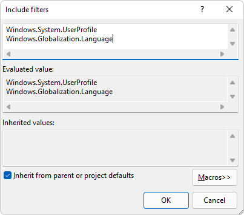

   You need to specify the full name of the namespaces or classes, as shown above.

1. Click the **OK** button to close the **Include filters** dialog.

1. Make sure the **WinRTAdapter Property Pages** dialog looks like the following, for this walkthrough:

   <!-- 1st use of png: -->
   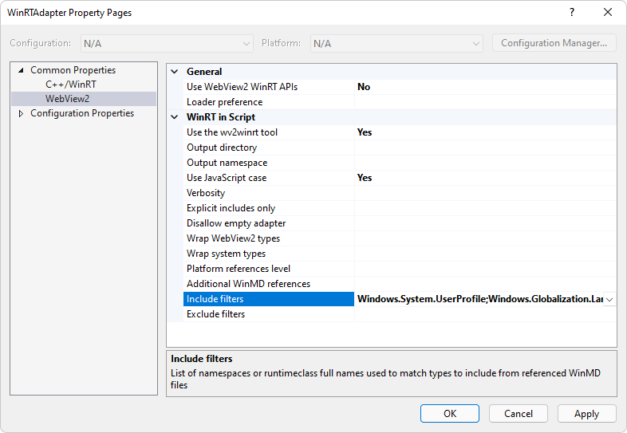

1. Click the **OK** button to close the **Property Pages** dialog.

1. Select **File** > **Save All** (**Ctrl+Shift+S**).


<!-- ------------------------------ -->
#### Adding a reference pointing to the adapter project

Next, add a reference in the main project, pointing to the adapter project.


##### [WinUI 2 (UWP)](#tab/winui2)

In the main project, such as **MyUWPGetStartApp**, add a reference that points to the **WinRTAdapter** project, as follows:

1. In Solution Explorer, expand the main project, such as **MyUWPGetStartApp**, right-click **References**, and then select **Add Reference**.  The **Reference Manager** dialog opens.

1. In the tree on the left, select **Projects**.  Select the **WinRTAdapter** checkbox:

   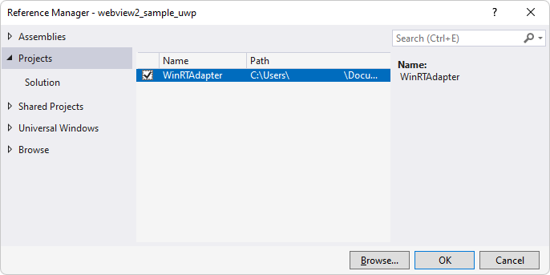

1. Click the **OK** button to close the **Reference Manager** dialog.

1. Select **File** > **Save All** (**Ctrl+Shift+S**).


##### [WinUI 3 (Windows App SDK)](#tab/winui3)

In the non-Adapter main project, such as **MyWebView2WinUI3**, add a reference that points to the **WinRTAdapter** project, as follows:

1. In Solution Explorer, select the main project, such as **MyWebView2WinUI3**.  Then in the menubar, select **Project** > **Add Project Reference**.  The **Reference Manager** dialog opens.

1. In the tree on the left, select **Projects**.  Select the **WinRTAdapter** checkbox:

   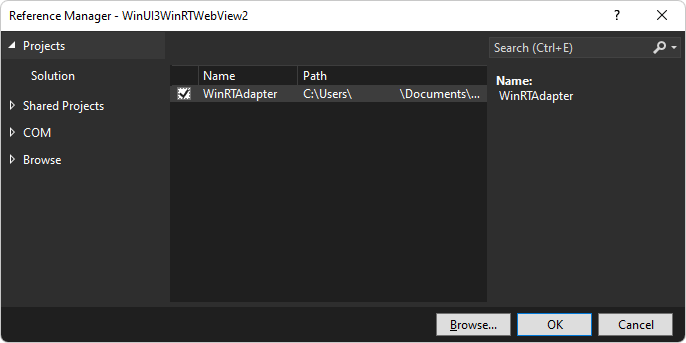

1. Click the **OK** button to close the **Reference Manager** dialog.

1. Select **File** > **Save All** (**Ctrl+Shift+S**).

---


<!-- ------------------------------ -->
#### Generate the API code

Next, generate the API code:

1. Right-click the **WinRTAdapter** project, and then select **Build**.

   Source code is generated for namespaces or classes that you specified in the **Include filters** dialog of the **wv2winrt** tool (the WebView2 WinRT JS Projection tool):
   *  `Windows.System.UserProfile` namespace
   *  `Windows.Globalization.Language` class

1. After building is complete, select **File** > **Save All** (**Ctrl+Shift+S**).


<!-- the next issue didn't occur in WinUI 3 solution: -->

> [!IMPORTANT]
> If you installed a release version of the WebView2 SDK and your build fails with `error MIDL2011: [msg]unresolved type declaration [context]: Microsoft.Web.WebView2.Core.ICoreWebView2DispatchAdapter [ RuntimeClass 'WinRTAdapter.DispatchAdapter'  ]`, this is an issue in the release version of the WebView2 SDK and you will need to change **Use WebView2 WinRT APIs** to **Yes** in the steps above.
>
> Alternatively, add the following after the last `</ItemGroup>` in the project file `WinRTAdapter.vcxproj`:
>
>```xml
><ItemGroup Condition="'$(WebView2UseDispatchAdapter)' == 'true'">
>  <Reference Include="$(WebView2SDKPath)lib\Microsoft.Web.WebView2.Core.winmd">
>    <!-- wv2winrt needs Dispatch Adapter metadata to generate code -->
>  </Reference>
></ItemGroup>
>```
>
> Replace `$(WebView2SDKPath)` with the directory where the WebView2 SDK was installed, with a `\` at the end. For example: `..\<sample-directory>\packages\Microsoft.Web.WebView2.1.0.1264.42\`.


<!-- ====================================================================== -->
## Step 7: Update Target Framework (WinUI 3 only)


##### [WinUI 2 (UWP)](#tab/winui2)

If your app is for WinUI 2 (UWP), skip this step.


##### [WinUI 3 (Windows App SDK)](#tab/winui3)


<!-- ------------------------------ -->
#### Update the OS target

This section is for WinUI 3 (Windows App SDK) only.

1. Update or inspect the `TargetFramework` in the `.csproj` file, as follows.

   If you build the main project, you might get a warning like the following in the **View** > **Error List** pane:

   "MSB3851 This project targets "Windows, Version=10.0.19041.0", but it is attempting to reference "WinRTAdapter.winmd" targeting "UAP,Version=10.0.22000.0" which is invalid."
   <!-- todo: When?  What triggers the display of this warning? got it about two major steps above (seemed non-blocking then) -->

   

   Fix that warning or inspect the value as follows:


<!-- get target version #: -->
1. Determine which version is targeted by WinRTAdapter: right-click the **WinRTAdapter** project, select **Properties**, expand and select **Configuration Properties** > **General**, and then examine the **Target Platform Version** field:

   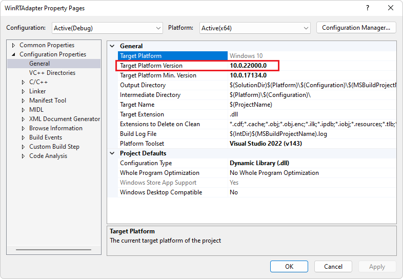

1. Note the **Target Platform Version**, and then click the **OK** button to close the **Property Pages** dialog.


<!-- edit .csproj: -->
1. In Visual Studio, select **File** > **Open** > **File**.  The **Open File** dialog opens. 

1. Open the `.csproj` file, such as `MyWebView2WinUI3.csproj`.

1. If Visual Studio doesn't show line numbers in the code editor, optionally turn on line numbers.  To do this, select **Tools** > **Options** > **Text Editor** > **All Languages** > **Line numbers**.  Then click the **OK** button.

1. In the `.csproj` file, update the version number in the line `<TargetFramework>net6.0-windows10.0.19041.0</TargetFramework>` to be the same as the WinRT Adapter version you obtained above.

   For example, change the line from: 

   ```xml
   <TargetFramework>net6.0-windows10.0.19041.0</TargetFramework>
   ```

   to:

   ```xml
   <TargetFramework>net6.0-windows10.0.22000.0</TargetFramework>
   ```

1. Select **File** > **Save All** (**Ctrl+Shift+S**).

The OS target is now updated.


<!-- ------------------------------ -->
#### Add CsWinRT and WinRTAdapter in the project file

This section is for WinUI 3 (Windows App SDK) only.

Add the CsWinRT and WinRTAdapter packages in the project file:

1. In Visual Studio, select **File** > **Open** > **File**.  The **Open File** dialog opens. 

1. Open the `.csproj` file, such as `MyWebView2WinUI3.csproj`.

1. Add the following `<PackageReference>` element within the `<ItemGroup>` element that already contains some `<PackageReference>` elements.  You can add it below the other `<PackageReference>` elements:

   ```xml
   <ItemGroup>
       ...
       <PackageReference Include="Microsoft.Windows.CsWinRT" Version="1.6.4"/>
       ...
   </ItemGroup>
   ```

1. In the `<PropertyGroup>` element, add the following property group reference.  You can add it to the bottom in that element:

   ```xml
   <PropertyGroup>
       ...
       <CsWinRTIncludes>WinRTAdapter</CsWinRTIncludes>
   </PropertyGroup> 
   ```

1. Select **File** > **Save All** (**Ctrl+Shift+S**).


<!-- ------------------------------ -->
#### Install single-project MSIX packaging tools

This section is for WinUI 3 (Windows App SDK) only.

1. In Solution Explorer, right-click the **WinRTAdapter** project, and then select **Build**.

1. Select **View** > **Error List**.

1. In Solution Explorer, right-click the main project, and then select **Build**.

1. Select **View** > **Error List**.

   You might get the following error: 

   "WinRTAdapter.winmd cannot be referenced.  Referencing a Windows Metadata NETSDK1component directly when targeting .NET 5 or higher is not supported."

   

1. To fix that error, download and install [Single-project MSIX Packaging Tools for VS 2022](https://marketplace.visualstudio.com/items?itemName=ProjectReunion.MicrosoftSingleProjectMSIXPackagingToolsDev17).  Without these packaging tools, the project will build but not run.
<!-- the dl file is: Microsoft.Windows.Msix.VisualStudio.ProjectExtensions.Dev17.Standalone.vsix -->

   The **VSIX Installer** dialog after double-clicking the downloaded file:

   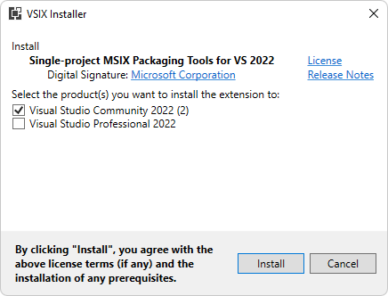

   The **Install Complete** dialog:

   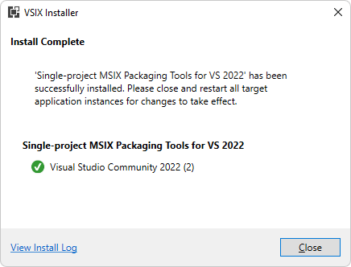

1. If your app is a non-packaged app, you must also do the steps in [Enhancing Non-packaged Desktop Apps using Windows Runtime Components](https://blogs.windows.com/windowsdeveloper/2019/04/30/enhancing-non-packaged-desktop-apps-using-windows-runtime-components/).

1. In Solution Explorer, right-click the main project, and then select **Build**.

1. Select **View** > **Error List**.

1. Select **Debug** > **Start Debugging** (**F5**).

   The WinUI 3 app opens:

   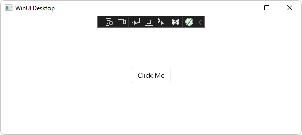

1. Close the app.

1. The following Visual Studio dialogs might appear.  These debugger dialogs are a known bug.  Click the **OK** button, and then click the **Cancel** button to close these dialogs:

   

1. Select **File** > **Save All** (**Ctrl+Shift+S**).

---


<!-- =============================================== -->
## Step 8: Add the host object in the main project

Next, pass the WinRT object from the native side of the host app to the web side of the host app.  To do this, add an `InitializeWebView2Async` method that calls `AddHostObjectToScript`, as follows:


##### [WinUI 2 (UWP)](#tab/winui2)

1. In Solution Explorer, expand the main project, such as **MyUWPGetStartApp**, expand **MainPage.xaml**, and then select **MainPage.xaml.cs**.

1. Below the `MainPage` constructor, add the following `InitializeWebView2Async` method:

   ```csharp
   private async void InitializeWebView2Async()
   {
      await WebView2.EnsureCoreWebView2Async();
      var dispatchAdapter = new WinRTAdapter.DispatchAdapter();
      WebView2.CoreWebView2.AddHostObjectToScript("Windows", dispatchAdapter.WrapNamedObject("Windows", dispatchAdapter));
   }
   ```

   This method calls `AddHostObjectToScript`.

   In the line `AddHostObjectToScript("Windows", ...`, `Windows` is the top-level namespace.  If you have other top-level namespaces, you can add additional calls to `AddHostObjectToScript`, like the following example:

   ```csharp
   WebView2.CoreWebView2.AddHostObjectToScript("RuntimeComponent1", dispatchAdapter.WrapNamedObject("RuntimeComponent1", dispatchAdapter));
   ```

   The `WrapNamedObject` call creates a wrapper object for the `RuntimeComponent1` namespace. The `AddHostObjectToScript` call adds that wrapped object to script using the name `RuntimeComponent1`.

   For full guidance on how to use custom WinRT components, see [Custom (3rd-party) WinRT components](#custom-3rd-party-winrt-components), below.

1. In the `MainPage` constructor, below `this.InitializeComponent();`, add the following code:

   ```csharp
   InitializeWebView2Async();
   ```

1. Right-click the main project, such as **MyUWPGetStartApp**, and then select **Set as startup project**.  Bold indicates startup project.

1. Select **File** > **Save All** (**Ctrl+Shift+S**).

1. Press **F5** to run the sample app.  The WebView2-enabled WinUI 2 (UWP) app opens:

   
   <!-- 2nd use of this png in this article -->


##### [WinUI 3 (Windows App SDK)](#tab/winui3)

Next, pass the WinRT object from the native side of the host app to the web side of the host app.  To do this, add an `InitializeWebView2Async` method that calls `AddHostObjectToScript`, as follows:

1. In Solution Explorer, expand the main project, such as **MyWebView2WinUI3**, and then select **MainWindow.xaml.cs**.

1. Below the `MainWindow` constructor, add the following `InitializeWebView2Async` method:

   ```csharp
   private async void InitializeWebView2Async()
   {
      await MyWebView.EnsureCoreWebView2Async();
      var dispatchAdapter = new WinRTAdapter.DispatchAdapter();
      MyWebView.CoreWebView2.AddHostObjectToScript("Windows", dispatchAdapter.WrapNamedObject("Windows", dispatchAdapter));
   }
   ```

   Note that in two places above, the variable name `MyWebView` is used.  This name needs to match elsewhere in the file.  Some samples use the name `webView2` here instead.

   This method calls `AddHostObjectToScript`.

   In the line `AddHostObjectToScript("Windows", ...`, `Windows` is the top-level namespace.  If you have other top-level namespaces, you can add additional calls to `AddHostObjectToScript`, like the following example:

   ```csharp
   WebView2.CoreWebView2.AddHostObjectToScript("RuntimeComponent1", dispatchAdapter.WrapNamedObject("RuntimeComponent1", dispatchAdapter));
   ```

   The `WrapNamedObject` call creates a wrapper object for the `RuntimeComponent1` namespace. The `AddHostObjectToScript` call adds that wrapped object to script using the name `RuntimeComponent1`.

   For full guidance on how to use custom WinRT components, see [Custom (3rd-party) WinRT components](#custom-3rd-party-winrt-components), below.

1. In the `MainPage` constructor, below the `MyWebView.NavigationStarting += EnsureHttps;` line, add the following code:

   ```csharp
   InitializeWebView2Async();
   ```

1. Right-click the main project, such as **MyWebView2WinUI3**, and then select **Set as startup project**.  Bold indicates startup project.

1. Select **File** > **Save All** (**Ctrl+Shift+S**).

1. Press **F5** to run the sample app.  The **WinUI Desktop** window opens:

   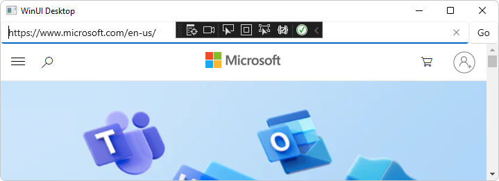

---

The host app's web-side code (and the DevTools Console) can now call methods and properties of the specified namespaces or classes of the host object.


<!-- =============================================== -->
## Step 9: Call methods and properties on the host object from web-side JavaScript


#### Access projected APIs via DevTools Console

Next, use the DevTools Console to demonstrate that web-side code can call the host-side APIs that were specified in the **wv2winrt** tool (the WebView2 WinRT JS Projection tool): 
* [Windows.System.UserProfile Namespace](/uwp/api/windows.system.userprofile)
* [Windows.Globalization.Language Class](/uwp/api/windows.globalization.language)

1. If the app isn't running, in Visual Studio, press **F5** to run the sample app.

1. Click in the main part of the WebView2 sample app window to give it focus, and then press **Ctrl+Shift+I** to open Microsoft Edge DevTools.  Or, right-click the page, and then select **Inspect**.

   The Microsoft Edge DevTools window opens.

1. If the Microsoft Edge DevTools window isn't displayed, press **Alt+Tab** to display it.

1. In the **DevTools** window, select the **Console** tab.

1. Click the **Clear console** () button, or right-click in the **Console** and then select **Clear console**.  Messages might periodically appear in the Console.

1. In the DevTools Console, paste the following [Windows.Globalization.Language Class](/uwp/api/windows.globalization.language) code, and then press **Enter**:

   ```javascript
   const Windows = chrome.webview.hostObjects.sync.Windows;
   (new Windows.Globalization.Language("en-US")).displayName;
   ```

   The Console outputs a language name string, such as `English (United States)`, demonstrating that your app's host-side (native-side) code can be called from web-side JavaScript code:

   

1. Try omitting the parentheses.  In the DevTools **Console**, enter the following statement:

   ```javascript
   new Windows.Globalization.Language("en-US").displayName;
   ```

   The Console outputs a language name string, such as `English (United States)`.

   You can similarly access [Windows.System.UserProfile Namespace](/uwp/api/windows.system.userprofile) members.
   <!-- todo: call Windows.System.UserProfile apis -->

1. Close the DevTools window.

1. Close the app.


##### [WinUI 2 (UWP)](#tab/winui2)

Congratulations!  You've finished the sample demonstration of calling WinRT code from JavaScript code.


##### [WinUI 3 (Windows App SDK)](#tab/winui3)

*  The following Visual Studio dialogs might appear.  These debugger dialogs are a known bug.  Click the **OK** button, and then click the **Cancel** button to close these dialogs:

   

Congratulations!  You've finished the sample demonstration of calling WinRT code from JavaScript code.

---


#### Access projected APIs via source code files

Above, we used the DevTools console to run JavaScript statements that access the projected host object.  Similarly, you can access the projected host object from within source code files.  To do this, first you run setup code for the script:

```javascript
// early in setup code:
const Windows = chrome.webview.hostObjects.sync.Windows;
```

Then in the main body of your code, you add calls to projected objects, like the following:

```csharp
(new Windows.Globalization.Language("en-US")).displayName;
```

You can similarly access `Windows.System.UserProfile` API members.
<!-- todo: call Windows.System.UserProfile apis -->


This is the end of the tutorial steps.  The following sections are general information about WebView2 WinRT apps.


<!-- =============================================== -->
## Custom (3rd-party) WinRT components

The **wv2winrt** tool (the WebView2 WinRT JS Projection tool) supports custom third-party WinRT components, in addition to first-party OS WinRT APIs.

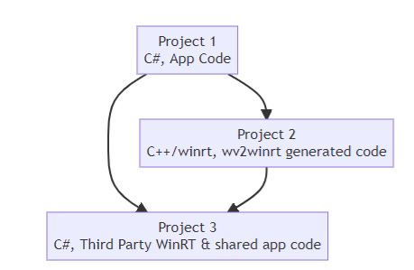

To use custom (3rd-party) WinRT components with the **wv2winrt** tool, in addition to the above steps, also do the following steps:

1. Add a third project (other than your main app and WinRTAdapter project) to your Visual Studio solution that implements your WinRT class.

1. Have the WinRTAdapter project 'Add a reference' to your new third project containing your WinRT class.

1. Update the WinRTAdapter project's Include filter in the properties to also include your new class.

1. Add an additional line to `InitializeWebView2Async` to add your winrt class's namespace:

   `WebView2.CoreWebView2.AddHostObjectToScript("MyCustomNamespace", dispatchAdapter.WrapNamedObject("MyCustomNamespace", dispatchAdapter));`

1. For easy method calling from the web, optionally add your namespace sync proxy as a global object in script.  For example:

   `window.MyCustomNamespace = chrome.webview.hostObjects.sync.MyCustomNamespace;`

For an example of this, see the following WebView2 sample:

* [uwp-wv2winrt-custom-csharp-winrt](https://github.com/MicrosoftEdge/WebView2Samples/compare/uwp-wv2winrt-custom-csharp-winrt) - A sample, as a branch.


<!-- =============================================== -->
## Asynchronous WinRT methods

Following the steps in the above guide, you should be able to use synchronous proxies. For async method calls, you will need to use `chrome.webview.hostObjects.options.forceAsyncMethodMatches`.

The `forceAsyncMethodMatches` property is an array of regexes, where if any regex matches a method name on a sync proxy, the method will be run asynchronously instead. Setting this to `[/Async$/]` will have it match any method ending with the suffix `Async`.  Then matching method calls work just like a method on an async proxy and returns a promise that you can await.

Example:

```javascript
const Windows = chrome.webview.hostObjects.sync.Windows;
chrome.webview.hostObjects.options.forceAsyncMethodMatches = [/Async$/];

let result = await Windows.System.Launcher.launchUriAsync(new Windows.Foundation.Uri('https://contoso.com/'));
```

For more information, see the `forceAsyncMethodMatches` row in [CoreWebView2.AddHostObjectToScript Method](/microsoft-edge/webview2/reference/winrt/microsoft_web_webview2_core/corewebview2#addhostobjecttoscript).


<!-- ====================================================================== -->
## Subscribing to WinRT events

WinRT events are also exposed via the script proxies. You can add and remove event handlers of instance WinRT events and static WinRT events by using the `addEventListener(string eventName, function handler)` and `removeEventListener(string eventName, function handler)` methods. 

These methods work similarly to the DOM methods of the same name. Call `addEventListener` with a string name of the WinRT event you want to subscribe as the first parameter, and a function callback to be called whenever the event is raised. Calling `removeEventListener` with the same parameters unsubscribes from that event. For example:

```javascript
const Windows = chrome.webview.hostObjects.sync.Windows;
const coreApplication = Windows.ApplicationModel.Core.CoreApplication;
const coreApplicationView = coreApplication.getCurrentView();
const titleBar = coreApplicationView.titleBar;
titleBar.addEventListener('IsVisibleChanged', () => {
    console.log('titlebar visibility changed to: ' + titleBar.isVisible);
});
```

For a WinRT event that provides event args, those are provided as the first parameter to the event handler function. For example, the `Windows.Foundation.Collections.PropertySet.MapChanged` event has `IMapChangedEventArgs<string, object>` event arg object and that object is provided as the parameter to the callback.

```javascript
const Windows = chrome.webview.hostObjects.sync.Windows;
const propertySet = new Windows.Foundation.Collections.PropertySet();
propertySet.addEventListener('MapChanged', eventArgs => {
    const key = eventArgs.key;
    const collectionChange = eventArgs.collectionChange;
    // ...
});
```

The event args object will additionally have the following properties:

| Property Name | Description |
| --- | --- |
| `target` | The object that raised the event |
| `type` | The string name of the event |
| `detail` | An array of all parameters provided to the WinRT delegate |


<!-- ====================================================================== -->
## Make AddHostObjectToScript JavaScript proxies act more like other JavaScript APIs

`AddHostObjectToScript` defaults to using asynchronous and verbose proxies, but you can make the `AddHostObjectToScript` JavaScript proxies act more like other JavaScript APIs.  To read more about `AddHostObjectToScript` and its default behavior, see [AddHostObjectToScript](/microsoft-edge/webview2/reference/winrt/microsoft_web_webview2_core/corewebview2#addhostobjecttoscript).  Also, if you are migrating a host app from JavaScript WinRT projection in JavaScript UWP apps, or from the EdgeHTML-based WebView, you may want to use the following approach, to better match that previous behavior.
<!-- This section is most relevant if you are migrating an existing codebase (a WinRT WebView2 host app) from EdgeHTML XAML WinUI 2 WebView to WinUI 2 WebView2. -->

To make the `AddHostObjectToScript` JavaScript proxies act more like other JavaScript APIs, set the following properties:

* `chrome.webview.hostObjects.option.defaultSyncProxy` - Proxies may either be asynchronous or synchronous.  Normally we know, when calling a method on a synchronous proxy, that the result should also be a synchronous proxy.  But in some cases, we lose that context, such as when providing a reference to a function to native code, and then native code later calling that function.  In these cases, the proxy will be asynchronous, unless this property is set.

* `chrome.webview.hostObjects.options.forceAsyncMethodMatches` - This is an array of regular expressions.  If you call a method on a synchronous proxy, the method call will actually be performed asynchronously if the method name matches a string or regular expression that's in this array.  Setting this value to [/Async$/] will make any method that ends with `Async` be an asynchronous method call.  If an async method doesn't match here and isn't forced to be asynchronous, the method will be invoked synchronously, blocking execution of the calling JavaScript and then returning the resolution of the promise, rather than returning a promise.

* `chrome.webview.hostObjects.options.ignoreMemberNotFoundError` - If you attempt to get the value of a property of a proxy, and the property doesn't exist on the corresponding native class, you'll get an exception - unless you set this property to `true`, in which case the behavior will match Chakra WinRT projection behavior (and general JavaScript behavior) and return `undefined` with no error.

Chakra WinRT projection puts the WinRT namespaces directly on the root object.  In contrast:
*  `AddHostObjectToScript` places async root proxies on `chrome.webview.hostObjects`.
*  `AddHostObjectToScript` places sync root proxies on `chrome.webview.hostObjects.sync`.

To access root proxies where Chakra WinRT projection code would expect, you can assign the root proxy WinRT namespace locations over to the root object. For example:

```javascript
window.Windows = chrome.webview.hostObjects.sync.Windows;
```

To ensure that the JavaScript that sets all this up is run before anything else, you can either add the above statement to your JavaScript, or you can tell WebView2 to inject the above statement for you before running any other script, by using the `CoreWebView2.AddScriptToExecuteOnDocumentCreatedAsync` method.

The following example demonstrates the above techniques:


##### [WinRT/C#](#tab/winrtcsharp)

```csharp
webview.CoreWebView2.AddScriptToExecuteOnDocumentCreatedAsync(
            "(() => {" +
                    "if (chrome && chrome.webview) {" +
                        "console.log('Setting up WinRT projection options');" +
                        "chrome.webview.hostObjects.options.defaultSyncProxy = true;" +
                        "chrome.webview.hostObjects.options.forceAsyncMethodMatches = [/Async$/,/AsyncWithSpeller$/];" +
                        "chrome.webview.hostObjects.options.ignoreMemberNotFoundError = true;"  +
                        "window.Windows = chrome.webview.hostObjects.sync.Windows;" +
                    "}" +
                "})();");
```

##### [WinRT/C++](#tab/winrtcpp)

```cpp
webView->CoreWebView2->AddScriptToExecuteOnDocumentCreatedAsync(
            LR"(
                (() => {
                    if (chrome && chrome.webview) {
                        console.log('Setting up WinRT projection options');
                        chrome.webview.hostObjects.options.defaultSyncProxy = true;
                        chrome.webview.hostObjects.options.forceAsyncMethodMatches = [/Async$/,/AsyncWithSpeller$/];
                        chrome.webview.hostObjects.options.ignoreMemberNotFoundError = true;
                        window.Windows = chrome.webview.hostObjects.sync.Windows;
                    }
                })();
            )"));
```

---


<!-- ====================================================================== -->
## Get information about WebView2 properties

Information about WebView2 properties is available in two places:
*  The WinRTAdapter project's Property Pages.
*  `wv2winrt.exe` command-line help.  This is the **wv2winrt** tool (the WebView2 WinRT JS Projection tool).


<!-- ------------------------------ -->
#### WinRTAdapter project's Property Pages

In the WinRTAdapter project's Property Pages, for help about a property, click a property row.  Help is shown at the bottom of the dialog:
<!-- 2nd use of png: -->


<!-- ------------------------------ -->
#### Command-line help for wv2winrt.exe properties

Command-line help for `wv2winrt.exe` gives information about the parameters of the **wv2winrt** tool (the WebView2 WinRT JS Projection tool).  For example:

| Parameter | Description |
|---|---|
| `verbose` | List some content to standard out including which files have been created and information about the include and exclude rules. |
| `include` | List as above will exclude namespaces and runtimeclasses by default except those listed. The include declarations may be either namespaces which include everything in that namespace, or runtimeclass names to include just that runtimeclass. |
| `use-javascript-case` | Changes the generated code to produce methods names, property names, and so on, that use the same casing style as Chakra JavaScript WinRT projection. The default is to produce names that match the winrt. |
| `output-path` | Sets the path in which generated files will be written. |
| `output-namespace` | Sets the namespace to use for the generated WinRT class. |
| `winmd-paths` | A space-delimited list of all the winmd files that should be examined for code generation. |


<!-- ====================================================================== -->
## See also

Tutorial and sample:
* [Get started with WinUI 2 (UWP) apps](../get-started/winui2.md) - Tutorial: Steps to create an app with WebView2 using a project template.
* [WinUI 2 (UWP) sample app](../samples/webview2_sample_uwp.md) - Sample: Steps to download, build, run, and update the sample.

API Reference:
* WinRT: [CoreWebView2.AddHostObjectToScript Method](/microsoft-edge/webview2/reference/winrt/microsoft_web_webview2_core/corewebview2#addhostobjecttoscript)
* Win32: [ICoreWebView2::AddHostObjectToScript method](/microsoft-edge/webview2/reference/win32/icorewebview2#addhostobjecttoscript)
* .NET: [CoreWebView2.AddHostObjectToScript Method](/dotnet/api/microsoft.web.webview2.core.corewebview2.addhostobjecttoscript)

.NET equivalent article:
* [Call native-side code from web-side code](hostobject.md) - covers Win32/C++, and also covers some aspects of .NET/C# within frames.
