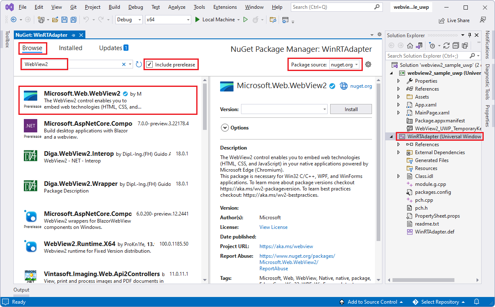

# Call native-side WinRT code from web-side code

<!-- target outline:
## Step 1. Setup: Installing WIL
* See [Get started with WebView2 in Win32 apps > Step 7 - Install the Windows Implementation Libraries (WIL)](../get-started/win32#step-7---install-the-windows-implementation-libraries-wil)
## Step 2. Adding the project 
## Step 3. Using the project
### Adding the wrapped object dispatch
### Adding the injected script
## Step 4. Calling WinRT methods from JavaScript
## Step 5. Generating source code for a filtered subset of classes
_Filtering_ filters the classes or namespaces to selectively generate the needed classes or namespaces (include, exclude list - see wiki page).   We generate source files that need to be compiled, so we aren't just doing # include of entire files.
-->

This article is for WebView2 developers who want to use WinRT host objects from JavaScript.  For more information on why you'd want to do this, see [Call native-side code from web-side code](hostobject.md).

<!-- **Why is this tool needed?** -->
This article is for the WinRT WebView2 APIs, not for the .NET WebView2 APIs. The C# code in this article will build, but not run, for the .NET WebView2 APIs; when you call `AddHostObjectToScript`, it will produce an error message.

The WebView2 WinRT tool generates C++/WinRT source code that your project can then consume.  This article provides an example of running the WebView2 WinRT tool.  We will start with our UWP WinUI2 WebView2 Sample App, and call `AddHostObjectToScript` from the sample app, to pass a native WinRT object to JavaScript. 

The WebView2 WinRT tool is needed when projecting WinRT objects, because WinRT by default doesn't support iDispatch, which WebView2's Win32, .NET platforms support.  The steps in this article won't work with .NET. 
<!-- 
Implementation detail: Why is WinRT handled specially?  First, made COM, to work w/ iDispatch.  .NET supports iDispatch (we had to do work to make it support iDispatch to provide COM support and sort of .NET), WinRT doesn't.  .NET was nice in that it had already support for iDispatch.

If you write in C# ...
Note:  you can't just make a C# class and pass it to AddHOTS.  .NET supports creating a runtime class.
This doc doesn't apply to .net, bc there are other issues. workaround: specifically, won't work w/ the .NET API.
-->


<!-- ====================================================================== -->
## Let's get started!

First let's find a native object (class) that we're interested in.  For this example, we'll use the WinRT `Language` class, which is in the `Windows.Globalization` namespace, for Windows UWP applications.  See [Language Class](/uwp/api/windows.globalization.language?view=winrt-22000).

The `Language` class API allows getting information from the client's native OS.  Your WebView2 host app can call methods and access properties of the `Language` object from the host app's web-side JavaScript code.


<!-- ====================================================================== -->
## Step 1: Clone the repo and build the WebView2 UWP sample

1. If Visual Studio (minimum required version) is not already installed, in a separate window or tab, see [Install Visual Studio](../how-to/machine-setup.md#install-visual-studio) in _Set up your Dev environment for WebView2_.  Follow the steps in that section, and then return to this page and continue the steps below.

1. If a preview channel of Microsoft Edge (Beta, Dev, or Canary) is not already installed, in a separate window or tab, see [Install a preview channel of Microsoft Edge](../how-to/machine-setup.md#install-a-preview-channel-of-microsoft-edge) in _Set up your Dev environment for WebView2_.  Follow the steps in that section, and then return to this page and continue the steps below.

   If you have your own app code base already, you can open that project in Visual Studio, instead of the following sample:

1. If not done already, download or clone the `WebView2Sample` repo to your local drive.  In a separate window or tab, see [Download the WebView2Samples repo](../how-to/machine-setup.md#download-the-webview2samples-repo) in _Set up your Dev environment for WebView2_.  Follow the steps in that section, and then return to this page and continue below.

1. On your local drive, open the `.sln` file in Visual Studio, in the directory:

   *  `<your-repos-directory>/WebView2Samples/SampleApps/webview2_sample_uwp/webview2_sample_uwp.sln`

   or:

   *  `<your-repos-directory>/WebView2Samples-master/SampleApps/webview2_sample_uwp/webview2_sample_uwp.sln`

   

In case you need more information, see detailed steps in these pages, and then continue below:
* [WebView2 sample: WinUI 2 (UWP) browser app](https://docs.microsoft.com/en-us/microsoft-edge/webview2/samples/webview2_sample_uwp) - steps to open, compile, and run the sample app.
* [Get started with WebView2 in WinUI 2 (UWP) apps (public preview)](https://docs.microsoft.com/en-us/microsoft-edge/webview2/get-started/winui2) - setting up a basic WebView2 app.
* [GitHub > WebView2Samples repo > webview2_sample_uwp](https://github.com/MicrosoftEdge/WebView2Samples/tree/master/SampleApps/webview2_sample_uwp)
* [Set up your Dev environment for WebView2](https://docs.microsoft.com/en-us/microsoft-edge/webview2/how-to/machine-setup) - details about setting up prerequisites.


<!-- ====================================================================== -->
## Step 2: Set up the WebView2 WinRT JS Projection tool
<!-- aka the WebView2 WinRT tool -->

<!--why cover this?:-->
**Note:** Alternative approach: If you don't add a project using the project template for **Windows Runtime Component (C++/WinRT)** as described in the numbered steps below, then you'll need to instead install the **Universal Windows Platform development** workload, by following the steps in [UWP applications > Introduction to C++/WinRT](/windows/uwp/cpp-and-winrt-apis/intro-to-using-cpp-with-winrt#visual-studio-support-for-cwinrt-xaml-the-vsix-extension-and-the-nuget-package).  That page reads: "From within the Visual Studio Installer, install the Universal Windows Platform development workload. In **Installation Details** > **Universal Windows Platform development**, check the **C++ (v14x) Universal Windows Platform tools** option(s), if you haven't already done so.  And, in **Windows Settings** > **Update & Security** > **For developers**, choose the **Developer mode** option rather than the **Sideload apps** option."

The recommended, regular way to set up the WebView2 WinRT JS Projection tool is as follows:


   <!-- =============================================== -->
   **Step 2A. Add a project for the WebView2 WinRT JS Projection tool:**

1. Right-click the solution, and then select **Add** > **New project**.  The **Add a new project** dialog box opens.

1. In the **Search** textbox, enter **Windows Runtime Component (C++/WinRT)**.

1. Select the **Windows Runtime Component (C++/WinRT)** card, and then click the **Next** button:

   

   The **Configure your new project** window opens.

1. In the **Project name** textbox, name the Project, specifically, **WinRTAdapter**.  **Note:** For now, you must use this specific project name.
 
   

1. Click the **Create** button.  The **New Universal Windows Platform Project** dialog opens:

   

1. Click the **OK** button.

   The base project is created, named **WinRTAdapter**:

   

   The WebView2 WinRT JS Projection tool will run in this **WinRTAdapter** base project.  In a below step, you'll generate code for selected classes in this project.


   <!-- =============================================== -->
   **Step 2B. Install the NuGet package for Windows Implementation Library (WIL), for the WinRTAdapter project:**

   Next, manage NuGet packages for the WinRT `Adapter` class.  First, in the WinRTAdapter project, install the NuGet package for Windows Implementation Library (WIL), as follows:

1. In **Solution Explorer**, right-click the **WinRTAdapter** project, and then select **Manage NuGet Packages**.  The **NuGet Package Manager** window opens in Visual Studio.

1. In the **NuGet Package Manager** window, in the **Search** box, enter **Windows Implementation Library**, and then select the **Windows Implementation Library** card:

   

1. Click the **Install** button.

   WIL is now installed for the **WinRTAdapter** project.

   Windows Implementation Library (WIL) is a header-only C++ library to make using COM coding for Windows easier.  It provides readable, type-safe C++ interfaces for Windows COM coding patterns.

   <!-- See [Get started with WebView2 in Win32 apps > Step 7 - Install the Windows Implementation Libraries (WIL)](../get-started/win32#step-7---install-the-windows-implementation-libraries-wil) -->


   <!-- =============================================== -->
   **Step 2C. Install the NuGet package for WebView2 prerelease SDK, for the WinRTAdapter project:**

1. Next, in **NugGet Package Manager**, download and install a prerelease version of the WebView2 SDK.  To do this, in the **Search** box, enter **WebView2**.

   

   The WebView2 prerelease SDK is now installed for the **WinRTAdapter** project.


   <!-- =============================================== -->
   **Step 2D. Install the NuGet package for WebView2 prerelease SDK, for the WebView2 UWP project:**

1. In Solution Explorer, right-click the **webview2_sample_uwp** project, and then select **Manage NuGet Packages**.

1. In **NugGet Package Manager**, in the **Search** box, enter **WebView2**.

   

   The WebView2 prerelease SDK is now installed for the **WinRTAdapter** project.


   <!-- =============================================== -->
   **Step 2D. Configure the WebView2 WinRT JS Projection tool, to generate source code for selected API items:**

   Next, configure the WebView2 WinRT JS Projection tool, to incorporate the WinRT class that you want to use.  In the example steps below, we'll specify two `Windows` namespaces, and the tool will generate source code for only those namespaces.

   **RESUME HERE**

1. In Solution Explorer, right-click the **WinRTAdapter** project, and then select **Properties**.  The **WinRTAdapter Property Pages** window opens.

1. On the left, select **Common Properties** > **WebView2**.

   

1. Set **Use the WV2WinRT tool** to **Yes**, and set **JavaScript Case** to **Yes**.

   <!-- ## Step 5. Generating source code for a filtered subset of classes -->

   Next, specify filters, to generate source code for a filtered subset of classes.  This filtering will selectively generate the needed classes or namespaces.  This filtering specifies an include list or an exclude list.<!--see wiki page-->  You generate source files that need to be compiled, rather than adding a `#` include of entire header files.  To define filters, specify the full name of the namespaces or runtime classes that you want to generate source code for, to include in your project.

   For this example project, include the following two namespaces.  Enter them as follows, if you are in the Edit view / editor:<!--UI name?-->

1. In the topmost text box of the **Include filters** dialog, enter: **Windows.System.UserProfile**

1. In the same text box, below the previous value you entered, add a reference for the tool itself, such as params: **Windows.Globalization.Language**

   

1. Click the **OK** button to close the **Include filters** dialog box.

1. Make sure that the **webview2_uwp_sample** has a reference to the **WinRTAdapter** project.  To do this, __.

   

   

1. Make sure the box is checked to add the project as a reference.

   Build the **WinRTAdapter** project independently.

   Next, update the sample apps webview2's dependency to match the one as the tool.

1. In File Explorer, navigate to **MainPage.xaml.cs**. 

1. Add the following code, to pass the WinRT object to the host app's web side:

   ```csharp
      InitializeWebView2Async();
      StatusUpdate("Ready");
   }
   
   private async void InitializeWebView2Async()
   {
      await WebView2.EnsureCoreWebView2Async();
      var dispatchAdapter = new WinRTAdapter.DispatchAdapter();
      WebView2.CoreWebView2.AddHostObjectToScript("Windows", dispatchAdapter.WrapNamedObject("Windows", dispatchAdapter));
   }
   ```
    
1. Run the sample app. The code should now have your host object on the web side.

1. Confirm that your host app's web-side code can call the app's host object's methods.  To do this, call `Language.displayName`, as follows:

   `new chrome.webview.hostObjects.sync.Windows.Globalization.Language("en-US")).displayName`


<!-- ====================================================================== -->
## Properties


| WebView2 property | Description |
|---|---|
| Use WebView2 WinRT APIs |  |
| Loader preference |  |
| Use the wv2winrt tool |  |
| Output directory | Sets the path in which generated files will be written. |
| Output namespace | Sets the namespace to use for the generated WinRT class. |
| Use JavaScript case | Changes the generated code to produce methods names, property names, and so on that use the same casing style as Chakra JavaScript WinRT projection. The default is to produce names that match the winrt. |
| Verbosity | List some content to standard out including which files have been created and information about the include and exclude rules. |
| Explicit includes only |  |
| Disallow empty adapter |  |
| Wrap WebView2 types |  |
| Wrap system types |  |
| Platform references level |  |
| Additional WinMD references |  |
| Include filters |  |
| Exclude filters |  |

From command line:

| WebView2 property | Description |
|---|---|
| verbose | List some content to standard out including which files have been created and information about the include and exclude rules. |
| include | List as above will exclude namespaces and runtimeclasses by default except those listed. The include declarations may be either namespaces which include everything in that namespace, or runtimeclass names to include just that runtimeclass. (There's currently a bug that if you include a type that depends on an excluded type, you may end up with generated code that cannot compile.) |
| use-javascript-case | Changes the generated code to produce methods names, property names, and so on that use the same casing style as Chakra JavaScript WinRT projection. The default is to produce names that match the winrt. |
| output-path | Sets the path in which generated files will be written. |
| output-namespace | Sets the namespace to use for the generated WinRT class (see the next section). |
| winmd-paths | A space-delimited list of all the winmd files that should be examined for code generation. |
