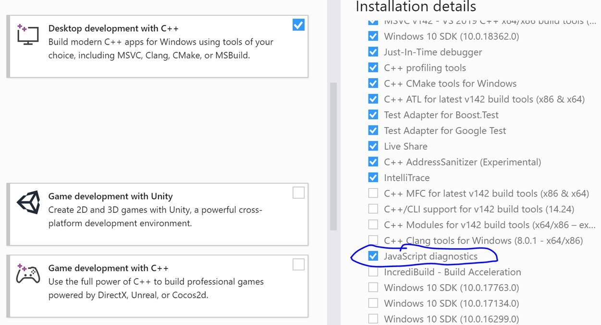
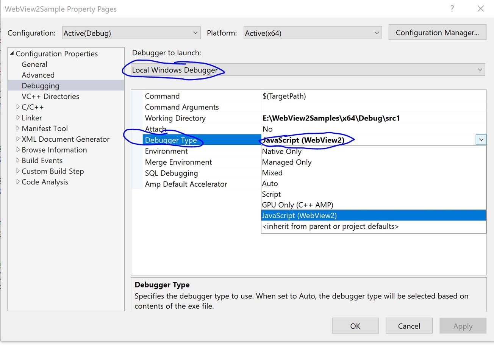

# How to Debug when Developing with WebView2

The goal of the Microsoft Edge WebView2 control is to combine the best of web and native both in terms of functionality and in terms of developer tooling. The following are different tools you can take advantage of when developing with WebView2.

## Microsoft Edge DevTools

### DevTools

You can use [Microsoft Edge (Chromium) Developer Tools](https://docs.microsoft.com/microsoft-edge/devtools-guide-chromium) to debug web content displayed in WebView, just as you would in the browser. While having focus on the WebView window, press `F12`, or press `Ctrl` + `Shift` + `I`, or Right Click + choose `Inspect` to open Developer Tools.

**Note when debugging application in Visual Studio with the native debugger attached, `F12` may trigger the native debugger instead of Developer Tools. Use `Ctrl` + `Shift` + `I`, or Right Click + `Inspect` to avoid potential hotkey conflict.**

### Visual Studio

You can use the script debugger in Visual Studio 2019 (minimum version 16.4 Preview 2) to debug your script within WebView2 right from the IDE. Make sure the **JavaScript diagnostics** component in **Desktop development with C++** workload is installed.

Right click on your project and select **Properties**. Under **Configuration Properties** > **Debugging** > **Debugger Type**,  choose the **JavaScript (WebView2)** option to enable WebView2 script debugging. More details to follow soon.

### Visual Studio Code

You can also use Visual Studio Code to debug your script within the WebView2 right from the IDE. For more details click [here](https://github.com/microsoft/vscode-edge-debug2/blob/master/README.md#microsoft-edge-chromium-webview-applications).

## Feedback

Help us build a richer WebView2 experience by sharing your feedback! Visit our [feedback repo](https://aka.ms/webviewfeedback) to submit feature requests or bug reports. 

