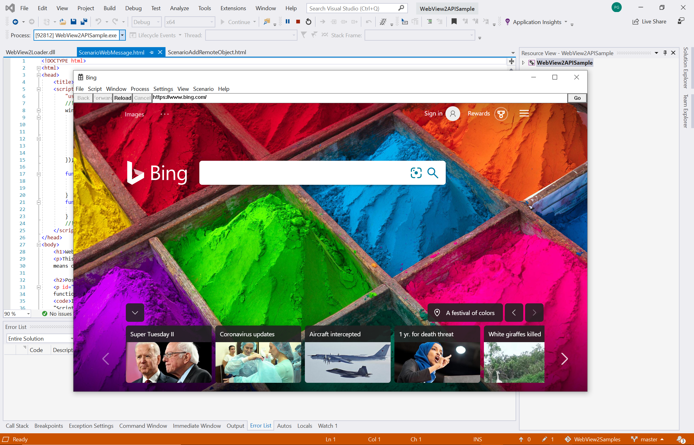
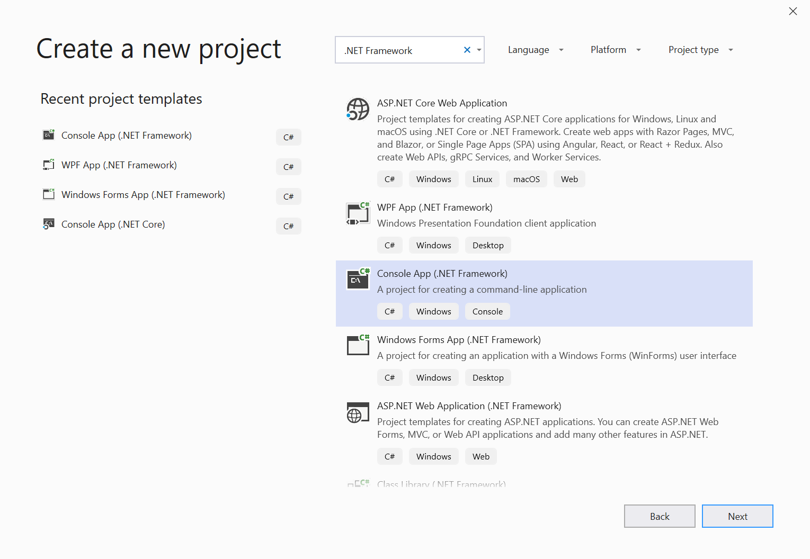
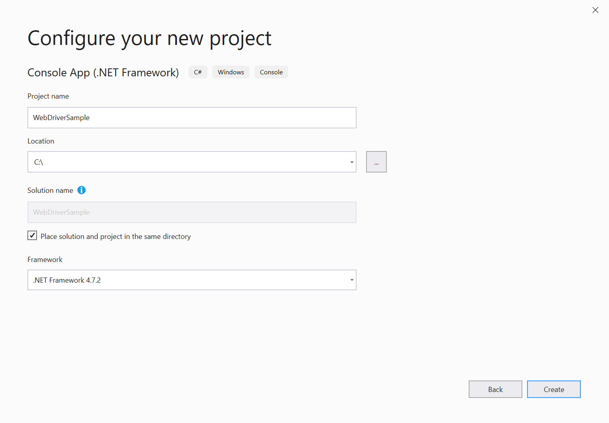
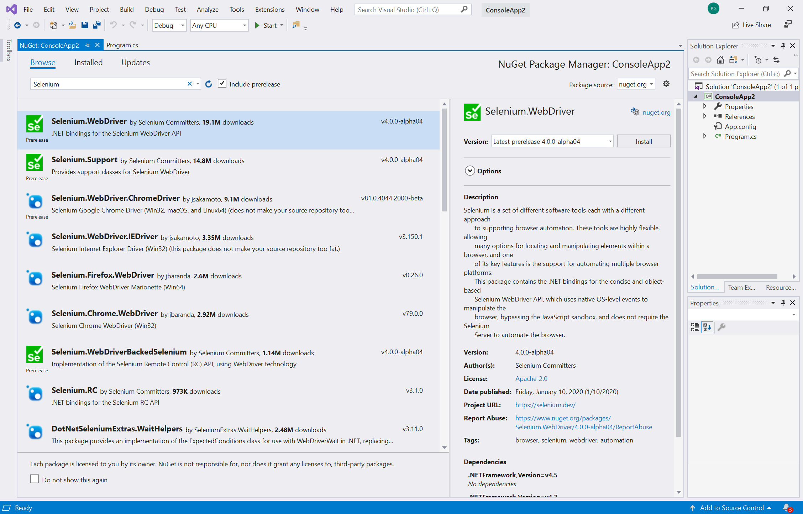

# Automating and Testing WebView2 with Microsoft Edge Driver

Because WebView2 utilizes the Chromium web platform, WebView2 developers can take advantage of standard web tooling for debugging and automation. One such tool is Selenium, which implements the W3C [WebDriver](https://www.w3.org/TR/webdriver2/) API, which can be used to create automated tests that simulate user interactions.

Here's how to get started:

## Step 1: Download WebView2API Sample

If you do not have an existing WebView2 project, download our [WebView2API Sample application](https://github.com/MicrosoftEdge/WebView2Samples/tree/master/WebView2APISample#webview2-api-sample), a comprehensive sample of the latest WebView2 SDK. Please double check that you have satisfied these [prerequisites](https://github.com/MicrosoftEdge/WebView2Samples/tree/master/WebView2APISample#prerequisites).

Once you have cloned the repo, build the project in Visual Studio. It should look like the following:



## Step 2: Install Microsoft Edge Driver

Follow the instructions to install [Microsoft Edge Driver](https://docs.microsoft.com/microsoft-edge/webdriver-chromium#download-microsoft-edge-driver) the browser-specific driver required by Selenium to automate and test WebView2.

It is important to make sure that the version of Microsoft Edge Driver matches the version of Microsoft Edge that the application uses. For the WebView2API Sample to work, make sure that your version of Microsoft Edge is greater than or equal to the supported version of our latest SDK release found [in our Release Notes](https://docs.microsoft.com/microsoft-edge/hosting/webview2/releasenotes). To find out what version of Microsoft Edge you currently have, load `edge://settings/help` in the browser.

## Step 3: Add Selenium to the WebView2API Sample

At this point you should have Microsoft Edge installed, built a WebView2 project, and installed Microsoft Edge Driver. Now, let's get started using Selenium.

> [!NOTE]
> Selenium supports C#, Java, Python, Javascript, and Ruby. However, this guide will be in C#.

1. Start by creating a new **C# .NET Framework** project in **Visual Studio**. Click **Next** on the bottom right-hand corner to continue.



2. Give your project a **name**, save it to your preferred **location**, and click **Create**.



3. A new project will be created. In this guide, all code will be written in the **Program.cs** file.


4. Now let's add **Selenium** to the project. You can install Selenium via the **Selenium.WebDriver NuGet package**.

To download the **Selenium.WebDriver NuGet package**, in **Visual Studio**, hover over **Project** and select **Manage NuGet Package**. The following screen should appear:


5. Enter **Selenium.WebDriver** in the search bar, click **Selenium.WebDriver** from the results, and make sure to checkmark the box next to **include pre-release**. On the right-hand side window, ensure the **Version** is set to **install 4.0.0-alpha04** or later and click **Install**. Nuget will download Selenium to your machine.

[Learn more about the Selenium.WebDriver NuGet package.](https://www.nuget.org/packages/Selenium.WebDriver/4.0.0-alpha04)



6. Use **OpenQA.Selenium.Edge** by adding the following statement:```using OpenQA.Selenium.Edge;``` at the beginning of **Program.cs**

```csharp
using OpenQA.Selenium.Edge;

using System;
using System.Collections.Generic;
using System.Linq;
using System.Text;
using System.Threading.Tasks;
```

## Step 4: Drive WebView2 with Selenium and Microsoft EdgeDriver

1. First, create the `EdgeOptions` object, by copying the code below:

```csharp
static void Main(string[] args)
{
    // EdgeOptions() requires using OpenQA.Selenium.Edge
    // Construct EdgeOptions with is_legacy = false and the string "webview2"
    EdgeOptions edgeOptions = new EdgeOptions(false, "webview2");
```

The `EdgeOptions` object takes in two parameters:
\
    **Parameters:**
    1. `is_legacy`: set to `false`, which tells Selenium that you are driving the new Chromium-based Microsoft Edge browser.
    2. `"webview2"`: a string that tell Selenium you are driving **WebView2**

2. Next, set `edgeOptions.BinaryLocation` to the file path of your WebView2 project's executable, create a string called `msedgedriverDir` that provides the file path to where you installed [Microsoft Edge Driver](https://developer.microsoft.com/microsoft-edge/tools/webdriver/#downloads), and create a string called `msedgedriverExe` to store the name of the Microsoft Edge Driver executable. By default, the executable is called `"msedgedriver.exe"`. Use these two strings to construct the `EdgeDriverService` object as shown below. Finally, create the `EdgeDriver` object using `EdgeDriverService` and `EdgeOptions`.

You can copy and paste the following code underneath `edgeOptions`. Make sure to specify the correct file paths to your project's executable and the Microsoft Edge Driver's executable on your machine.

```csharp
    //Set the BinaryLocation to the filepath of the WebView2API Sample's executable
    edgeOptions.BinaryLocation = @"C:\path\to\your\webview2\project.exe";

    //Set msedgedriverDir to the filepath of the directory housing msedgedriver.exe
    string msedgedriverDir = @"C:\path\to\your\msededriver.exe's\directory";

    //Set msedgedriverExe to the name of the Edge Driver. By default it is:
    string msedgedriverExe = @"msedgedriver.exe";

    // Construct EdgeDriverService with is_legacy = false  
    EdgeDriverService service = EdgeDriverService.CreateDefaultService(msedgedriverDir, msedgedriverExe, false);

    EdgeDriver e = new EdgeDriver(service, edgeOptions);
```

3. Now, **EdgeDriver** is configured to drive the **WebView2** in your project. For example, if you are using the **WebView2API Sample**, you can **Navigate** to <https://microsoft.com> by calling ```e.Url = @"https://www.microsoft.com";```. You can watch **Selenium** drive **WebView2** by setting a breakpoint on this line and running the project.

```csharp
    //The following will Navigate the WebView2API Sample from bing.com to microsoft.com
    e.Url = @"https://www.microsoft.com";

    //This exits the edge driver
    e.Quit();
}
```


Congratulations! You have successfully automated a WebView2 project and driven WebView2 using Selenium and Microsoft Edge Driver.

## Next Steps

To learn more:

- Check out [Selenium's documentation](https://www.selenium.dev/documentation/en/webdriver/) for a comprehensive look at the APIs Selenium has available for driving WebView2 or Microsoft Edge (Chromium)
- Learn more about [WebView2](https://docs.microsoft.com/microsoft-edge/hosting/webview2) control and how to use it when embedding web content in your native app
- Check out [documentation for Microsoft Edge Driver](https://docs.microsoft.com/microsoft-edge/webdriver-chromium) to learn more about automating Microsoft Edge (Chromium)

## Getting in touch with the WebView2 team  

Help us build a richer WebView2 experience by sharing your feedback! Visit our [feedback repo](https://github.com/MicrosoftEdge/WebViewFeedback) to submit feature requests or bug reports or to search for known issues.
