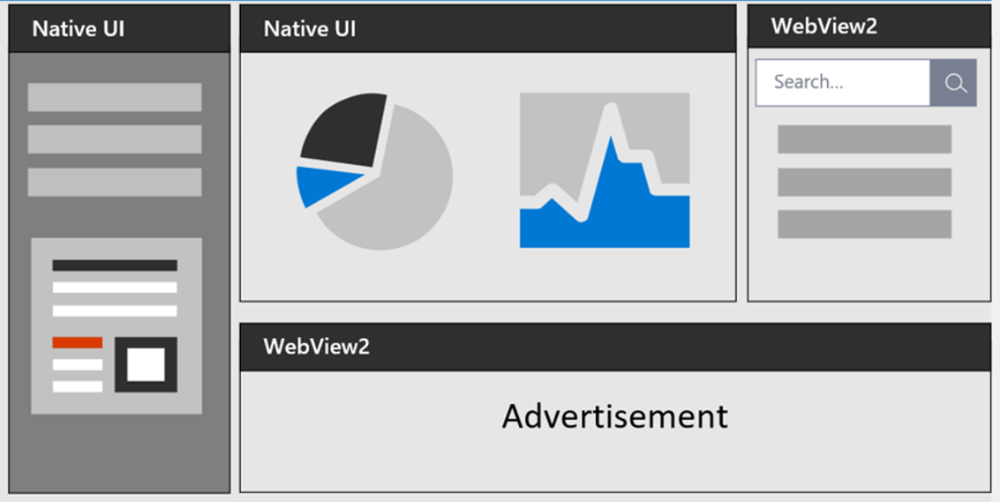
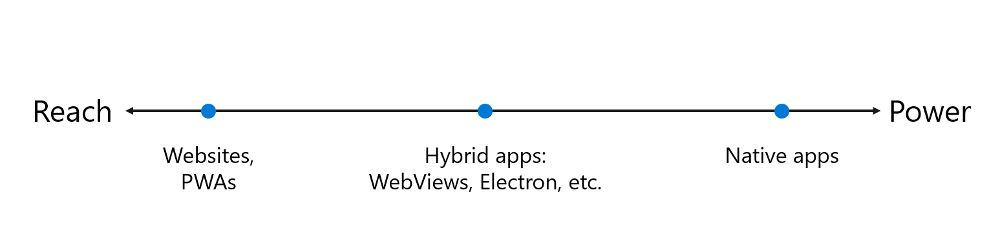

# Introduction to Microsoft Edge WebView2

The Microsoft Edge WebView2 control allows you to embed web technologies (HTML, CSS, and JavaScript) in your native apps.  The WebView2 control uses [Microsoft Edge](https://www.microsoft.com/edge/download/insider) as the rendering engine to display the web content in native apps.

With WebView2, you can embed web code in different parts of your native app, or build all of the native app within a single WebView2 instance.

To start building a WebView2 app, see [Get started with WebView2](get-started/get-started.md).

<!-- ====================================================================== -->
## Hybrid app approach

Developers must often decide between building a web app or a native app.  This decision hinges on the tradeoff between reach and power:

*  Web apps allow for a broad reach.  As a Web developer, you can reuse most of your code across different platforms.

*  To access all the powerful capabilities of a native platform, use a native app.

The following diagram shows the spectrum of apps, from maximum reach, to maximum power:

*  Wide **reach** includes websites and Progressive Web Apps.

*  In the middle are hybrid apps, such as WebViews and Electron.

*  Maximum **power** is native apps.

Hybrid apps, in the middle of this spectrum, allow you to enjoy the best of both worlds: the ubiquity and strength of the web platform, combined with the power and full capabilities of the native platform.

<!-- ====================================================================== -->
## WebView2 benefits

*  **Web ecosystem and skill set**.  Utilize the entire web platform, libraries, tooling, and talent that exists within the web ecosystem.

*  **Rapid innovation**.  Web development allows for faster deployment and iteration.

*  **Windows 10 and 11 support**.  Support for a consistent user experience across Windows 10 and Windows 11.

*  **Native capabilities**.  Access the full set of Native APIs.

*  **Code-sharing**.  Add web code to your codebase allows for increased reuse across multiple platforms.

*  **Microsoft support**.  Microsoft provides support and adds new feature requests on supported platforms.

*  **Evergreen distribution**.  Rely on an up-to-date version of Chromium with regular platform updates and security patches.

*  **Fixed Version distribution**.  Optionally package a specific version of the Chromium bits in your app.

*  **Incremental adoption**.  Add web components piece-by-piece to your app.

<!-- ====================================================================== -->
## Supported platforms

The following programming environments are supported:

*  Win32 C/C++
*  .NET Framework 4.5 or later
*  .NET Core 3.1 or later
*  .NET 5 or later
*  [WinUI 2.0](/windows/apps/winui/winui2/)
*  [WinUI 3.0](/windows/apps/winui/winui3/)

WebView2 apps can run on the following versions of Windows:

*  Windows 11
*  Windows 10
*  Windows 10 IoT Enterprise LTSC x32 2019
*  Windows 10 IoT Enterprise LTSC x64 2019
*  Windows 10 IoT Enterprise 21h1 x64
*  Windows Server 2022
*  Windows Server 2019
*  Windows Server 2016

WebView2 is also supported on the following devices:
*  Xbox
*  HoloLens 2

<!-- ------------------------------ -->
#### Windows 7 and 8

WebView2 Runtime version 109 is the final version that supports the following versions of Windows.  WebView2 Runtime and SDK version 110.0.1519.0 and higher don't support these operating systems.

*  Windows 8/8.1
*  Windows 7
*  Windows Server 2012 R2
*  Windows Server 2012
*  Windows Server 2008 R2

See also:
* [Microsoft Edge supported Operating Systems](/deployedge/microsoft-edge-supported-operating-systems) - WebView2 support for Windows 7 and Windows Server 2008 R2 have the same support timeline as Microsoft Edge.
* [Microsoft Edge and WebView2 ending support for Windows 7 and Windows 8/8.1](https://blogs.windows.com/msedgedev/2022/12/09/microsoft-edge-and-webview2-ending-support-for-windows-7-and-windows-8-8-1/)

<!-- ====================================================================== -->
## See also

* [Overview of WebView2 features and APIs](concepts/overview-features-apis.md)
* [Getting Started tutorials](get-started/get-started.md)
* [Distribute your app and the WebView2 Runtime](concepts/distribution.md)

developer.microsoft.com:
* [Microsoft Edge WebView2](https://developer.microsoft.com/microsoft-edge/webview2) - initial introduction to WebView2 features at developer.microsoft.com.
