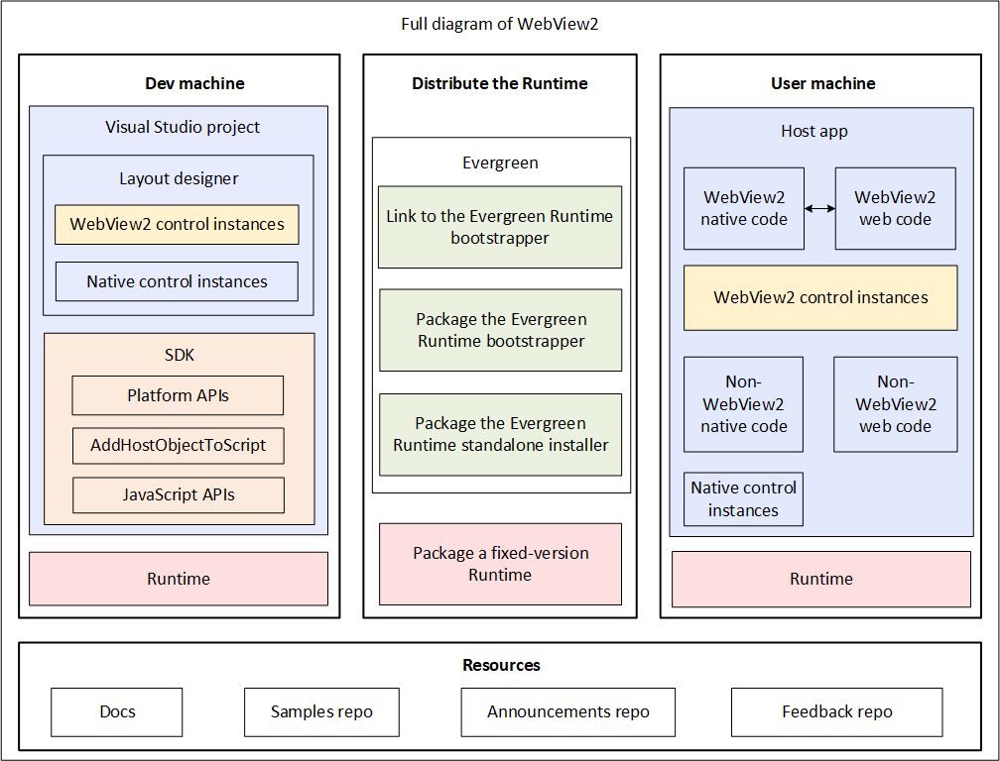
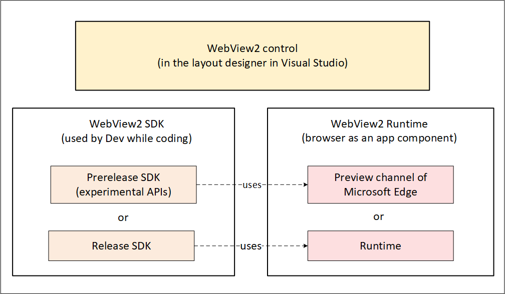
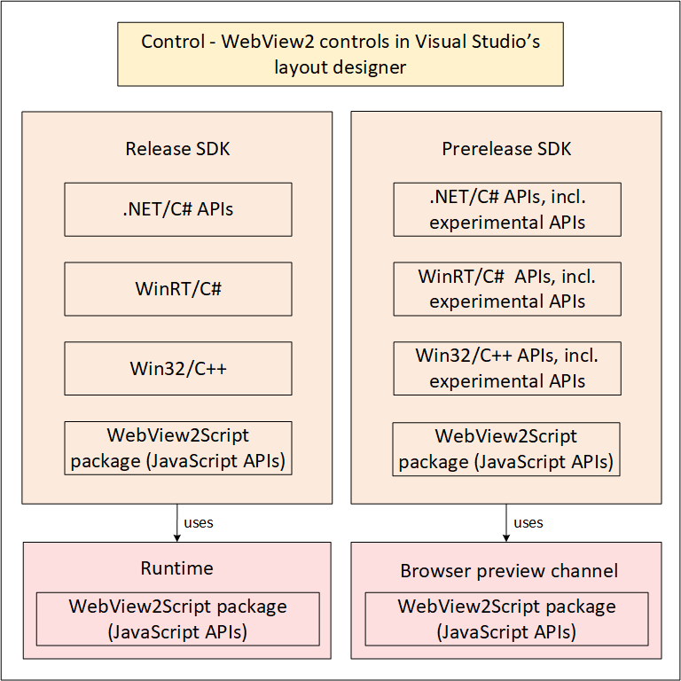
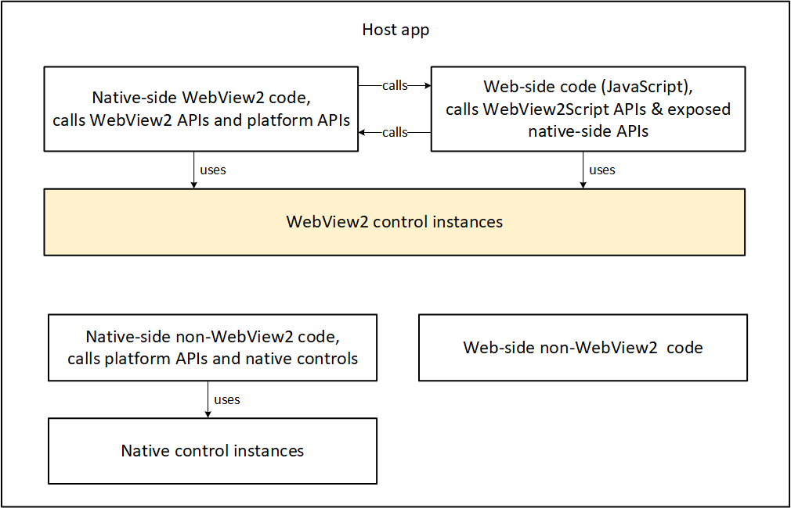
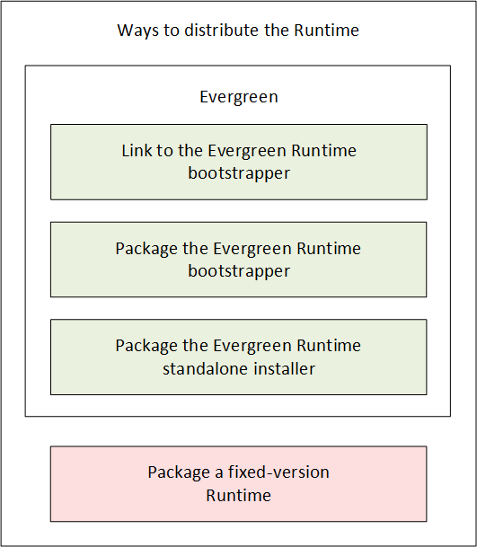

# Introduction to Microsoft Edge WebView2

The Microsoft Edge WebView2 control allows you to embed web technologies (HTML, CSS, and JavaScript) in your native apps.  The WebView2 control uses [Microsoft Edge](https://www.microsoftedgeinsider.com) as the rendering engine to display the web content in native apps.

With WebView2, you can embed web code in different parts of your native app, or build all of the native app within a single WebView2 instance.

To start building a WebView2 app, see [Get started with WebView2](get-started/get-started.md).

<!-- ====================================================================== -->
## High-level view of app development that includes WebView2 control instances

Developing a WebView2 app has the following high-level areas:
*  Dev machine
*  Distribute the app and Runtime
*  User machine
*  Resources

<!-- ====================================================================== -->
## Top-level WebView2 components

| Shorthand term | Complete term |
|---|---|
|  _App_ | Any app, for any framework or platform, that includes an instance of the WebView2 control.  An app can have areas that use a WebView2 control instance, and other areas that don't use the control. |
|  _SDK_ | The WebView2 SDK.  When part of your app uses WebView2, that code can call these APIs in conjunction with instances of the WebView2 control.  The Release SDK ships to users, and contains only stable APIs.  The Prerelease SDK is only used by Devs, and contains some experimental APIs. |
|  _Control_ | An instance of the WebView2 control.  In an app, typically appears as a rectangular area than contains web content. |
|  _Runtime_ | The WebView2 Runtime, which is a browser engine.  Installed on user machines, as well as Dev and test machines. |
|  _Preview channel_ | A preview channel of Microsoft Edge, either Beta (near-stable), Dev, or Canary (the very latest build; daily).  For Dev and test machines only, not user machines. |

<!-- ====================================================================== -->
## Hybrid app approach

Developers must often decide between building a web app or a native app.  This decision hinges on the tradeoff between reach and power:

*  Web apps allow for a broad reach.  As a Web developer, you can reuse most of your code across different platforms.

*  To access all the powerful capabilities of a native platform, use a native app.

The following diagram shows the spectrum of apps, from maximum reach, to maximum power:

*  Wide **reach** includes websites and Progressive Web Apps.

*  In the middle are hybrid apps, such as WebViews and [Electron](https://en.wikipedia.org/wiki/Electron_(software_framework)).

*  Maximum **power** is native apps.

Hybrid apps, in the middle of this spectrum, allow you to enjoy the best of both worlds: the ubiquity and strength of the web platform, combined with the power and full capabilities of the native platform.

<!-- ====================================================================== -->
## WebView2 benefits

*  **Web ecosystem and skill set**.  Utilize the entire web platform, libraries, tooling, and talent that exists within the web ecosystem.

*  **Rapid innovation**.  Web development allows for faster deployment and iteration.

*  **Windows 10 and 11 support**.  Support for a consistent user experience across Windows 10 and Windows 11.

*  **Native capabilities**.  Access the full set of Native APIs.

*  **Code-sharing**.  Add web code to your codebase allows for increased reuse across multiple platforms.

*  **Microsoft support**.  Microsoft provides support and adds new feature requests on supported platforms.

*  **Evergreen distribution**.  Rely on an up-to-date version of Chromium with regular platform updates and security patches.

*  **Fixed Version distribution**.  Optionally package a specific version of the Chromium bits in your app.

*  **Incremental adoption**.  Add web components piece-by-piece to your app.

<!-- ====================================================================== -->
## The WebView2 control, SDK, and Runtime

The WebView2 control, WebView2 SDK, and WebView2 Runtime have the following roles:

| Component | Role |
|:---|:---|
| WebView2 SDK | Provides APIs for developers to use in an app's code.  Used by Dev locally while coding the app.  Two versions: Prerelease SDK for local Dev testing, and Release SDK for developing shippable code for users. |
| WebView2 control | You embed the WebView2 control in the app.  Hosts the Runtime; serves as a visible area to display web content. |
| WebView2 Runtime | On Dev's test machine and on user machines.  Or, instead of using the Runtime, Dev can use a preview channel of Microsoft Edge for local testing, when using the Prerelease SDK. |

Control:
*  WebView2 control - in the app layout; hosts the Runtime.

SDK:
*  WebView2 SDK - used by Dev while coding.  Either:
   *  Prerelease SDK (Dev only; includes experimental APIs for Dev testing).
   *  Release SDK.

Runtime:
*  WebView2 Runtime - a browser for use as a component of an app; on user machines.  Either:
   *  Preview channel of Microsoft Edge (Dev only)
   *  Runtime

This diagram has the following top-level items:
* Control
* Runtime
* SDK

*  WebView2 control - eg. add as an XML element

*  WebView2 Runtime (a browser used as a component) - Required; runs the WebView2 control
*  WebView2 Runtime - runs the WebView2 control
*  Evergreen Runtime, or Fixed-version Runtime (a browser used as a component of an app)
*  Evergreen Runtime, or Fixed-version Runtime

WebView2 SDK
*  Supported platforms: .NET, WinRT, Win32
*  Preview channel of Microsoft Edge

APIs
*  Release SDK (to ship)
*  Prerelease SDK with experimental APIs (to test locally)
*  JavaScript API (to support communication between web-side code & the host application)

You periodically download the latest SDK from NuGet.  NuGet links are in [Release Notes for the WebView2 SDK](./release-notes).

The SDK includes the JavaScript API?  The JavaScript API is the [WebView2Script package](https://learn.microsoft.com/microsoft-edge/webview2/reference/javascript/).

<!-- ====================================================================== -->
## Design architecture of a WebView2 app

A host app contains the following categories of code and components:
*  Native-side code calls platform APIs and WebView2 APIs
*  WebView2 control instance
*  Native-side code calls platform APIs and WebView2 APIs
*  Web-side JavaScript code calls WebView2Script APIs & exposed native-side APIs

<!-- todo: diagram -->
Two-way code:
*  Call web-side code from native-side code
*  Call native-side code from web-side code

<!-- todo: diagram -->
Categories of code:
*  Native-side app code that isn't WebView2-related.
*  Native-side app code that's WebView2-related.
*  Web-side code that isn't WebView2-related.
*  Web-side code that's WebView2-related.

<!-- ====================================================================== -->
## Development machine vs. user machine

Here are the differences between the Dev machine and User machine, for which components are used.

| Component | Dev machine | User machine |
|---|---|---|
| Runtime | A Preview channel of Microsoft Edge, or the Runtime that's part of the SDK. | Runtime (downloaded via bootstrapper, or packaged with app); Microsoft Edge isn't used. |
| Working environment | Visual Studio project that has the SDK package installed.  Layout designer includes WebView control areas & native, non-WebView control areas. | The App (including WebView control areas, and native, non-WebView control areas). |
| Activity | Dev works with the APIs in code (experimental APIs or stable APIs). | User machine runs app.  The WebView2 parts of the app (instances of the WebView2 control) use the Runtime to display webpage functionality. |
| User interface environment | Visual Studio (layout designer includes WebView control areas & native, non-WebView control areas). | The App (including WebView control areas, and native, non-WebView control areas). |
| SDK | Prerelease SDK (experimental APIs) or Release SDK (stable APIs). | No SDK; just the Runtime containing the executable stable APIs. |
| Control | Placed on layout designer in Visual Studio. | Areas (regions) of the app containing web content. |

<!-- ====================================================================== -->
## Ways to distribute, install, and update the Runtime on the user's machine

There are several ways to distribute the WebView2 Runtime with your app:

| Name of distribution approach | Description | Notes |
|---|---|---|
| Link to the Evergreen Runtime bootstrapper | In your app's installer, link to the Evergreen Runtime bootstrapper.  Have your app's installer use this link to programmatically download and install the Evergreen bootstrapper onto the user's machine.  Then invoke the bootstrapper to install the appropriate Runtime for the user's device. | For users who have an online connection.  The Evergreen bootstrapper is a tiny installer that installs the correct Runtime for the user's CPU, using an internet connection. |
| Package the Evergreen Runtime bootstrapper | Download the Evergreen bootstrapper to your Dev machine.  Package and distribute the Evergreen bootstrapper with your app installer.  Then your app installer invokes the bootstrapper to install the Runtime on the user's machine. | For users who don't have a reliable connection to the bootstrapper CDN site. |
| Package the Evergreen Runtime standalone installer | Download the Evergreen standalone installer to your Dev machine, and package it with your app.  Package the Evergreen standalone installer with your app's installer.  Your app's installer then invokes the Evergreen standalone installer to install the Runtime on the user's device. | For offline users.  A large, standalone Evergreen Runtime installer for offline users, that includes the Evergreen Runtime. |
| Package a fixed-version Runtime | Download a version-specific, CPU-specific Runtime to your Dev machine.  Package and distribute the fixed-version Runtime with your app's installer.  Your app's installer installs the specific fixed-version Runtime on the user's machine. | Specialty case, for when you need specific version of the APIs; avoids testing whether latest APIs are available. |

The above approaches are listed in the same sequence as in the [Download the WebView2 Runtime](https://developer.microsoft.com/microsoft-edge/webview2#download-section) section of the **Microsoft Edge WebView2** page, from lightweight to heavyweight approaches.  Favor the lightweight approaches; use a heavyweight approach if required by a specialized scenario.

_Your app's installer_ means your app's installer/updater, which can be separate from your app, or a part of your app.

See also:
* [Understanding the options at the Runtime download page](./concepts/distribution.md#understanding-the-options-at-the-runtime-download-page) in _Distribute your app and the WebView2 Runtime_.

<!-- ====================================================================== -->
## Host app, WebView2 control, and HTTP server

The WebView2 control acts as an intermediary for communication between the host app and the HTTP server.

<!-- ====================================================================== -->
## Frameworks and coding languages supported

The following programming environments are supported:

*  Win32 C/C++
*  .NET Framework 4.5 or later
*  .NET Core 3.1 or later
*  .NET 5
*  .NET 6
*  [WinUI 2.0](/windows/apps/winui/winui2/)
*  [WinUI 3.0](/windows/apps/winui/winui3/)

<!-- ====================================================================== -->
## Windows versions supported

WebView2 apps can run on the following versions of Windows:

*  Windows 11
*  Windows 10
*  Windows 10 IoT Enterprise LTSC x32 2019
*  Windows 10 IoT Enterprise LTSC x64 2019
*  Windows 10 IoT Enterprise 21h1 x64
*  Windows Server 2022
*  Windows Server 2019
*  Windows Server 2016

<!-- ------------------------------ -->
#### Windows 7 and 8

WebView2 Runtime version 109 is the final version that supports the following versions of Windows.  WebView2 Runtime and SDK version 110.0.1519.0 and higher don't support these operating systems.

*  Windows 8/8.1
*  Windows 7
*  Windows Server 2012 R2
*  Windows Server 2012
*  Windows Server 2008 R2

See also:
* [Microsoft Edge supported Operating Systems](/deployedge/microsoft-edge-supported-operating-systems) - WebView2 support for Windows 7 and Windows Server 2008 R2 have the same support timeline as Microsoft Edge.
* [Microsoft Edge and WebView2 ending support for Windows 7 and Windows 8/8.1](https://blogs.windows.com/msedgedev/2022/12/09/microsoft-edge-and-webview2-ending-support-for-windows-7-and-windows-8-8-1/)

<!-- ====================================================================== -->
## Prerelease SDK with preview browser channel, or Release SDK with Runtime

| Version | Renderer platform | Description |
|:---|:---|:---|
| Prerelease SDK | A preview channel of Microsoft Edge (Beta, Dev, or Canary) | For experimenting and testing your app against upcoming changes, on your Dev machines. |
| Release SDK | The WebView2 Runtime | For shipping your app to end users. |

* A Prerelease version of the WebView2 SDK uses a preview channel of Microsoft Edge (Beta, Dev, or Canary).
* A Release version of the WebView2 SDK uses the WebView2 Runtime.

See also:
* [Understanding the options at the Runtime download page](./concepts/distribution.md#understanding-the-options-at-the-runtime-download-page) in _Distribute your app and the WebView2 Runtime_.
* [Prerelease and release SDKs for WebView2](./concepts/versioning.md)
* [Distribute your app and the WebView2 Runtime](./concepts/distribution.md)

<!-- ====================================================================== -->
## Using a Prerelease SDK and experimental APIs with a Preview channel of Microsoft Edge

To develop the prerelease version of your app using experimental APIs, or to test your app against upcoming SDK changes:

* On your Dev machine, in the Visual Studio project, install a **Prerelease** version of the `Microsoft.Web.WebView2` SDK NuGet package.  Write code that uses the **experimental** APIs (and stable APIs).
* On your Dev machine, install and use a preview channel of Microsoft Edge.

To distribute your prerelease app to your test machine:
* On your test machine, install a preview channel of Microsoft Edge.

See also:
* [Understand the different WebView2 SDK versions](./concepts/versioning.md) - Either use a prerelease SDK with a preview channel of Microsoft Edge, or use a release SDK with the WebView2 Runtime.

<!-- ====================================================================== -->
## Using a Release SDK and stable APIs with the Runtime

To develop the release version of your app:
* On your Dev machine, in the Visual Studio project, install a **Release** version of the `Microsoft.Web.WebView2` SDK NuGet package.  Write code that uses only the **stable** APIs.
* On your Dev machine, use the WebView2 Runtime (part of the SDK package).

The WebView2 Runtime is like a browser engine for use as a component in your app.

There are several ways to distribute your app and the Runtime to users.  See [Ways to distribute, install, and update the Runtime on the user's machine](#ways-to-distribute-install-and-update-the-runtime-on-the-users-machine) above.

See also:
* [Understand the different WebView2 SDK versions](./concepts/versioning.md) - Either use a prerelease SDK with a preview channel of Microsoft Edge, or use a release SDK with the WebView2 Runtime.

<!-- ====================================================================== -->
## How the WebView2 SDK is laid out in relation to how the WebView2 RunTime is laid out

todo: what's the intention here?

<!-- ====================================================================== -->
## Differences in the Runtime and the SDK across the frameworks

todo

<!-- ====================================================================== -->
## Resources

*  Docs - the present article is the main page for WebView2 docs. <!--[Introduction to Microsoft Edge WebView2](./index.md)-->
*  Support - see [Contact the WebView2 Team](./contact.md).
*  Runtime installer download page - see [Download the WebView2 Runtime](https://developer.microsoft.com/microsoft-edge/webview2#download-section).
*  NuGet SDK package download site - see [Microsoft.Web.WebView2](https://www.nuget.org/packages/Microsoft.Web.WebView2) at NuGet.org.
*  GitHub Repos
   *  [WebView2Samples repo](https://github.com/MicrosoftEdge/WebView2Samples) - contains completed Getting Started article projects (minimal code) and code-rich Samples.
   *  [WebView2Announcements repo](https://github.com/MicrosoftEdge/WebView2Announcements)
   *  [WebView2Feedback repo](https://github.com/MicrosoftEdge/WebView2Feedback)

<!-- ====================================================================== -->
## See also

* [Overview of WebView2 features and APIs](concepts/overview-features-apis.md)
* [Getting Started tutorials](get-started/get-started.md)
* [Distribute your app and the WebView2 Runtime](concepts/distribution.md)

developer.microsoft.com:
* [Microsoft Edge WebView2](https://developer.microsoft.com/microsoft-edge/webview2) - initial introduction to WebView2 features at developer.microsoft.com.
