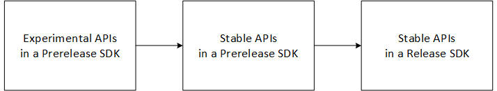

# About Release Notes for the WebView2 SDK

The WebView2 team updates the WebView2 Release SDK and the WebView2 Prerelease SDK on a four-week cadence.  These Release Notes contain the latest information on product announcements, additions, modifications, and breaking changes to the APIs.

You can view the list of [Microsoft.Web.WebView2](https://www.nuget.org/packages/Microsoft.Web.WebView2) SDK packages at the NuGet site.

Generally, release notes apply across the supported platforms, which are listed in [WebView2 API Reference](../webview2-api-reference.md).  For an outline of APIs that are in Release SDK packages, see [Overview of WebView2 features and APIs](../concepts/overview-features-apis.md).

Release Notes entries correspond to historical releases of WebView2, and are not updated over time.  References to "new features" and "experimental APIs" might become outdated as new versions of WebView2 are released.

<!-- ====================================================================== -->
## Phases of adding APIs

New APIs are added in phases, as follows:
1. APIs are initially introduced as Experimental APIs in a Prerelease SDK package.
1. Then they become Stable APIs in a Prerelease SDK package.
1. Soon after, they become Stable APIs in a Release SDK package.

<!-- .png is used by webview2/release-notes/about.md and webview2/concepts/versioning.md -->

See also:
* [Phases of introducing APIs](../concepts/versioning.md#phases-of-introducing-apis) in _Understand the different WebView2 SDK versions_.

<!-- terminology:
APIs are Experimental or Stable
SDKs/packages are Prerelease or Release
-->

<!-- ====================================================================== -->
## Updating the Runtime and SDK

WebView2 changes may require an update to the Runtime, SDK, or both.  Most new APIs require both Runtime and SDK updates.  Starting with the February 2023 release, the update requirement for each bug fix is indicated as follows:

| Indicator | Meaning |
|---|---|
| **Runtime and SDK**, or no indicator | Both the Runtime and the SDK need to be updated. |
| **Runtime-only** | Only the Runtime needs to be updated. |
| **SDK-only** | Only the SDK needs to be updated. |

WebView2 shares code and binaries with the Microsoft Edge browser, and is released around the same time.  As a result, WebView2 Runtime releases generally also include Microsoft Edge updates.

*  For Microsoft Edge updates, see [Release notes for Microsoft Edge Stable Channel](/deployedge/microsoft-edge-relnote-stable-channel) and [Release notes for Microsoft Edge Beta Channel](/deployedge/microsoft-edge-relnote-beta-channel).

*  To update the WebView2 Runtime on your development machine and on user machines, see [Distribute your app and the WebView2 Runtime](../concepts/distribution.md).  To view or get the latest WebView2 Runtime versions, see [Download the WebView2 Runtime](https://developer.microsoft.com/microsoft-edge/webview2/#download-section) in the _Microsoft Edge WebView2_ page at developer.microsoft.com.

*  To install or update the WebView2 SDK, see [Install or update the WebView2 SDK](../how-to/machine-setup.md#install-or-update-the-webview2-sdk) in _Set up your Dev environment for WebView2_.

<!-- ====================================================================== -->
## Recommended browser channel and Runtime

Make sure to re-compile your WebView2 app after updating the WebView2 SDK NuGet package.  The WebView2 team recommends the following:

* Use the Canary preview channel of Microsoft Edge when you develop using a Prerelease version of the WebView2 SDK package.  Canary is the recommended preview channel, because it ships at the fastest cadence and has the newest APIs.

* Use the Evergreen WebView2 Runtime when you use a release version of the WebView2 SDK package.

For more information, see [Matching the Runtime version with the SDK version](../concepts/versioning.md#matching-the-runtime-version-with-the-sdk-version).

<!-- ====================================================================== -->
## Minimum version of the browser or Runtime to load WebView2

To load WebView2, the minimum version of Microsoft Edge or the WebView2 Runtime is 86.0.616.0.  The minimum version to load WebView2 only changes when a breaking change occurs in the web platform.

To use a Prerelease SDK along with a Microsoft Edge preview channel, see [Test upcoming APIs and features](../how-to/set-preview-channel.md).

<!--
Cross-framework API conventions

Events:
No EventHandler or CompletedHandler in .NET or WinRT.
General event pattern:
- Win32: add/remove_XYZ + XYZEventHandler
- .NET/WinRT: XYZ event

Async methods:
- Win32: XYZ method + XYZCompletedHandler
- .NET/WinRT: XYZAsync
-->

<!-- ====================================================================== -->
## See also

* [Release Notes for the WebView2 SDK](./index.md)
* [Archived Release Notes for the WebView2 SDK](./archive.md)
* [Overview of WebView2 features and APIs](../concepts/overview-features-apis.md)
* [Contacting the Microsoft Edge WebView2 team](../contact.md)
