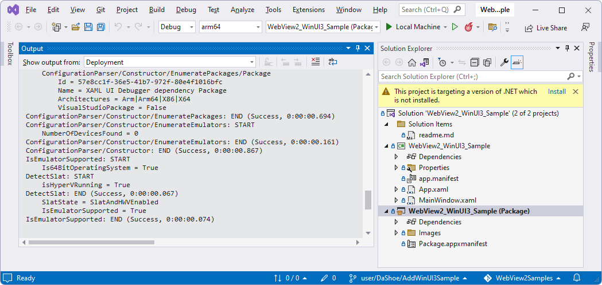
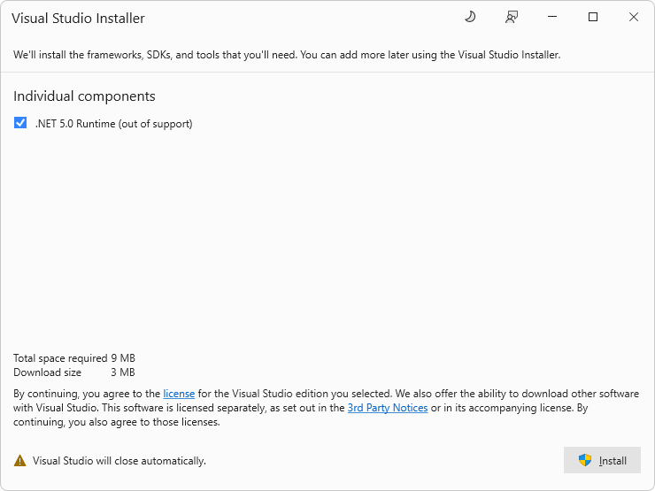
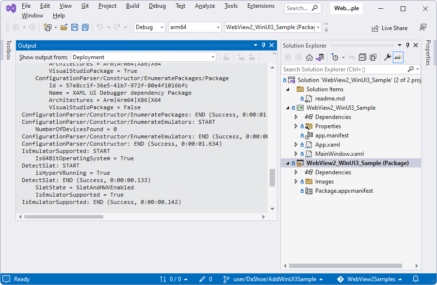

# WinUI 3 sample app

This sample demonstrates using a WebView2 control in a WinUI 3 Windows SDK Packaged application.

* Sample name: **WebView2_WinUI3_Sample**
* Repo folder: [WebView2_WinUI3_Sample](https://github.com/MicrosoftEdge/WebView2Samples/tree/main/SampleApps/WebView2_WinUI3_Sample)
* Solution file: `SampleApps/WebView2_WinUI3_Sample/WebView2_WinUI3_Sample.sln`

This sample also shows how to optionally update the application to ship packaged together with a fixed version of the WebView2 Runtime, instead of using the version of the WebView2 Runtime that's installed on the user's computer.

This sample was created using Visual Studio 2022.  To build and run this sample, see the [Readme](https://github.com/MicrosoftEdge/WebView2Samples/tree/main/SampleApps/WebView2_WinUI3_Sample#readme).

<!-- 1. In Visual Studio 2022, open the solution file.

   A message might appear: "This project is targeting a version of .NET which is not installed."

   

1. Click the **Install** link.  The **Visual Studio Installer** window opens:

   

1. Follow the prompts.  The .NET Runtime is installed.  Visual Studio opens and displays two projects:

    

1. Press **F5**.  A dialog might open, saying "There were deployment errors.  Continue?"  Click the **No** button.

1. Right-click the **WebView2_WinUI3_Sample** project, and then select **Debug > Start New Instance**. -->

<!-- ====================================================================== -->
## See also

* [WebView2 API Reference](../webview2-api-reference.md)
* [Get started with WebView2 in WinUI 3 (Windows App SDK) apps](../get-started/winui.md)
* [Call native-side WinRT code from web-side code](../how-to/winrt-from-js.md)
