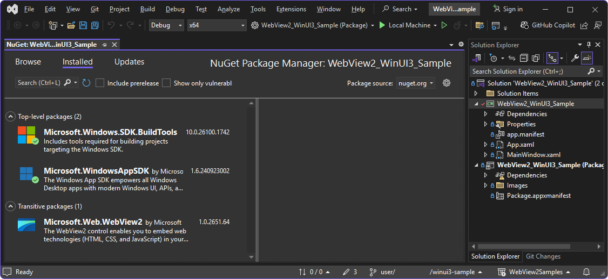

# WinUI 3 (Windows App SDK) sample app

*  Sample name: **WebView2_WinUI3_Sample**
*  Repo directory: [WebView2_WinUI3_Sample](https://github.com/MicrosoftEdge/WebView2Samples/tree/main/SampleApps/WebView2_WinUI3_Sample)
*  Solution file: `WebView2_WinUI3_Sample.sln`

This sample demonstrates using a WebView2 control in a WinUI 3 (Windows App SDK) Packaged application.

This sample also shows how to update an application to ship with a fixed WebView2 version, instead of using the version of WebView2 Runtime that's installed and running on the Windows computer.


<!-- ------------------------------ -->
#### NuGet packages and workload components

Before building, we'll do the following:
* Update the **Microsoft.Windows.SDK.BuildTools** NuGet package for the project and for the (Package) project.
* Update the **Microsoft.WindowsAppSDK** NuGet package for the project and for the (Package) project.
* Install the "Windows 10 SDK" component of the "Windows app development" workload, if not installed already.


<!-- ====================================================================== -->
## Directories

| Directory | Contents |
| --- | --- |
| WebView2_WinUI3_Sample | Project code |
| WebView2_WinUI3_Sample (Package) | Packaging and distribution project |
| WebView2_WinUI3_Sample (Package)\FixedRuntime | (Optional) Fixed WebView2 runtime |
| WebView2_WinUI3_Sample (Package)\FixedRuntime\95.0.1020.53 | (Optional) Fixed WebView2 runtime sample |


<!-- ====================================================================== -->
## Step 1: Install the latest Visual Studio 2022

Make sure that Visual Studio 2022 is installed and up-to-date.

To install the latest Visual Studio 2022:

1. Go to [Visual Studio: IDE and Code Editor for Software Developers and Teams](https://visualstudio.microsoft.com), and then in the **Visual Studio 2022** section, click the **Download** button, and then select **Community 2022** or another version.

1. In the **Downloads** popup in the upper right of Microsoft Edge, `VisualStudioSetup.exe` is listed.  Click **Open file**.

   Visual Studio Installer opens.

1. Follow the prompts, and accept the defaults.


<!-- ====================================================================== -->
## Step 2: Clone or download the WebView2Samples repo

1. If not done already, clone or download the `WebView2Samples` repo to your local drive.  In a separate window or tab, see [Download the WebView2Samples repo](../how-to/machine-setup.md#download-the-webview2samples-repo) in _Set up your Dev environment for WebView2_.  Follow the steps in that section, and then return to this page and continue below.


<!-- ====================================================================== -->
## Step 3: Open the solution in Visual Studio

These initial steps about the repo and branch aren't required, but they're a good practice, to avoid changing the code that's in the "main" branch of your cloned copy of the WebView2Samples repo.  This enables you to alter the files of the project (in order to build and run the sample), while keeping the code that's in the "main" branch identical to the repo.

You can do these steps in any tool for git operations, such as:
   * GitHub Desktop.
   * The **Git Changes** tab next to the **Solution Explorer** tab, in the lower right of Visual Studio.
   * The git bash command prompt.


To open the sample's solution file in a working branch:

1. In GitHub Desktop, in the **Current repository** list in the upper left, select the **WebView2Samples** repo.

1. Click **Fetch origin** in the upper middle of the window.

1. In the **Current branch** menu, create a working branch such as **user/myGithubUsername/winui3-sample** and switch to it.

   You're now safely in a working branch rather than the "main" branch, and are free to start altering the sample's files.

1. On your local drive, open the `.sln` file in Visual Studio.  Example directories:

   `<your-repos-directory>/WebView2Samples/SampleApps/WebView2_WinUI3_Sample/WebView2_WinUI3_Sample.sln`
   `<your-repos-directory>/WebView2Samples-main/SampleApps/webview2_sample_uwp/webview2_sample_uwp.sln`


<!-- ====================================================================== -->
## Step 4: Update the NuGet packages

1. In Solution Explorer, right-click the **WebView2_WinUI3_Sample** project, and then select **Manage NuGet Packages**.

   In Visual Studio, the **NuGet Package Manager** opens:

   

   The **Installed** tab is selected, listing the NuGet packages:
   * **Microsoft.Windows.SDK.BuildTools**
   * **Microsoft.WindowsAppSDK**
   * **Microsoft.Web.WebView2**

1. Select the **Updates** tab.

1. In the upper left, select the **Select all packages** checkbox.

1. To the right of that checkbox, click the **Update** button.

   The **Preview Changes** dialog opens.

1. Click the **Apply** button.

   The **License Acceptance** dialog opens.

1. Click the **I Accept** button.

   The NuGet packages are updated, and the number next to the **Updates** tab is removed.

1. Click the **View** menu, and then click the **Output** menuitem.

   In the **Output** tab, in the **Show output from** dropdown list, **Package Manager** is selected.  The output includes lines such as:

   ```
   Installing NuGet package Microsoft.Windows.SDK.BuildTools
   Installing NuGet package Microsoft.WindowsAppSDK

   Successfully uninstalled 'Microsoft.Windows.SDK.BuildTools
   Successfully uninstalled 'Microsoft.WindowsAppSDK

   Successfully installed 'Microsoft.Web.WebView2
   Successfully installed 'Microsoft.Windows.SDK.BuildTools
   Successfully installed 'Microsoft.WindowsAppSDK
   ```

   **Update NuGet packages in the (Package) project**

1. In Solution Explorer, right-click the **WebView2_WinUI3_Sample (Package)** project, and then select **Manage NuGet Packages**.

1. Select the **Updates** tab.

1. In the upper left, select the **Select all packages** checkbox.

1. To the right of that checkbox, click the **Update** button.

   The **Preview Changes** dialog opens.

1. Click the **Apply** button.

   The **License Acceptance** dialog opens.

1. Click the **I Accept** button.

   The NuGet packages are updated, and the number next to the **Updates** tab is removed.

1. Click the **View** menu, and then click the **Output** menuitem.

   In the **Output** tab, in the **Show output from** dropdown list, **Package Manager** is selected.  The output includes lines like shown above.

1. Close the **NuGet Package Manager** window.


<!-- ====================================================================== -->
## Step 5: Install the Windows 10 SDK or other workload components

Depending what what you have installed, you might need to install a Visual Studio workload, or component of a workload, such as the following, to build the sample.

To install the **Windows 10 SDK** component of the **Windows application development** workload:

1. In Visual Studio, click the **Tools** menu, and then click the **Get Tools and Features** menuitem.

   The **Visual Studio Installer** window opens.

1. Select the **Windows application development** card, so that a checkmark appears.

1. In the **Installation details** tree on the right, select the **Windows 10 SDK 10.0.19041.0** component's checkbox.

1. Click the **Modify** button.

   The **User Account Control** dialog opens.

1. Click the **Yes** button.

   The **Before we get started** dialog (of the **Visual Studio Installer**) opens, prompting to save your work in Visual Studio.

1. Close the main Visual Studio window, saving if needed.

1. In the **Before we get started** dialog, click the **Retry** button.

   After a few minutes, the **Windows 10 SDK 10.0.19041.0** workload component is downloaded and installed.  **Visual Studio Installer** says "All installations are up to date."


<!-- ====================================================================== -->
## Step 6: Build the solution

1. Open the solution in Visual Studio 2022.  For example, in **Visual Studio Installer**, in the **Visual Studio 2022** section, click the **Launch** button.

   The Visual Studio launcher opens, with sections **Open recent** and **Get started**.

1. In the **Open recent** section, select **WebView2_WinUI3_Sample.sln**.

   The solution opens in Visual Studio 2022.

1. Press **F5**.

   In Solution Explorer, the **(Package)** project is bold, indicating that it's the default project.  The app builds, and then the **WebView2_WinUI3_Sample (Package)** app window opens:

   

   The message "Navigation complete" is displayed at the bottom.
 
1. In the Address bar (a text box), enter `https://bing.com` (a complete HTTPS URL), and then press **Enter** (equivalent to clicking the **Go** button).

   The WebView2 control navigates to Bing and then displays "Navigation complete" at the bottom.

   In Visual Studio, the **Output** window displays messages such as:

   ```
   AddressBar_KeyDown [Enter]: https://bing.com
   TryNavigate
   TryCreateUri
   Navigation complete
   ```


<!-- ====================================================================== -->
## Step 7: Commit changes in your working branch

In a git tool such as GitHub Desktop, at this point, you can commit changes, and optionally push them to a fork of your branch at GitHub.  These types of operations are relevant when you modify, experiment with, and customize the sample.  This also keeps your working branch clean and keep your clone of the repo organized, so that you can switch to a different sample.

To commit and push changes that were made to the sample in your working branch:

1. In Visual Studio, select **File** > **Save All** (Ctrl+Shift+S).

1. In GitHub Desktop, enter a brief commit message, such as "updated, built, ran sample", and then click the **Commit** button.

1. Select **Repository** > **Push**.  Your working branch is copied from your local drive to your forked branch of the WebView2Samples repo at GitHub.

   **View your working branch at GitHub**

1. In Microsoft Edge, go to your fork of the repo, such as `https://github.com/myGithubUsername/WebView2Samples/`.

1. Click the **[#] Branches** link, and then select your new working branch, such as `user/myGithubUsername/winui3-sample`.


<!-- ====================================================================== -->
## Step 8: Inspect the code

1. Close the **WebView2_WinUI3_Sample (Package)** app.

1. In Solution Explorer, in the **WebView2_WinUI3_Sample** project, double-click each `.xaml` file and its `.cs` file:
   * `App.xaml` - No WebView2 code.
      * `App.cs` - Code to use a fixed-version WebView2 Runtime.
   * `MainWindow.xaml` - WebView2 elements.
      * `MainWindow.cs` - WebView2 code.

Condensed versions of these files are below.


<!-- ------------------------------ -->
#### App.xaml

There's no WebView2-specific code in this file.


<!-- ---------- -->
###### Condensed listing

```xaml
<Application
    x:Class="WebView2_WinUI3_Sample.App"
    xmlns="http://schemas.microsoft.com/winfx/2006/xaml/presentation"
    xmlns:x="http://schemas.microsoft.com/winfx/2006/xaml"
    xmlns:local="using:WebView2_WinUI3_Sample">
    <Application.Resources>
        <ResourceDictionary>
            <ResourceDictionary.MergedDictionaries>
                <XamlControlsResources xmlns="using:Microsoft.UI.Xaml.Controls" />
            </ResourceDictionary.MergedDictionaries>
        </ResourceDictionary>
    </Application.Resources>
</Application>
```


<!-- ------------------------------ -->
#### App.cs

<!-- todo: create PR in Samples repo to improve comment block like below -->

There's no WebView2-specific code in this file.  This file contains a comment about fixed-version; see [Using a fixed-version WebView2 Runtime](#using-a-fixed-version-webview2-runtime), below.


<!-- ---------- -->
###### Condensed listing

```csharp
namespace WebView2_WinUI3_Sample
{
    /// <summary>
    /// Provides application-specific behavior to supplement the default Application class.
    /// </summary>
    public partial class App : Application
    {
        /// <summary>
        /// Initializes the singleton application object.  Equivalent to main() or WinMain().
        /// </summary>
        public App()
        {
            this.InitializeComponent();
            // If you're shipping a fixed-version WebView2 Runtime with your app,
            // un-comment the following code and change the version number to the
            // version number of the WebView2 Runtime that you're packaging and
            // shipping to users:
            // StorageFolder localFolder = Windows.ApplicationModel.Package.Current.InstalledLocation;
            // String fixedPath = Path.Combine(localFolder.Path, "FixedRuntime\\95.0.1020.53");
            // Debug.WriteLine($"Launch path [{localFolder.Path}]");
            // Debug.WriteLine($"FixedRuntime path [{fixedPath}]");
            // Environment.SetEnvironmentVariable("WEBVIEW2_BROWSER_EXECUTABLE_FOLDER", fixedPath);
        }

        /// <summary>
        /// Invoked when the application is launched normally by the end user.
        /// </summary>
        /// <param name="args">Details about the launch request and process.</param>
        protected override void OnLaunched(Microsoft.UI.Xaml.LaunchActivatedEventArgs args)
        {
            m_window = new MainWindow();
            m_window.Activate();
        }

        private Window m_window;
    }
}
```


<!-- ------------------------------ -->
#### MainWindow.xaml


<!-- ---------- -->
###### XML elements

| Element | Control |
|---|---|
| `<TextBox>` | Address bar |
| `<Button>` | **Go** button |
| `<WebView2>` | WebView2 control |
| `<TextBlock>` | Status bar |


<!-- ---------- -->
###### Condensed listing

```xaml
<Window
    xmlns:local="using:WebView2_WinUI3_Sample">
    <Grid>
        <Grid.RowDefinitions>
        </Grid.RowDefinitions>
        <Grid Grid.Row="0" Background="LightGray">
            <TextBox Grid.Column="0"  x:Name="AddressBar" KeyDown="AddressBar_KeyDown" VerticalAlignment="Center" Margin="10,0,0,0"/>
            <Button Grid.Column="1" x:Name="Go" Content="Go" Click="Go_OnClick" VerticalAlignment="Center" HorizontalAlignment="Center"/>
        </Grid>

        <WebView2 x:Name="WebView2" Grid.Row="1"/>

        <Rectangle Grid.Row="2" Fill="LightGray"/>
        <TextBlock x:Name="StatusBar" Text="WebView2" VerticalAlignment="Center" Grid.Row="2" Margin="10,0,10,0"/>
    </Grid>
</Window>
```

<!-- ------------------------------ -->
#### MainWindow.cs


<!-- ---------- -->
###### Methods

* `WebView2_WinUI3_Sample` namespace
   * `MainWindow` class
      * `StatusUpdate(message)`
      * `WebView2_CoreWebView2Initialized(InitializedEventArgs)`
      * `WebView2_NavigationCompleted(NavigationCompletedEventArgs)`
      * `TryCreateUri(potentialUri, out uri)`
      * `TryNavigate()`
      * `Go_OnClick(sender, RoutedEventArgs)`
      * `AddressBar_KeyDown(sender, KeyRoutedEventArgs)`
      * `SetTitle()`
      * `GetWebView2Version()`


<!-- ---------- -->
###### Condensed listing
<!-- todo: trim listing -->

```csharp
using Microsoft.Web.WebView2.Core;

namespace WebView2_WinUI3_Sample
{
    /// <summary>
    /// An empty window that can be used on its own or navigated to within a Frame.
    /// </summary>
    public sealed partial class MainWindow : Window
    {
        public MainWindow()
        {
            this.InitializeComponent();

            Closed += (obj, eventArgs) =>
            {
                if (WebView2 != null)
                {
                    // Ensure that WebView2 resources are released when
                    // the MainWindow is closed. 
                    // WebView2 lifecycle in WinUI3 and the Close() method:
                    // https://github.com/microsoft/microsoft-ui-xaml/issues/4752#issuecomment-819687363
                    WebView2.Close();
                }
            };

            AddressBar.Text = "https://developer.microsoft.com/en-us/microsoft-edge/webview2/";

            WebView2.NavigationCompleted += WebView2_NavigationCompleted;
            WebView2.CoreWebView2Initialized += WebView2_CoreWebView2Initialized;

            WebView2.Source = new Uri(AddressBar.Text);
            StatusUpdate("Ready");
            SetTitle();
        }

        private void StatusUpdate(string message)
        {
            StatusBar.Text = message;
            Debug.WriteLine(message);
        }

        private void WebView2_CoreWebView2Initialized(WebView2 sender, CoreWebView2InitializedEventArgs args)
        {
            if (args.Exception != null)
            {
                StatusUpdate($"Error initializing WebView2: {args.Exception.Message}");
            }
            else
            {
                SetTitle(sender);
            }
        }

        private void WebView2_NavigationCompleted(WebView2 sender, CoreWebView2NavigationCompletedEventArgs args)
        {
            StatusUpdate("Navigation complete");

            // Update the address bar with the full URL that was navigated to.
            AddressBar.Text = sender.Source.ToString();
        }

        private bool TryCreateUri(String potentialUri, out Uri result)
        {
            StatusUpdate("TryCreateUri");

            Uri uri;
            if ((Uri.TryCreate(potentialUri, UriKind.Absolute, out uri) || Uri.TryCreate("http://" + potentialUri, UriKind.Absolute, out uri)) &&
                (uri.Scheme == Uri.UriSchemeHttp || uri.Scheme == Uri.UriSchemeHttps))
            {
                result = uri;
                return true;
            }
            else
            {
                StatusUpdate("Unable to configure URI");
                result = null;
                return false;
            }
        }

        private void TryNavigate()
        {
            StatusUpdate("TryNavigate");

            Uri destinationUri;
            if (TryCreateUri(AddressBar.Text, out destinationUri))
            {
                WebView2.Source = destinationUri;
            }
            else
            {
                StatusUpdate("URI couldn't be figured out use it as a bing search term");

                String bingString = $"https://www.bing.com/search?q={Uri.EscapeDataString(AddressBar.Text)}";
                if (TryCreateUri(bingString, out destinationUri))
                {
                    AddressBar.Text = destinationUri.AbsoluteUri;
                    WebView2.Source = destinationUri;
                }
                else
                {
                    StatusUpdate("URI couldn't be configured as bing search term, giving up");
                }
            }
        }

        private void Go_OnClick(object sender, RoutedEventArgs e)
        {
            StatusUpdate("Go_OnClick: " + AddressBar.Text);

            TryNavigate();
        }

        private void AddressBar_KeyDown(object sender, KeyRoutedEventArgs e)
        {
            if (e.Key == Windows.System.VirtualKey.Enter)
            {
                StatusUpdate("AddressBar_KeyDown [Enter]: " + AddressBar.Text);

                e.Handled = true;
                TryNavigate();
            }
        }

        private void SetTitle(WebView2 webView2 = null)
        {
            var packageDisplayName = Windows.ApplicationModel.Package.Current.DisplayName;
            var webView2Version = (webView2 != null) ? " - " + GetWebView2Version(webView2) : string.Empty;
            Title = $"{packageDisplayName}{webView2Version}";
        }

        private string GetWebView2Version(WebView2 webView2)
        {
            var runtimeVersion = webView2.CoreWebView2.Environment.BrowserVersionString;

            CoreWebView2EnvironmentOptions options = new CoreWebView2EnvironmentOptions();
            var targetVersionMajorAndRest = options.TargetCompatibleBrowserVersion;
            var versionList = targetVersionMajorAndRest.Split('.');
            if (versionList.Length != 4)
            {
                return "Invalid SDK build version";
            }
            var sdkVersion = versionList[2] + "." + versionList[3];

            return $"{runtimeVersion}; {sdkVersion}";
        }
    }
}
```


<!-- ====================================================================== -->
## Using a fixed-version WebView2 Runtime

If you want to ship a fixed version of the WebView2 runtime with your application you will need to include it in your project.  See [Distribute your app and the WebView2 Runtime](../concepts/distribution.md).

The following steps show Runtime version number `95.0.1020.53`; you'll change this number to whatever version you are packaging and shipping.


To use a fixed-version Runtime:

1. Include the fixed WebView2 runtime in the package project:

   ```
   \WebView2_WinUI3_Sample\WebView2_WinUI3_Sample (Package)\FixedRuntime\95.0.1020.53\
   ```

   Above, use the version that you're shipping, instead of `95.0.1020.53`.

1. Update the package project `wapproj` file for the version you're using (use your version instead of `95.0.1020.53`):

   ```
   < Content Include="FixedRuntime\95.0.1020.53\\**\*.*" >
   ```

1. In `App.xaml.cs`, uncomment the five commented-out lines of code below the comment, to enable the Runtime override:

   ```
   public App()
   {
      this.InitializeComponent();
      // If you're shipping a fixed-version WebView2 Runtime with your app,
      // un-comment the following code and change the version number to the
      // version number of the WebView2 Runtime that you're packaging and
      // shipping to users:
      // StorageFolder localFolder = Windows.ApplicationModel.Package.Current.InstalledLocation;
      // String fixedPath = Path.Combine(localFolder.Path, "FixedRuntime\\95.0.1020.53");
      // Debug.WriteLine($"Launch path [{localFolder.Path}]");
      // Debug.WriteLine($"FixedRuntime path [{fixedPath}]");
      // Environment.SetEnvironmentVariable("WEBVIEW2_BROWSER_EXECUTABLE_FOLDER", fixedPath);
       }
   ```

1. In the above code, change the version number from `95.0.1020.53` to the version that you're shipping.


<!-- ====================================================================== -->
## See also

* [Distribute your app and the WebView2 Runtime](../concepts/distribution.md)
* [Get started with WebView2 in WinUI 3 (Windows App SDK) apps](../get-started/winui.md)
