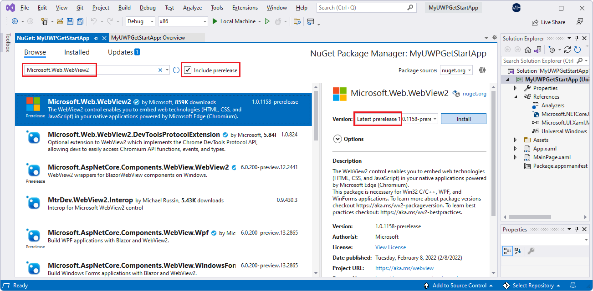
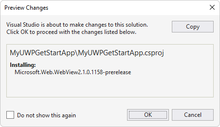
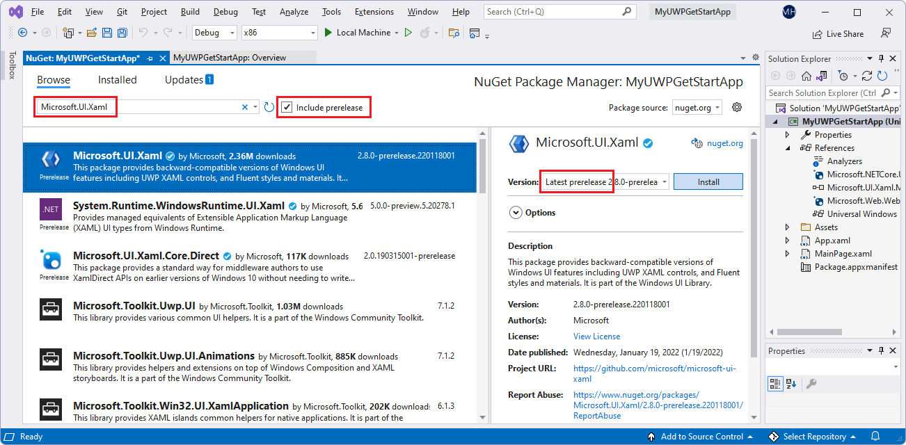
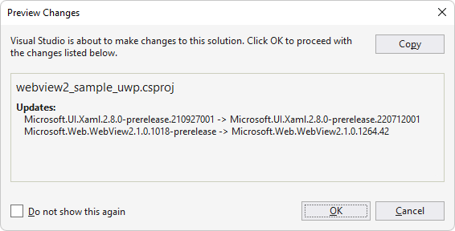
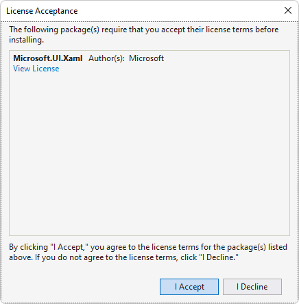
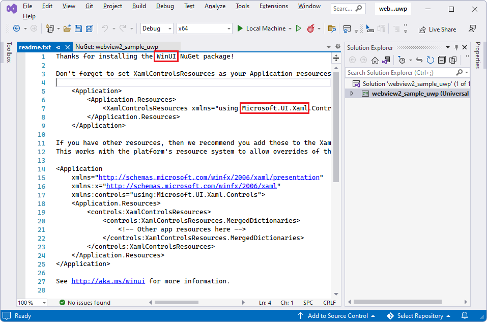
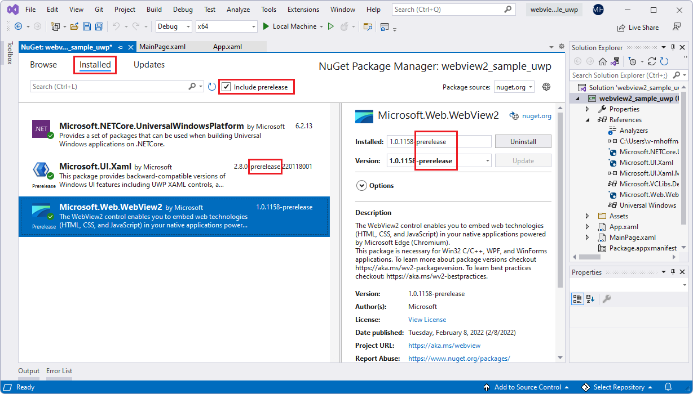
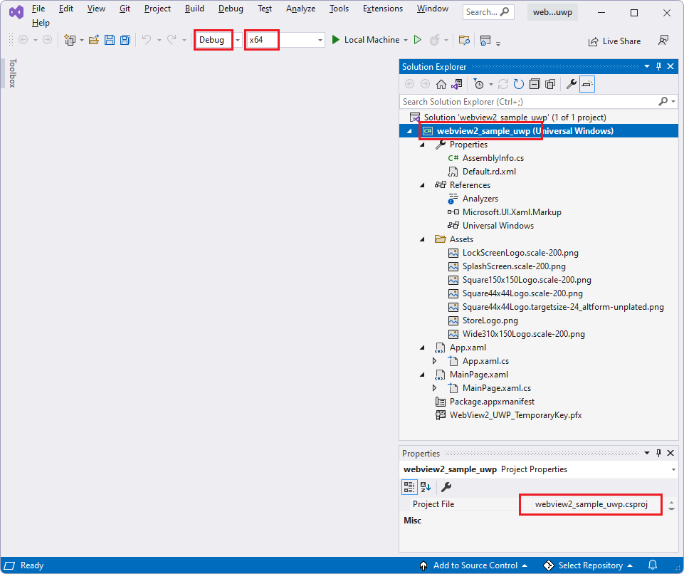

# WinUI 2 (UWP) sample app

This WebView2 sample demonstrates how to use the WebView2 control and WebView2 APIs to implement a web browser in a WinUI 2 (UWP) app.

Directory &amp; .sln: **webview2_sample_uwp/webview2_sample_uwp.sln**.

<!-- ====================================================================== -->
## Step 1 - View the Readme

The steps on the present page are general-purpose.  See the sample-specific steps in the README sections, which may override the present page.

1. In a separate window or tab, read the rendered README.md file for this project at GitHub: [README file for webview2_sample_uwp](https://github.com/MicrosoftEdge/WebView2Samples/tree/main/SampleApps/webview2_sample_uwp#readme).  Then return to this page and continue the steps below.

   * [README > Prerequisites](https://github.com/MicrosoftEdge/WebView2Samples/tree/main/SampleApps/webview2_sample_uwp#prerequisites)

   * [README > Build the WebView2 UWP WinUi2 browser](https://github.com/MicrosoftEdge/WebView2Samples/tree/main/SampleApps/webview2_sample_uwp#build-the-webview2-uwp-winui2-browser)

   You can also view the README.md source file (non-rendered) in Visual Studio.  In **File Manager** or Visual Studio > Solution Explorer, open the file:<!-- todo: is there a .md preview capability locally? -->

   `<your-repos-directory>/WebView2Samples/SampleApps/webview2_sample_uwp/README.md`

   or:

   `<your-repos-directory>/WebView2Samples-main/SampleApps/webview2_sample_uwp/README.md`

<!-- ====================================================================== -->
## Step 2 - Install Visual Studio

Microsoft Visual Studio is required.  Microsoft Visual Studio Code is not supported for this sample.

1. If Visual Studio (minimum required version) is not already installed, in a separate window or tab, see [Install Visual Studio](../how-to/machine-setup.md#install-visual-studio) in _Set up your Dev environment for WebView2_.  Follow the steps in that section, and then return to this page and continue the steps below.

<!-- ====================================================================== -->
## Step 3 - Install a preview channel of Microsoft Edge

1. If a preview channel of Microsoft Edge (Beta, Dev, or Canary) is not already installed, in a separate window or tab, see [Install a preview channel of Microsoft Edge](../how-to/machine-setup.md#install-a-preview-channel-of-microsoft-edge) in _Set up your Dev environment for WebView2_.  Follow the steps in that section, and then return to this page and continue the steps below.

<!-- ====================================================================== -->
## Step 4 - Download or clone the WebView2Samples repo

1. If not done already, download or clone the `WebView2Sample` repo to your local drive.  In a separate window or tab, see [Download the WebView2Samples repo](../how-to/machine-setup.md#download-the-webview2samples-repo) in _Set up your Dev environment for WebView2_.  Follow the steps in that section, and then return to this page and continue below.

<!-- ====================================================================== -->
## Step 5 - Open .sln in Visual Studio

1. On your local drive, open the `.sln` file in Visual Studio, in the directory:

   *  `<your-repos-directory>/WebView2Samples/SampleApps/webview2_sample_uwp/webview2_sample_uwp.sln`

   or:

   *  `<your-repos-directory>/WebView2Samples-main/SampleApps/webview2_sample_uwp/webview2_sample_uwp.sln`

<!-- ====================================================================== -->
## Step 6 - Install workloads if prompted

1. If prompted, install any Visual Studio workloads that are requested.  In a separate window or tab, see [Install Visual Studio workloads](../how-to/machine-setup.md#install-visual-studio-workloads) in _Set up your Dev environment for WebView2_.  Follow the steps in that section, and then return to this page and continue below.

<!-- ====================================================================== -->
## Step 7 - View the opened project

Solution Explorer shows the **webview2_sample_uwp** project:

_To zoom, right-click > **Open image in new tab**._

Now that the project is open, install or update NuGet packages for the project.

<!-- ====================================================================== -->
## Step 8 - Install or update the prerelease WebView2 SDK

Install or update the _prerelease_ WebView2 SDK for the project, as follows:

1. In Solution Explorer, right-click the project (not the solution node above it), and then select **Manage NuGet Packages**.

   The **NuGet Package Manager** panel opens in Visual Studio.

1. In the **NuGet Package Manager**, click the **Browse** tab.

1. To the right of the search text box, select the **Include prerelease** check box.

1. In the search text box, enter **Microsoft.Web.WebView2**.

   The **Microsoft.Web.WebView2** card appears in the search results.

1. Click the **Microsoft.Web.WebView2** card below the search box.

1. On the right, in the **Version** dropdown list, make sure **Latest prerelease** is selected:

   

   _The above image is from another project, but is similar._

1. Click the **Install** (or **Update**) button.

   The **Preview Changes** dialog box appears:

   

   _The above image is from another project, but is similar._

1. Click the **OK** button.

The WebView2 SDK is now installed for this project.

<!-- ====================================================================== -->
## Step 9 - Install or update the prerelease Microsoft.UI.Xaml package (WinUI 2 SDK)

Next, install or update the _prerelease_ **Microsoft.UI.Xaml** package.  Microsoft.UI.Xaml is WinUI 2, as follows:

1. If the **NuGet Package Manager** panel isn't open: in Solution Explorer, right-click the project (not the solution node above it), and then select **Manage NuGet Packages**.

   The **NuGet Package Manager** panel opens in Visual Studio.

1. In the **NuGet Package Manager**, click the **Browse** tab.

1. Select the **Include prerelease** check box.

1. In the **Search** box, enter **Microsoft.UI.Xaml**, and then select the **Microsoft.UI.Xaml** card below the search box.

1. On the right, make sure that the **Version** is **Latest prerelease**.

1. Click the  **Install** (or **Update**) button:

   

   _Image borrowed from another project.  To zoom, right-click > **Open image in new tab**._

   The **Preview Changes** dialog box appears:

   

   _Image borrowed from another project._

1. Click the **OK** button.

1. The **License Acceptance** dialog box appears:

   

1. Click the **I Accept** button.  In Visual Studio, the `readme.txt` file is displayed, saying that you've installed the WinUI package:

   

   _Image borrowed from another project._

   The readme lists some lines of code that are similar to what we'll add.

1. Select **File** > **Save All**.

   You've now installed the Microsoft.UI.Xaml package, which is WinUI (WinUI 2), for your project.  Check the resulting installed packages, as follows:

1. In NuGet Package Manager, click the **Installed** tab, and make sure the three packages are listed:

   *  **Microsoft.NETCore.UniversalWindowsPlatform**
   *  **Microsoft.UI.Xaml - Prerelease**
   *  **Microsoft.Web.WebView2 - Prerelease**

   

   _To zoom, right-click > **Open image in new tab**._

1. Close the **NuGet Package Manager** window.

<!-- ====================================================================== -->
## Step 10 - Build the project

At the top of Visual Studio, set the build target, as follows:

1. In the **Solution Configurations** dropdown list, select **Debug** or **Release**.

1. In the **Solution Platforms** dropdown list, select **Any CPU** (or a specific platform if **Any CPU** isn't listed).<!--Any CPU is not available.-->

   

1. In **Solution Explorer**, right-click the **webview2_sample_uwp** project, and then select **Build**.

   This builds the project file `webview2_sample_uwp.csproj` (per **Build** > **Rebuild Solution** > **Output**), or `WebView2_UWP.csproj` (per Readme.md).

<!-- ====================================================================== -->
## Step 11 - Run (debug) the project

1. Select **Debug** > **Start Debugging** (`F5`).

   An empty grid window initially appears:

   

   The sample app window then displays webpage content:

   

1. Use the sample app; see [README file for webview2_sample_uwp](https://github.com/MicrosoftEdge/WebView2Samples/tree/main/SampleApps/webview2_sample_uwp#readme).

1. In Visual Studio, select **Debug** > **Stop Debugging**.  Visual Studio closes the app.

<!-- ====================================================================== -->
## Step 12 - Inspect the code

1. In the Visual Studio code editor, inspect the code:

   

   _To zoom, right-click > **Open image in new tab**._

<!-- ====================================================================== -->
## See also

* [Get started with WebView2 in WinUI 2 (UWP) apps (public preview)](../get-started/winui2.md)
