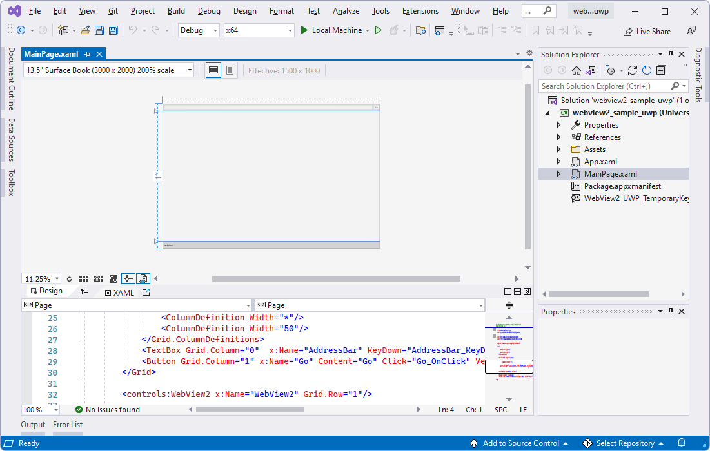
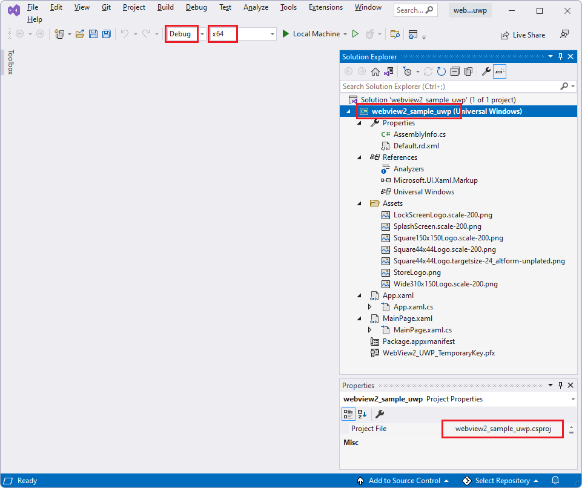
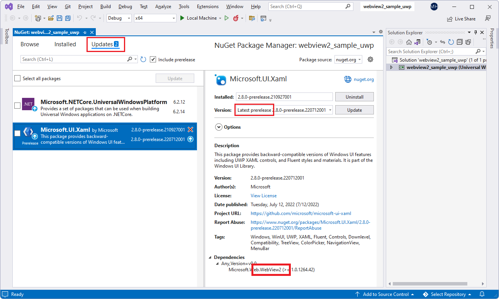
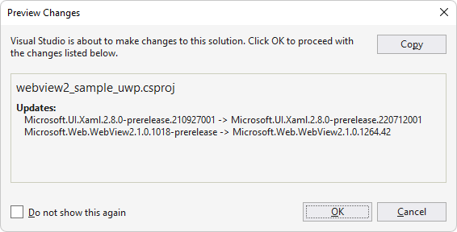
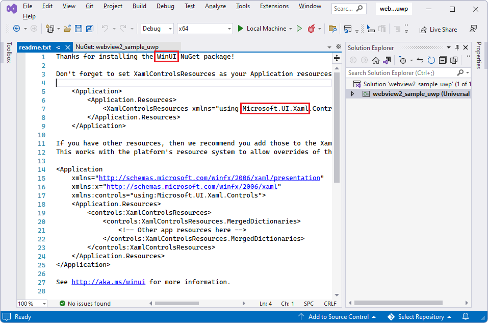
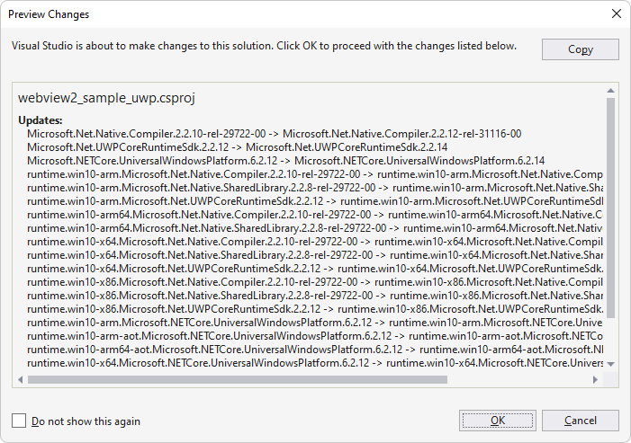
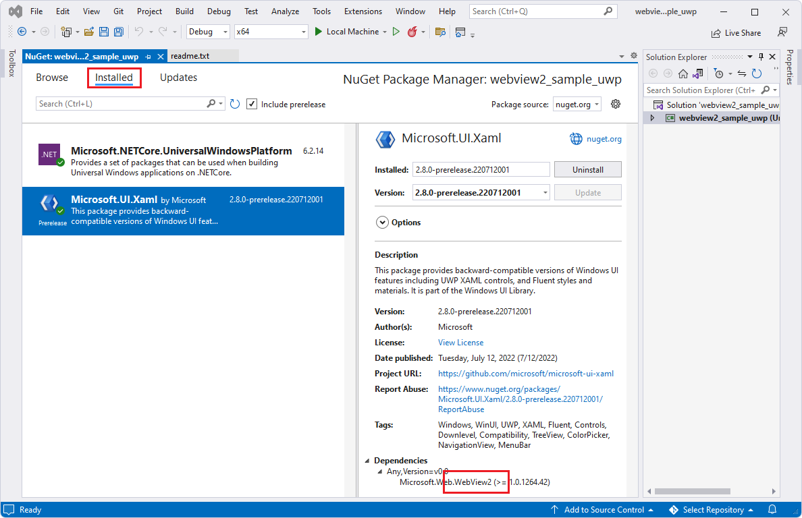
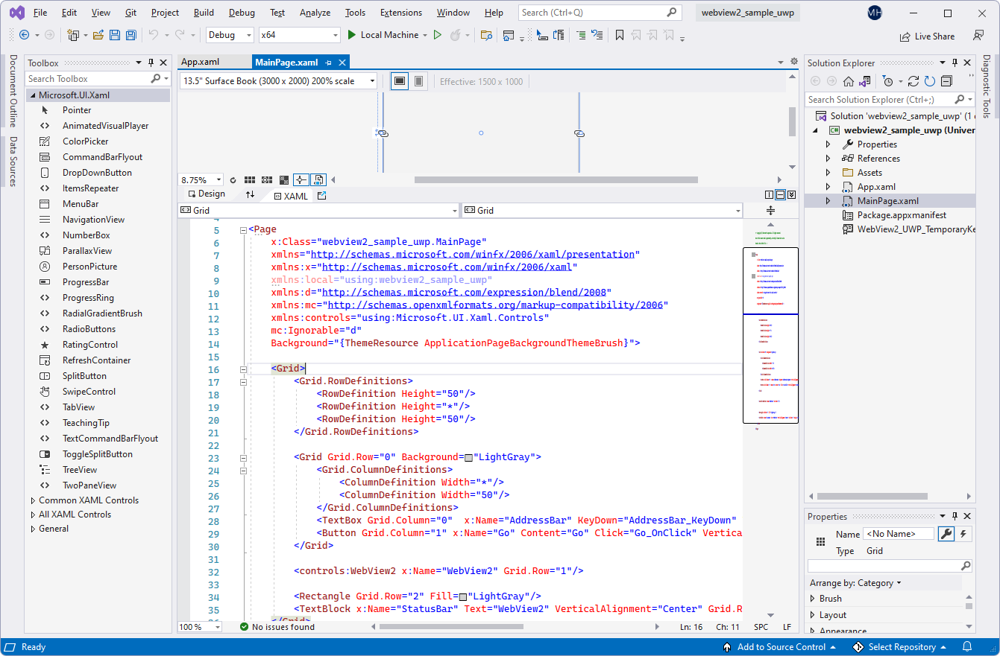

# WinUI 2 (UWP) sample app

This WebView2 sample demonstrates how to use the WebView2 control and WebView2 APIs to implement a web browser in a WinUI 2 (UWP) app.

*  Sample name: **webview2_sample_uwp**
*  Repo directory: [webview2_sample_uwp](https://github.com/MicrosoftEdge/WebView2Samples/tree/main/SampleApps/webview2_sample_uwp)
*  Solution file: **webview2_sample_uwp.sln**

#### Installed NuGet packages

This sample includes the following NuGet packages:

*  **Microsoft.NETCore.UniversalWindowsPlatform**
*  **Microsoft.UI.Xaml - Prerelease** - includes Microsoft.Web.WebView2 SDK as a dependency.

To demonstrate the latest features, this sample in the WebView2Samples repo is set up to use a prerelease version of the WinUI 2 SDK (listed as **Microsoft.UI.Xaml** in NuGet Package Manager), rather than a Stable version.  The WinUI 2 SDK includes a compatible version of the WebView2 SDK, as a dependency of **Microsoft.UI.Xaml**.
<!-- After you update the packages, the resulting WebView2 SDK might be a stable or prerelease SDK.  Per screenshots below; appears to have switched from prerelease (per repo) to stable (after local update) -->

See also [README file for webview2_sample_uwp](https://github.com/MicrosoftEdge/WebView2Samples/tree/main/SampleApps/webview2_sample_uwp#readme).

<!-- ====================================================================== -->
## Step 1 - Install Visual Studio

Microsoft Visual Studio is required.  Microsoft Visual Studio Code is not supported for this sample.

1. If Visual Studio (minimum required version) is not already installed, in a separate window or tab, see [Install Visual Studio](../how-to/machine-setup.md#install-visual-studio) in _Set up your Dev environment for WebView2_.  Follow the steps in that section, and then return to this page and continue the steps below.

<!-- ====================================================================== -->
## Step 2 - Install a preview channel of Microsoft Edge

1. If a preview channel of Microsoft Edge (Beta, Dev, or Canary) is not already installed, in a separate window or tab, see [Install a preview channel of Microsoft Edge](../how-to/machine-setup.md#install-a-preview-channel-of-microsoft-edge) in _Set up your Dev environment for WebView2_.  Follow the steps in that section, and then return to this page and continue the steps below.

<!-- ====================================================================== -->
## Step 3 - Clone or download the WebView2Samples repo

1. If not done already, clone or download the `WebView2Sample` repo to your local drive.  In a separate window or tab, see [Download the WebView2Samples repo](../how-to/machine-setup.md#download-the-webview2samples-repo) in _Set up your Dev environment for WebView2_.  Follow the steps in that section, and then return to this page and continue below.

<!-- ====================================================================== -->
## Step 4 - Open the solution in Visual Studio

1. On your local drive, open the `.sln` file in Visual Studio, in the directory:

   *  `<your-repos-directory>/WebView2Samples/SampleApps/webview2_sample_uwp/webview2_sample_uwp.sln`

   or:

   *  `<your-repos-directory>/WebView2Samples-main/SampleApps/webview2_sample_uwp/webview2_sample_uwp.sln`

<!-- ====================================================================== -->
## Step 5 - Install workloads if prompted

1. If prompted, install any Visual Studio workloads that are requested.  In a separate window or tab, see [Install Visual Studio workloads](../how-to/machine-setup.md#install-visual-studio-workloads) in _Set up your Dev environment for WebView2_.  Follow the steps in that section, and then return to this page and continue below.

<!-- ====================================================================== -->
## Step 6 - Build and run the project using pre-installed packages

Solution Explorer shows the **webview2_sample_uwp** project:

Build and run the project, using the versions of the NuGet packages that were installed in the sample from the repo:

1. In the **Solution Configurations** dropdown list, select a configuration, such as **Debug**.

1. In the **Solution Platforms** dropdown list, select a platform, such as **x64**.

   

1. In **Solution Explorer**, right-click the **webview2_sample_uwp** project, and then select **Build**.

   The project builds.

1. Select **Debug** > **Start Debugging** (**F5**).

   An empty grid window initially appears for a moment:

   

   The sample app window then displays webpage content:

   

1. In Visual Studio, select **Debug** > **Stop Debugging**.  Visual Studio closes the app.

Next, update the NuGet packages for the project, per the following sections.

<!-- ====================================================================== -->
## Step 7 - Update the NuGet packages

In this step, we'll update the project's NuGet packages, to get the latest prerelease version of the WinUI 2 SDK.  The WinUI 2 SDK includes a compatible prerelease or release version of the WebView2 SDK.

Update the project's NuGet packages:

1. In Visual Studio, in Solution Explorer, right-click the **webview2_sample_uwp** project (not the solution node above it), and then select **Manage NuGet Packages**.

   The **NuGet Package Manager** panel opens in Visual Studio.

1. In the **NuGet Package Manager**, click the **Installed** tab.

1. Select the **Include prerelease** check box.

   A pre-release version of the **Microsoft.UI.Xaml** package is listed, indicating the WinUI 2 SDK.  The **Microsoft.UI.Xaml** package includes the WebView2 SDK; **Microsoft.Web.WebView2** is listed in the **Dependencies** section of the **Microsoft.UI.Xaml** package.  Updating the **Microsoft.UI.Xaml** package will also cause an update to the compatible WebView2 SDK.

1. In the **NuGet Package Manager**, click the **Updates** tab.

1. Click the **Microsoft.UI.Xaml** card on the left.

1. In the **Version** text box, make sure **Latest prerelease** is selected.

1. Click the **Update** button on the right:

   

   After getting the latest packages, which can take a few minutes, the **Preview Changes** dialog opens.  **Microsoft.Web.WebView2** (the WebView2 SDK) is listed separately in the **Preview Changes** dialog:

   

1. Click the **OK** button.

1. The **License Acceptance** dialog appears:

   

1. Click the **I Accept** button.  In Visual Studio, the `readme.txt` file is displayed, saying that you've installed the WinUI package:

   

   The readme lists some lines of code that are similar to what we'll add.

1. Update the **Microsoft.NETCore.UniversalWindowsPlatform** NuGet package, using similar steps.

   After getting the latest UWP packages, which can take a few minutes, the **Preview Changes** dialog appears:

   

1. Select **File** > **Save All**.

   You've now installed the Microsoft.UI.Xaml package, which is WinUI (WinUI 2), for your project.  Check the resulting installed packages, as follows:

1. In NuGet Package Manager, click the **Installed** tab, and inspect the updated packages:

   *  **Microsoft.NETCore.UniversalWindowsPlatform**
   *  **Microsoft.UI.Xaml - Prerelease**

   

1. Close the **NuGet Package Manager** window.

<!-- ====================================================================== -->
## Step 8 - Build and run the project with updated packages

Now that the NuGet packages have been updated, build and run the project again:

1. In **Solution Explorer**, right-click the **webview2_sample_uwp** project, and then select **Build**.

   The project builds.

1. Select **Debug** > **Start Debugging** (**F5**).

   An empty grid window initially appears for a moment:

   

   The sample app window then displays webpage content:

   

1. In Visual Studio, select **Debug** > **Stop Debugging**.  Visual Studio closes the app.

<!-- ====================================================================== -->
## Step 9 - Inspect the code

1. In the Visual Studio code editor, inspect the code:

   

<!-- ====================================================================== -->
## See also

* [WebView2 API Reference](../webview2-api-reference.md)
* [Get started with WebView2 in WinUI 2 (UWP) apps](../get-started/winui2.md)
