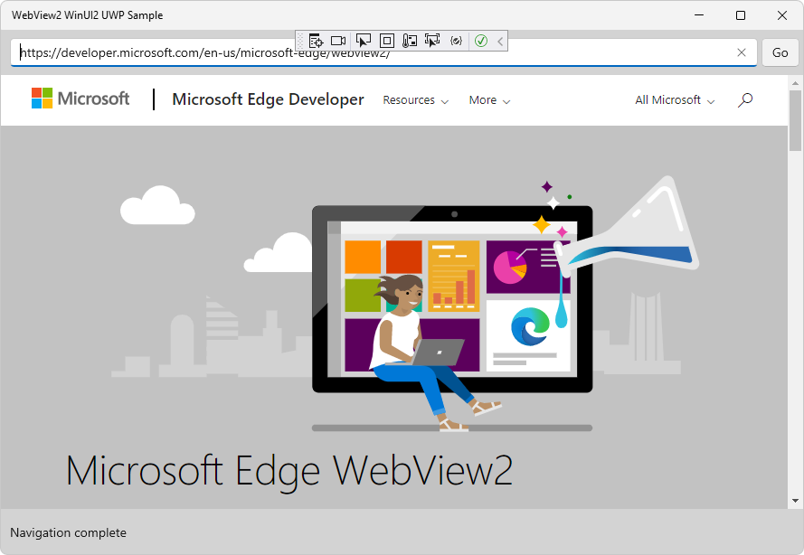

# WebView2 sample: UWP WinUI 2 browser app

This WebView2 sample demonstrates how to use the WebView2 control and WebView2 APIs to implement a web browser in a UWP WinUI 2 app.

Directory &amp; project name: **webview2_sample_uwp**.

**To use this sample (general-purpose steps):**

The steps on the present page are general-purpose.  See the sample-specific steps in the README sections, which may override the present page.

1. **README** - In a separate window or tab, read the rendered README.md file for this project at GitHub: [README file for webview2_sample_uwp](https://github.com/MicrosoftEdge/WebView2Samples/tree/master/SampleApps/webview2_sample_uwp#readme).  Then return to this page and continue the steps below.

   * [README > Prerequisites](https://github.com/MicrosoftEdge/WebView2Samples/tree/master/SampleApps/webview2_sample_uwp#prerequisites)

   * [README > Build the WebView2 UWP WinUi2 browser](https://github.com/MicrosoftEdge/WebView2Samples/tree/master/SampleApps/webview2_sample_uwp#build-the-webview2-uwp-winui2-browser)

   You can also view the README.md source file (non-rendered) in Visual Studio.  In **File Manager** or Visual Studio > Solution Explorer, open the file:<!-- todo: is there a .md preview capability locally? -->

   `<your-repos-directory>/WebView2Samples/SampleApps/webview2_sample_uwp/README.md`

   or:

   `<your-repos-directory>/WebView2Samples-master/SampleApps/webview2_sample_uwp/README.md`

1. **Visual Studio** - If Visual Studio (minimum required version) is not already installed, in a separate window or tab, see [Install Visual Studio](../how-to/machine-setup.md#install-visual-studio) in _Set up your Dev environment for WebView2_.  Follow the steps in that section, and then return to this page and continue the steps below.

1. **Preview channel of Microsoft Edge** - If a preview channel of Microsoft Edge (Beta, Dev, or Canary) is not already installed, in a separate window or tab, see [Install a preview channel of Microsoft Edge](../how-to/machine-setup.md#install-a-preview-channel-of-microsoft-edge) in _Set up your Dev environment for WebView2_.  Follow the steps in that section, and then return to this page and continue the steps below.

1. **Download samples** - If not done already, download or clone the `WebView2Sample` repo to your local drive.  In a separate window or tab, see [Download the WebView2Samples repo](../how-to/machine-setup.md#download-the-webview2samples-repo) in _Set up your Dev environment for WebView2_.  Follow the steps in that section, and then return to this page and continue below.

1. **Open .sln in Visual Studio** - On your local drive, open the `.sln` file in Visual Studio, in the directory:

   *  `<your-repos-directory>/WebView2Samples/SampleApps/webview2_sample_uwp/webview2_sample_uwp.sln`

   or:

   *  `<your-repos-directory>/WebView2Samples-master/SampleApps/webview2_sample_uwp/webview2_sample_uwp.sln`

1. **Visual Studio workloads** - If prompted, install any Visual Studio workloads that are requested.  In a separate window or tab, see [Install Visual Studio workloads](../how-to/machine-setup.md#install-visual-studio-workloads) in _Set up your Dev environment for WebView2_.  Follow the steps in that section, and then return to this page and continue below.

   Solution Explorer shows the **webview2_sample_uwp** project:

   

   _To zoom, right-click > **Open image in new tab**._

1. **WebView2 SDK** - If needed, install (or update) the _prerelease_ WebView2 SDK on the project node (not the solution node) in Solution Explorer.  In a separate window or tab, see [Step 5 - Install the prerelease WebView2 SDK](../get-started/winui2.md#step-5---install-the-prerelease-webview2-sdk) in _Set up your Dev environment for WebView2_.  Follow the steps in that section, and then return to this page and continue below.

1. **Microsoft.UI.Xaml NuGut package (WinUI 2 SDK)**: If needed, install (or update) the _prerelease_ Microsoft.UI.Xaml NuGut package (which is the WinUI 2 SDK) on the project node (not the solution node) in Solution Explorer.  In a separate window or tab, see [Step 6 - Install the prerelease WinUI 2 SDK (Microsoft.UI.Xaml)](../get-started/winui2.md#step-6---install-the-prerelease-winui-2-sdk-microsoftuixaml) in _Get started with WebView2 in WinUI 2 (UWP) apps (public preview)_.  Follow the steps in that section, and then return to this page and continue below.

   At the top of Visual Studio, set the build target, as follows:

1. In the **Solution Configurations** drop-down list, select **Debug** or **Release**.

1. In the **Solution Platforms** drop-down list, select **Any CPU**.

1. In **Solution Explorer**, right-click the **webview2_sample_uwp** project, and then select **Build**.

   This builds the project file `WebView2_UWP.csproj` (per Readme.md), or `webview2_sample_uwp.csproj` (per **Build** > **Rebuild Solution** > **Output**).

1. Select **Debug** > **Start Debugging** (`F5`).

   An empty grid window initially appears:

   

   The sample app window then displays webpage content:

   

1. Use the sample app; see [README file for webview2_sample_uwp](https://github.com/MicrosoftEdge/WebView2Samples/tree/master/SampleApps/webview2_sample_uwp#readme).

1. In Visual Studio, select **Debug** > **Stop Debugging**.

1. In the Visual Studio code editor, inspect the code:

   

   _To zoom, right-click > **Open image in new tab**._

<!-- ====================================================================== -->
## See also

* [Get started with WebView2 in WinUI 2 (UWP) apps (public preview)](../get-started/winui2.md)
