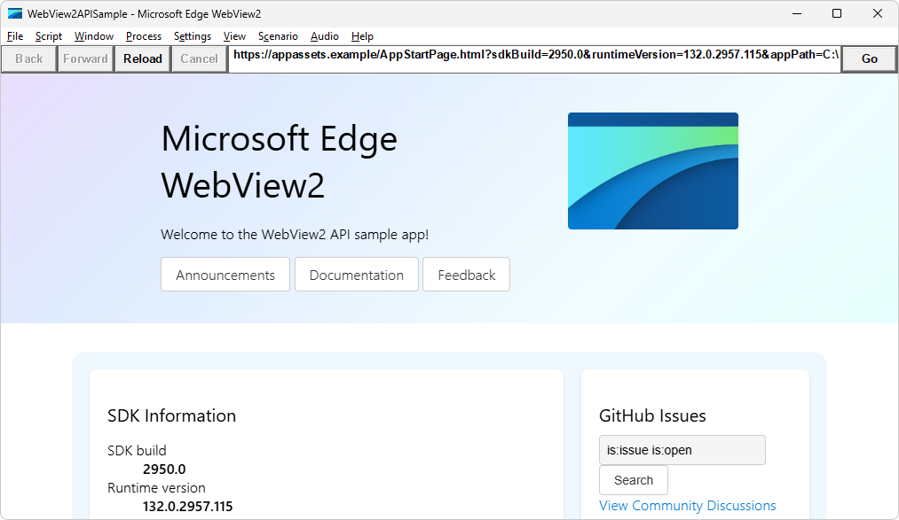
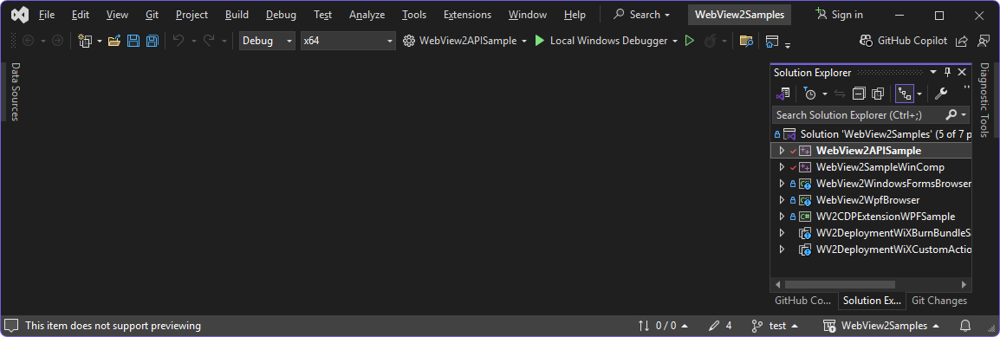
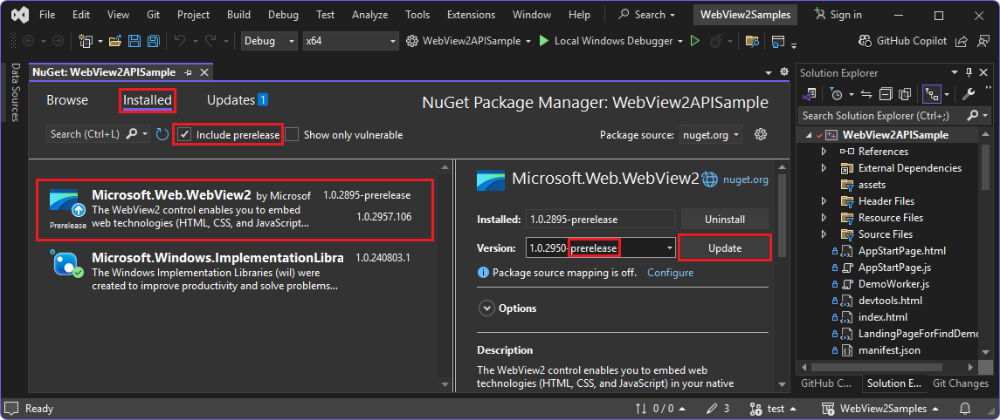
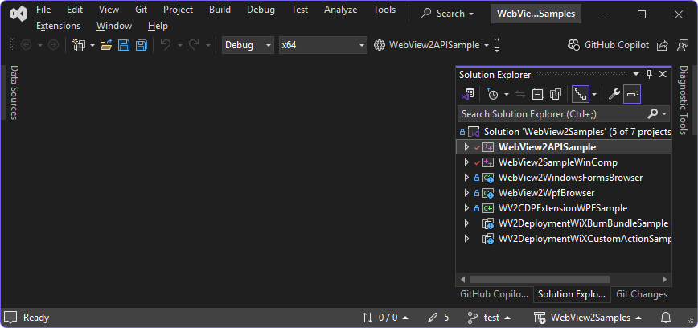
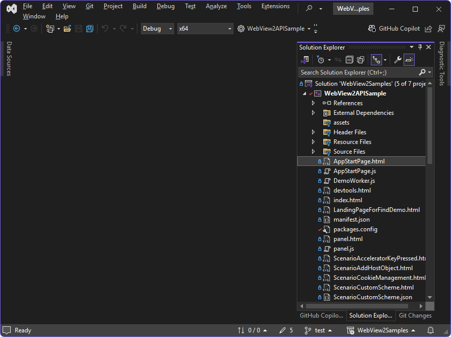

# Win32 sample app

The **WebView2APISample** app demonstrates how to use the WebView2 control and WebView2 APIs to add features to a Win32 C++ app.  This is the main Win32 sample, and has test webpages for the latest features and APIs, and hundreds of menuitems to test various APIs.

*  Sample name: **WebView2APISample**
*  Repo directory: [WebView2APISample](https://github.com/MicrosoftEdge/WebView2Samples/tree/main/SampleApps/WebView2APISample)
*  Solution file: `WebView2Samples.sln` (located in the parent directory, `\SampleApps\`)
*  Project name in Solution Explorer: **WebView2APISample**

**WebView2APISample** embeds a WebView2 control within a Win32 native application.

This sample uses C++ and HTML/CSS/JavaScript in the WebView2 environment.

**WebView2APISample** showcases a selection of WebView2's event handlers and API methods that allow a native Win32 application to directly interact with a WebView2 control and vice versa.



This sample and its solution file are unique: it contains a copy of other samples, in Solution Explorer.

**WebView2APISample** is a hybrid application built with the Microsoft Edge WebView2 control; that is, this app combines a native side and a browser web app side.  See [Hybrid app approach](../index.md#hybrid-app-approach) in _Introduction to Microsoft Edge WebView2_.

The running **WebView2APISample** app window shows the WebView2 SDK version and also the WebView2 Runtime version and path.  There are many useful menus and menuitems to test and demonstrate the WebView2 APIs.


<!-- ------------------------------ -->
#### Sequence of articles

To start learning WebView2, use this suggested sequence of articles and sample projects:

1. Get this **WebView2APISample** to build and run, using the present article, even if your own app is for a different platform.

1. If you're most interested in a platform other than Win32, use the Sample article for your platform; see [Sample apps](../samples/index.md).

1. Use the Get Started article for the platform you're interested in; see [Getting Started tutorials](../get-started/get-started.md).


<!-- ====================================================================== -->
## Step 1: Install Visual Studio 2022

1. Press the **Windows** key, enter **Visual Studio 2022**, and then click **Open**.

   The Visual Studio **Open recent** dialog opens.

   Microsoft Visual Studio Code is not supported for this sample.

1. If Visual Studio 2022 isn't installed, go to [Visual Studio 2022](https://visualstudio.microsoft.com/vs/) and then use the **Download Visual Studio** combo button.

Continue with the next step below, [Step 2: Clone the WebView2Samples repo](#step-2-clone-the-webview2samples-repo).


<!-- ------------------------------ -->
#### Older versions of Visual Studio

Visual Studio 2019 and 2017 are also supported.


<!-- ---------- -->
###### Visual Studio 2019
<!-- any mentions of "2019" go in this section only -->

This sample was created with Visual Studio 2019, as a Visual Studio 2019 project.  To open this sample's project as-is, you can use Visual Studio 2019.


<!-- ---------- -->
###### Visual Studio 2017

If you want to open this sample by using Visual Studio 2017: 

1. Open the solution in Visual Studio 2017.

1. Change the project's Platform Toolset in **Project Properties > Configuration properties > General > Platform Toolset**.

1. You might also need to install a recent Windows SDK on your machine.


<!-- ====================================================================== -->
## Step 2: Clone the WebView2Samples repo

1. Press **Windows + E**.

   A File Explorer window opens.

1. Navigate to where you cloned or plan to clone the **WebView2Samples** repo.

   Example path:

   `C:\Users\localAccount\GitHub\WebView2Samples`

1. If not done already, clone the `WebView2Samples` repo to your local drive.  In a separate window or tab, see [Clone the WebView2Samples repo](../how-to/machine-setup.md#clone-the-webview2samples-repo) in _Set up your Dev environment for WebView2_.  Follow the steps in that section, and then return to this page and continue below.

1. If not opened already, open a git bash command prompt: Press the **Windows** key, and then type **git bash**.


   **Pull commits**

1. Switch to the cloned repo directory:

   ```
   cd C:/Users/localAccount/GitHub/WebView2Samples`
   ```

   Substitute the path where you cloned the **WebView2Samples** repo to.

1. Pull the latest commits to your local copy of the repo:

   ```
   git pull
   ```


   **Create a working branch**

1. Create a working branch and switch to it:

   ```
   git checkout -b test
   ```

   Returns: `Switched to branch 'test'`

You are now free to modify the code in your working branch, without altering the code that's in the "main" branch of the repo.  Later you might want to switch back to the "main" branch, for example to pull new commits, or create a different branch based off the "main" branch.


<!-- ====================================================================== -->
## Step 3: Open the solution in Visual Studio

Opening and building the sample will modify the sample.  Best practice is to avoid changing the code that's in the "main" branch, by creating and switching to a working branch, which you can do from within Visual Studio.

1. Press the **Windows** key, enter **Visual Studio 2022**, and then click **Open**.

   The Visual Studio **Open recent** dialog opens:

   

1. Click **Continue without code**, in the lower right.

1. In Visual Studio 2022, select **File** > **Open** > **Project/Solution**.

   The **Open Project/Solution** dialog opens.

1. Navigate to the `WebView2Samples\SampleApps\WebView2Samples.sln` file, and then click the **Open** button.

   Example path:

   ```
   C:\Users\localAccount\GitHub\WebView2Samples\SampleApps\WebView2Samples.sln
   ```

   Unlike some other samples, there's not a dedicated `.sln` file in the sample repo directory that contains this sample's Readme.  Instead, the `.sln` file for this sample (including other sample projects as well) is in the parent directory.

   The **Review Project and Solution Changes** dialog might open:

   

1. Click the **OK** button.

   The solution opens in Visual Studio:

   <!-- instance 1 of png -->


<!-- ====================================================================== -->
## Step 4: Update the toolset

Continuing from above: The **Review Solution Actions: Retarget Projects** dialog might open:


This screenshot shows:
* **Windows SDK Version:** **10.0 (latest installed version)**
* **Platform Toolset:** **Upgrade to v143**

Those options are listed for these projects:

* **WebView2APISample.vcxproj** - the present, main sample.
* **WebView2APISampleWinComp.vcxproj** - a different sample.

* If that dialog opens, click the **OK** button.

   The **Output** pane in Visual Studio shows results, such as:

   ```
   Upgrading project 'WebView2APISample'...
   Configuration 'Debug|ARM64': changing Platform Toolset to 'v143' (was 'v142').
   Configuration 'Debug|Win32': changing Platform Toolset to 'v143' (was 'v142').
   Configuration 'Debug|x64': changing Platform Toolset to 'v143' (was 'v142').
   Configuration 'Release|Win32': changing Platform Toolset to 'v143' (was 'v142').
   Configuration 'Release|ARM64': changing Platform Toolset to 'v143' (was 'v142').
   Configuration 'Release|x64': changing Platform Toolset to 'v143' (was 'v142').
   Upgrading project 'WebView2SampleWinComp'...
   Configuration 'Debug|Win32': changing Platform Toolset to 'v143' (was 'v142').
   Configuration 'Debug|x64': changing Platform Toolset to 'v143' (was 'v142').
   Configuration 'Release|Win32': changing Platform Toolset to 'v143' (was 'v142').
   Configuration 'Release|x64': changing Platform Toolset to 'v143' (was 'v142').
   Retargeting End: 2 completed, 0 failed, 0 skipped
   ```

   In the browser, a **Migration Report** page opens, such as: `file:///C:/Users/localAccount/GitHub/WebView2Samples/SampleApps/UpgradeLog.htm`


<!-- old pngs, might be useful:
1. Click the **OK** button.  The **Retarget Projects** dialog might open:

   

   Example of installed versions:

   
-->


<!-- ====================================================================== -->
## Step 5: Update .NET

Continuing from above: In Visual Studio, in **Solution Explorer** in the upper right, the message might appear: **This project is targeting a version of .NET which is not installed.**

1. If you get that message, click the **Install** link next to the message.

   The **Visual Studio Installer** dialog opens:

   

1. Click the **Install** button.

   The **User Account Control** dialog opens.

1. Click the **Yes** button.

   The **Visual Studio Installer** dialog shows progress for downloading and installing, and then shows **The installation has completed**.

1. Click the **Close** button.

   The **Visual Studio Installer** dialog closes.

   **Solution Explorer** is displayed without the "not installed" message.


<!-- ====================================================================== -->
## Step 6: Install the C++ workload for Visual Studio

Continuing from above: If prompted to install workloads when you try to build the project:

1. In Visual Studio, select **Tools** > **Get Tools and Features**.

   The **Visual Studio Installer** dialog opens, and then the  **Modifying** dialog opens.

1. In the **Workloads** tab, select the **Desktop development with C++** card, so that a checkmark appears on it.

1. In **Installation details** on the right, expand **Desktop development with C++**.

1. Click the **Update** or **Install** button.

   The Installer closes.

See also:
* [Step 4 - Install workloads if prompted](../get-started/win32.md#step-4---install-workloads-if-prompted) in _Get started with WebView2 in Win32 apps_.
* [Install Visual Studio workloads](../how-to/machine-setup.md#install-visual-studio-workloads) in _Set up your Dev environment for WebView2_.

You don't need to install WiX to continue; that's for a different project in this solution file.  Installing WiX is covered in [WiX Burn Bundle to deploy the WebView2 Runtime](./wv2deploymentwixburnbundlesample.md).


<!-- ====================================================================== -->
## Step 7: Build and run using older SDK

At the top of Visual Studio, set the build target, as follows:

1. In the **Solution Configurations** dropdown list, select **Debug**.

1. In the **Solution Platforms** dropdown list, select **x64**.

1. In **Solution Explorer**, right-click the **WebView2APISample** project, and then select **Build**.

   <!-- instance 2 of png -->

   This builds the project file `SampleApps/WebView2APISample/WebView2APISample.vcxproj`.

1. Select **Debug** > **Start Debugging** (**F5**).  

   The **WebView2APISample** app window opens:

   

1. Close the sample app window.


<!-- ====================================================================== -->
## Step 8: Update the prerelease WebView2 SDK

The repo version of this sample has a Prerelease version of the WebView2 SDK installed.  Below, you'll update the WebView2 SDK to the latest Prerelease version (unless the latest Prerelease SDK is installed already).  A Prerelease SDK supports the latest experimental APIs and the latest "Stable in Prerelease" APIs.

1. Check the version number of the Prerelease SDK that's in the repo's copy of the **WebView2APISample** app at GitHub: see [packages.config](https://github.com/MicrosoftEdge/WebView2Samples/blob/main/SampleApps/WebView2APISample/packages.config).

   For example:

   ```xml
   <package id="Microsoft.Web.WebView2" version="1.0.2950-prerelease" targetFramework="native" />
   <package id="Microsoft.Windows.ImplementationLibrary" version="1.0.220201.1" targetFramework="native" />
   ```

1. Check what's the latest Prerelease version number, at [Release Notes for the WebView2 SDK](../release-notes/index.md).

1. In Visual Studio, in **Solution Explorer**, right-click the **WebView2APISample** project (not the solution node above it), and then select **Manage NuGet Packages**.

   The **NuGet Package Manager** panel opens in Visual Studio.

1. In the **NuGet Package Manager**, click the **Installed** tab:

   

1. To the right of the **Search** text box, select the **Include prerelease** check box.

1. On the left, select **Microsoft.Web.WebView2**.

1. On the right, in the **Version** dropdown list, select the latest **-prerelease** version.

1. To the right of the **Version** dropdown list, click the **Update** button.

   The **Preview Changes** dialog opens:

   

1. Click the **Apply** button.

1. Repeat the above steps to update the **Microsoft.Windows.Implementation.Library**, but you can select the latest Release rather than latest Prerelease.

   The latest prerelease version of the WebView2 SDK is now installed for this project.

See also:
* [Phases of adding APIs](../release-notes/about.md#phases-of-adding-apis) in _About Release Notes for the WebView2 SDK_.


<!-- ====================================================================== -->
## Step 9: Build and run using updated SDK

Assuming you updated the Prerelease version of the WebView2 SDK, build and run the sample again:

1. In **Solution Explorer**, right-click the **WebView2APISample** project, and then select **Build**.

1. Select **Debug** > **Start Debugging** (**F5**).  

   The **WebView2APISample** app window opens:

   

1. Close the sample app window.


You obtained, updated, built, and ran the Win32 sample app.


<!-- ====================================================================== -->
## Step 10: Study the sample

The sections below describe how the sample works.


<!-- ====================================================================== -->
## View the project files

These steps assume you obtained, updated, built, and ran the Win32 sample app per the above steps.

The **WebView2APISample** sample and project is the main Win32 sample.

1. Open `WebView2Samples.sln` in Visual Studio.

   Example path:

   ```
   C:\Users\localAccount\GitHub\WebView2Samples\SampleApps\WebView2Samples.sln
   ```

   This solution file contains the main sample (**WebView2APISample**) and other samples as well:

   

1. In **Solution Explorer**, expand the **WebView2APISample** project:

   


<!-- ====================================================================== -->
## Hybrid app architecture

The **WebView2APISample** app is an example of a hybrid application, with a Win32 native part and a WebView part:


*  The Win32 part can directly access native Windows APIs.  The top part of the **WebView2APISample** app is a Win32 component written in C++. This part of the application takes in UI inputs from the user and uses them to control the WebView.

*  The WebView is a container for standard web technologies (HTML, CSS, and JavaScript).  The main part of the **WebView2APISample** app is a WebView that can be repurposed using standard web technologies (HTML/CSS/JavaScript).  The WebView can be navigated to websites or local content.

This hybrid approach allows you to create and iterate faster using web technologies, while still being able to take advantage of native functionality.  The **WebView2APISample** app demonstrates how the Win32 component and the WebView component can interact with each other.

This sample app has over 100 menuitems, which demonstrate many WebView2 APIs in the Win32/C++ framework.  The following sections focus on basics of hybrid app implementation.


<!-- ====================================================================== -->
## Project Files

This section briefly explains some key files within the repository.  The **WebView2APISample** app is divided vertically into components, instead of horizontally into layers.  Each component implements the whole workflow of a category of example features, from listening for menu commands, to calling WebView API methods to implement them.


<!-- ------------------------------ -->
#### App.cpp

This is the top-level file that runs the **WebView2APISample** app. It reads command-line options, sets up the process environment, and handles the app's threading model.


<!-- ------------------------------ -->
#### AppWindow.cpp (Window menu)

This file implements the application window, by doing the following:

1. Set up all the Win32 controls.

1. Initialize the WebView Environment and the WebView.

1. Add event handlers to the WebView and create all the components that handle various features of the application.

The `AppWindow` class handles commands from the sample app's **Window** menu.

This file is described in more detail in [Key functions in AppWindow.cpp](#key-functions-in-appwindowcpp), below.


<!-- ------------------------------ -->
#### FileComponent.cpp (File menu)

This component handles commands from the **File** menu (except for **Exit**), as well as the `DocumentTitleChanged` event.


<!-- ------------------------------ -->
#### ScriptComponent.cpp (Script menu)

This component handles commands from the **Script** menu, which involve interacting with the WebView by injecting JavaScript, posting WebMessages, adding native objects to the webpage, or using the DevTools protocol to communicate with the webpage.


<!-- ------------------------------ -->
#### ProcessComponent.cpp (Process menu)

This component handles commands from the **Process** menu, which involve interaction with the browser's process.  It also handles the `ProcessFailed` event, in case the browser process or one of its render process crashes or is unresponsive.


<!-- ------------------------------ -->
#### SettingsComponent.cpp (Settings menu)

This component handles commands from the **Settings** menu.  This component is also in charge of copying settings from an old WebView when a new one is created.  Most code that interacts with the `ICoreWebView2Settings` interface is found here.


<!-- ------------------------------ -->
#### ViewComponent.cpp (View menu)

This component handles commands from the **View** menu, and any functionality related to sizing and visibility of the WebView.  When the app window is resized, minimized, or restored, `ViewComponent` will resize, hide, or show the WebView in response.  It also responds to the `ZoomFactorChanged` event.


<!-- ------------------------------ -->
#### ScenarioWebMessage.cpp and ScenarioWebMessage.html (Scenario menu)

The `ScenarioWebMessage` component is created when you select the **Scenario** > **Web Messaging** menu item.  This component implements an example application with a C++ part and an HTML + JavaScript part, which communicate with each other by asynchronously posting and receiving messages.

This component is described in more detail in [ScenarioWebMessage (.html, .cpp, and .h)](#scenariowebmessage-html-cpp-and-h), below.


<!-- ------------------------------ -->
#### ScenarioAddHostObject.cpp and ScenarioAddHostObject.html (Scenario menu)

This component is created when you select the **Scenario** > **Host Objects** menu item.  It demonstrates communication between the native app and the HTML webpage by means of host object injection.  The interface of the host object is declared in `HostObjectSample.idl`, and the object itself is implemented in `HostObjectSampleImpl.cpp`.

See also:
* [Call native-side code from web-side code](../how-to/hostobject.md)


<!-- ====================================================================== -->
## Key functions in AppWindow.cpp

`AppWindow.cpp` implements the application window, by doing the following:

1. Set up all the Win32 controls.

1. Initialize the WebView Environment and the WebView.

1. Add event handlers to the WebView and create all the components that handle various features of the application.

The `AppWindow` class handles commands from the sample app's **Window** menu.  The following are some of the key functions in `AppWindow.cpp`.


<!-- ------------------------------ -->
#### InitializeWebView()

In `AppWindow.cpp`, the `InitializeWebView()` function creates the WebView2 environment by using [CreateCoreWebView2EnvironmentWithOptions](/microsoft-edge/webview2/reference/win32/webview2-idl#createcorewebview2environmentwithoptions).

To see these API calls in action, inspect the following code from `InitializeWebView()`:

```cpp
HRESULT hr = CreateCoreWebView2EnvironmentWithOptions(
    subFolder, nullptr, options.Get(),
    Callback<ICoreWebView2CreateCoreWebView2EnvironmentCompletedHandler>(
        this, &AppWindow::OnCreateEnvironmentCompleted)
        .Get());
if (!SUCCEEDED(hr))
{
    if (hr == HRESULT_FROM_WIN32(ERROR_FILE_NOT_FOUND))
    {
        MessageBox(
            m_mainWindow,
            L"Couldn't find Edge installation. "
            "Do you have a version installed that's compatible with this "
            "WebView2 SDK version?",
            nullptr, MB_OK);
    }
    else
    {
        ShowFailure(hr, L"Failed to create webview environment");
    }
}
```


<!-- ------------------------------ -->
#### OnCreateEnvironmentCompleted()

After creating the environment, we create the WebView by using `CreateCoreWebView2Controller`.

The `OnCreateEnvironmentCompleted` callback function is passed to `CreateCoreWebView2EnvironmentWithOptions` in `InitializeWebView()`.  The callback stores the environment pointer and then uses it to create a new WebView:

```cpp
HRESULT AppWindow::OnCreateEnvironmentCompleted(
    HRESULT result, ICoreWebView2Environment* environment)
{
    CHECK_FAILURE(result);

    m_webViewEnvironment = environment;

    CHECK_FAILURE(m_webViewEnvironment->CreateCoreWebView2Controller(
        m_mainWindow, Callback<ICoreWebView2CreateCoreWebView2ControllerCompletedHandler>(
                            this, &AppWindow::OnCreateCoreWebView2ControllerCompleted)
                            .Get()));
    return S_OK;
}
```


<!-- ------------------------------ -->
#### OnCreateCoreWebView2ControllerCompleted()

The `OnCreateCoreWebView2ControllerCompleted` callback function is passed to `CreateCoreWebView2Controller` in `InitializeWebView()`.  This callback:
* Initializes the WebView-related state.
* Registers some event handlers.
* Creates the app components.


<!-- ------------------------------ -->
#### RegisterEventHandlers()

The `RegisterEventHandlers` function is called within `CreateCoreWebView2Controller`.  It sets up some of the event handlers used by the application, and adds them to the WebView.

For more information about event handlers in WebView2, see [ICoreWebView2](/microsoft-edge/webview2/reference/win32/icorewebview2).

Below is a code snippet from `RegisterEventHandlers()`, where we set up an event handler for the `NewWindowRequested` event.  This event is fired when JavaScript in the webpage calls `window.open()`.   `ICoreWebView2NewWindowRequestedEventHandler` makes a new `AppWindow` and passes the new window's WebView back to the browser, so it<!-- todo: specify "it": the browser? --> can return it<!-- todo: specify "it": the WebView? -->  from the `window.open()` call.  Unlike our calls to `CreateCoreWebView2EnvironmentWithOptions` and `CreateCoreWebView2Controller`, instead of providing a method for the callback, we just provide a C++ lambda right then and there:

```cpp
CHECK_FAILURE(m_webView->add_NewWindowRequested(
    Callback<ICoreWebView2NewWindowRequestedEventHandler>(
        [this](
            ICoreWebView2* sender,
            ICoreWebView2NewWindowRequestedEventArgs* args) {
            wil::com_ptr<ICoreWebView2Deferral> deferral;
            CHECK_FAILURE(args->GetDeferral(&deferral));

            auto newAppWindow = new AppWindow(L"");
            newAppWindow->m_isPopupWindow = true;
            newAppWindow->m_onWebViewFirstInitialized = [args, deferral, newAppWindow]() {
                CHECK_FAILURE(args->put_NewWindow(newAppWindow->m_webView.get()));
                CHECK_FAILURE(args->put_Handled(TRUE));
                CHECK_FAILURE(deferral->Complete());
            };

            return S_OK;
        })
        .Get(),
    nullptr));
```


<!-- ====================================================================== -->
## ScenarioWebMessage (.html, .cpp, and .h)

The `ScenarioWebMessage` files show how the Win32 host can modify the WebView, how the WebView can modify the Win32 host, and how the WebView can modify itself by accessing information from the Win32 host.  This is done asynchronously.

The `ScenarioWebMessage` component is created when you select the **Scenario** > **Web Messaging** menu item.  The `ScenarioWebMessage` component implements an example application with a C++ part and an HTML+JavaScript part, which communicate with each other by asynchronously posting and receiving messages:


The following sections demonstrate how each discrete function works using the **WebView2APISample** app, and then explains how to implement this functionality.

First, go to the **ScenarioWebMessage** web app within the sample app:

1. Open (run) the **WebView2APISample** app.

1. In the **Scenario** menu, select **Web Messaging**.

   The WebView displays a webpage titled **WebMessage sample page** (`ScenarioWebMessage.html`):

   

To explore the `ScenarioWebMessage` functionality, you can follow the instructions on the page, or follow the steps below.


<!-- ------------------------------ -->
#### Posting Messages from the Win32 host to the WebView

The following steps show how the Win32 Host can modify a WebView.  In this example, you'll turn the text blue:

1. Open the **WebMessage sample page** (`ScenarioWebMessage.html`) as described above.

1. In the **Script** menu, select **Post Web Message JSON**.

   A dialog containing the pre-written code `{"SetColor":"blue"}` appears.

1. Click **OK**.

   The text in the **Posting Messages** section of the page changes from black to blue.


<!-- ---------- -->
###### How it works

1. In `ScriptComponent.cpp`, the call to [PostWebMessageAsJson](/microsoft-edge/webview2/reference/win32/icorewebview2#postwebmessageasjson) posts user input to the `ScenarioMessage.html` web application:

   ```cpp
   // Prompt the user for some JSON and then post it as a web message.
   void ScriptComponent::SendJsonWebMessage()
   {
      TextInputDialog dialog(
         m_appWindow->GetMainWindow(),
         L"Post Web Message JSON",
         L"Web message JSON:",
         L"Enter the web message as JSON.",
         L"{\"SetColor\":\"blue\"}");
      if (dialog.confirmed)
      {
         m_webView->PostWebMessageAsJson(dialog.input.c_str());
      }
   }
   ```

1. Within the web application, event listeners are used to receive and respond to the web message.  The code snippet below is from `ScenarioWebMessage.html`.  The event listener changes the color of the text if the argument is "SetColor":

   ```javascript
   window.chrome.webview.addEventListener('message', arg => {
      if ("SetColor" in arg.data) {
         document.getElementById("colorable").style.color = arg.data.SetColor;
      }
   });
   ```


<!-- ------------------------------ -->
#### Receiving messages (from the WebView to the Win32 host)

The following steps show how the WebView can modify the Win32 Host App by changing the title of the Win32 app:

1. Open the **WebMessage sample page** (`ScenarioWebMessage.html`) as described above.

1. Note the title of the **WebView2APISample** app, displayed in the top left of the window next to the icon.  It's initially **WebView2APISample - Microsoft Edge WebView2**.

1. In the **Receiving Messages** section of the page, enter a new title, and then click the **Send** button.

1. Note the new title that's displayed in the titlebar of the **WebView2APISample** app.


<!-- ---------- -->
###### How it works

1. In `ScenarioWebMessage.html`, [window.chrome.webview.postMessage()](https://developer.mozilla.org/docs/Web/API/Window/postMessage) sends the user input to the host application:

   ```javascript
   function SetTitleText() {
      let titleText = document.getElementById("title-text");
      window.chrome.webview.postMessage(`SetTitleText ${titleText.value}`);
   }
   ```

1. Within `ScenarioWebMessage.cpp`, we use [add_WebMessageReceived](/microsoft-edge/webview2/reference/win32/icorewebview2#add_webmessagereceived) to register the event handler.  When we receive the event, after validating the input, we change the title of the App Window (`m_appWindow`):

   ```cpp
   // Setup the web message received event handler before navigating to
   // ensure we don't miss any messages.
   CHECK_FAILURE(m_webview->add_WebMessageReceived(
      Microsoft::WRL::Callback<ICoreWebView2WebMessageReceivedEventHandler>(
         [this](ICoreWebView2* sender, ICoreWebView2WebMessageReceivedEventArgs* args)
   {
      wil::unique_cotaskmem_string uri;
      CHECK_FAILURE(args->get_Source(&uri));
   
      // Always validate that the origin of the message is what you expect.
      if (uri.get() != m_sampleUri)
      {
         return S_OK;
      }
      wil::unique_cotaskmem_string messageRaw;
      CHECK_FAILURE(args->TryGetWebMessageAsString(&messageRaw));
      std::wstring message = messageRaw.get();
   
      if (message.compare(0, 13, L"SetTitleText ") == 0)
      {
         m_appWindow->SetTitleText(message.substr(13).c_str());
      }
      return S_OK;
   }).Get(), &m_webMessageReceivedToken));
   ```


<!-- ------------------------------ -->
#### Round trip messages (from the WebView to the host back to the WebView)

The following steps show how the WebView can get information from the Win32 Host and modify itself by displaying the size of the Win32 App.

1. Open the **WebMessage sample page** (`ScenarioWebMessage.html`) as described above.

1. In the **Round trip** section of the page, click the **GetWindowBounds** button.

   The text box below the button displays the bounds for the **WebView2APISample** app.


<!-- ---------- -->
###### How it works

1. When the **Get window bounds** button is clicked, the `GetWindowBounds` function in `ScenarioWebMessage.html` gets called.  `GetWindowBounds` calls [window.chrome.webview.postMessage()](https://developer.mozilla.org/docs/Web/API/Window/postMessage) to send a message to the host application:

   ```javascript
   function GetWindowBounds() {
       window.chrome.webview.postMessage("GetWindowBounds");
   }
   ```

1. In `ScenarioWebMessage.cpp`, we use [add_WebMessageReceived](/microsoft-edge/webview2/reference/win32/icorewebview2#add_webmessagereceived) to register the received event handler.  After validating the input, the event handler gets window bounds from the App Window. [PostWebMessageAsJson](/microsoft-edge/webview2/reference/win32/icorewebview2#postwebmessageasjson) sends the bounds to the web application:

   ```cpp
   if (message.compare(L"GetWindowBounds") == 0)
   {
      RECT bounds = m_appWindow->GetWindowBounds();
      std::wstring reply =
         L"{\"WindowBounds\":\"Left:" + std::to_wstring(bounds.left)
         + L"\\nTop:" + std::to_wstring(bounds.top)
         + L"\\nRight:" + std::to_wstring(bounds.right)
         + L"\\nBottom:" + std::to_wstring(bounds.bottom)
         + L"\"}";
      CHECK_FAILURE(sender->PostWebMessageAsJson(reply.c_str()));
   }
   ```

1. In `ScenarioWebMessage.html`, an event listener responds to the `WindowBounds` message and displays the bounds of the window:

   ```javascript
   window.chrome.webview.addEventListener('message', arg => {
      if ("WindowBounds" in arg.data) {
         document.getElementById("window-bounds").value = arg.data.WindowBounds;
      }
   });
   ```


<!-- ====================================================================== -->
## See also

* [WebView2 API Reference](../webview2-api-reference.md)
* [Get started with WebView2 in Win32 apps](../get-started/win32.md)
* [Overview of WebView2 APIs](../concepts/overview-features-apis.md)
* [Phases of adding APIs](../release-notes/about.md#phases-of-adding-apis) in _About Release Notes for the WebView2 SDK_.
