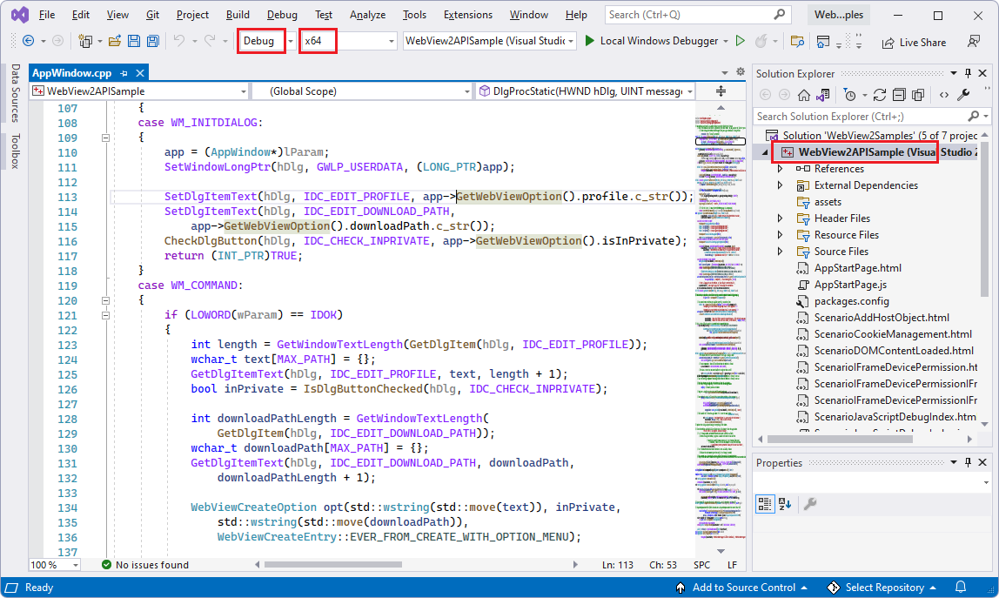

# Win32 sample app

This WebView2 sample demonstrates how to use the WebView2 control and WebView2 APIs to add features to a Win32 C++ app.

The WebView2APISample is an example of an application that embeds a WebView2 control within a Win32 native application. It is built as a Win32 Visual Studio project and makes use of both C++ and HTML/CSS/JavaScript in the WebView2 environment.

The API Sample showcases a selection of WebView2's event handlers and API methods that allow a native Win32 application to directly interact with a WebView2 control and vice versa.

Directory &amp; .sln: **WebView2APISample / WebView2Samples.sln (in parent dir)**.

<!-- ====================================================================== -->
## Step 1 - View the Readme

The steps on the present page are general-purpose.  See the sample-specific steps in the README sections, which may override the present page.

1. In a separate window or tab, read the rendered README.md file for this project at GitHub: [README file for WebView2APISample](https://github.com/MicrosoftEdge/WebView2Samples/tree/main/SampleApps/WebView2APISample#readme).  Then return to this page and continue the steps below.

   * [README > Prerequisites](https://github.com/MicrosoftEdge/WebView2Samples/tree/main/SampleApps/WebView2APISample#prerequisites)

   * [README > Build the WebView2 API Sample](https://github.com/MicrosoftEdge/WebView2Samples/tree/main/SampleApps/WebView2APISample#build-the-webview2-api-sample)

   You can also view the README.md source file (non-rendered) in Visual Studio.  In **File Manager** or Visual Studio > Solution Explorer, open the file:<!-- todo: is there a .md preview capability locally? -->

   `<your-repos-directory>/WebView2Samples/SampleApps/README.md`

   or:

   `<your-repos-directory>/WebView2Samples-main/SampleApps/README.md`

<!-- ====================================================================== -->
## Step 2 - Install Visual Studio

Microsoft Visual Studio is required.  Microsoft Visual Studio Code is not supported for this sample.

1. If Visual Studio (minimum required version) is not already installed, in a separate window or tab, see [Install Visual Studio](../how-to/machine-setup.md#install-visual-studio) in _Set up your Dev environment for WebView2_.  Follow the steps in that section, and then return to this page and continue the steps below.

<!-- ====================================================================== -->
## Step 3 - Install a preview channel of Microsoft Edge

1. If a preview channel of Microsoft Edge (Beta, Dev, or Canary) is not already installed, in a separate window or tab, see [Install a preview channel of Microsoft Edge](../how-to/machine-setup.md#install-a-preview-channel-of-microsoft-edge) in _Set up your Dev environment for WebView2_.  Follow the steps in that section, and then return to this page and continue the steps below.

<!-- ====================================================================== -->
## Step 4 - Download or clone the WebView2Samples repo

1. If not done already, download or clone the `WebView2Sample` repo to your local drive.  In a separate window or tab, see [Download the WebView2Samples repo](../how-to/machine-setup.md#download-the-webview2samples-repo) in _Set up your Dev environment for WebView2_.  Follow the steps in that section, and then return to this page and continue below.

<!-- ====================================================================== -->
## Step 5 - Open .sln in Visual Studio

1. On your local drive, open the `.sln` file in Visual Studio, in the directory:

   *  `<your-repos-directory>/WebView2Samples/SampleApps/WebView2Samples.sln`

   or:

   *  `<your-repos-directory>/WebView2Samples-main/SampleApps/WebView2Samples.sln`

<!-- ====================================================================== -->
## Step 6 - Install workloads if prompted

1. **Visual Studio workloads** - If prompted, install any Visual Studio workloads that are requested.  In a separate window or tab, see [Install Visual Studio workloads](../how-to/machine-setup.md#install-visual-studio-workloads) in _Set up your Dev environment for WebView2_.  Follow the steps in that section, and then return to this page and continue below.

<!-- ====================================================================== -->
## Step 7 - View the opened project

Solution Explorer shows several projects, including the **WebView2APISample** project:

<!-- ====================================================================== -->
## Step 8 - Install or update the prerelease WebView2 SDK

Install or update the _prerelease_ WebView2 SDK for the project, as follows:

1. In Solution Explorer, right-click the project (not the solution node above it), and then select **Manage NuGet Packages**.

   The **NuGet Package Manager** panel opens in Visual Studio.

1. In the **NuGet Package Manager**, click the **Browse** tab.

1. To the right of the search text box, select the **Include prerelease** check box.

1. In the search text box, enter **Microsoft.Web.WebView2**.

   The **Microsoft.Web.WebView2** card appears in the search results.

1. Click the **Microsoft.Web.WebView2** card below the search box.

1. On the right, in the **Version** dropdown list, make sure **Latest prerelease** is selected:

   

   _The above image is from another project, but is similar.  To zoom, right-click > **Open image in new tab**._

1. Click the **Install** (or **Update**) button.

   The **Preview Changes** dialog box appears:

   

   _The above image is from another project, but is similar._

1. Click the **OK** button.

The WebView2 SDK is now installed for this project.

<!-- ====================================================================== -->
## Step 9 - Build the project

At the top of Visual Studio, set the build target, as follows:

1. In the **Solution Configurations** dropdown list, select **Debug** or **Release**.

1. In the **Solution Platforms** dropdown list, select **x86**, **x64**, or **ARM64**.

1. In **Solution Explorer**, right-click the **WebView2APISample** project, and then select **Build**.

   

   _To zoom, right-click > **Open image in new tab**._

   This builds the project file `SampleApps/WebView2APISample/WebView2APISample.vcxproj`.

<!-- ====================================================================== -->
## Step 10 - Run (debug) the project

1. Select **Debug** > **Start Debugging** (`F5`).  

   Troubleshooting: if you skip the build step and immediately select **Debug** > **Start Debugging** (`F5`), a dialog box might appear, "Unable to start program: Cannot find the path specified":

   

   To fix this problem: in **Solution Explorer**, right-click the **WebView2APISample** project, and then select **Build**.

   The **WebView2APISample** app window opens:

   

   _To zoom, right-click > **Open image in new tab**._

1. Use the sample app.  See [README file for WebView2 API Sample](https://github.com/MicrosoftEdge/WebView2Samples/tree/main/SampleApps/WebView2APISample#readme)

1. In Visual Studio, select **Debug** > **Stop Debugging**.  Visual Studio closes the app.

<!-- ====================================================================== -->
## Step 11 - Inspect the code

1. In the Visual Studio code editor, inspect the code.

<!--
Note: The `.sln` file is not in the sample repo directory that contains this sample's [README.md file](https://github.com/MicrosoftEdge/WebView2Samples/tree/main/SampleApps/WebView2APISample#readme), or the equivalent local filesystem directory.  Instead, the `.sln` file for this sample is in the parent directory that corresponds to the [SampleApps](https://github.com/MicrosoftEdge/WebView2Samples/tree/main/SampleApps) repo directory.
-->

<!-- ====================================================================== -->
## See also

* [Get started with WebView2 in Win32 apps](../get-started/win32.md)
