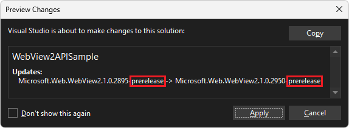

# Win32 sample app

This sample, **WebView2APISample**, demonstrates how to use the WebView2 control and WebView2 APIs to add features to a Win32 C++ app.

*  Sample name: **WebView2APISample**
*  Repo directory: [WebView2APISample](https://github.com/MicrosoftEdge/WebView2Samples/tree/main/SampleApps/WebView2APISample)
*  Solution file: **WebView2Samples.sln** (located in the parent directory, `\SampleApps\`)
*  Project name in Solution Explorer: **WebView2APISample**

**WebView2APISample** embeds a WebView2 control within a Win32 native application.

This sample is built as a Win32 Visual Studio 2019 project.  It uses C++ and HTML/CSS/JavaScript in the WebView2 environment.
<!-- [Visual Studio 2019](https://visualstudio.microsoft.com/vs/) -->

**WebView2APISample** showcases a selection of WebView2's event handlers and API methods that allow a native Win32 application to directly interact with a WebView2 control and vice versa.

This sample and its solution file are unique: it contains a copy of other samples, in Solution Explorer.

**WebView2APISample** is a hybrid application built with the Microsoft Edge WebView2 control; that is, this app combines a native side and a browser web app side.  See [Hybrid app approach](../index.md#hybrid-app-approach) in _Introduction to Microsoft Edge WebView2_.

The running **WebView2APISample** app window shows the WebView2 SDK version and also the WebView2 Runtime version and path.  There are many useful menus and menuitems provided for you:


<!-- old:

-->

If this is your first time using WebView, we recommend first following the tutorial [Get started with WebView2 in Win32 apps](../get-started/win32.md), which goes over how to create a WebView2 app and walks through some basic WebView2 functionality.  That particular tutorial doesn't start with you creating a new Win32 project using a project template; instead, it starts with a finished project in the WebView2Samples repo, and walks you through how to optionally re-add the WebView2 code.
<!-- the getstart tut should probably create new app from project template, but, currently starts from existing project, that is provided now as a finished project -->

For details of events and API handlers in WebView2, see [WebView2 API Reference](../webview2-api-reference.md).


<!-- ====================================================================== -->
## Step 1 - Install a preview channel of Microsoft Edge

Next, make sure a preview channel of Microsoft Edge in installed, on a supported OS.  Currently we recommend the latest version of the Canary channel.

1. If a preview channel of Microsoft Edge (Beta, Dev, or Canary) is not already installed, in a separate window or tab, see [Install a preview channel of Microsoft Edge](../how-to/machine-setup.md#install-a-preview-channel-of-microsoft-edge) in _Set up your Dev environment for WebView2_.  Follow the steps in that section, and then return to this page and continue the steps below.


<!-- ====================================================================== -->
## Step 2 - Install Visual Studio 2019

Microsoft Visual Studio is required.  Microsoft Visual Studio Code is not supported for this sample.  This repo sample is a Visual Studio 2019 project.

1. If Visual Studio 2019 (minimum required version) is not already installed with C++ support, in a separate window or tab, see [Install Visual Studio](../how-to/machine-setup.md#install-visual-studio) in _Set up your Dev environment for WebView2_.  Follow the steps in that section to install Visual Studio 2019 with C++ support, and then return to this page and continue the steps below.

If you want to use Visual Studio 2017, after you open the solution in Visual Studio 2017, change the project's Platform Toolset in **Project Properties > Configuration properties > General > Platform Toolset**.

To use Visual Studio 2017, you might also need to install a recent Windows SDK on your machine.


<!-- ====================================================================== -->
## Step 3 - Clone the WebView2Samples repo

1. If not done already, clone the `WebView2Sample` repo to your local drive.  In a separate window or tab, see [Download the WebView2Samples repo](../how-to/machine-setup.md#download-the-webview2samples-repo) in _Set up your Dev environment for WebView2_.  Follow the steps in that section, and then return to this page and continue below.

1. If you previously cloned the repo, pull the latest commits to your local copy of the repo.


<!-- ====================================================================== -->
## Step 4 - Open the solution in Visual Studio

1. On your local drive, open the `.sln` file in Visual Studio:

   *  `<your-repos-directory>/WebView2Samples/SampleApps/WebView2Samples.sln`

   or:

   *  `<your-repos-directory>/WebView2Samples-main/SampleApps/WebView2Samples.sln`

The **WebView2APISample** sample and project is the main Win32 sample.

Unlike some other samples, there's not a dedicated `.sln` file in the sample repo directory that contains this sample's Readme.  Instead, the `.sln` file for this sample (including other sample projects as well) is in the parent directory.


<!-- ====================================================================== -->
## Step 5 - Install workloads if prompted

1. **Visual Studio workloads** - If prompted, install any Visual Studio workloads that are requested.  In a separate window or tab, see [Install Visual Studio workloads](../how-to/machine-setup.md#install-visual-studio-workloads) in _Set up your Dev environment for WebView2_.  Follow the steps in that section, and then return to this page and continue below.

   <!-- The **Review project changes** dialog might open, indicating that the WiX deployment projects in Solution Explorer are Unsupported: -->

   <!--  -->

<!-- 1. Click the **OK** button. -->

<!-- You don't need to install WiX to continue.  Installing WiX is covered in [WiX Burn Bundle to deploy the WebView2 Runtime](./wv2deploymentwixburnbundlesample.md). -->

Continue the steps below.


<!-- ====================================================================== -->
## Step 6 - View the opened project

1. On your local drive, open again the **WebView2Samples** solution in the same version of Visual Studio that you set up, such as Visual Studio 2019:

   *  `<your-repos-directory>/WebView2Samples/SampleApps/WebView2Samples.sln`

   or:

   *  `<your-repos-directory>/WebView2Samples-main/SampleApps/WebView2Samples.sln`

   <!-- The Unsupported dialog might open: -->

   <!--  -->

1. Click the **OK** button.  The **Retarget Projects** dialog might open:

   

   Example of installed versions:

   

1. Click the **OK** button.

Solution Explorer shows several projects, including the **WebView2APISample** project:


<!--  -->


<!-- ====================================================================== -->
## Step 7 - Build the project using the installed SDK version

At the top of Visual Studio, set the build target, as follows:

1. In the **Solution Configurations** dropdown list, select **Debug** or **Release**.

1. In the **Solution Platforms** dropdown list, select **x86**, **x64**, or **ARM64**.

1. In **Solution Explorer**, right-click the **WebView2APISample** project, and then select **Build**.

   

   _To zoom, right-click > **Open image in new tab**._

   This builds the project file `SampleApps/WebView2APISample/WebView2APISample.vcxproj`.


<!-- ====================================================================== -->
## Step 8 - Run (debug) the project

1. Select **Debug** > **Start Debugging** (**F5**).  

   Troubleshooting: if you skip the build step and immediately select **Debug** > **Start Debugging** (**F5**), a dialog might appear, "Unable to start program: Cannot find the path specified":

   

   To fix this problem: in **Solution Explorer**, right-click the **WebView2APISample** project, and then select **Build**.

   The **WebView2APISample** app window opens:

   

   _To zoom, right-click > **Open image in new tab**._

1. Use the sample app.  See [README file for WebView2 API Sample](https://github.com/MicrosoftEdge/WebView2Samples/tree/main/SampleApps/WebView2APISample#readme), which is a long Readme about the code in this sample.

1. In Visual Studio, select **Debug** > **Stop Debugging**.  Visual Studio closes the app.


<!-- ====================================================================== -->
## Step 9 - Update the prerelease WebView2 SDK

After you initially build & run this project, update the WebView2 SDK and then re-build the project.

To quickly see which version of the WebView2 SDK is installed in the repo's copy of the sample app at GitHub, see [packages.config](https://github.com/MicrosoftEdge/WebView2Samples/blob/main/SampleApps/WebView2APISample/packages.config).

The repo version of this sample has a pre-release version of the WebView2 SDK installed.  Below, you'll update it to the latest pre-release version of the WebView2 SDK, or confirm that the latest SDK is installed.  Using a Prerelease SDK gives you access to the latest functionality.

Examine and possibly update the installed NuGet packages, as follows:

1. In Solution Explorer, right-click the **WebView2APISample** project (not the solution node above it), and then select **Manage NuGet Packages**.

   The **NuGet Package Manager** panel opens in Visual Studio.

1. To the right of the search text box, select the **Include prerelease** check box.

1. In the **NuGet Package Manager**, click the **Installed** tab.  On the right side of each package, check whether there is a newer version number listed as well as the existing version number.

1. Click the **Update** tab.  If updates are available for WebView2 or WIL packages, if you want, you can update the package here.
 
1. On the right, in the **Version** dropdown list, make sure **Latest prerelease** is selected, if you want to be able to try the latest APIs:

   

   _The above image is from another project, but is similar.  To zoom, right-click > **Open image in new tab**._

1. Click the **Update** button.

   The **Preview Changes** dialog appears:

   

   _The above image is from another project, but is similar._

1. Click the **OK** button.

The latest version of the WebView2 SDK is now installed for this project.


<!-- ====================================================================== -->
## Step 10 - Build and run the project with updated SDK


1. In **Solution Explorer**, right-click the **WebView2APISample** project, and then select **Build**.

   

1. Select **Debug** > **Start Debugging** (**F5**).  

   The **WebView2APISample** app window opens:

   

1. Use the sample app.

1. In Visual Studio, select **Debug** > **Stop Debugging**.  Visual Studio closes the app.


<!-- ====================================================================== -->
## Step 11 - Inspect the code

1. In the Visual Studio code editor, inspect the code, per the following sections.


<!-- ====================================================================== -->
## Application architecture

The API Sample App is an example of a hybrid application. It has two parts: a Win32 native part and a WebView part.
*  The Win32 part can access native Windows APIs.
*  The WebView container can utilize standard web technologies (HTML, CSS, JavaScript).

This hybrid approach allows you to create and iterate faster using web technologies, while still being able to take advantage of native functionalities. The Sample App specifically demonstrates how both components can interact with each other.

Both of these parts of the Sample App are displayed in the image below:


<!-- todo: remove from PR 140:  -->


1. Section One: The top part of the Sample App is a Win32 component written in C++. This part of the application takes in UI inputs from the user and uses them to control the WebView.

2. Section Two: The main part of the Sample App is a WebView that can be repurposed using standard web technologies (HTML/CSS/JavaScript). It can be navigated to websites or local content.


<!-- ====================================================================== -->
## Project Files

This section briefly explains some key files within the repository. The WebView2APISample is divided vertically into components, instead of horizontally into layers.  Each component implements the whole workflow of a category of example features, from listening for menu commands, to calling WebView API methods to implement them.

#### 1. App.cpp

This is the top-level file that runs the Sample App. It reads command line options, sets up the process environment, and handles the app's threading model.

#### 2. AppWindow.cpp

This file implements the application window. In this file, we first set up all the Win32 controls. Second, we initialize the WebView Environment and the WebView. Third, we add some event handlers to the WebView and create all the components that handle various features of the application. The `AppWindow` class itself handles commands from the application's Window menu.

#### 3. FileComponent.cpp

This component handles commands from the File menu (except for Exit), as well as the `DocumentTitleChanged` event.

#### 4. ScriptComponent.cpp

This component handles commands from the Script menu, which involve interacting with the WebView by injecting JavaScript, posting WebMessages, adding native objects to the webpage, or using the DevTools protocol to communicate with the webpage.

#### 5. ProcessComponent.cpp

This component handles commands from the Process menu, which involve interaction with the browser's process. It also handles the ProcessFailed event, in case the browser process or one of its render process crashes or is unresponsive.

#### 6. SettingsComponent.cpp

This component handles commands from the Settings menu, and is also in charge of copying settings from an old WebView when a new one is created. Most code that interacts with the `ICoreWebView2Settings` interface can be found here.

#### 7. ViewComponent.cpp

This component handles commands from the View menu, and any functionality related to sizing and visibility of the WebView. When the app window is resized, minimized, or restored, `ViewComponent` will resize, hide, or show the WebView in response. It also responds to the `ZoomFactorChanged` event.

#### 8. ScenarioWebMessage.cpp and ScenarioWebMessage.html

This component is created when you select the Scenario/Web Messaging menu item. It implements an example application with a C++ part and an HTML+JavaScript part, which communicate with each other by asynchronously posting and receiving messages.


<!-- todo: remove from PR 140:  -->


#### 9. ScenarioAddHostObject.cpp and ScenarioAddHostObject.html

This component is created when you select the Scenario/Host Objects menu item. It demonstrates communication between the native app and the HTML webpage by means of host object injection.  The interface of the host object is declared in `HostObjectSample.idl`, and the object itself is implemented in `HostObjectSampleImpl.cpp`.


<!-- ====================================================================== -->
## Key Functions

The section below briefly explains some of the key functions in the Sample App.


### AppWindow.cpp

#### InitializeWebView()

In the AppWindow file, we use the InitializeWebView() function to create the WebView2 environment by using [CreateCoreWebView2EnvironmentWithOptions](/microsoft-edge/webview2/reference/win32/webview2-idl#createcorewebview2environmentwithoptions).

Once we've created the environment, we create the WebView by using `CreateCoreWebView2Controller`.

To see these API calls in action, refer to the following code snippet from `InitializeWebView()`.

```cpp
HRESULT hr = CreateCoreWebView2EnvironmentWithOptions(
    subFolder, nullptr, options.Get(),
    Callback<ICoreWebView2CreateCoreWebView2EnvironmentCompletedHandler>(
        this, &AppWindow::OnCreateEnvironmentCompleted)
        .Get());
if (!SUCCEEDED(hr))
{
    if (hr == HRESULT_FROM_WIN32(ERROR_FILE_NOT_FOUND))
    {
        MessageBox(
            m_mainWindow,
            L"Couldn't find Edge installation. "
            "Do you have a version installed that's compatible with this "
            "WebView2 SDK version?",
            nullptr, MB_OK);
    }
    else
    {
        ShowFailure(hr, L"Failed to create webview environment");
    }
}
```

#### OnCreateEnvironmentCompleted()

This callback function is passed to `CreateCoreWebView2EnvironmentWithOptions` in `InitializeWebView()`.  It stored the environment pointer and then uses it to create a new WebView.

```cpp
HRESULT AppWindow::OnCreateEnvironmentCompleted(
    HRESULT result, ICoreWebView2Environment* environment)
{
    CHECK_FAILURE(result);

    m_webViewEnvironment = environment;

    CHECK_FAILURE(m_webViewEnvironment->CreateCoreWebView2Controller(
        m_mainWindow, Callback<ICoreWebView2CreateCoreWebView2ControllerCompletedHandler>(
                            this, &AppWindow::OnCreateCoreWebView2ControllerCompleted)
                            .Get()));
    return S_OK;
}
```

#### OnCreateCoreWebView2ControllerCompleted()

This callback function is passed to `CreateCoreWebView2Controller` in `InitializeWebView()`. Here, we initialize the WebView-related state, register some event handlers, and create the app components.

#### RegisterEventHandlers()

This function is called within `CreateCoreWebView2Controller`. It sets up some of the event handlers used by the application, and adds them to the WebView.

To read more about event handlers in WebView2, you can refer to this [documentation](/microsoft-edge/webview2/reference/win32/icorewebview2).

Below is a code snippet from `RegisterEventHandlers()`, where we set up an event handler for the `NewWindowRequested` event. This event is fired when JavaScript in the webpage calls `window.open()`, and our handler makes a new `AppWindow` and passes the new window's WebView back to the browser so it can return it from the `window.open()` call. Unlike our calls to `CreateCoreWebView2EnvironmentWithOptions` and `CreateCoreWebView2Controller`, instead of providing a method for the callback, we just provide a C++ lambda right then and there.

```cpp
CHECK_FAILURE(m_webView->add_NewWindowRequested(
    Callback<ICoreWebView2NewWindowRequestedEventHandler>(
        [this](
            ICoreWebView2* sender,
            ICoreWebView2NewWindowRequestedEventArgs* args) {
            wil::com_ptr<ICoreWebView2Deferral> deferral;
            CHECK_FAILURE(args->GetDeferral(&deferral));

            auto newAppWindow = new AppWindow(L"");
            newAppWindow->m_isPopupWindow = true;
            newAppWindow->m_onWebViewFirstInitialized = [args, deferral, newAppWindow]() {
                CHECK_FAILURE(args->put_NewWindow(newAppWindow->m_webView.get()));
                CHECK_FAILURE(args->put_Handled(TRUE));
                CHECK_FAILURE(deferral->Complete());
            };

            return S_OK;
        })
        .Get(),
    nullptr));
```

### ScenarioWebMessage

The `ScenarioWebMessage` files show how the Win32 Host can modify the WebView, how the WebView can modify the Win32Host, and how the WebView can modify itself by accessing information from the Win32 Host. This is done asynchronously.

The following sections demonstrate how each discrete function works using the Sample App and then explains how to implement this functionality.

First, navigate to the ScenarioWebMessage application within the Sample App, using the following steps:

1. Open the Sample App
2. Click on Scenario
3. Click on Web Messaging

The WebView should display a simple webpage titled: "WebMessage sample page". The code for this page can be found in the `ScenarioWebMessage.html` file.


To better understand ScenarioWebMessage functionality, you can either follow the instructions on the page or the steps detailed below.

#### 1. Posting Messages (Win32 Host to WebView)

The following steps show how the Win32 Host can modify a WebView. In this example, you will turn the text blue:

1. Click on Script in the Toolbar
2. Click on Post Web Message JSON

A dialog with the pre-written code `{"SetColor":"blue"}` should appear.

3. Click OK

The text under Posting Messages should now be blue.

Here's how it works:

1. In `ScriptComponent.cpp`, we use [PostWebMessageAsJson](/microsoft-edge/webview2/reference/win32/icorewebview2#postwebmessageasjson) to post user input to the `ScenarioMessage.html` web application.

```cpp
// Prompt the user for some JSON and then post it as a web message.
void ScriptComponent::SendJsonWebMessage()
{
    TextInputDialog dialog(
        m_appWindow->GetMainWindow(),
        L"Post Web Message JSON",
        L"Web message JSON:",
        L"Enter the web message as JSON.",
        L"{\"SetColor\":\"blue\"}");
    if (dialog.confirmed)
    {
        m_webView->PostWebMessageAsJson(dialog.input.c_str());
    }
}
```

2. Within the web application, event listeners are used to receive and respond to the web message. The code snippet below is from `ScenarioWebMessage.html`. The event listener changes the color of the text if it reads "SetColor".

```js
window.chrome.webview.addEventListener('message', arg => {
    if ("SetColor" in arg.data) {
        document.getElementById("colorable").style.color = arg.data.SetColor;
    }
});
```

#### 2. Receiving Messages (WebView to Win32 Host)

The following steps show how the WebView can modify the Win32 Host App by changing the title of the Win32 App:

1. Locate the Title of the Sample App - the top left of the window next to the icon.
2. Under the Receiving Message section, fill out the form with the new title of your choice.
3. Click Send

Locate the Title of the Sample App, it should have changed to the title you have just inputted.

Here's how it works:

1. Within `ScenarioWebMessage.html`, we call [window.chrome.webview.postMessage()](https://developer.mozilla.org/docs/Web/API/Window/postMessage) to send the user input to the host application. Refer to code snippet below:

```js
function SetTitleText() {
    let titleText = document.getElementById("title-text");
    window.chrome.webview.postMessage(`SetTitleText ${titleText.value}`);
}
```

2. Within `ScenarioWebMessage.cpp`, we use [add_WebMessageReceived](/microsoft-edge/webview2/reference/win32/icorewebview2#add_webmessagereceived) to register the event handler. When we receive the event, after validating the input, we change the title of the App Window.

```cpp
// Setup the web message received event handler before navigating to
// ensure we don't miss any messages.
CHECK_FAILURE(m_webview->add_WebMessageReceived(
    Microsoft::WRL::Callback<ICoreWebView2WebMessageReceivedEventHandler>(
        [this](ICoreWebView2* sender, ICoreWebView2WebMessageReceivedEventArgs* args)
{
    wil::unique_cotaskmem_string uri;
    CHECK_FAILURE(args->get_Source(&uri));

    // Always validate that the origin of the message is what you expect.
    if (uri.get() != m_sampleUri)
    {
        return S_OK;
    }
    wil::unique_cotaskmem_string messageRaw;
    CHECK_FAILURE(args->TryGetWebMessageAsString(&messageRaw));
    std::wstring message = messageRaw.get();

    if (message.compare(0, 13, L"SetTitleText ") == 0)
    {
        m_appWindow->SetTitleText(message.substr(13).c_str());
    }
    return S_OK;
}).Get(), &m_webMessageReceivedToken));
```

#### 3. Roundtrip (WebView to WebView)

The following steps show how the WebView can get information from the Win32 Host and modify itself by displaying the size of the Win32 App.

1. Under RoundTrip, click GetWindowBounds

The box underneath the button should display the bounds for the Sample App.

Here's how it works:

1. When the 'Get window bounds' button is clicked, the `GetWindowBounds` function in `ScenarioWebMessage.html` gets called. It uses [window.chrome.webview.postMessage()](https://developer.mozilla.org/docs/Web/API/Window/postMessage) to send a message to the host application.

```js
function GetWindowBounds() {
    window.chrome.webview.postMessage("GetWindowBounds");
 }
```

2. Within `ScenarioWebMessage.cpp`, we use [add_WebMessageReceived](/microsoft-edge/webview2/reference/win32/icorewebview2#add_webmessagereceived) to register the received event handler. After validating the input, the event handler gets window bounds from the App Window. [PostWebMessageAsJson](/microsoft-edge/webview2/reference/win32/icorewebview2#postwebmessageasjson) sends the bounds to the web application.

```cpp
if (message.compare(L"GetWindowBounds") == 0)
{
    RECT bounds = m_appWindow->GetWindowBounds();
    std::wstring reply =
        L"{\"WindowBounds\":\"Left:" + std::to_wstring(bounds.left)
        + L"\\nTop:" + std::to_wstring(bounds.top)
        + L"\\nRight:" + std::to_wstring(bounds.right)
        + L"\\nBottom:" + std::to_wstring(bounds.bottom)
        + L"\"}";
    CHECK_FAILURE(sender->PostWebMessageAsJson(reply.c_str()));
}
```

3. Within `ScenarioWebMessage.html`, an event listener responds to the WindowBounds message and displays the bounds of the window:

```js
window.chrome.webview.addEventListener('message', arg => {
    if ("WindowBounds" in arg.data) {
        document.getElementById("window-bounds").value = arg.data.WindowBounds;
    }
});
```


<!-- ====================================================================== -->
## See also

* [WebView2 API Reference](../webview2-api-reference.md)
* [Get started with WebView2 in Win32 apps](../get-started/win32.md)
