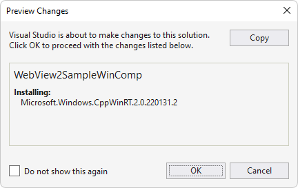

# WebView2 sample: Win32 C++ app with Visual Composition

This WebView2 sample demonstrates creating an application that embeds a WebView2 control within a Win32 native application.

It is built as a Win32 Visual Studio 2019 project and makes use of both C++ and HTML/CSS/JavaScript in the WebView2 environment.

It also uses Windows Runtime Composition APIs (also called the Visual layer) to take avantage of the Windows UI features and create a better look, feel, and functionality in C++ Win32 applications.

Directory &amp; .sln: **WebView2SampleWinComp/WebView2SampleWinComp.sln**.


**To use this sample (general-purpose steps):**

The steps on the present page are general-purpose.  See the sample-specific steps in the README sections, which may override the present page.


<!-- ====================================================================== -->
## Step 1 - View the Readme

1. In a separate window or tab, read the rendered README.md file for this project at GitHub: [README file for WebView2SampleWinComp](https://github.com/MicrosoftEdge/WebView2Samples/tree/master/SampleApps/WebView2SampleWinComp#readme).  Then return to this page and continue the steps below.

   * [README > Prerequisites](https://github.com/MicrosoftEdge/WebView2Samples/tree/master/SampleApps/WebView2SampleWinComp#prerequisites)

   * [README > Build the WebView2 Sample WinComp](https://github.com/MicrosoftEdge/WebView2Samples/tree/master/SampleApps/WebView2SampleWinComp#build-the-webview2-sample-wincomp)

   You can also view the README.md source file (non-rendered) in Visual Studio.  In **File Manager** or Visual Studio > Solution Explorer, open the file:<!-- todo: is there a .md preview capability locally? -->

   `<your-repos-directory>/WebView2Samples/SampleApps/WebView2SampleWinComp/README.md`

   or:

   `<your-repos-directory>/WebView2Samples-master/SampleApps/WebView2SampleWinComp/README.md`


<!-- ====================================================================== -->
## Step 2 - Install Visual Studio

1. If Visual Studio (minimum required version) is not already installed, in a separate window or tab, see [Install Visual Studio](../how-to/machine-setup.md#install-visual-studio) in _Set up your Dev environment for WebView2_.  Follow the steps in that section, and then return to this page and continue the steps below.


<!-- ====================================================================== -->
## Step 3 - Install a preview channel of Microsoft Edge

1. If a preview channel of Microsoft Edge (Beta, Dev, or Canary) is not already installed, in a separate window or tab, see [Install a preview channel of Microsoft Edge](../how-to/machine-setup.md#install-a-preview-channel-of-microsoft-edge) in _Set up your Dev environment for WebView2_.  Follow the steps in that section, and then return to this page and continue the steps below.


<!-- ====================================================================== -->
## Step 4 - Download or clone the WebView2Samples repo

1. If not done already, download or clone the `WebView2Sample` repo to your local drive.  In a separate window or tab, see [Download the WebView2Samples repo](../how-to/machine-setup.md#download-the-webview2samples-repo) in _Set up your Dev environment for WebView2_.  Follow the steps in that section, and then return to this page and continue below.


<!-- ====================================================================== -->
## Step 5 - Open .sln in Visual Studio

1. On your local drive, open the `.sln` file in Visual Studio, in the directory:

   *  `<your-repos-directory>/WebView2Samples/SampleApps/WebView2SampleWinComp/WebView2SampleWinComp.sln`

   or:

   *  `<your-repos-directory>/WebView2Samples-master/SampleApps/WebView2SampleWinComp/WebView2SampleWinComp.sln`

   A **Review Solution Actions** dialog box might appear:

   

1. Click the **OK** button.


<!-- ====================================================================== -->
## Step 6 - Install workloads if prompted

1. If prompted, install any Visual Studio workloads that are requested.  In a separate window or tab, see [Install Visual Studio workloads](../how-to/machine-setup.md#install-visual-studio-workloads) in _Set up your Dev environment for WebView2_.  Follow the steps in that section, and then return to this page and continue below.

   Solution Explorer shows the **WebView2SampleWinComp** project.

   <!-- Solution Explorer shows the **WebView2SampleWinComp** project: -->

   <!--  -->
   <!--todo: create png-->


<!-- ====================================================================== -->
## Step 7 - View the opened project

The project opens in Visual Studio:


_To zoom, right-click > **Open image in new tab**._


<!-- ====================================================================== -->
## Step 8 - Install or update the WebView2 SDK

<!-- comment on sample says: "Update apps to to 1.0.1056-prerelease (#110)"  Oct 28 2021 -->

1. Install or update the WebView2 SDK on the project node (not the solution node) in Solution Explorer.  In a separate window or tab, see [Install the WebView2 SDK](../how-to/machine-setup.md#install-the-webview2-sdk) in _Set up your Dev environment for WebView2_.  Follow the steps in that section, and then return to this page and continue below.


<!-- ====================================================================== -->
## Step 9 - Build the project

At the top of Visual Studio, set the build target, as follows:

1. In the **Solution Configurations** drop-down list, select **Debug** or **Release**.

1. In the **Solution Platforms** drop-down list, select **x86**, **x64**, or **ARM64**.

1. In **Solution Explorer**, right-click the **WebView2SampleWinComp** project, and then select **Build**.

   This builds the project file `SampleApps/WebView2SampleWinComp/WebView2SampleWinComp.vcxproj`.


<!-- ====================================================================== -->
## Step 10 - Install or update the Microsoft.Windows.CppWinRT package

In the above step, the build might fail, as follows:

   ```
   Build started...
   1>------ Build started: Project: WebView2SampleWinComp, Configuration: Debug x64 ------
   1>AppWindow.cpp
   1>C:\Program Files (x86)\Windows Kits\10\Include\10.0.19041.0\cppwinrt\winrt\impl\Windows.Foundation.0.h(983,26):
   error C2039: 'wait_for': is not a member of 'winrt::impl'
   1>C:\Program Files (x86)\Windows Kits\10\Include\10.0.19041.0\cppwinrt\winrt\impl\Windows.Foundation.0.h(103):
   message : see declaration of 'winrt::impl'
   1>C:\Program Files (x86)\Windows Kits\10\Include\10.0.19041.0\cppwinrt\winrt\impl\Windows.Foundation.0.h(985):
   message : see reference to class template instantiation 'winrt::impl::consume_Windows_Foundation_IAsyncAction<D>' being compiled
   ...
   1>Generating Code...
   1>Done building project "WebView2SampleWinComp.vcxproj" -- FAILED.
   ========== Build: 0 succeeded, 1 failed, 0 up-to-date, 0 skipped ==========
   ```

1. To fix the issue: In **Solution Explorer**, right-click the solution's project node (not the solution node) and then select **Manage NuGet Packages**.

   The **NuGet Package Manager** tab opens in Visual Studio.

1. In the **NuGet** window, click the **Browse** tab.

1. On the right of the search bar, clear the **Include prerelease** checkbox (unless you know that you want a prerelease version of the SDK).

1. In the search bar in the upper left, type **Microsoft.Windows.CppWinRT**.

1. Below the search bar, click the **Microsoft.Windows.CppWinRT** card.

1. In the right-hand pane, click the **Install** (or **Update**) button.  NuGet downloads the Microsoft.Windows.CppWinRT package to your machine, for use by this project.

   

   _To zoom, right-click > **Open image in new tab**._

   The **Preview Changes** dialog box opens:

   

1. Click the **OK** button.

1. The `readme.txt` file opens for the CppWinRT package:

   

The Microsoft.Windows.CppWinRT package is now installed or updated.  Continue with the steps below.

### See also

* [NuGet.org > Microsoft.Windows.CppWinRT NuGet package](https://www.nuget.org/packages/Microsoft.Windows.CppWinRT/)

* [GitHub > microsoft/cppwinrt repo > Issues > error C2039: 'wait_for': is not a member of 'winrt::impl' #744](https://github.com/microsoft/cppwinrt/issues/744)

   <!-- > `impl::wait_for` is defined later in `Windows.Foundation.h:2960`, but other foundation headers (via `2.h`, `1.h` and `0.h`) included earlier require it.
   >
   > The version of C++/WinRT that ships in the Windows SDK is rather old, and fails to compile with the stricter conformance expectations of more recent compilers. You can get a newer version of C++/WinRT here: https://aka.ms/cppwinrt/nuget
   >
   > I ended up running the `cppwinrt.exe` manually, since I couldn't get the `CMake VC_PROJECT_IMPORT` to work.  This works well for me; the headers are all generated in my build folder at generation time. -->


<!-- ====================================================================== -->
## Step 11 - Build the project again

1. In **Solution Explorer**, right-click the **WebView2SampleWinComp** project, and then select **Build**.

   This builds the project file `SampleApps/WebView2SampleWinComp/WebView2SampleWinComp.vcxproj`.

   <!-- The build might fail:

   

   _To zoom, right-click > **Open image in new tab**._ -->


<!-- ====================================================================== -->
## Step 12 - Run (debug) the project

<!-- retest: -->

1. In Visual Studio, select **Debug** > **Start Debugging** (`F5`).

   Troubleshooting: If you try to debug before building the project, a dialog box might appear: "There were build errors":

   

   Click the **Yes** button.  A dialog box appears: "Unable to start program: cannot find file":

   

   To fix that issue, build the project before debugging it.
   <!-- ------------------------------- -->

   After resolving the build issue, and then entering debug mode, the sample app window opens.

   <!-- The sample app window opens: -->
   <!--  -->
   <!-- todo: create png -->

1. Use the sample app; see [README file for WebView2SampleWinComp](https://github.com/MicrosoftEdge/WebView2Samples/tree/master/SampleApps/WebView2SampleWinComp#readme).

1. In Visual Studio, select **Debug** > **Stop Debugging**.  Visual Studio closes the app.


<!-- ====================================================================== -->
## Step 13 - Inspect the code

1. In the Visual Studio code editor, inspect the code.

   <!--
   1. In the Visual Studio code editor, inspect the code:

   

   _To zoom, right-click > **Open image in new tab**._
   -->


<!-- ====================================================================== -->
## See also

* [Get started with WebView2 in Win32 apps](../get-started/win32.md)
