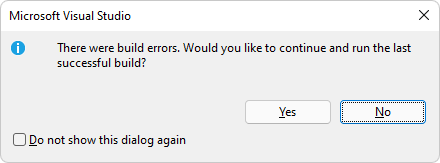

# WebView2 sample: Win32 C++ app with Visual Composition

This WebView2 sample demonstrates creating an application that embeds a WebView2 control within a Win32 native application.

It is built as a Win32 Visual Studio 2019 project and makes use of both C++ and HTML/CSS/JavaScript in the WebView2 environment.

It also uses Windows Runtime Composition APIs (also called the Visual layer) to take advantage of the Windows UI features and create a better look, feel, and functionality in C++ Win32 applications.

Directory &amp; .sln: **WebView2SampleWinComp/WebView2SampleWinComp.sln**.

**To use this sample (general-purpose steps):**

The steps on the present page are general-purpose.  See the sample-specific steps in the README sections, which may override the present page.

<!-- ====================================================================== -->
## Step 1 - View the Readme

1. In a separate window or tab, read the rendered README.md file for this project at GitHub: [README file for WebView2SampleWinComp](https://github.com/MicrosoftEdge/WebView2Samples/tree/main/SampleApps/WebView2SampleWinComp#readme).  Then return to this page and continue the steps below.

   * [README > Prerequisites](https://github.com/MicrosoftEdge/WebView2Samples/tree/main/SampleApps/WebView2SampleWinComp#prerequisites)

   * [README > Build the WebView2 Sample WinComp](https://github.com/MicrosoftEdge/WebView2Samples/tree/main/SampleApps/WebView2SampleWinComp#build-the-webview2-sample-wincomp)

   You can also view the README.md source file (non-rendered) in Visual Studio.  In **File Manager** or Visual Studio > Solution Explorer, open the file:<!-- todo: is there a .md preview capability locally? -->

   `<your-repos-directory>/WebView2Samples/SampleApps/WebView2SampleWinComp/README.md`

   or:

   `<your-repos-directory>/WebView2Samples-main/SampleApps/WebView2SampleWinComp/README.md`

<!-- ====================================================================== -->
## Step 2 - Install Visual Studio

Microsoft Visual Studio is required.  Microsoft Visual Studio Code is not supported for this sample.

1. If Visual Studio (minimum required version) is not already installed, in a separate window or tab, see [Install Visual Studio](../how-to/machine-setup.md#install-visual-studio) in _Set up your Dev environment for WebView2_.  Follow the steps in that section, and then return to this page and continue the steps below.

<!-- ====================================================================== -->
## Step 3 - Install a preview channel of Microsoft Edge

1. If a preview channel of Microsoft Edge (Beta, Dev, or Canary) is not already installed, in a separate window or tab, see [Install a preview channel of Microsoft Edge](../how-to/machine-setup.md#install-a-preview-channel-of-microsoft-edge) in _Set up your Dev environment for WebView2_.  Follow the steps in that section, and then return to this page and continue the steps below.

<!-- ====================================================================== -->
## Step 4 - Download or clone the WebView2Samples repo

1. If not done already, download or clone the `WebView2Sample` repo to your local drive.  In a separate window or tab, see [Download the WebView2Samples repo](../how-to/machine-setup.md#download-the-webview2samples-repo) in _Set up your Dev environment for WebView2_.  Follow the steps in that section, and then return to this page and continue below.

<!-- ====================================================================== -->
## Step 5 - Open the Solution and set the Windows SDK target

1. On your local drive, open the `.sln` file in Visual Studio, in the directory:

   *  `<your-repos-directory>/WebView2Samples/SampleApps/WebView2SampleWinComp/WebView2SampleWinComp.sln`

   or:

   *  `<your-repos-directory>/WebView2Samples-main/SampleApps/WebView2SampleWinComp/WebView2SampleWinComp.sln`

   A **Review Solution Actions** dialog box opens:

   

1. In the **Windows SDK Version** dropdown list, select **10.0.20348.0** or **10.0.18362.0** (but not 10.0.19041.0), and then click the **OK** button.  If those versions aren't available, use the next section, otherwise, skip to the section below it.

<!-- ====================================================================== -->
## Step 6 - Install the Windows SDK

<!-- todo: rewrite in reaction to being prompted to retarget while opening .sln -->

By default, this sample app uses the latest Window 10 SDK version you have installed.  There's an issue with Windows 10 SDK, version 2004 (10.0.**19041**.0) that will stop this sample app from building.  If you run into this issue, either install (and retarget this project to use) a later version, such as Windows 10 SDK version 2104 (10.0.**20348**.0), or an earlier version, such as 10.0.**18362**.1.  

To install a Windows 10 SDK:

1. Go to [Windows SDK and emulator archive](https://developer.microsoft.com/en-us/windows/downloads/sdk-archive/).

1. On row **Windows 10 SDK version 2104 (10.0.20348.0)** or **Windows 10 SDK, version 1903 (10.0.18362.1)**, click the **Install SDK** link.  The **Windows SDK setup** window opens:

  

1. Click the **Next** button and then follow the prompts.  You can accept the defaults.  At the end of installing, the Windows SDK Welcome screen for whichever version that you selected appears:

  

1. Click the **Close** button.

<!-- ====================================================================== -->
## Step 7 - Install workloads if prompted

*  If prompted, install any Visual Studio workloads that are requested.  In a separate window or tab, see [Install Visual Studio workloads](../how-to/machine-setup.md#install-visual-studio-workloads) in _Set up your Dev environment for WebView2_.  Follow the steps in that section, and then return to this page and continue below.

<!-- ====================================================================== -->
## Step 8 - View the opened project

The project opens in Visual Studio, showing the **WebView2SampleWinComp** project in Solution Explorer:

_To zoom, right-click > **Open image in new tab**._

<!-- todo: test & note:

June 9, 2022, after downloading the samples repo: 
Does the project successfully build immediately?  No, it says WIL 1.0.200902.2 is missing. that contradicts Update tab, which offers to update from that version (supposedly installed).
Initially, Update tab of NuGet Package Manager offers to update from that to 1.0.220201.1

Which release version of WebView2 SDK is initially installed in the repo downloaded today?   1.0.1056-prerelease
Updates tab shows possible update from that to 1.0.1248-prerelease

In NuGet Package Manager, does it offer to update, to which version of release?

for the windows SDK, I installed them from here Windows SDK and emulator archive | Microsoft Developer

https://developer.microsoft.com/en-us/windows/downloads/sdk-archive/

and then right click the project and retarget it to which SDK I want to use

-->

<!-- ====================================================================== -->
## Step 9 - Install or update the WebView2 prerelease SDK

This step is optional.  The sample has preinstalled a version of the WebView2 prerelease SDK.

1. In **Solution Explorer**, right-click the **WebView2SampleWinComp** project (not the Solution node), and then select **Manage NuGet Packages**.  The **NuGet Package Manager** tab opens.

1. Select the **Include prerelease** checkbox.

1. Click the **Updates** tab.

1. If a newer prerelease of the **Microsoft.Web.WebView2** SDK is listed, click the **Update** button.  A prerelease has a "-prerelease" suffix, such as **1.0.1248-prerelease**.  If you want to see details about this step, in a separate window or tab, see [Install the WebView2 SDK](../how-to/machine-setup.md#install-the-webview2-sdk) in _Set up your Dev environment for WebView2_.  Follow the steps in that section, and then return to this page and continue below.

_To zoom, right-click > **Open image in new tab**._

<!-- ====================================================================== -->
## Step 10 - Install or update the Windows Implementation Libraries (WIL)

<!-- resume here -->

This step is optional.  The sample has preinstalled a version of the Windows Implementation Libraries (WIL).

1. In **Solution Explorer**, right-click the **WebView2SampleWinComp** project (not the Solution node), and then select **Manage NuGet Packages**.  The **NuGet Package Manager** tab opens.

1. Install or update the Windows Implementation Libraries (WIL) on the project node (not the solution node) in Solution Explorer.  If the WebView2 prerelease SDK is already installed, and a newer prerelease is listed in the Update tab, update it.  In a separate window or tab, see [Install the WebView2 SDK](../how-to/machine-setup.md#install-the-webview2-sdk) in _Set up your Dev environment for WebView2_.  Follow the steps in that section, and then return to this page and continue below.

<!-- ====================================================================== -->
## Step 11 - Build the project

At the top of Visual Studio, set the build target, as follows:

1. In the **Solution Configurations** dropdown list, select **Debug** or **Release**.

1. In the **Solution Platforms** dropdown list, select **x86**, **x64**, or **ARM64**.

1. In **Solution Explorer**, right-click the **WebView2SampleWinComp** project, and then select **Build**.

   This builds the project file `SampleApps/WebView2SampleWinComp/WebView2SampleWinComp.vcxproj`.

<!-- ====================================================================== -->
## Step 12 - Run (debug) the project

1. In Visual Studio, select **Debug** > **Start Debugging** (`F5`).

   Troubleshooting: If you try to debug before building the project, a dialog box might appear: "There were build errors":

   

   Click the **Yes** button.  A dialog box appears: "Unable to start program: cannot find file":

   

   To fix that issue, build the project before debugging it.
   <!-- ------------------------------- -->

   After resolving the build issue, and then entering debug mode, the sample app window opens.

   <!-- The sample app window opens: -->
   <!--  -->
   <!-- todo: create png -->

1. Use the sample app; see [README file for WebView2SampleWinComp](https://github.com/MicrosoftEdge/WebView2Samples/tree/main/SampleApps/WebView2SampleWinComp#readme).

1. In Visual Studio, select **Debug** > **Stop Debugging**.  Visual Studio closes the app.

<!-- ====================================================================== -->
## Step 13 - Inspect the code

1. In the Visual Studio code editor, inspect the code.

   <!--
   1. In the Visual Studio code editor, inspect the code:

   

   _To zoom, right-click > **Open image in new tab**._
   -->

<!-- ====================================================================== -->
## See also

* [Get started with WebView2 in Win32 apps](../get-started/win32.md)
