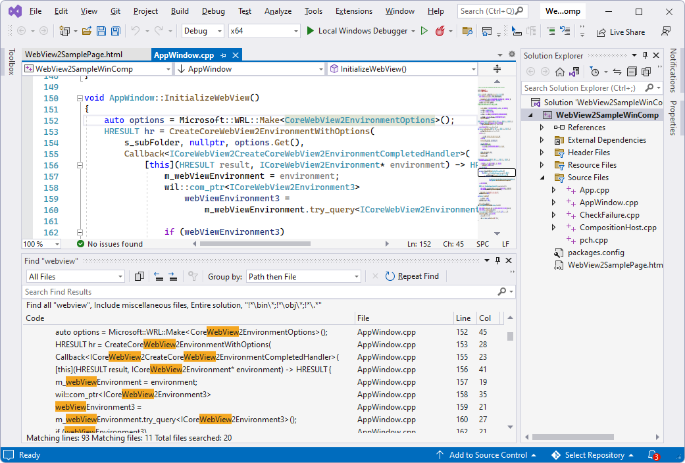

# Win32 sample app with Visual Composition

This WebView2 sample embeds a WebView2 control within a Win32 native application.

*  Sample name: **WebView2SampleWinComp**
*  Repo directory: [WebView2SampleWinComp](https://github.com/MicrosoftEdge/WebView2Samples/tree/main/SampleApps/WebView2SampleWinComp)
*  Solution file: **WebView2SampleWinComp.sln**

This sample is built as a Win32 Visual Studio 2019 project.  It uses C++ and HTML/CSS/JavaScript in the WebView2 environment.

This sample uses the [Windows Runtime Composition APIs](/uwp/api/windows.ui.composition) (also called the Visual layer) to take advantage of the Windows UI features and create a better look, feel, and functionality in C++ Win32 applications.

This sample showcases a selection of WebView2's event handlers and API methods that allow a native Win32 application to directly interact with a WebView and vice versa.

If this is your first time using WebView, we recommend first following the tutorial [Get started with WebView2 in Win32 apps](../get-started/win32.md), which goes over how to create a WebView2 and walks through some basic WebView2 functionality.

See also [Readme file for WebView2SampleWinComp](https://github.com/MicrosoftEdge/WebView2Samples/tree/main/SampleApps/WebView2SampleWinComp#readme).

<!-- ====================================================================== -->
## Step 1 - Install a preview channel of Microsoft Edge

We recommend the latest version of the Edge Canary channel.

1. If a preview channel of Microsoft Edge (Beta, Dev, or Canary) is not already installed, in a separate window or tab, see [Install a preview channel of Microsoft Edge](../how-to/machine-setup.md#install-a-preview-channel-of-microsoft-edge) in _Set up your Dev environment for WebView2_.  Follow the steps in that section, and then return to this page and continue the steps below.

<!-- ====================================================================== -->
## Step 2 - Install Visual Studio with C++ support

Microsoft Visual Studio is required.  Microsoft Visual Studio Code is not supported for this sample.

This sample is built as a Win32 Visual Studio 2019 project.

1. If Visual Studio (minimum required version) is not already installed, in a separate window or tab, see [Install Visual Studio](../how-to/machine-setup.md#install-visual-studio) in _Set up your Dev environment for WebView2_.  Follow the steps in that section, and then return to this page and continue the steps below.

1. If you want to use Visual Studio 2017, change the project's **Platform Toolset** in **Project Properties > Configuration properties > General > Platform Toolset**.  You might also need to change the Windows SDK to the latest version available to you.

#### Other prerequisites

* WebView2 SDK - A prerelease version of the WebView2 SDK is already installed in this sample project.  Steps are shown below to optionally update the SDK.

* Windows 10 SDK - By default, this sample app will use the latest Window 10 SDK version that's installed on your machine.  However, there is an issue with Windows 10 SDK, version 2004 (10.0.19041.0) that will stop this sample app from building.  Steps are provided below to install a compatible version of the Windows 10 SDK.

<!-- ====================================================================== -->
## Step 3 - Clone or download the WebView2Samples repo

The first step to build this sample is to get a local copy of the samples repo.

1. If not done already, clone or download the `WebView2Samples` repo to your local drive.  In a separate window or tab, see [Download the WebView2Samples repo](../how-to/machine-setup.md#download-the-webview2samples-repo) in _Set up your Dev environment for WebView2_.  Follow the steps in that section, and then return to this page and continue below.

<!-- ====================================================================== -->
## Step 4 - Open the Solution and set the Windows SDK target

1. On your local drive, open the `.sln` file in Visual Studio, in the directory:

   * `<your-repos-directory>/WebView2Samples/SampleApps/WebView2SampleWinComp/WebView2SampleWinComp.sln`

   or:

   * `<your-repos-directory>/WebView2Samples-main/SampleApps/WebView2SampleWinComp/WebView2SampleWinComp.sln`

   A **Review Solution Actions** dialog might open, prompting you for which installed Windows SDK to retarget the project to:

   

1. In the **Windows SDK Version** dropdown list, select **10.0.20348.0** or later, or **10.0.18362.0** or earlier; do not select **10.0.19041.0**.  Then click the **OK** button.  If those versions aren't available, do the steps in the "Install the Windows SDK" section below.  Otherwise, skip to the section below that.

If the solution is already open, you can change the target as follows:

*  In **Solution Explorer**, right-click the **WebView2SampleWinComp** project (not solution), and then click **Retarget Projects**.

<!-- ====================================================================== -->
## Step 5 - Install the Windows SDK

By default, this sample app uses the latest Window 10 SDK version you have installed.  There's an issue with Windows 10 SDK, version 2004 (10.0.**19041**.0) that will stop this sample app from building.  If you run into this issue, either install (and retarget this project to use) a later version, such as Windows 10 SDK version 2104 (10.0.**20348**.0), or an earlier version, such as 10.0.**18362**.1.  

To install a Windows 10 SDK:

1. Go to [Windows SDK and emulator archive](https://developer.microsoft.com/windows/downloads/sdk-archive/).

1. On one of the following rows, click the **Install SDK** link:
   *  Windows 10 SDK version 2104 (10.0.20348.0) (or later)
   *  Windows 10 SDK, version 1903 (10.0.18362.1)

   A version-specific copy of `winsdksetup.exe` is downloaded to your `Downloads` directory.

1. In your `Downloads` directory, open the copy of `winsdksetup.exe` that you just downloaded.

1. The **Windows SDK setup** window opens:

   

1. Click the **Next** button and then follow the prompts.  You can accept the defaults.  At the end of installing, the Windows SDK Welcome screen for whichever version that you selected appears:

   

1. Click the **Close** button.

Do the previous step, "Open the Solution and set the Windows SDK target".  Or, if the solution is already open, in **Solution Explorer**, right-click the **WebView2SampleWinComp** project (not solution), and then click **Retarget Projects**.

<!-- ====================================================================== -->
## Step 6 - Install workloads if prompted

*  If prompted, install any Visual Studio workloads that are requested.  In a separate window or tab, see [Install Visual Studio workloads](../how-to/machine-setup.md#install-visual-studio-workloads) in _Set up your Dev environment for WebView2_.  Follow the steps in that section, and then return to this page and continue below.

<!-- ====================================================================== -->
## Step 7 - Build and run the project

After opening the solution in Visual Studio (above) and responding to any setup or installation prompts, the project opens in Visual Studio, showing the **WebView2SampleWinComp** project in Solution Explorer:

At the top of Visual Studio, set the build target, as follows:

1. In the **Solution Configurations** dropdown list, select **Debug** or **Release**.

1. In the **Solution Platforms** dropdown list, select **x86**, **x64**, or **ARM64**.

1. In **Solution Explorer**, right-click the **WebView2SampleWinComp** project, and then select **Build**.

   This builds the project file `SampleApps/WebView2SampleWinComp/WebView2SampleWinComp.vcxproj`.

1. Select **Debug** > **Start Debugging** (**F5**).

   The sample app window opens:

   

1. In Visual Studio, select **Debug** > **Stop Debugging**.  Visual Studio closes the app.

<!-- ====================================================================== -->
## Step 8 - Update the installed packages

This step is optional.  The sample has preinstalled:
*  A version of the WebView2 prerelease SDK.
*  A version of the Windows Implementation Libraries (WIL).

1. In **Solution Explorer**, right-click the **WebView2SampleWinComp** project (not the Solution node), and then select **Manage NuGet Packages**.  The **NuGet Package Manager** tab opens.

1. Select the **Include prerelease** checkbox.

1. Click the **Installed** tab.  For each package, note whether there are two versions listed (the current version and an available updated version number).

1. Click the **Updates** tab.

1. If a newer prerelease of the **Microsoft.Web.WebView2** SDK is listed, you can optionally click the **Update** button.  A prerelease has a "-prerelease" suffix, such as **1.0.1248-prerelease**.  If you want to see details about this step, in a separate window or tab, see [Install or update the WebView2 SDK](../how-to/machine-setup.md#install-or-update-the-webview2-sdk) in _Set up your Dev environment for WebView2_.  Follow the steps in that section, and then return to this page and continue below.

   

1. If a newer release of the Windows Implementation Libraries (WIL) is listed, you can optionally click the **Update** button.

1. Follow the prompts to continue updating the packages.

1. Build and run the project again, now using the updated packages.

<!-- ====================================================================== -->
## Step 9 - Inspect the code

1. In the Visual Studio code editor, inspect the code:

   

<!-- ====================================================================== -->
## See also

* [Get started with WebView2 in Win32 apps](../get-started/win32.md)
* [WebView2 API Reference](../webview2-api-reference.md)
