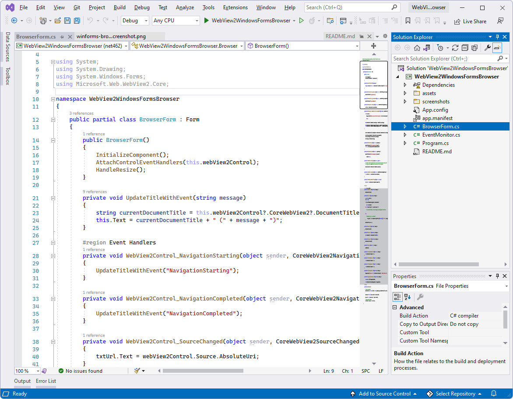
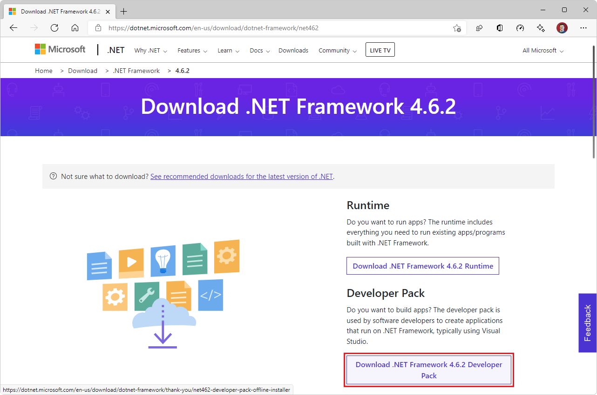
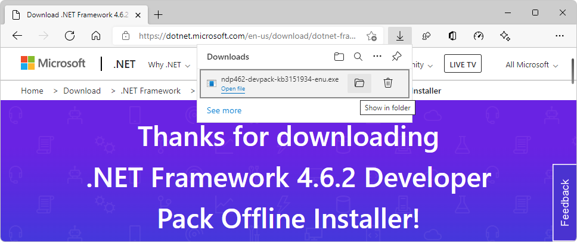
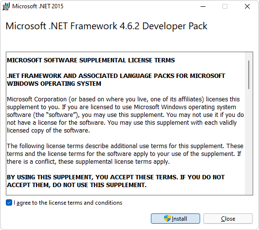
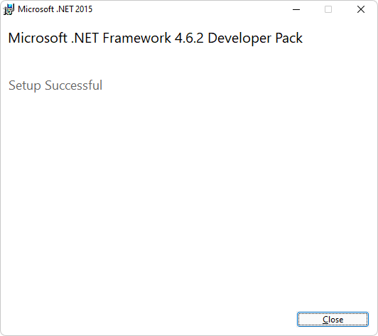
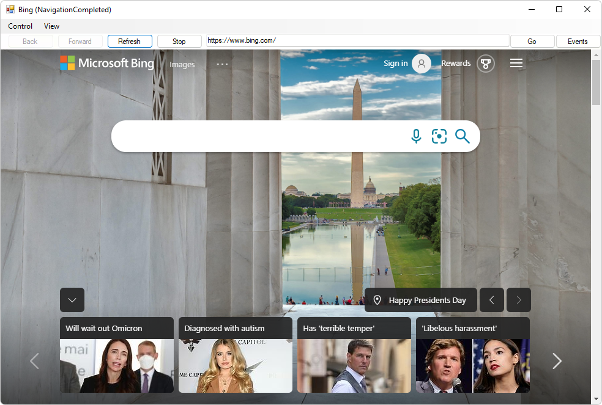

# WinForms sample app

<!-- todo: paste/merge into here from corresp Readme https://github.com/MicrosoftEdge/WebView2Samples/pull/140/files -->

This sample, **WebView2WindowsFormsBrowser**, demonstrates how to use the WebView2 control and WebView2 APIs to implement a web browser in a WinForms app.

*  Sample name: **WebView2WindowsFormsBrowser**
*  Repo directory: [WebView2WindowsFormsBrowser](https://github.com/MicrosoftEdge/WebView2Samples/tree/main/SampleApps/WebView2WindowsFormsBrowser)
*  Solution file: **WebView2WindowsFormsBrowser.sln**

<!-- ====================================================================== -->
## Step 1 - View the Readme

The steps on the present page are general-purpose.  See the sample-specific steps in the README sections, which may override the present page.

To use this sample, follow the steps below in order.

1. In a separate window or tab, read the rendered README.md file for this project at GitHub: [README file for WebView2WindowsFormsBrowser](https://github.com/MicrosoftEdge/WebView2Samples/tree/main/SampleApps/WebView2WindowsFormsBrowser#readme).  Then return to this page and continue the steps below.

   * [README > Prerequisites](https://github.com/MicrosoftEdge/WebView2Samples/tree/main/SampleApps/WebView2WindowsFormsBrowser#prerequisites)

   * [README > Build the WebView2 Windows Forms Browser](https://github.com/MicrosoftEdge/WebView2Samples/tree/main/SampleApps/WebView2WindowsFormsBrowser#build-the-webview2-windows-forms-browser)

   You can also view the README.md source file (non-rendered) in Visual Studio.  In **File Manager** or Visual Studio > Solution Explorer, open the file:<!-- todo: is there a .md preview capability locally? -->

   `<your-repos-directory>/WebView2Samples/SampleApps/WebView2WindowsFormsBrowser/README.md`

   or:

   `<your-repos-directory>/WebView2Samples-main/SampleApps/WebView2WindowsFormsBrowser/README.md`

<!-- ====================================================================== -->
## Step 2 - Install Visual Studio

Microsoft Visual Studio is required.  Microsoft Visual Studio Code is not supported for this sample.

1. If Visual Studio (minimum required version) is not already installed, in a separate window or tab, see [Install Visual Studio](../how-to/machine-setup.md#install-visual-studio) in _Set up your Dev environment for WebView2_.  Follow the steps in that section, and then return to this page and continue the steps below.

<!-- ====================================================================== -->
## Step 3 - Install a preview channel of Microsoft Edge

1. If a preview channel of Microsoft Edge (Beta, Dev, or Canary) is not already installed, in a separate window or tab, see [Install a preview channel of Microsoft Edge](../how-to/machine-setup.md#install-a-preview-channel-of-microsoft-edge) in _Set up your Dev environment for WebView2_.  Follow the steps in that section, and then return to this page and continue the steps below.

<!-- ====================================================================== -->
## Step 4 - Download or clone the WebView2Samples repo

1. If not done already, download or clone the `WebView2Sample` repo to your local drive.  In a separate window or tab, see [Download the WebView2Samples repo](../how-to/machine-setup.md#download-the-webview2samples-repo) in _Set up your Dev environment for WebView2_.  Follow the steps in that section, and then return to this page and continue below.

<!-- ====================================================================== -->
## Step 5 - Open .sln in Visual Studio

1. On your local drive, open the `.sln` file in Visual Studio, in the directory:

   *  `<your-repos-directory>/WebView2Samples/SampleApps/WebView2WindowsFormsBrowser/WebView2WindowsFormsBrowser.sln`

   or:

   *  `<your-repos-directory>/WebView2Samples-main/SampleApps/WebView2WindowsFormsBrowser/WebView2WindowsFormsBrowser.sln`

<!-- ====================================================================== -->
## Step 6 - Install workloads if prompted

1. If prompted, install any Visual Studio workloads that are requested.  In a separate window or tab, see [Install Visual Studio workloads](../how-to/machine-setup.md#install-visual-studio-workloads) in _Set up your Dev environment for WebView2_.  Follow the steps in that section, and then return to this page and continue below.

<!-- ====================================================================== -->
## Step 7 - View the opened project

   Solution Explorer shows the **WebView2WindowsFormsBrowser** project.

   <!-- Solution Explorer shows the **WebView2WindowsFormsBrowser** project: -->

   <!--  -->
   <!--todo: create png-->

<!-- ====================================================================== -->
## Step 8 - Install or update the WebView2 SDK

<!-- checking comment at repo says "Update projects to use latest WebView2 SDK 1.0.781-prerelease (#74)" -->

1. **WebView2 SDK** - Install or update the WebView2 SDK on the project node (not the solution node) in Solution Explorer.  In a separate window or tab, see [Install the WebView2 SDK](../how-to/machine-setup.md#install-the-webview2-sdk) in _Set up your Dev environment for WebView2_.  Follow the steps in that section, and then return to this page and continue below.

   <!-- this same png is used multiple times in this file -->
   

   _To zoom, right-click > **Open image in new tab**._

<!-- ====================================================================== -->
## Step 9 - Install .NET Framework 4.6.2 Developer Pack

To build this project, .NET Framework 4.6.2 Developer Pack is required.

To test whether .NET Framework 4.6.2 Developer Pack is installed:

At the top of Visual Studio, set the build target, as follows:

1. In the **Solution Configurations** dropdown list, select **Debug** or **Release**.

1. In the **Solution Platforms** dropdown list, select **Any CPU**.

1. In **Solution Explorer**, right-click the **WebView2WindowsFormsBrowser** project, and then select **Build**.

   This builds the project file `SampleApps/WebView2WindowsFormsBrowser/WebView2WindowsFormsBrowser.vcxproj`.  This might take a couple minutes.

   If you get error messages about missing .NET Framework 4.6.2 Developer Pack, follow the steps below.  Otherwise, skip to the next major section below.

1. Go to [Download .NET Framework](https://dotnet.microsoft.com/download/dotnet-framework/), select v4.6.2, and then click the **Download .NET Framework 4.6.2 Developer Pack** button:

   

1. In Microsoft Edge, select **Settings and more** > **Downloads** > **Show in folder** icon:

   

1. In the `Downloads` folder, double-click the file, such as `ndp462-devpack-kb3151934-enu.exe`.

   The **Microsoft .NET Framework Developer Pack** license agreement dialog box appears:

   
   <!--  4.8, keep as-in, in case needed -->

1. Select the **I agree to the license terms and conditions** checkbox, and then click the **Install** button.

   A **User Account Control** window appears, asking "Do you want to allow this app to make changes to your device?"

1. Click the **Yes** button.

   The Microsoft .NET Framework Developer Pack **Setup Successful** dialog box appears:

   
   <!--  4.8, keep as-in, in case needed -->

1. Click the **Close** button.

Microsoft .NET Framework 4.6.2 Developer Pack is now installed on your machine.

<!-- ====================================================================== -->
## Step 10 - Build the project

1. If you just now installed .NET Framework 4.6.2 Developer Pack above, close Visual Studio, and then open the solution file in Visual Studio again, from the directory:

   *  `<your-repos-directory>/WebView2Samples/SampleApps/WebView2WindowsFormsBrowser/WebView2WindowsFormsBrowser.sln`

   or:

   *  `<your-repos-directory>/WebView2Samples-main/SampleApps/WebView2WindowsFormsBrowser/WebView2WindowsFormsBrowser.sln`

At the top of Visual Studio, set the build target, as follows:

1. In the **Solution Configurations** dropdown list, select **Debug** or **Release**.

1. In the **Solution Platforms** dropdown list, select **Any CPU**.

1. In **Solution Explorer**, right-click the **WebView2WindowsFormsBrowser** project, and then select **Build**.

   This builds the project file `SampleApps/WebView2WindowsFormsBrowser/WebView2WindowsFormsBrowser.vcxproj`.

<!-- ====================================================================== -->
## Step 11 - Run (debug) the project

1. In Visual Studio, select **Debug** > **Start Debugging** (`F5`).

   The sample app window opens:

   

1. Use the sample app; see [README file for WebView2WindowsFormsBrowser](https://github.com/MicrosoftEdge/WebView2Samples/tree/main/SampleApps/WebView2WindowsFormsBrowser#readme).

1. In Visual Studio, select **Debug** > **Stop Debugging**.  Visual Studio closes the app.

<!-- ====================================================================== -->
## Step 12 - Inspect the code

1. In the Visual Studio code editor, inspect the code:

   <!-- this same png is used multiple times in this file -->
   

   _To zoom, right-click > **Open image in new tab**._

<!-- ====================================================================== -->
## See also

* [Get started with WebView2 in WinForms apps](../get-started/winforms.md)
