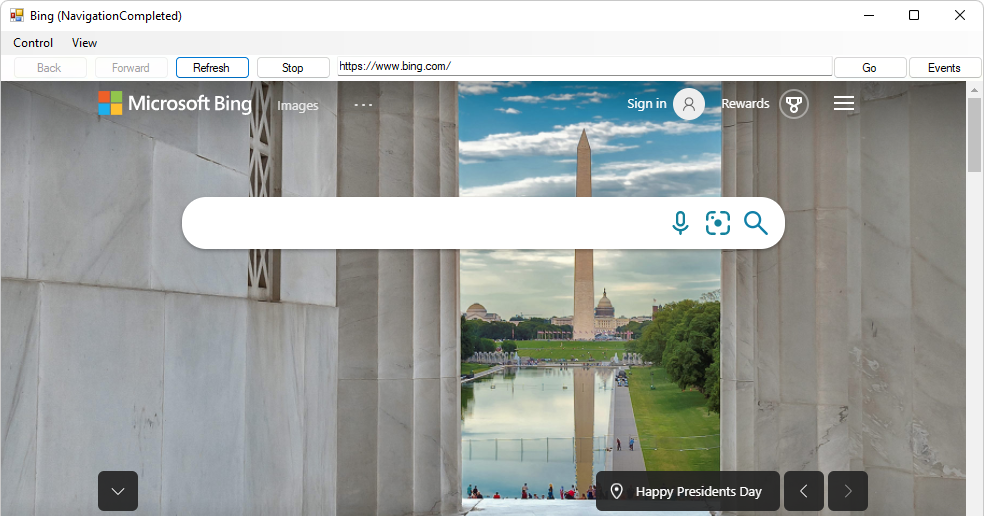
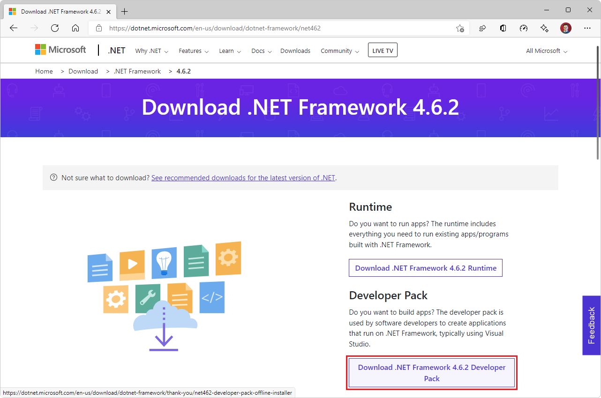
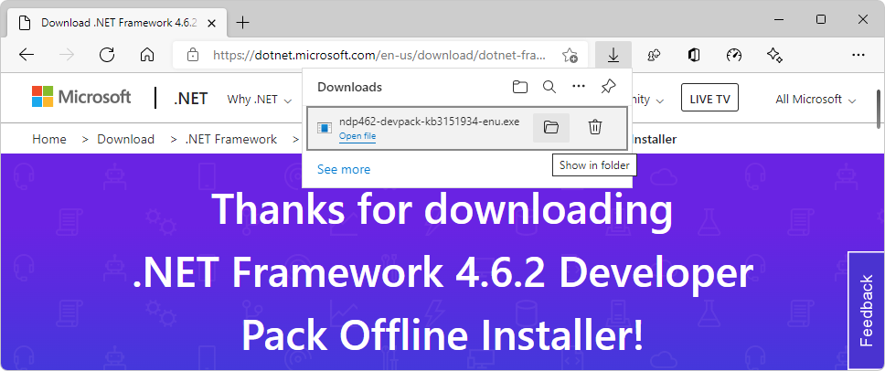
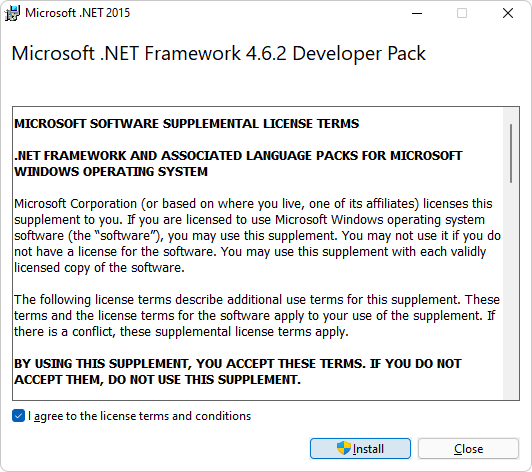
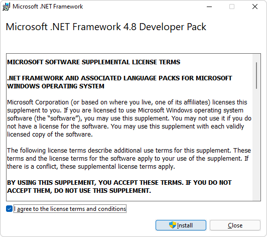
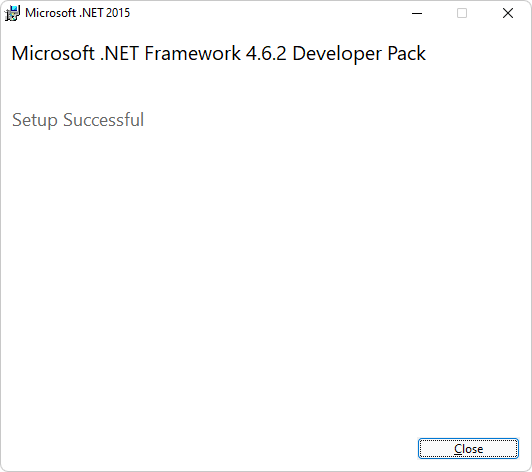
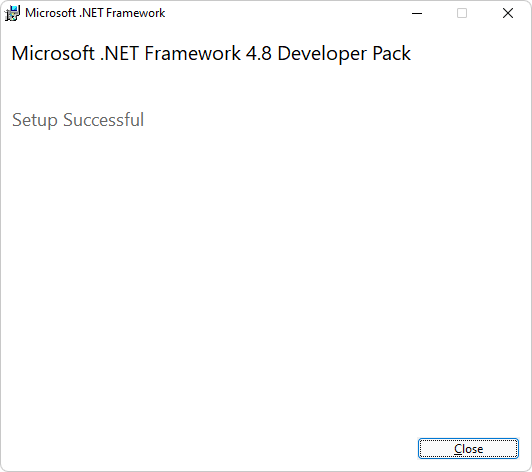
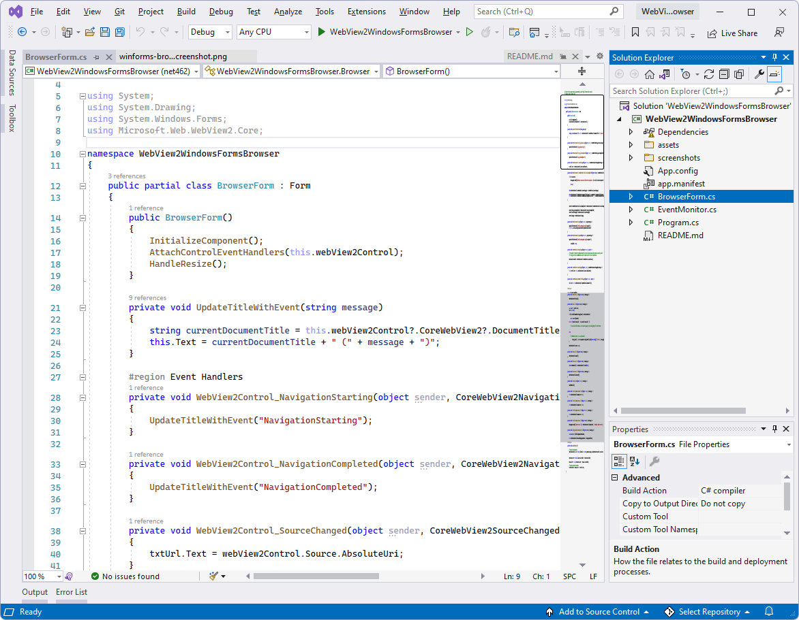

# WinForms sample app

<!-- todo: paste/merge into here from corresp Readme https://github.com/MicrosoftEdge/WebView2Samples/pull/140/files -->

This sample, **WebView2WindowsFormsBrowser**, demonstrates how to use the WebView2 control and WebView2 APIs to implement a web browser in a WinForms app.

*  Sample name: **WebView2WindowsFormsBrowser**
*  Repo directory: [WebView2WindowsFormsBrowser](https://github.com/MicrosoftEdge/WebView2Samples/tree/main/SampleApps/WebView2WindowsFormsBrowser)
*  Solution file: **WebView2WindowsFormsBrowser.sln**

*  The **Control** menu has toggle menuitems for **Accelerator Keys** and **Allow External Drop**.
*  The **View** menu has **Zoom** and **Background Color** submenus.
*  The **Events** button opens the **EventMonitor** window.

<!-- ====================================================================== -->
## Step 1 - Install Visual Studio

Microsoft Visual Studio is required.  Microsoft Visual Studio Code is not supported for this sample.

1. If Visual Studio (minimum required version) is not already installed, in a separate window or tab, see [Install Visual Studio](../how-to/machine-setup.md#install-visual-studio) in _Set up your Dev environment for WebView2_.  Follow the steps in that section, and then return to this page and continue the steps below.

<!-- ====================================================================== -->
## Step 2 - Install a preview channel of Microsoft Edge

1. If a preview channel of Microsoft Edge (Beta, Dev, or Canary) is not already installed, in a separate window or tab, see [Install a preview channel of Microsoft Edge](../how-to/machine-setup.md#install-a-preview-channel-of-microsoft-edge) in _Set up your Dev environment for WebView2_.  Follow the steps in that section, and then return to this page and continue the steps below.

1. To test the experimental APIs ahead of time and ensure your WebView2 app's forward-compatibility, see [Approaches to making your app use a specific browser channel](../how-to/set-preview-channel.md#approaches-to-making-your-app-use-a-specific-browser-channel) in _Test upcoming APIs and features_. Follow the steps in that section, and then return to this page and continue the steps below.

<!-- ====================================================================== -->
## Step 3 - Clone or download the WebView2Samples repo

1. If not done already, clone or download the `WebView2Sample` repo to your local drive.  In a separate window or tab, see [Download the WebView2Samples repo](../how-to/machine-setup.md#download-the-webview2samples-repo) in _Set up your Dev environment for WebView2_.  Follow the steps in that section, and then return to this page and continue below.

<!-- ====================================================================== -->
## Step 4 - Open .sln in Visual Studio

1. On your local drive, open the `.sln` file in Visual Studio, in the directory:

   *  `<your-repos-directory>/WebView2Samples/SampleApps/WebView2WindowsFormsBrowser/WebView2WindowsFormsBrowser.sln`

   or:

   *  `<your-repos-directory>/WebView2Samples-main/SampleApps/WebView2WindowsFormsBrowser/WebView2WindowsFormsBrowser.sln`

<!-- ====================================================================== -->
## Step 5 - Install workloads if prompted

1. If prompted, install any Visual Studio workloads that are requested.  In a separate window or tab, see [Install Visual Studio workloads](../how-to/machine-setup.md#install-visual-studio-workloads) in _Set up your Dev environment for WebView2_.  Follow the steps in that section, and then return to this page and continue below.

<!-- ====================================================================== -->
## Step 6 - Build and run the project

The **WebView2WindowsFormsBrowser** project is now open in Visual Studio, from doing the above steps.  At the top of Visual Studio, set the build target, as follows:

1. In the **Solution Configurations** dropdown list, select **Debug** or **Release**.

1. In the **Solution Platforms** dropdown list, select **Any CPU**.

1. In **Solution Explorer**, right-click the **WebView2WindowsFormsBrowser** project, and then select **Build**.

   This builds the project file `SampleApps/WebView2WindowsFormsBrowser/WebView2WindowsFormsBrowser.vcxproj`.  This might take a couple minutes.

   If you get error messages about missing .NET Framework 4.6.2 Developer Pack, follow the steps below.  Otherwise, skip to the next major section below.

1. In Visual Studio, select **Debug** > **Start Debugging** (**F5**).

   The sample app window opens:

   

1. Use the sample app; see [README file for WebView2WindowsFormsBrowser](https://github.com/MicrosoftEdge/WebView2Samples/tree/main/SampleApps/WebView2WindowsFormsBrowser#readme).

1. In Visual Studio, select **Debug** > **Stop Debugging**.  Visual Studio closes the app.

<!-- ====================================================================== -->
## Step 7 - Install .NET Framework 4.6.2 Developer Pack

If you build the **WebView2WindowsFormsBrowser** project and get error messages about missing .NET Framework 4.6.2 Developer Pack, follow the steps below.  Otherwise, skip to the next major section below.

1. Go to [Download .NET Framework](https://dotnet.microsoft.com/download/dotnet-framework/), select v4.6.2, and then click the **Download .NET Framework 4.6.2 Developer Pack** button:

   

1. In Microsoft Edge, select **Settings and more** > **Downloads** > **Show in folder** icon:

   

1. In the `Downloads` folder, double-click the file, such as `ndp462-devpack-kb3151934-enu.exe`.

   The **Microsoft .NET Framework Developer Pack** license agreement dialog appears:

   
   <!--  4.8, keep as-in, in case needed -->

1. Select the **I agree to the license terms and conditions** checkbox, and then click the **Install** button.

   A **User Account Control** window appears, asking "Do you want to allow this app to make changes to your device?"

1. Click the **Yes** button.

   The Microsoft .NET Framework Developer Pack **Setup Successful** dialog appears:

   
   <!--  4.8, keep as-in, in case needed -->

1. Click the **Close** button.

Microsoft .NET Framework 4.6.2 Developer Pack is now installed on your machine.

<!-- ====================================================================== -->
## Step 8 - Update or install the WebView2 SDK

<!-- a checkin comment at repo says "Update projects to use latest WebView2 SDK 1.0.781-prerelease (#74)" -->

1. **WebView2 SDK** - Update or install the WebView2 SDK on the project node (not the solution node) in Solution Explorer.  In a separate window or tab, see [Install or update the WebView2 SDK](../how-to/machine-setup.md#install-or-update-the-webview2-sdk) in _Set up your Dev environment for WebView2_.  Follow the steps in that section, and then return to this page and continue below.

   <!-- this same png is used multiple times in this file -->
   

<!-- ====================================================================== -->
## Step 9 - Build and run the updated project

1. If you just now installed .NET Framework 4.6.2 Developer Pack above, close Visual Studio, and then open the solution file in Visual Studio again, from the directory:

   *  `<your-repos-directory>/WebView2Samples/SampleApps/WebView2WindowsFormsBrowser/WebView2WindowsFormsBrowser.sln`

   or:

   *  `<your-repos-directory>/WebView2Samples-main/SampleApps/WebView2WindowsFormsBrowser/WebView2WindowsFormsBrowser.sln`

At the top of Visual Studio, set the build target, as follows:

1. In the **Solution Configurations** dropdown list, select **Debug** or **Release**.

1. In the **Solution Platforms** dropdown list, select **Any CPU**.

1. In **Solution Explorer**, right-click the **WebView2WindowsFormsBrowser** project, and then select **Build**.

   This builds the project file `SampleApps/WebView2WindowsFormsBrowser/WebView2WindowsFormsBrowser.vcxproj`.

1. In Visual Studio, select **Debug** > **Start Debugging** (**F5**).

   The sample app window opens:

   

   *  The **Control** menu has toggle menuitems for **Accelerator Keys** and **Allow External Drop**.
   *  The **View** menu has **Zoom** and **Background Color** submenus.
   *  The **Events** button opens the **EventMonitor** window.

1. In Visual Studio, select **Debug** > **Stop Debugging**.  Visual Studio closes the app.

<!-- ====================================================================== -->
## Step 10 - Inspect the code

1. In the Visual Studio code editor, inspect the code:

   <!-- this same png is used multiple times in this file -->
   

<!-- ====================================================================== -->
## See also

* [WebView2 API Reference](../webview2-api-reference.md)
* [Get started with WebView2 in WinForms apps](../get-started/winforms.md)
