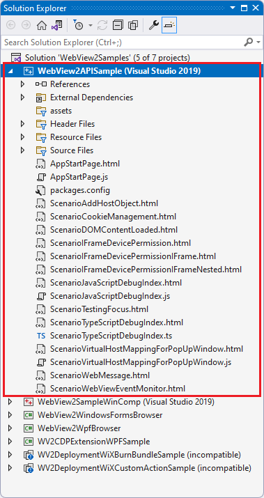

# WebView2 sample: WinForms browser app

This WebView2 sample demonstrates how to use the WebView2 control and WebView2 APIs to implement a web browser in a WinForms app.

<!-- ====================================================================== -->
## To use this sample (general-purpose steps)

The steps on the present page are general-purpose.  See the sample-specific steps in the README sections, which may override the present page.

1. In a separate window or tab, read the rendered README.md file for this project at GitHub: [README file for WebView2WindowsFormsBrowser](https://github.com/MicrosoftEdge/WebView2Samples/tree/master/SampleApps/WebView2WindowsFormsBrowser#readme).  Then return to this page and continue the steps below.

   * [README > Prerequisites](https://github.com/MicrosoftEdge/WebView2Samples/tree/master/SampleApps/WebView2WindowsFormsBrowser#prerequisites)

   * [README > Build the WebView2 Windows Forms Browser](https://github.com/MicrosoftEdge/WebView2Samples/tree/master/SampleApps/WebView2WindowsFormsBrowser#build-the-webview2-windows-forms-browser)

   You can also view the README.md source file (non-rendered) in Visual Studio.  In **File Manager** or Visual Studio > Solution Explorer, open the file:<!-- todo: is there a .md preview capability locally? -->

   `<your-repos-directory>/WebView2Samples/SampleApps/WebView2WindowsFormsBrowser/README.md`

   or:

   `<your-repos-directory>/WebView2Samples-master/SampleApps/WebView2WindowsFormsBrowser/README.md`

1. If Visual Studio (minimum required version) is not already installed, in a separate window or tab, see [Install Visual Studio](../how-to/machine-setup.md#install-visual-studio) in _Set up your Dev environment for WebView2_.  Follow the steps in that section, and then return to this page and continue the steps below.

1. If not done already, download or clone the `WebView2Sample` repo to your local drive.

1. On your local drive, open the `.sln` file in Visual Studio, in the directory:

   *  `<your-repos-directory>/WebView2Samples/SampleApps/WebView2WindowsFormsBrowser/WebView2WindowsFormsBrowser.sln`

   or:

   *  `<your-repos-directory>/WebView2Samples-master/SampleApps/WebView2WindowsFormsBrowser/WebView2WindowsFormsBrowser.sln`

1. If prompted, install any Visual Studio workloads that are requested.  In a separate window or tab, see [Install Visual Studio workloads](../how-to/machine-setup.md#install-visual-studio-workloads) in _Set up your Dev environment for WebView2_.  Follow the steps in that section, and then return to this page and continue below.

   Solution Explorer shows several projects, including the **WebView2APISample** project:

   

1. If needed, install the WebView2 SDK on the project node (not the solution node) in Solution Explorer.  In a separate window or tab, see [Install the WebView2 SDK](../how-to/machine-setup.md#install-the-webview2-sdk) in _Set up your Dev environment for WebView2_.  Follow the steps in that section, and then return to this page and continue below.

1. In Visual Studio, select **Debug** > **Run debug** (`F5`).

   The sample app window opens.

1. In the sample app window, use the sample app.

1. In the Visual Studio code editor, inspect the code; see [README file for WebView2WindowsFormsBrowser](https://github.com/MicrosoftEdge/WebView2Samples/tree/master/SampleApps/WebView2WindowsFormsBrowser#readme).

1. Close the sample app window.
