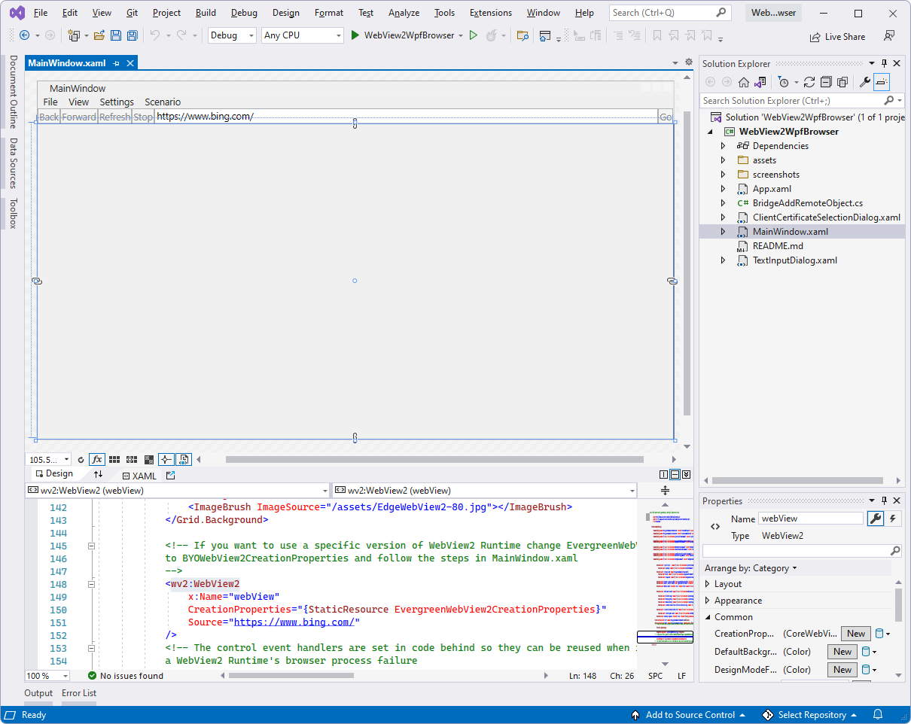
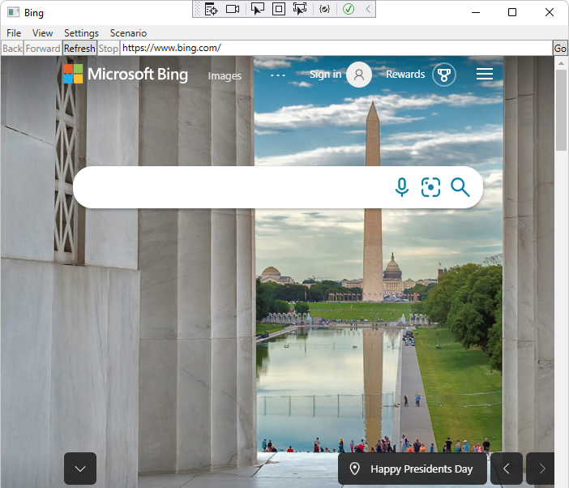
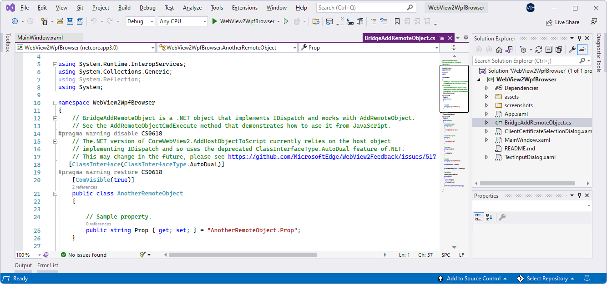

# WebView2 sample: WPF .NET browser app

This WebView2 sample demonstrates how to use the WebView2 control and WebView2 APIs to implement a web browser in a WPF .NET app.

Directory &amp; .sln: **WebView2WpfBrowser/WebView2WpfBrowser.sln**.

<!-- ====================================================================== -->
## Step 1 - View the Readme

The steps on the present page are general-purpose.  See the sample-specific steps in the README sections, which may override the present page.

1. In a separate window or tab, read the rendered README.md file for this project at GitHub: [README file for WebView2WpfBrowser](https://github.com/MicrosoftEdge/WebView2Samples/tree/master/SampleApps/WebView2WpfBrowser#readme).  Then return to this page and continue the steps below.

   * [README > Prerequisites](https://github.com/MicrosoftEdge/WebView2Samples/tree/master/SampleApps/WebView2WpfBrowser#prerequisites)

   * [README > Build the WebView2 WPF Browser](https://github.com/MicrosoftEdge/WebView2Samples/tree/master/SampleApps/WebView2WpfBrowser#build-the-webview2-wpf-browser)

   You can also view the README.md source file (non-rendered) in Visual Studio.  In **File Manager** or Visual Studio > Solution Explorer, open the file:<!-- todo: is there a .md preview capability locally? -->

   `<your-repos-directory>/WebView2Samples/SampleApps/WebView2WpfBrowser/README.md`

   or:

   `<your-repos-directory>/WebView2Samples-master/SampleApps/WebView2WpfBrowser/README.md`

<!-- ====================================================================== -->
## Step 2 - Install Visual Studio

1. If Visual Studio (minimum required version) is not already installed, in a separate window or tab, see [Install Visual Studio](../how-to/machine-setup.md#install-visual-studio) in _Set up your Dev environment for WebView2_.  Follow the steps in that section, and then return to this page and continue the steps below.

<!-- ====================================================================== -->
## Step 3 - Install a preview channel of Microsoft Edge

1.If a preview channel of Microsoft Edge (Beta, Dev, or Canary) is not already installed, in a separate window or tab, see [Install a preview channel of Microsoft Edge](../how-to/machine-setup.md#install-a-preview-channel-of-microsoft-edge) in _Set up your Dev environment for WebView2_.  Follow the steps in that section, and then return to this page and continue the steps below.

<!-- ====================================================================== -->
## Step 4 - Download or clone the WebView2Samples repo

1. If not done already, download or clone the `WebView2Sample` repo to your local drive.  In a separate window or tab, see [Download the WebView2Samples repo](../how-to/machine-setup.md#download-the-webview2samples-repo) in _Set up your Dev environment for WebView2_.  Follow the steps in that section, and then return to this page and continue below.

<!-- ====================================================================== -->
## Step 5 - Open .sln in Visual Studio

1. On your local drive, open the `.sln` file in Visual Studio, in the directory:

   *  `<your-repos-directory>/WebView2Samples/SampleApps/WebView2WpfBrowser/WebView2WpfBrowser.sln`

   or:

   *  `<your-repos-directory>/WebView2Samples-master/SampleApps/WebView2WpfBrowser/WebView2WpfBrowser.sln`

<!-- ====================================================================== -->
## Step 6 - Install workloads if prompted

1. If prompted, install any Visual Studio workloads that are requested.  In a separate window or tab, see [Install Visual Studio workloads](../how-to/machine-setup.md#install-visual-studio-workloads) in _Set up your Dev environment for WebView2_.  Follow the steps in that section, and then return to this page and continue below.

   The **WebView2WpfBrowser** project opens in Visual Studio:

   

   _To zoom, right-click > **Open image in new tab**._

<!-- ====================================================================== -->
## Step 7 - Install or update the WebView2 SDK

1. Install or update the WebView2 SDK on the project node (not the solution node) in Solution Explorer.  In a separate window or tab, see [Install the WebView2 SDK](../how-to/machine-setup.md#install-the-webview2-sdk) in _Set up your Dev environment for WebView2_.  Follow the steps in that section, and then return to this page and continue below.

<!-- ====================================================================== -->
## Step 8 - Build the project

At the top of Visual Studio, set the build target, as follows:

1. In the **Solution Configurations** drop-down list, select **Debug** or **Release**.

1. In the **Solution Platforms** drop-down list, select **Any CPU**.

1. In **Solution Explorer**, right-click the **WebView2WpfBrowser** project, and then select **Build**.

   This builds the project file `WebView2WpfBrowser.csproj`.

<!-- ====================================================================== -->
## Step 9 - Run (debug) the project

1. In Visual Studio, select **Debug** > **Start Debugging** (`F5`).

   The sample app window opens:

   

1. Use the sample app; see [README file for WebView2WpfBrowser](https://github.com/MicrosoftEdge/WebView2Samples/tree/master/SampleApps/WebView2WpfBrowser#readme).

1. In Visual Studio, select **Debug** > **Stop Debugging**.  Visual Studio closes the app.

<!-- ====================================================================== -->
## Step 10 - Inspect the code

1. In the Visual Studio code editor, inspect the code:

   

   _To zoom, right-click > **Open image in new tab**._

<!-- ====================================================================== -->
## See also

* [Get started with WebView2 in WPF apps](../get-started/wpf.md)
