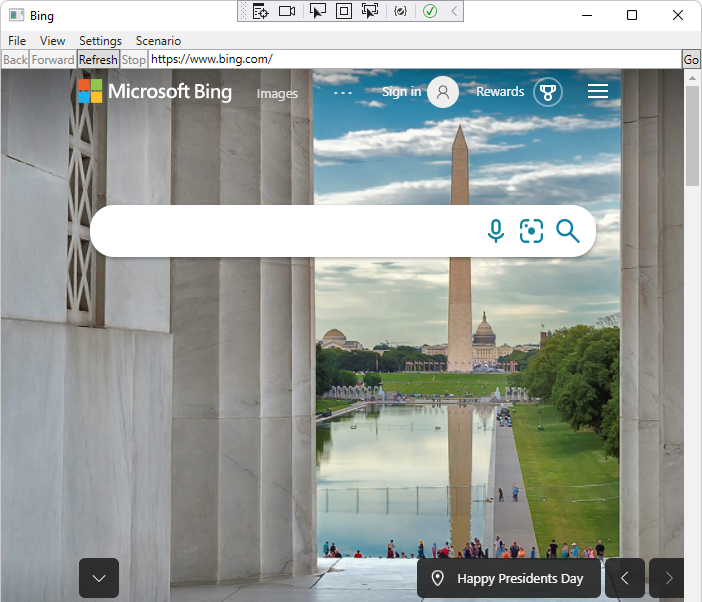
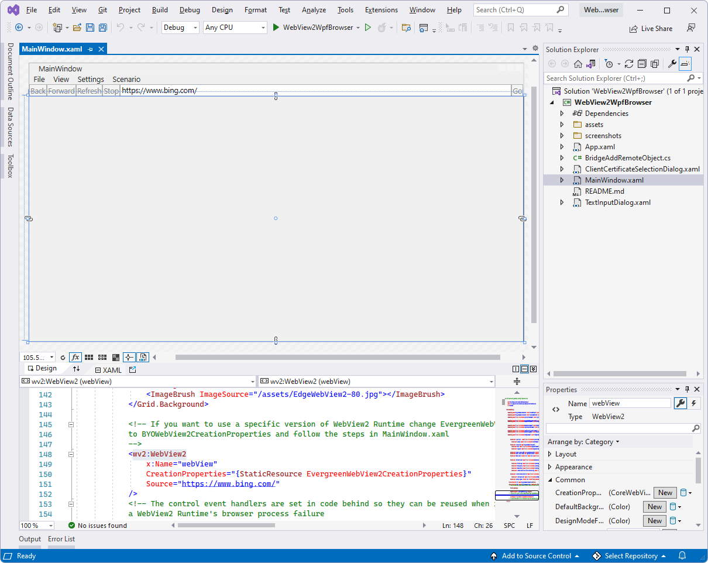
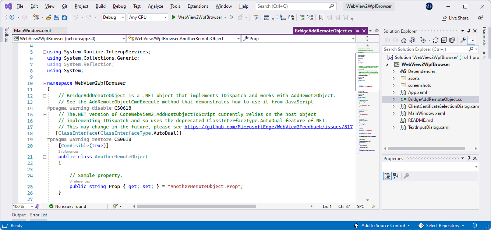

# WPF sample app

<!-- todo: paste/merge into here from corresp Readme https://github.com/MicrosoftEdge/WebView2Samples/pull/140/files -->

This sample, **WebView2WpfBrowser**, is a WPF .NET app that demonstrates how to embed the WebView2 control and use WebView2 APIs to implement a web browser.

*  Sample name: **WebView2WpfBrowser**
*  Repo directory: [WebView2WpfBrowser](https://github.com/MicrosoftEdge/WebView2Samples/tree/main/SampleApps/WebView2WpfBrowser)
*  Solution file: **WebView2WpfBrowser.sln**

This sample is built as a WPF Visual Studio 2019 project.  It uses C# and HTML/CSS/JavaScript in the WebView2 environment.

This sample showcases a selection of WebView2's event handlers and API methods that allow a WPF application to directly interact with a WebView and vice versa.

The **WebView2WpfBrowser** sample app has the following menus, containing many useful menuitems:
*  **File**
*  **View**
*  **Settings**
*  **Scenario**

If this is your first time using WebView2, we recommend first following the Getting Started tutorial, which goes over how to create a WebView2 and walks through some basic WebView2 functionality.  See [Get started with WebView2 in WPF apps](../get-started/wpf.md).

For more information about events and API Handlers in WebView2, see [WebView2 API Reference](/microsoft-edge/webview2/webview2-api-reference).

<!-- ====================================================================== -->
## Step 1 - Install a preview channel of Microsoft Edge

1. If a preview channel of Microsoft Edge (Beta, Dev, or Canary) is not already installed, in a separate window or tab, see [Install a preview channel of Microsoft Edge](../how-to/machine-setup.md#install-a-preview-channel-of-microsoft-edge) in _Set up your Dev environment for WebView2_.  Follow the steps in that section, and then return to this page and continue the steps below.

1. To test the experimental APIs ahead of time and ensure your WebView2 app's forward-compatibility, see [Approaches to making your app use a specific browser channel](../how-to/set-preview-channel.md#approaches-to-making-your-app-use-a-specific-browser-channel) in _Test upcoming APIs and features_. Follow the steps in that section, and then return to this page and continue the steps below.

<!-- ====================================================================== -->
## Step 2 - Install Visual Studio 2019 with .NET support

Microsoft Visual Studio is required.  Microsoft Visual Studio Code is not supported for this sample.

1. If Visual Studio 2019 (minimum required version) with .NET support is not already installed, in a separate window or tab, see [Install Visual Studio](../how-to/machine-setup.md#install-visual-studio) in _Set up your Dev environment for WebView2_.  Follow the steps in that section to install Visual Studio 2019 with .NET support, and then return to this page and continue the steps below.
<!-- could show selecting .NET support -->

<!-- ====================================================================== -->
## Step 3 - Clone or download the WebView2Samples repo

1. If not done already, clone or download the `WebView2Sample` repo to your local drive.  In a separate window or tab, see [Download the WebView2Samples repo](../how-to/machine-setup.md#download-the-webview2samples-repo) in _Set up your Dev environment for WebView2_.  Follow the steps in that section, and then return to this page and continue below.

<!-- ====================================================================== -->
## Step 4 - Open the solution in Visual Studio

1. On your local drive, open the `.sln` file in Visual Studio, in the directory:

   *  `<your-repos-directory>/WebView2Samples/SampleApps/WebView2WpfBrowser/WebView2WpfBrowser.sln`

   or:

   *  `<your-repos-directory>/WebView2Samples-main/SampleApps/WebView2WpfBrowser/WebView2WpfBrowser.sln`

<!-- ====================================================================== -->
## Step 5 - Install workloads if prompted

1. If prompted, install any Visual Studio workloads that are requested.  In a separate window or tab, see [Install Visual Studio workloads](../how-to/machine-setup.md#install-visual-studio-workloads) in _Set up your Dev environment for WebView2_.  Follow the steps in that section, and then return to this page and continue below.

   The **WebView2WpfBrowser** project opens in Visual Studio:

   

<!-- ====================================================================== -->
## Step 6 - Build and run the project

At the top of Visual Studio, set the build target, as follows:

1. In the **Solution Configurations** dropdown list, select **Debug** or **Release**.

1. In the **Solution Platforms** dropdown list, select **Any CPU**.

1. In **Solution Explorer**, right-click the **WebView2WpfBrowser** project, and then select **Build**.

   This builds the project file `WebView2WpfBrowser.csproj`.

1. In Visual Studio, select **Debug** > **Start Debugging** (**F5**).

   The sample app window opens:

   

1. In Visual Studio, select **Debug** > **Stop Debugging**.  Visual Studio closes the app.

<!-- ====================================================================== -->
## Step 7 - Update the WebView2 SDK

1. Update the prerelease WebView2 SDK on the project node (not the solution node) in Solution Explorer.  Install the latest prerelease of the WebView2 SDK, so that you can try the latest features.  In a separate window or tab, see [Install or update the WebView2 SDK](../how-to/machine-setup.md#install-or-update-the-webview2-sdk) in _Set up your Dev environment for WebView2_.  Follow the steps in that section, and then return to this page and continue below.

1. Build and run the project again.

<!-- ====================================================================== -->
## Step 8 - Explore the menus and inspect the code

1. Explore the **WebView2WpfBrowser** sample app's menus, containing many useful menuitems:
   *  **File**
   *  **View**
   *  **Settings**
   *  **Scenario**
   
1. In the Visual Studio code editor, inspect the code:

   

<!-- ====================================================================== -->
## See also

* [WebView2 API Reference](../webview2-api-reference.md)
* [Get started with WebView2 in WPF apps](../get-started/wpf.md)
