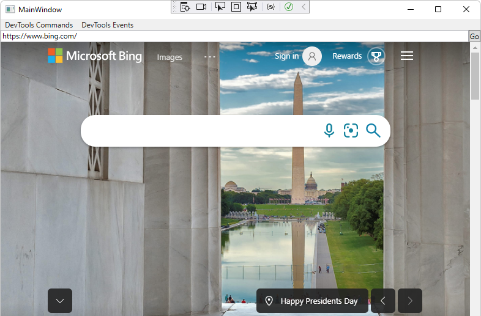
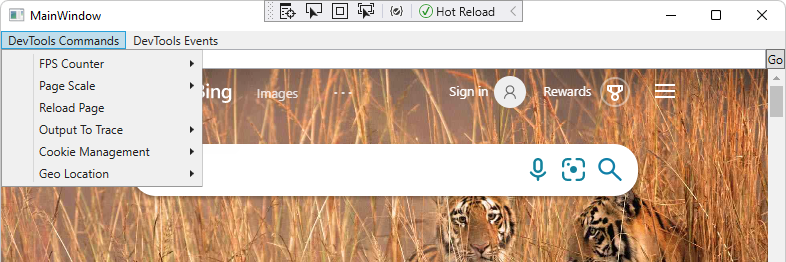
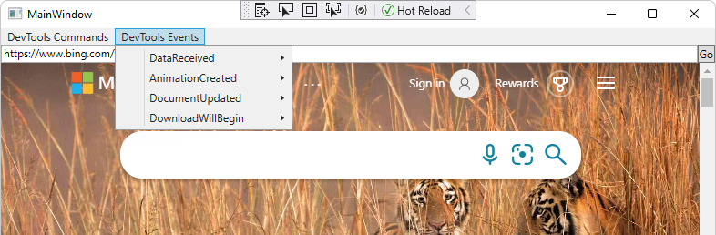
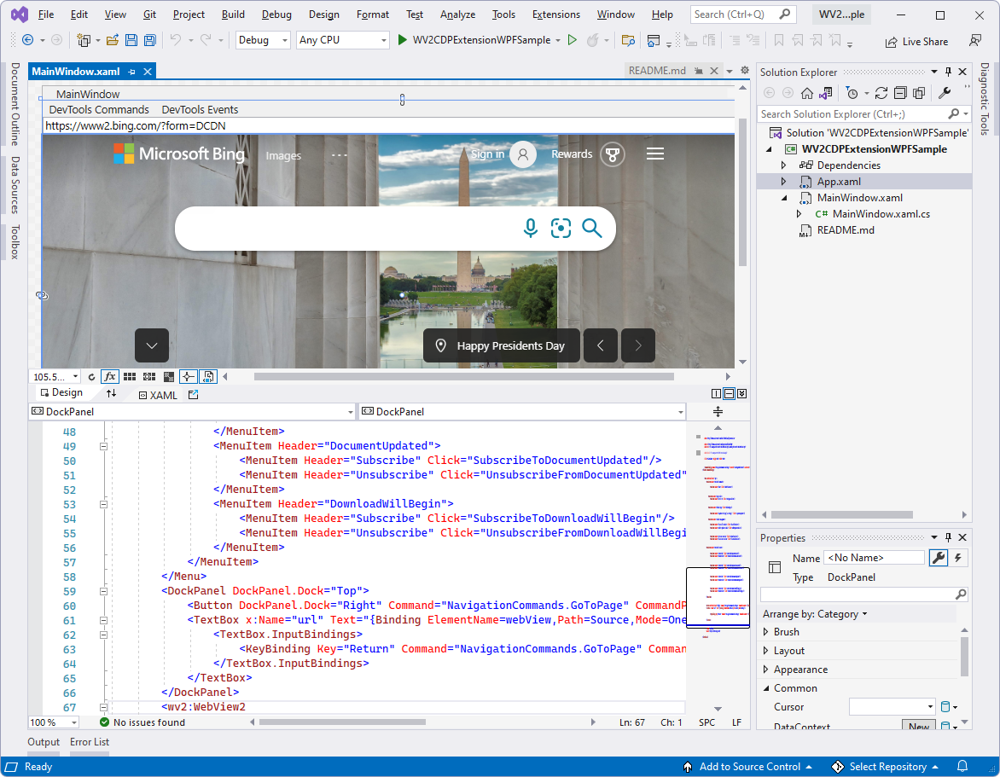
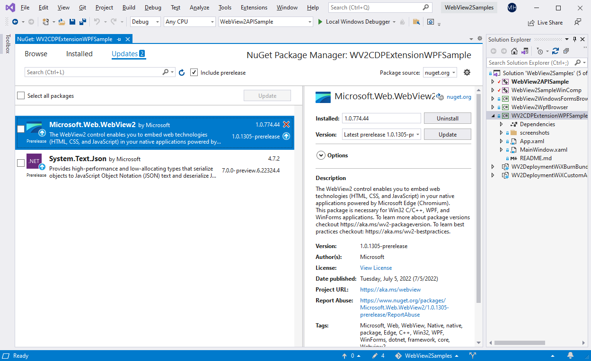
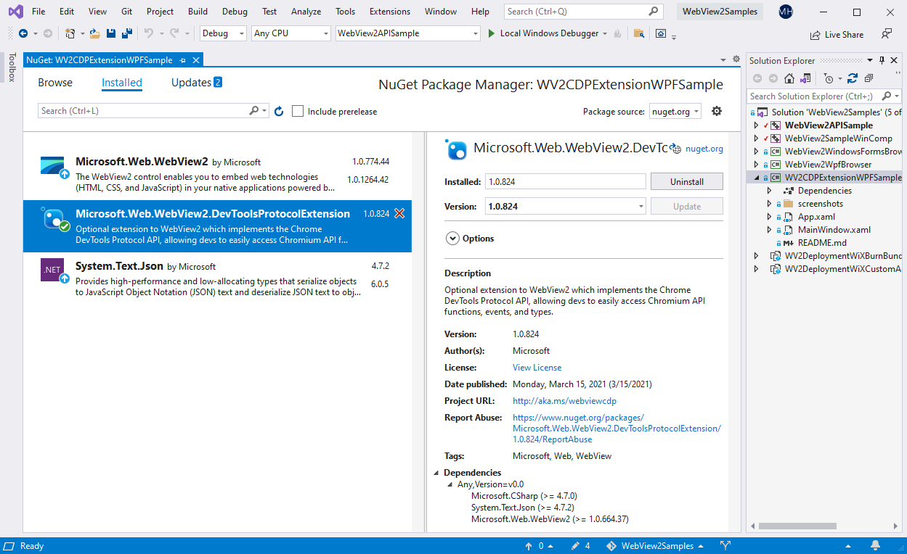
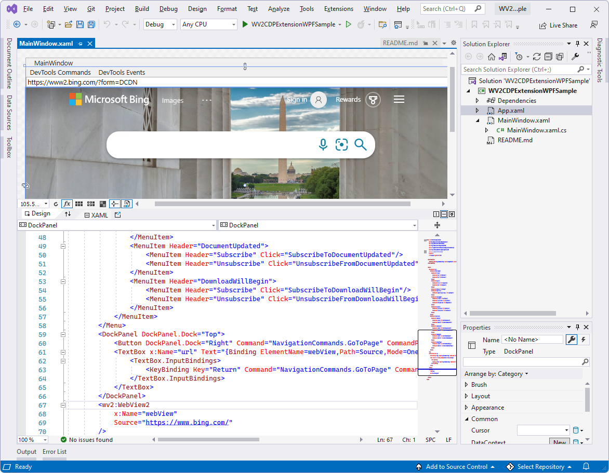

# WPF sample app with CDP extension

<!-- todo: after copying the "summary / which project/ which lang" info to top of each Sample .md file, merge into here the Readme sections: Prereq, Build. -->
<!-- todo: global: like readmes PR in samples repo, add a tangible representative "finished result" screenshot at top of each sample or getstart. -->

This WebView2 sample demonstrates how to use the WebView2 CDP extension to use the Chrome DevTools Protocol (CDP) in a WPF app.

*  Sample name: **WV2CDPExtensionWPFSample**
*  Repo directory: [WV2CDPExtensionWPFSample](https://github.com/MicrosoftEdge/WebView2Samples/tree/main/SampleApps/WV2CDPExtensionWPFSample)
*  Solution file: **WV2CDPExtensionWPFSample.sln**

This sample, **WV2CDPExtensionWPFSample**, is built with the WebView2 CDP Extension (the **Microsoft.Web.WebView2.DevToolsProtocolExtension** NuGet package).  This sample calls Chrome DevTools Protocol methods on a `DevToolsProtocolHelper` object in WebView2.

This sample is built as a WPF Visual Studio 2019 project.  It uses C# in the WebView2 environment.

The **DevTools Commands** menu:

The **DevTools Events** menu:

If this is your first time using WebView2, we recommend first following the [Get started with WebView2 in WPF apps](../get-started/wpf.md) tutorial.  The tutorial walks you through creating a WebView2 and adding some basic WebView2 functionality.

<!-- ====================================================================== -->
## Step 1 - Install a preview channel of Microsoft Edge

<!-- readme said "Prerequisites: Microsoft Edge (Chromium) installed on a supported OS. Currently we recommend the latest version of the Edge Canary channel." -->

We recommend the latest version of the Canary channel.

1.  If a preview channel of Microsoft Edge (Beta, Dev, or Canary) is not already installed, in a separate window or tab, see [Install a preview channel of Microsoft Edge](../how-to/machine-setup.md#install-a-preview-channel-of-microsoft-edge) in _Set up your Dev environment for WebView2_.  Follow the steps in that section, and then return to this page and continue the steps below.

<!-- ====================================================================== -->
## Step 2 - Install Visual Studio with .NET support

<!-- readme said "Prerequisites: Visual Studio with .NET support installed." -->
Microsoft Visual Studio (with .NET support) is required.  Microsoft Visual Studio Code is not supported for this sample.

1. If Visual Studio (minimum required version) with .NET support is not already installed, in a separate window or tab, see [Install Visual Studio](../how-to/machine-setup.md#install-visual-studio) in _Set up your Dev environment for WebView2_.  Follow the steps in that section, and then return to this page and continue the steps below.

<!-- ====================================================================== -->
## Step 3 - Clone or download the WebView2Samples repo

1. If not done already, clone or download the `WebView2Sample` repo to your local drive.  In a separate window or tab, see [Download the WebView2Samples repo](../how-to/machine-setup.md#download-the-webview2samples-repo) in _Set up your Dev environment for WebView2_.  Follow the steps in that section, and then return to this page and continue below.

<!-- ====================================================================== -->
## Step 4 - Open the solution in Visual Studio

1. On your local drive, open the `.sln` file in Visual Studio, in the directory:

   *  `<your-repos-directory>/WebView2Samples/SampleApps/WV2CDPExtensionWPFSample/WV2CDPExtensionWPFSample.sln`

   or:

   *  `<your-repos-directory>/WebView2Samples-main/SampleApps/WV2CDPExtensionWPFSample/WV2CDPExtensionWPFSample.sln`

If you want to use Visual Studio 2017, in Visual Studio, change the project's Platform Toolset in **Project Properties > Configuration properties > General > Platform Toolset**.
To use Visual Studio 2017, you might also need to install a recent Windows SDK.

<!-- ====================================================================== -->
## Step 5 - Install workloads if prompted

1. If prompted, install any Visual Studio workloads that are requested.  In a separate window or tab, see [Install Visual Studio workloads](../how-to/machine-setup.md#install-visual-studio-workloads) in _Set up your Dev environment for WebView2_.  Follow the steps in that section, and then return to this page and continue below.

   The **WV2CDPExtensionWPFSample** project opens in Visual Studio:

   

<!-- ====================================================================== -->
## Step 6 - Build and run the project with installed version of SDKs

A version of the WebView2 SDK and the WebView2 DevToolsProtocolExtension are included as NuGet packages in this project.  In a later step, you'll update these by using Visual Studio's NuGet Package Manager.<!-- Right-click the project, and then select **Manage NuGet Packages**. -->

At the top of Visual Studio, set the build target, as follows:

1. In the **Solution Configurations** dropdown list, select **Debug** or **Release**.

1. In the **Solution Platforms** dropdown list, select **Any CPU**.

1. In **Solution Explorer**, right-click the **WV2CDPExtensionWPFSample** project, and then select **Build**.

<!--This builds the project file `WV2CDPExtensionWPFSample.csproj`.readme was missing "WPF" there, vs dir listing; readme said: Build the project file: _WV2CDPExtensionSample.csproj_ -->

1. In Visual Studio, select **Debug** > **Start Debugging** (**F5**).

   The sample app window opens:

   

1. In Visual Studio, select **Debug** > **Stop Debugging**.  Visual Studio closes the app.

<!-- ====================================================================== -->
## Step 7 - Update the WebView2 SDK

<!-- readme said "Prerequisites: Latest version of our WebView2 SDK, which is included in this project."  doesn't specify "release" or "prerelease" -->
1. In Solution Explorer, right-click the project (not the solution node) and then select **Manage NuGet Packages**.  **NuGet Package Manager** opens.

1. Click the **Installed** or **Updates** tab.

1. Select or clear the **Include prerelease** checkbox.

   

   The above screenshot shows Visual Studio 2019, showing this sample in the context of the overarching **WebView2APIsSample** solution, rather than the present standalone solution.  In this screenshot, the repo has a release version of the WebView2 SDK, and newer release and prerelease versions of the SDK are available.

1. If a newer release of the **Microsoft.Web.WebView2** SDK is listed, click the **Update** button.  A prerelease has a "-prerelease" suffix, such as **1.0.1248-prerelease**.  Prerelease SDKs allow you to try the latest WebView2 features and APIs.

If you want to see details about this step, in a separate window or tab, see [Install or update the WebView2 SDK](../how-to/machine-setup.md#install-or-update-the-webview2-sdk) in _Set up your Dev environment for WebView2_.  Follow the steps in that section, and then return to this page and continue below.

<!-- ====================================================================== -->
## Step 8 - Update the WebView2 CDP Extension

A prerequisite for this sample is the latest release version of the WebView2 CDP Extension (**Microsoft.Web.WebView2.DevToolsProtocolExtension**), which is included in this project.  That package adds support for the Chrome DevTools Protocol (CDP) API.

<!-- readme said "Prerequisites: Latest release version of our WebView2 CDP Extension, which is included in this project." -->
1. In Solution Explorer, right-click the project and then select **Manage NuGet Packages**.  **NuGet Package Manager** opens.

1. Click the **Installed** or **Updates** tab.

1. Clear the **Include prerelease** checkbox.

   

1. If a newer release version of the **Microsoft.Web.WebView2.DevToolsProtocolExtension** SDK is listed, click the **Update** button.

<!-- For more information, see [WebView2 CDP Extension](https://aka.ms/webviewcdpnuget).  todo: 404, ie: defaults to bing -->

See also:
* [Use the Chrome DevTools Protocol (CDP) in WebView2 apps](../how-to/chromium-devtools-protocol.md)

<!-- ====================================================================== -->
## Step 9 - Build and run the project with updated packages

1. In Visual Studio, select **Debug** > **Start Debugging** (**F5**).

   The sample app window opens:

   

1. In Visual Studio, select **Debug** > **Stop Debugging**.  Visual Studio closes the app.

<!-- ====================================================================== -->
## Step 10 - Inspect the code

1. In the Visual Studio code editor, inspect the code:

   

   The **DevTools Commands** menu:

   

   The **DevTools Events** menu:

   

<!-- ====================================================================== -->
## See also

* [WebView2 API Reference](../webview2-api-reference.md)
* [Get started with WebView2 in WinUI 2 (UWP) apps](../get-started/winui2.md)
* [Microsoft.Web.WebView2.DevToolsProtocolExtension](https://www.nuget.org/packages/Microsoft.Web.WebView2.DevToolsProtocolExtension) at NuGet.
