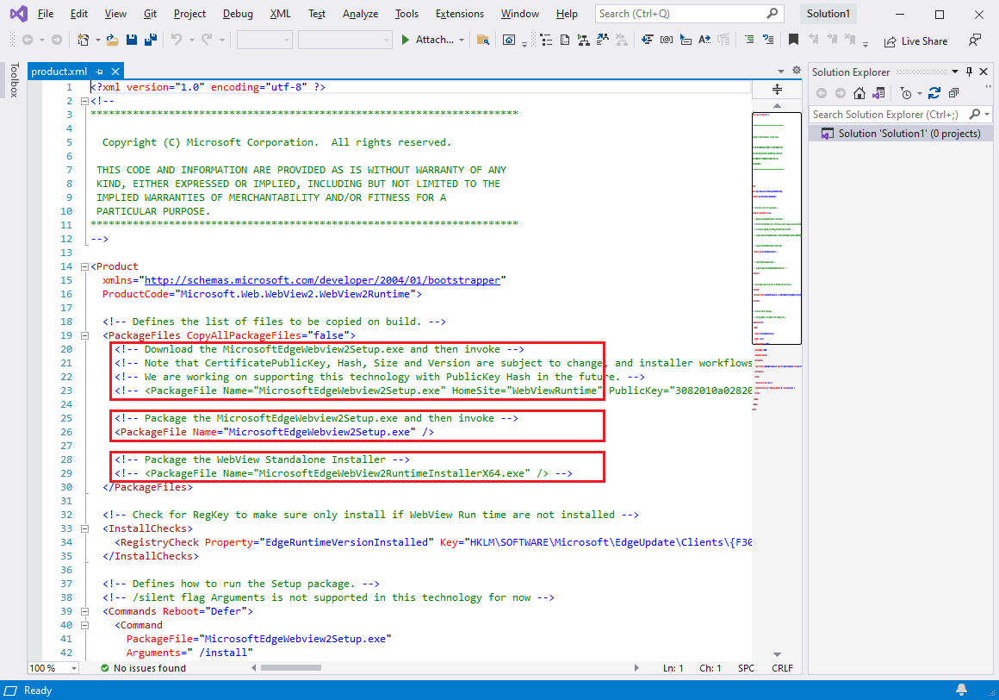

# WebView2 Deployment Visual Studio installer

<!-- todo: check against readme https://github.com/MicrosoftEdge/WebView2Samples/tree/main/SampleApps/WV2DeploymentVSInstallerSample#readme -->

This sample, **WV2DeploymentVSInstallerSample**, demonstrates how to deploy a WebView2 app by using the Visual Studio installer.

*  Sample name: **WV2DeploymentVSInstallerSample**
*  Repo directory: [WV2DeploymentVSInstallerSample](https://github.com/MicrosoftEdge/WebView2Samples/tree/main/SampleApps/WV2DeploymentVSInstallerSample)
*  Solution file: not provided in the repo.  You create a solution file in the steps below.

To demonstrate how to deploy the Evergreen WebView2 Runtime with your app, this article describes how to use the [Microsoft Visual Studio Installer Project](https://marketplace.visualstudio.com/items?itemName=visualstudioclient.MicrosoftVisualStudio2017InstallerProjects) extension for Visual Studio.  You create a project of type **Setup Project**, to create an installer for the [Win32 sample app](./webview2apissample.md) (**WebView2APISample**).  That installer that you create chain-installs the Evergreen WebView2 Runtime.

<!-- todo: screenshot representing the success state -->

You first edit the `project.xml` file from the repo, and then in Visual Studio, you create a new project by using the **Setup Project** project template from the **Microsoft Visual Studio Installer Projects** extension.

This sample demonstrates several different deployment approaches:
* Downloading the Evergreen WebView2 Runtime Bootstrapper by using a link.
* Packaging the Evergreen WebView2 Runtime Bootstrapper with your app.
* Packaging the Evergreen WebView2 Runtime Standalone Installer with your app.

For information about these different approaches, see [Deploying the Evergreen WebView2 Runtime](/microsoft-edge/webview2/concepts/distribution#deploying-the-evergreen-webview2-runtime) in _Distribute your app and the WebView2 Runtime_.


<!-- ====================================================================== -->
## Step 1 - Build and run WebView2APISample

<!-- todo: is this required before using this sample? -->

To become familiar with the app that this sample distributes, and to make sure your environment is set up for general Win32 WebView2 app development, build and run the Win32 sample app (**WebView2APISample**) before using this deployment sample.

1. Do the steps in [Win32 sample app](./webview2apissample.md) (**WebView2APISample**) and then continue below.

Prerequisite: As stated in the above page, Microsoft Visual Studio is required, including C++ support.  Microsoft Visual Studio Code is not supported for this **WV2DeploymentVSInstallerSample** sample.

The above page helps you clone or download the WebView2Samples repo, and install Visual Studio with C++ support, if not done yet.


<!-- ====================================================================== -->
## Step 2 - Install Visual Studio Installer Projects

If not done yet, install Visual Studio Installer Projects:

1. Install the [Microsoft Visual Studio Installer Projects](https://marketplace.visualstudio.com/items?itemName=visualstudioclient.MicrosoftVisualStudio2017InstallerProjects) for Visual Studio 2019. Follow the steps on that page, and then return to this page and continue the steps below.


If a **Waiting on the following processes to shut down** dialog appears, close Visual Studio.


<!-- ====================================================================== -->
## Step 3 - Edit product.xml to configure how to distribute the WebView2 Runtime

1. Open Visual Studio.  In the opening screen, you can click the **Continue without code** link in the lower right.

1. Open the following individual file that's in your local copy of the repo: `<repo-location>\WebView2Samples\SampleApps\WV2DeploymentVSInstallerSample\product.xml`

   Location of the file in the repo at GitHub: [SampleApps/WV2DeploymentVSInstallerSample/product.xml](https://github.com/MicrosoftEdge/WebView2Samples/blob/main/SampleApps/WV2DeploymentVSInstallerSample/product.xml)

   

1. Inspect `product.xml`.  There are three `<PackageFile>` lines.  Study the comment above each of the 3 lines.  Here is a simplified view of the lines, with clarifications.

   The first `<PackageFile>` line uses file `MicrosoftEdgeWebview2Setup.exe`, which is the Evergreen WebView2 Runtime Bootstrapper, and it specifies a `HomeSite` website.   Use this line for _Approach 1: Downloading the Evergreen WebView2 Runtime Bootstrapper through a link_:

   ```xml
   <!-- Download the MicrosoftEdgeWebview2Setup.exe -->
   <!-- <PackageFile Name="MicrosoftEdgeWebview2Setup.exe" HomeSite="WebViewRuntime" PublicKey="..."/> -->
   ```

   The second `<PackageFile>` line uses file `MicrosoftEdgeWebview2Setup.exe`, which is the Evergreen WebView2 Runtime Bootstrapper.  Use this line for _Approach 2: Packaging the Evergreen WebView2 Runtime Bootstrapper with the app_:

   ```xml
   <!-- Package the MicrosoftEdgeWebview2Setup.exe -->
   <PackageFile Name="MicrosoftEdgeWebview2Setup.exe" />
   ```

   The third `<PackageFile>` line uses file `MicrosoftEdgeWebView2RuntimeInstallerX64.exe`, which is a platform-specific Evergreen WebView2 Runtime Standalone Installer.  Use this line for _Approach 3: Packaging the Evergreen WebView2 Runtime Standalone Installer with your app_:

   ```xml
   <!-- Package the WebView Standalone Installer -->
   <!-- <PackageFile Name="MicrosoftEdgeWebView2RuntimeInstallerX64.exe" /> -->
   ```

1. Identify which approach you are using.  Approach 2 is the default; that is, the line to use Approach 2 is un-commented in the repo's `product.xml` file.

1. Edit `product.xml`, as follows; do the steps in one of the three sections below.


<!-- this section order matches product.xml's order & top of present .md file -->
#### Approach 1: Downloading the Evergreen WebView2 Runtime Bootstrapper through a link


If you want the app to download the Evergreen WebView2 Runtime Bootstrapper (`MicrosoftEdgeWebview2Setup.exe`) through a link:

1. Within the `<PackageFiles CopyAllPackageFiles="false">` section, un-comment the following line (keep the long public key value), and comment out the other lines:

   ```xml
   <PackageFile Name="MicrosoftEdgeWebview2Setup.exe" HomeSite="WebViewRuntime" PublicKey="..."/>
   ```

1. The `PublicKey` value for the WebView2 Runtime Bootstrapper may change without notice.  We're working on addressing this issue.  For now, you may need to replace it in `product.xml` with an updated `PublicKey` value.

1. Within the `<Commands Reboot="Defer">` and `</Commands>` section, make sure `PackageFile` points to `"MicrosoftEdgeWebview2Setup.exe"` so that the Visual Studio installer is using the Bootstrapper.

1. Save the file.


#### Approach 2: Packaging the Evergreen WebView2 Runtime Bootstrapper with the app

If you want to package the Evergreen WebView2 Runtime Bootstrapper (`MicrosoftEdgeWebview2Setup.exe`) with the app:

1. Within the `<PackageFiles CopyAllPackageFiles="false">` section, un-comment the following line and comment out the other lines:

   ```xml
   <PackageFile Name="MicrosoftEdgeWebview2Setup.exe" />
   ```

1. Within the `<Commands Reboot="Defer">` section, make sure `PackageFile` points to `"MicrosoftEdgeWebview2Setup.exe"` so that the Visual Studio installer is using the Bootstrapper.

1. Save the file.


#### Approach 3: Packaging the Evergreen WebView2 Runtime Standalone Installer with your app

If you want to package the Evergreen WebView2 Runtime Standalone Installer with the app:

1. Within the `<PackageFiles CopyAllPackageFiles="false">` section, un-comment the following line and comment out the other lines:

   ```xml
   <PackageFile Name="MicrosoftEdgeWebView2RuntimeInstallerX64.exe" />
   ```

1. Within the `<Commands Reboot="Defer">` and `</Commands>` section, make sure `PackageFile` points to `"MicrosoftEdgeWebView2RuntimeInstallerX64.exe"` so that the Visual Studio installer is using the Standalone Installer.

1. If you're targeting non-X64 devices, edit the `MicrosoftEdgeWebView2RuntimeInstallerX64` file name to reflect the correct architecture.

1. Save the file.


<!-- ====================================================================== -->
## Step 4 - Download the WebView2 Bootstrapper or Standalone Installer

If you want to package either the Bootstrapper (Approach 2) or the Standalone Installer (Approach 3) with the app, do the steps in this section.  Otherwise skip to the next major Step section.

1. Download [Microsoft Edge WebView2](https://developer.microsoft.com/microsoft-edge/webview2/) Bootstrapper or the Standalone Installer.

1. Save the downloaded Bootstrapper or the Standalone Installer under the `<repo-location>\WebView2Samples\SampleApps\WV2DeploymentVSInstallerSample\` folder.


<!-- ====================================================================== -->
## Step 5 - Copy the WV2DeploymentVSInstallerSample folder into a Packages folder

This step applies to all of the approaches (1, 2, or 3).

1. Copy the `<repo-location>\WebView2Samples\SampleApps\WV2DeploymentVSInstallerSample\` folder, and paste it into either one of the following folders:

   * `<drive>:\Program Files (x86)\Microsoft SDKs\ClickOnce Bootstrapper\Packages\`

   * `<Visual Studio install dir>\MSBuild\Microsoft\VisualStudio\BootstrapperPackages\` (requires at least Visual Studio 2019 Update 7)

   Typical path for `<Visual Studio install dir>`:

   * `C:\Program Files (x86)\Microsoft Visual Studio\2019\Professional\Common7\IDE\`


<!-- ====================================================================== -->
## Step 6 - Create a Setup Project in Visual Studio

1. In Visual Studio, select **File** > **New** > **Project**.  The **Create a new project** window appears.

1. In the **Search for templates** text box, enter **setup project**, and then select the **Setup Project** template.  Make sure you select the template that's named exactly that, as shown below:

   

1. Click the **Next** button.

   The **Configure your new project: Setup Project** dialog opens, as shown below.

1. In the **Project name** text box, enter a name, such as **MyWin32WV2DeploySample**.

1. In the **Location** text box, navigate to a location that's not inside another project directory, such as `<repo-path>\WebView2Samples\` or a location that's not in the repo directory.

   

1. Click the **Create** button.

   


<!-- ====================================================================== -->
## Step 7 - Add WebView2 Runtime as a prerequisite

1. In Visual Studio, in Solution Explorer, right-click your project, and then select **Properties**.  The **Property Pages** dialog opens.

1. Click the **Prerequisites** button:

   

1. Select the **Edge WebView2 runtime** checkbox.

   If that checkbox isn't listed, that might indicate that a needed file hasn't been placed in a Packages folder.  Check which approach you are using.  You might need to do the steps above, in sections [Step 4 - Download the WebView2 Bootstrapper or Standalone Installer](#step-4---download-the-webview2-bootstrapper-or-standalone-installer) and [Step 5 - Copy the WV2DeploymentVSInstallerSample folder into a Packages folder](#step-5---copy-the-wv2deploymentvsinstallersample-folder-into-a-packages-folder).

1. Clear the other prerequisites checkboxes.  Then click the **OK** button:

   


<!-- ====================================================================== -->
## Step 8 - Build the Setup project

1. Press **F5** to save and build the Setup project.

<!-- TODO: describe the Done state; explain result: accomplished xyz -->


<!-- ====================================================================== -->
## See also

* [README file for WV2DeploymentVSInstallerSample](https://github.com/MicrosoftEdge/WebView2Samples/tree/main/SampleApps/WV2DeploymentVSInstallerSample#readme)
