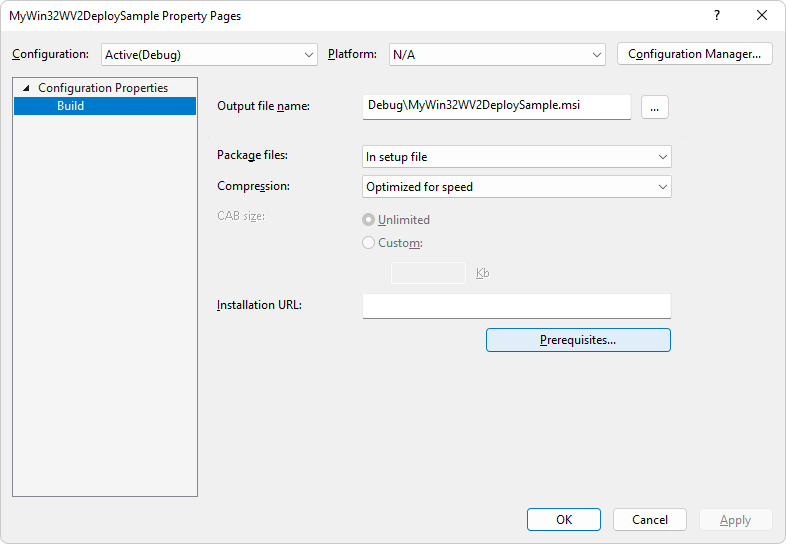

# WebView2 Deployment Visual Studio installer

This WebView2 sample demonstrates how to deploy a WebView2 app using the Visual Studio installer.

Directory: **WV2DeploymentVSInstallerSample** (no `.sln` file)

To help you understand how to deploy the [Evergreen WebView2 Runtime](/microsoft-edge/webview2/concepts/distribution#deploying-the-evergreen-webview2-runtime) with an application, this article describes how to use the [Microsoft Visual Studio Installer Project](https://marketplace.visualstudio.com/items?itemName=visualstudioclient.MicrosoftVisualStudio2017InstallerProjects) to create an installer for [WebView2APISample](https://github.com/MicrosoftEdge/WebView2Samples/tree/main/SampleApps/WebView2APISample#readme) and chain-install the Evergreen WebView2 Runtime.

<!-- ====================================================================== -->
## Step 1 - Install Visual Studio and Installer Projects

Microsoft Visual Studio is required. Microsoft Visual Studio Code is not supported for this sample.

1. If Visual Studio 2019 or higher is not already installed, in a separate window or tab, open [Install Visual Studio](../how-to/machine-setup.md#install-visual-studio) in _Set up your Dev environment for WebView2_.  Follow the steps in that section, and then return to this page and continue the steps below.

1. Install the [Microsoft Visual Studio Installer Projects](https://marketplace.visualstudio.com/items?itemName=visualstudioclient.MicrosoftVisualStudio2017InstallerProjects). Follow the steps on that page, and then return to this page and continue the steps below.

<!-- ====================================================================== -->
## Step 2 - Install a preview channel of Microsoft Edge

1. If a preview channel of Microsoft Edge (Beta, Dev, or Canary) is not already installed, in a separate window or tab, see [Install a preview channel of Microsoft Edge](../how-to/machine-setup.md#install-a-preview-channel-of-microsoft-edge) in _Set up your Dev environment for WebView2_.  Follow the steps in that section, and then return to this page and continue the steps below.

<!-- ====================================================================== -->
## Step 3 - Download or clone the WebView2Samples repo

1. If not done already, download or clone the `WebView2Sample` repo to your local drive.  In a separate window or tab, see [Download the WebView2Samples repo](../how-to/machine-setup.md#download-the-webview2samples-repo) in _Set up your Dev environment for WebView2_.  Follow the steps in that section, and then return to this page and continue below.

<!-- ====================================================================== -->
<!-- ## Step 5 - Open .sln in Visual Studio -->

<!-- 1. On your local drive, open the `.sln` file in Visual Studio, in the directory:

   *  `<your-repos-directory>/WebView2Samples/SampleApps/WV2DeploymentVSInstallerSample/WV2DeploymentVSInstallerSample.sln`

   or:

   *  `<your-repos-directory>/WebView2Samples-main/SampleApps/WV2DeploymentVSInstallerSample/WV2DeploymentVSInstallerSample.sln` -->

<!-- ====================================================================== -->
<!-- 1. **Visual Studio workloads** - If prompted, install any Visual Studio workloads that are requested.  In a separate window or tab, see [Install Visual Studio workloads](../how-to/machine-setup.md#install-visual-studio-workloads) in _Set up your Dev environment for WebView2_.  Follow the steps in that section, and then return to this page and continue below. -->

   <!-- Solution Explorer shows the **WV2DeploymentVSInstallerSample** project. -->

   <!-- Solution Explorer shows the **WV2DeploymentVSInstallerSample** project: -->

   <!--  -->
   <!--todo: create png-->

<!-- ====================================================================== -->
## Step 4 - Install or update the WebView2 SDK

1. If needed, install (or update) the WebView2 SDK on the project node (not the solution node) in Solution Explorer.  In a separate window or tab, see [Install the WebView2 SDK](../how-to/machine-setup.md#install-the-webview2-sdk) in _Set up your Dev environment for WebView2_.  You can follow these steps to determine whether the WebView2 SDK is installed for the project.  Follow the steps in that section, and then return to this page and continue below.

<!-- ====================================================================== -->
<!-- 1. In Visual Studio, select **Debug** > **Start Debugging** (`F5`). -->

   <!-- The sample app window opens. -->

<!-- 1. In the sample app window, use the sample app.  In the Visual Studio code editor, inspect the code; see [README file for WV2DeploymentVSInstallerSample](https://github.com/MicrosoftEdge/WebView2Samples/tree/main/SampleApps/WV2DeploymentVSInstallerSample#readme). -->

<!-- 1. Close the sample app window. -->

<!-- ====================================================================== -->
## Step 5 - Create a Visual Studio installer for the Evergreen WebView2 Runtime

This section highlights deployment workflows included in [Deploying the Evergreen WebView2 Runtime](/microsoft-edge/webview2/concepts/distribution#deploying-the-evergreen-webview2-runtime) in _Distribute your app and the WebView2 Runtime_ to complete the following tasks:

* Download the Evergreen WebView2 Runtime Bootstrapper using a link.
* Package the Evergreen WebView2 Runtime Bootstrapper.
* Package the Evergreen WebView2 Runtime Standalone Installer.

### Build Steps

Complete these steps to edit and run the project.

1. Start Visual Studio.

1. Open the local copy of the `WebView2Samples` repo.

1. Edit the `product.xml` file depending on the workflow you wish to use.

    * For "Package the Evergreen WebView2 Runtime Bootstrapper",
        * Within the `<PackageFiles CopyAllPackageFiles="false">` and `</PackageFiles>` section, un-comment the line `<PackageFile Name="MicrosoftEdgeWebview2Setup.exe" />` and comment out other lines.
        * Within the `<Commands Reboot="Defer">` and `</Commands>` section, make sure `PackageFile` points to `"MicrosoftEdgeWebview2Setup.exe"` so that the Visual Studio installer is using the Bootstrapper.

    * For "Download the Evergreen WebView2 Runtime Bootstrapper through link",
        * Within the `<PackageFiles CopyAllPackageFiles="false">` and `</PackageFiles>` section, un-comment the line `<PackageFile Name="MicrosoftEdgeWebview2Setup.exe" HomeSite="WebViewRuntime" PublicKey="..."/>` and comment out other lines. Note that the `PublicKey` for the WebView2 Runtime Bootstrapper may change without notice and we are working on addressing this issue. For now, you may need to replace it with an updated `PublicKey`.
        * Within the `<Commands Reboot="Defer">` and `</Commands>` section, make sure `PackageFile` points to `"MicrosoftEdgeWebview2Setup.exe"` so that the Visual Studio installer is using the Bootstrapper.

    * For "Package the Evergreen WebView2 Runtime Standalone Installer",
        * Within the `<PackageFiles CopyAllPackageFiles="false">` and `</PackageFiles>` section, un-comment the line `<PackageFile Name="MicrosoftEdgeWebView2RuntimeInstallerX64.exe" />` and comment out other lines.
        * Within the `<Commands Reboot="Defer">` and `</Commands>` section, make sure `PackageFile` points to `"MicrosoftEdgeWebView2RuntimeInstallerX64.exe"` so that the Visual Studio installer is using the Standalone Installer.
        * If you're targeting non-X64 devices, edit the `MicrosoftEdgeWebView2RuntimeInstallerX64` filename to reflect the correct architecture.

1. If you plan to package either the Bootstrapper or the Standalone Installer, download [Microsoft Edge WebView2](https://developer.microsoft.com/microsoft-edge/webview2/) Bootstrapper or the Standalone Installer and save it in the `WV2DeploymentVSInstallerSample` folder.

1. Copy the `WV2DeploymentVSInstallerSample` folder, and paste it in either folder:
   1. `Program Files (x86)\Microsoft SDKs\ClickOnce Bootstrapper\Packages\`, or,
   1. `<Visual Studio Install Dir>\MSBuild\Microsoft\VisualStudio\BootstrapperPackages\` (requires at least Visual Studio 2019 Update 7).

1. Create a Setup Project in Visual Studio. 
   1. In Visual Studio, select **File** > **New** > **Project**. 
   1. Search for `Setup Project`.

       

   1. Create a Setup project.

1. Add WebView2 Runtime as a prerequisite. 
   1. In Visual Studio, select **Project** > **Properties**.
   1. In the Property page, select **Prerequisites**.

       

   1. Check **Edge WebView2 runtime**, and un-check other prerequisites. Select **OK**.
   
       

1. Press **F5** to save and build the Setup project.

<!-- ====================================================================== -->
## See also

* [README file for WV2DeploymentVSInstallerSample](https://github.com/MicrosoftEdge/WebView2Samples/tree/main/SampleApps/WV2DeploymentVSInstallerSample#readme)
