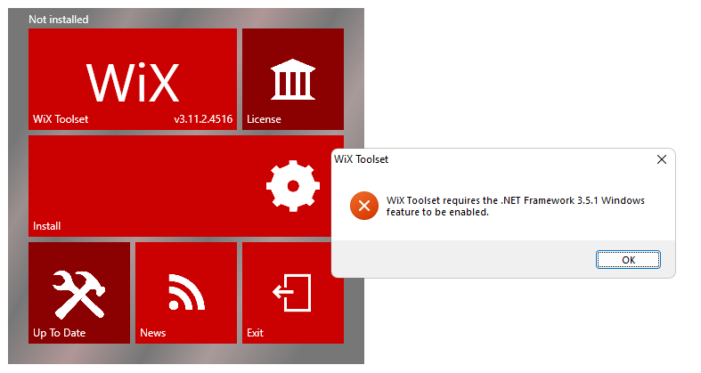
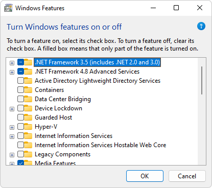
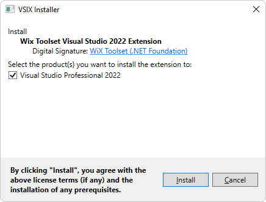
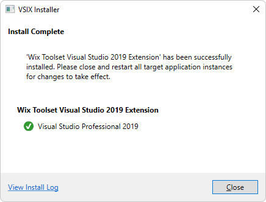

# WiX Custom Action to deploy the WebView2 Runtime

This sample, **WV2DeploymentWiXCustomActionSample**, demonstrates how to use a WiX Custom Action to deploy the WebView2 Runtime.

*  Sample name: **WV2DeploymentWiXCustomActionSample**
*  Repo directory: [WV2DeploymentWiXCustomActionSample](https://github.com/MicrosoftEdge/WebView2Samples/tree/main/SampleApps/WV2DeploymentWiXCustomActionSample)
*  Project file: **WV2DeploymentWiXCustomActionSample.wixproj**

<!-- todo: screenshot representing the success state -->

To help you understand how to deploy the Evergreen WebView2 Runtime with your app, this sample creates a [WiX](https://wixtoolset.org/) installer for the **WebView2APISample** and uses a [WiX Custom Action](https://wixtoolset.org/documentation/manual/v3/wixdev/extensions/authoring_custom_actions.html) to chain-install the Evergreen WebView2 Runtime.

This sample demonstrates several different deployment approaches:
* Downloading the Evergreen WebView2 Runtime Bootstrapper by using a link.
* Packaging the Evergreen WebView2 Runtime Bootstrapper with your app.
* Packaging the Evergreen WebView2 Runtime Standalone Installer with your app.

<!-- ====================================================================== -->
## Step 1 - Install Visual Studio 2019 with C++ support

<!-- readme says "Prereqs: Visual Studio 2019 with C++ support installed." -->

Microsoft Visual Studio is required.  Microsoft Visual Studio Code is not supported for this sample.

1. **Visual Studio** - If Install Visual Studio 2019 (minimum required version) with C++ support is not already installed, in a separate window or tab, see [Install Visual Studio](../how-to/machine-setup.md#install-visual-studio) in _Set up your Dev environment for WebView2_.  Follow the steps in that section to install Visual Studio 2019 with C++ support, and then return to this page and continue the steps below.

<!-- ====================================================================== -->
## Step 2 - Install a preview channel of Microsoft Edge

1. **Preview channel of Microsoft Edge** - If a preview channel of Microsoft Edge (Beta, Dev, or Canary) is not already installed, in a separate window or tab, see [Install a preview channel of Microsoft Edge](../how-to/machine-setup.md#install-a-preview-channel-of-microsoft-edge) in _Set up your Dev environment for WebView2_.  Follow the steps in that section, and then return to this page and continue the steps below.

<!-- ====================================================================== -->
## Step 3 - Install WiX Toolset build tools

If not done yet, install WiX Toolset:

1. In a new window or tab, go to [WiX Toolset](https://wixtoolset.org/releases/) and then download the **WiX Toolset build tools**.

1. Click the `wixnnn.exe` file, and then click **Open file**.

   A dialog might open, **Requires .NET Framework 3.5.1 to be enabled**:

   

   If .NET Framework 3.5.1 is already enabled on your machine, skip ahead to continue installing this WiX component.

1. Click the **OK** button.  The WiX installer window closes.

1. Press the **Windows logo key** , type **Windows features**, and then press **Enter**.  The **Turn Windows features on or off** dialog appears.

1. Select the **.NET Framework 3.5 (includes .NET 2.0 and 3.0)** check box:

   

   You don't need to select the child items.

1. Click **OK**.  You might be prompted whether to let Windows Update download files.

   For more information, see [Install the .NET Framework 3.5 on Windows 11, Windows 10, Windows 8.1, and Windows 8](/dotnet/framework/install/dotnet-35-windows).

1. After .NET Framework 3.5.1 is enabled, again run the `wixnnn.exe` file.  For example, in Microsoft Edge, click **Settings and more**, click **Downloads**, and then click **Open file** below `wix311.exe`.

1. Click the **Install** panel of the WiX installer.

1. In **User Account Control**, click the **Yes** button.  The top of the WiX installer reads "Successfully installed".

Also install the WiX Visual Studio component, per the next section.

<!-- ====================================================================== -->
## Step 4 - Install WiX Toolset Visual Studio Extension

If not done yet, install WiX Toolset Visual Studio 2019 Extension:

1. In a new window or tab, go to [WiX Toolset](https://wixtoolset.org/releases/) and then download and install the extension:
   * WiX Toolset Visual Studio 2019 Extension - downloaded installer file: `Votive2019.vsix`

1. In **User Account Control**, click the **Yes** button.  VSIX Installer for WiX Visual Studio extension opens:

   

   <!--  -->

1. Click the **Install** button.

1. If a **VSIX waiting for processes to shut down** dialog opens, close Visual Studio.  The VSIX Installer proceeds.

   The VSIX Installer reads **Install complete**:

   

   <!--  -->
   <!--todo: delete the two above pngs after confirm end-to-end -->

1. In VSIX Installer, click the **Close** button.

1. In the WiX installer, click the **Exit** panel.

<!-- ====================================================================== -->
## Step 5 - Clone the WebView2Samples repo

1. If not done already, clone the `WebView2Sample` repo to your local drive.  In a separate window or tab, see [Clone the WebView2Samples repo](../how-to/machine-setup.md#clone-the-webview2samples-repo) in _Set up your Dev environment for WebView2_.  Follow the steps in that section, and then return to this page and continue below.

<!-- ====================================================================== -->
## Step 6 - Open the solution in Visual Studio

1. In your local copy of the WebView2Samples repo, open `<repo-location>\WebView2Samples\SampleApps\WebView2Samples.sln` with Visual Studio (not Visual Studio Code).

<!-- ====================================================================== -->
## Step 7 - Edit Product.wxs to configure how to distribute the WebView2 Runtime

1. Open `Product.wxs` under the `WV2DeploymentWiXCustomActionSample` project. 

1. Edit `Product.wxs` depending on which approach you want to use:

#### Approach 1: Downloading the Evergreen WebView2 Runtime Bootstrapper through a link

If you want the app to download the Evergreen WebView2 Runtime Bootstrapper (`MicrosoftEdgeWebview2Setup.exe`) through a link:

1. Under `<!-- Step 4: Config Custom Action to download/install Bootstrapper -->`, uncomment the `<CustomAction Id='DownloadAndInvokeBootstrapper' ...>` element below `<!-- [Download Bootstrapper] ... -->`.

1. Comment out other `<Binary>` and `<CustomAction>` elements under `Step 4`.

1. Under `<!-- Step 5: Config execute sequence of custom action -->`, uncomment the `<Custom Action='DownloadAndInvokeBootstrapper' ...>` element below `<!-- [Download Bootstrapper] ...-->`.

1. Comment out other `<Custom>` elements under `Step 5`.

#### Approach 2: Packaging the Evergreen WebView2 Runtime Bootstrapper with the app

If you want to package the Evergreen WebView2 Runtime Bootstrapper (`MicrosoftEdgeWebview2Setup.exe`) with the app:

1. Under `<!-- Step 4: Config Custom Action to download/install Bootstrapper -->`, uncomment the `<Binary Id="MicrosoftEdgeWebview2Setup.exe" ...>` and `<CustomAction Id='InvokeBootstrapper' ...>` elements below `<!-- [Package Bootstrapper] ... -->`.

1. Comment out other `<Binary>` and `<CustomAction>` elements under `Step 4`.
        
1. Under `<!-- Step 5: Config execute sequence of custom action -->`, uncomment the `<Custom Action='InvokeBootstrapper' ...>` element below `<!-- [Package Bootstrapper] ...-->`.

1. Comment out other `<Custom>` elements under `Step 5`.

#### Approach 3: Packaging the Evergreen WebView2 Runtime Standalone Installer with your app

If you want to package the Evergreen WebView2 Runtime Standalone Installer with the app:

1. Under `<!-- Step 4: Config Custom Action to download/install Bootstrapper -->`, uncomment the `<Binary Id="MicrosoftEdgeWebView2RuntimeInstallerX64.exe" ...>` and `<CustomAction Id='InvokeStandalone' ...>` elements below `<!-- [Package Standalone Installer] ... -->`. 

1. Comment out other `<Binary>` and `<CustomAction>` elements under `Step 4`.

1. If you're targeting non-X64 devices, you may also want to edit the `MicrosoftEdgeWebView2RuntimeInstallerX64` file name to reflect the correct architecture.

1. Under `<!-- Step 5: Config execute sequence of custom action -->`, uncomment the `<Custom Action='InvokeStandalone' ...>` element below `<!-- [Package Standalone Installer] ...-->`.

1. Comment out other `<Custom>` elements under `Step 5`.

<!-- ====================================================================== -->
## Step 8 - Put bootstrapper or installer in the folder

If you plan to package either the Bootstrapper (Approach 2) or the Standalone Installer (Approach 3) with the app:

1. Download the Bootstrapper or the Standalone Installer.  At [Microsoft Edge WebView2](https://developer.microsoft.com/microsoft-edge/webview2/), click **Download Now**, to scroll down to the **Download the WebView2 Runtime** section.

1. Place the downloaded Bootstrapper or Standalone Installer under the enclosing `SampleApps` folder.

<!-- ====================================================================== -->
## Step 9 - Build the installer project

1. Build the `WV2DeploymentVSInstallerSample` project.

<!-- TODO: describe the Done state; explain result: accomplished xyz -->

<!-- ====================================================================== -->
## See also

* [Win32 sample app](./webview2apissample.md)
* [Deploying the Evergreen WebView2 Runtime](../concepts/distribution.md#deploying-the-evergreen-webview2-runtime) in _Distribute your app and the WebView2 Runtime_.
* [Readme for WV2DeploymentWiXCustomActionSample](https://github.com/MicrosoftEdge/WebView2Samples/tree/main/SampleApps/WV2DeploymentWiXCustomActionSample#readme).
* [WiX Toolset](https://wixtoolset.org/)
* [WiX > Adding a Custom Action](https://wixtoolset.org/documentation/manual/v3/wixdev/extensions/authoring_custom_actions.html)
